# Development Log

開発ログ（2025-12-29〜）- 新しい順

過去のログは `DEVELOPMENT_LOG_as_of_2025-12-29.md` を参照。

---

## 今後の予定

### video-chapter-editor

- UI大改造（下記参照）
- 単一エンコードパス実装

### report-workflow

- 配管のプロトタイプは完了
- 陶器（GUI）の設計は video-chapter-editor 完成後

---

## 2025-12-29: ユースケース拡張

### ユースケース全体図

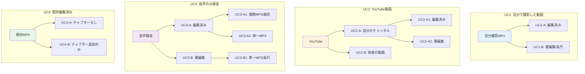

### 処理フロー統合図

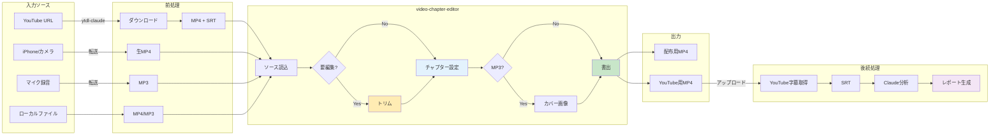

### ユースケース詳細マトリクス

| UC | パターン | 入力 | トリム | 結合 | カバー | 後続処理 |
|----|----------|------|--------|------|--------|----------|
| UC1-A | 自撮/編集済 | MP4 | - | - | - | 字幕取得→分析 |
| UC1-B | 自撮/長尺 | MP4 | 必要 | - | - | 字幕取得→分析 |
| UC2-A1 | YouTube/自/編集済 | MP4+SRT | - | - | - | 焼込+チャプタ |
| UC2-A2 | YouTube/自/要編集 | MP4+SRT | 必要 | - | - | 字幕取得→分析 |
| UC2-B | YouTube/他者 | MP4+SRT | - | - | - | 個人学習用 |
| UC3-A1 | 音声/曲別MP3 | 複数MP3 | - | 必要 | 必要 | 字幕取得→分析 |
| UC3-A2 | 音声/単一編集済 | MP3 | - | - | 必要 | 字幕取得→分析 |
| UC3-B1 | 音声/長尺未編集 | MP3 | 必要 | - | 必要 | 字幕取得→分析 |
| UC4-A | 既存/チャプタなし | MP4 | - | - | - | 焼込+チャプタ |
| UC4-B | 既存/チャプタ追加 | MP4 | - | - | - | 焼込+チャプタ |

### 配管/陶器 分界マトリクス

各処理ステップの担当を明確化。**境界線**はvideo-chapter-editorの入出力点。

```
凡例:
  🔧 配管（CLI/外部ツール）
  🏺 陶器（video-chapter-editor）
  ─── 境界線
```

| ステップ | ツール | 分類 | 備考 |
|----------|--------|------|------|
| **入力取得** |||
| YouTube DL | ytdl-claude | 🔧 | URL → MP4 + SRT |
| ファイル転送 | Finder/手動 | 🔧 | iPhone → Mac |
| **─── 境界線 ───** |||
| **動画編集** |||
| ソース選択 | video-chapter-editor | 🏺 | ダイアログ |
| 結合（MP3） | video-chapter-editor | 🏺 | -c copy無劣化 |
| トリム | video-chapter-editor | 🏺 | 波形+プレビュー |
| カバー設定 | video-chapter-editor | 🏺 | ダイアログ |
| チャプター編集 | video-chapter-editor | 🏺 | メイン機能 |
| 書出 | video-chapter-editor | 🏺 | 焼込+エンコード |
| **─── 境界線 ───** |||
| **後続処理** |||
| YouTubeアップロード | ブラウザ/手動 | 🔧 | 字幕生成待ち |
| 字幕取得 | yt-srt | 🔧 | SRT出力 |
| AI分析 | Claude Code | 🔧 | /rehearsal skill |
| レポート生成 | rehearsal-finalize | 🔧 | PDF + chapters |

**ユースケース別 責務分担:**

| UC | 配管（前） | 陶器 | 配管（後） |
|----|-----------|------|-----------|
| UC1-A | - | 編集→書出 | YT→SRT→分析 |
| UC1-B | - | トリム→編集→書出 | YT→SRT→分析 |
| UC2-A1 | ytdl | 編集→書出 | 配布のみ |
| UC2-A2 | ytdl | トリム→編集→書出 | YT→SRT→分析 |
| UC2-B | ytdl | 閲覧のみ | - |
| UC3-A1 | - | 結合→カバー→編集→書出 | YT→SRT→分析 |
| UC3-A2 | - | カバー→編集→書出 | YT→SRT→分析 |
| UC3-B1 | - | トリム→カバー→編集→書出 | YT→SRT→分析 |
| UC4-A | - | 編集→書出 | 配布のみ |
| UC4-B | - | 編集→書出 | 配布のみ |

**視覚化:**

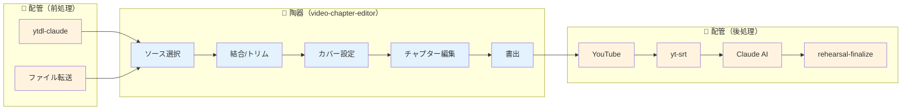

**設計上の意味:**

1. **video-chapter-editorの責務範囲が明確**: ソース選択〜書出まで
2. **入出力インターフェースが2箇所**: 入力（ファイル）と出力（MP4）
3. **後続処理は独立**: 字幕取得〜分析は別ワークフロー
4. **UC2-Bは例外**: 陶器を通過するが書出せず（閲覧用途）

### 処理パス分類

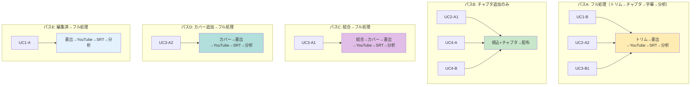

### 設計への影響

1. **トリム機能の重要性**: UC1-B, UC2-A2, UC3-B1 で必須 → video-chapter-editorに統合済み
2. **YouTube連携**: 字幕取得インフラとしての活用が複数パスで発生
3. **配布用 vs 字幕取得用**: 出力が2系統（ローカル配布、YouTube経由分析）
4. **カバー画像**: MP3入力時のみ必要、MP4では不要

---

## 2025-12-29: UI大改造計画

### 背景・課題

現状のワークフローでMP3からMP4を生成する際、2回のエンコードが発生：

```
現状（2回エンコード）:
  MP3 → [enc] → 中間MP4 → [enc] → 最終MP4
              ↑ここで劣化    ↑さらに劣化
```

### 設計目標

- エンコード1回のみで劣化最小化
- 処理オーバーヘッドの最小化
- タイトル焼込は必須要件として維持

### 検討過程

#### 1. 一筆書き問題の認識（グラフ理論的アプローチ）

ワークフロー設計を**グラフ理論**の観点から分析。

**問題の本質**: 入力パターン（起点）が3つ以上存在する場合、機能重複が発生しやすい。
これは**オイラー路（一筆書き）問題**に類似：奇数次数の頂点が2つより多いと一筆書き不可能。

**起点（入力パターン）:**
1. 複数のカット済みMP3
2. 単一の長尺未編集MP3
3. 既存のMP4

**終点:**
- チャプター付きMP4

**処理ノード:**

| ノード | 必要な起点 |
|--------|-----------|
| 結合 | 起点1のみ |
| カバー画像 | MP3入力時のみ |
| チャプター編集 | 全起点 |
| 書出 | 全起点 |

**一筆書きできない構造（初期設計）:**

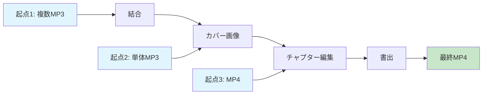

問題: 起点2→カバー画像、起点3→チャプター編集と、経路が分散している。

**解決策: 共通パスを1つにし、入口を分岐**

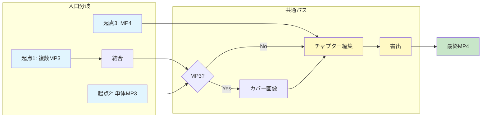

**洞察**: 機能重複は「起点が3つ以上ある」ことに起因。共通パスを明確にし、
入口のみを分岐させることで重複を排除できる。

#### 2. 制約条件による設計空間の縮小

制約を追加することで設計が明確化される逆説的な効果を確認。

**制約なし（最初の状態）:**

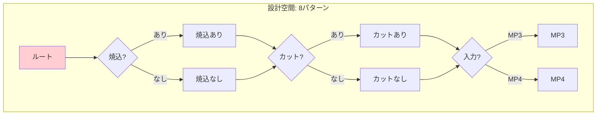

**制約追加後（タイトル焼込必須）:**

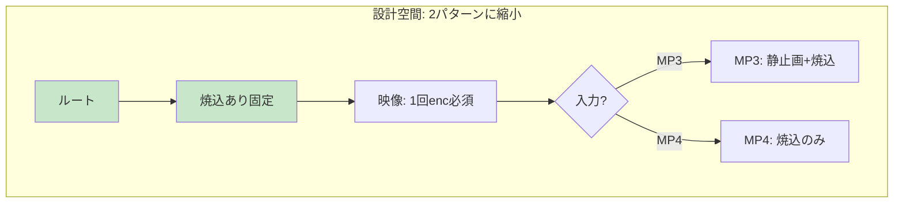

**最適化されたエンコード戦略:**

| 入力 | 映像処理 | 音声処理 |
|------|----------|----------|
| MP3 | enc(静止画+焼込) 1回 | enc 1回 |
| MP4 | enc(焼込) 1回 | **copy（無劣化）** |

**洞察**: 制約は自由度を狭めるが、設計空間を明確にし、最適解を見つけやすくする。

#### 3. Tab構成の検討

**初期案**: 2タブ構成（入力準備 + 編集・書出）

**問題点**: Tab 1のMP3結合は無劣化（-c copy）で可能。中間ファイルが不要ならタブを分ける意味が薄い。

**議論の流れ:**
1. 「タブ1とタブ2を分けなくても良いのでは？」→ 陶器（UI）が巨大化する懸念
2. 「入力ソースも別画面では？」→ ダイアログパターンの発見
3. 「チャプター自動挿入、カバー画像も自動適用」→ 統一的なUXパターン

#### 4. 最終決定: 単一画面 + ダイアログ（モーダル分離パターン）

**アーキテクチャ:**

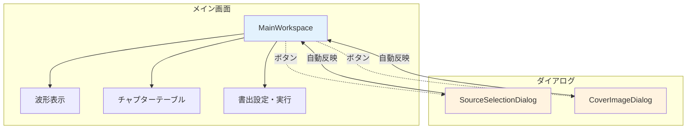

**UI構成:**

```
┌─────────────────────────────────────────────┐
│ [ソース選択] [カバー画像]  ← ボタンで別画面 │
│                                             │
│ ソース: audio.mp3 (14:20)                   │
│ カバー: cover.jpg (1920x1080)               │
│                                             │
│ [波形表示]                                  │
│ ════════════════════════════════════════    │
│                                             │
│ [チャプターテーブル]                        │
│ │ 00:00 | 第1曲 ホルスト 木星              │
│ │ 05:23 | 第2曲 エルガー 威風堂々          │
│                                             │
│ [書出設定] [書出]                           │
└─────────────────────────────────────────────┘
```

### 決定事項

1. **単一画面構成**: タブを廃止、メイン画面1つに統合
2. **ダイアログパターン**:
   - ソース選択ダイアログ: MP3/MP4追加・並替 → 自動でチャプター挿入
   - カバー画像ダイアログ: 選択・クロップ → 自動適用
3. **エンコード最適化**:
   - MP3結合は無劣化（-c copy）
   - 最終書出で1回のみエンコード
   - MP4入力時の音声は無劣化copy

### 各ケースのフロー

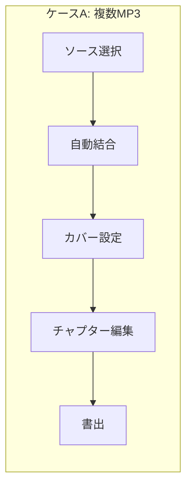

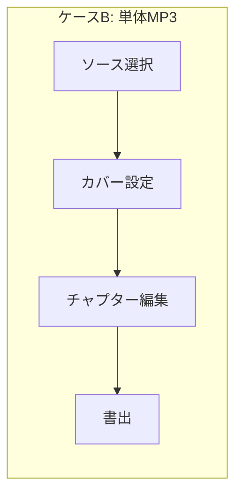

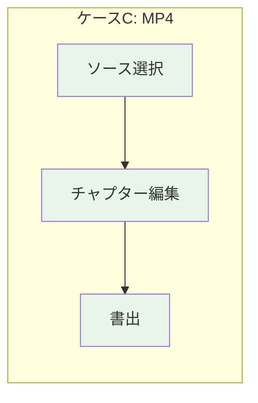

| ケース | カバー画像 | 結合 | エンコード |
|--------|-----------|------|-----------|
| A. 複数MP3 | 必要 | 必要 | 映像1回 + 音声1回 |
| B. 単体MP3 | 必要 | 不要 | 映像1回 + 音声1回 |
| C. MP4 | 不要 | 不要 | 映像1回 + 音声copy |

### メリット

- メイン画面はシンプル（表示と編集に集中）
- 各ダイアログは単一責務
- 明示的な「保存」「適用」ボタン不要
- タブ切替なし、迷わない
- エンコード1回のみ、劣化最小

### 設計原則（本議論から得られた知見）

1. **グラフ構造での問題分析**: ワークフローを有向グラフとして捉え、起点・終点・ノードを明確化
2. **共通パスの抽出**: 複数の起点が合流する「共通パス」を見つけ、そこを中心に設計
3. **制約による単純化**: 制約は選択肢を狭めるが、設計を明確にする効果がある
4. **モーダル分離パターン**: 複雑な入力はダイアログに分離し、メイン画面をシンプルに保つ
5. **自動適用の原則**: ダイアログを閉じると自動で反映、明示的な「保存」ボタン不要

### 次のステップ

- [ ] 現在の2タブ構成を単一画面に統合
- [ ] SourceSelectionDialog の実装
- [ ] CoverImageDialog の実装
- [ ] MainWorkspace の実装
- [ ] ffmpegコマンドの最適化（1パス処理）
- [ ] 実装完了後: PAD図による処理ロジックの文書化

### ダイアグラム方針

| フェーズ | 形式 | 用途 |
|----------|------|------|
| 設計 | Mermaid | グラフ構造、コンポーネント関係 |
| 実装記録 | PAD | 処理ロジック、条件分岐の詳細 |

PADは構造化プログラミング時代の産物であり、実装レベルの処理フローを階層的に記述するのに適している。

### 関連ファイル

- `docs/dev-log-ui-redesign-2025-12-29.md` - 詳細な議論ログ

---

**更新**: 2025-12-29
