# Development Log

開発ログ（2025-12-29〜）- 新しい順

過去のログは `DEVELOPMENT_LOG_as_of_2025-12-29.md` を参照。

---

## 今後の予定

### video-chapter-editor

#### 短期（リファクタリング）
- ~~Phase 1: 重複コード抽出~~ ✅ 完了
- ~~Phase 2: ユーティリティクラス~~ ✅ 完了
- Phase 3: God Class分割（main_workspace.py: 5000行超）
  - ~~YouTubeDownloadMixin抽出~~ ✅ 完了
  - 残り候補: ChapterManager, MediaPlaybackController, ExportOrchestrator

#### 中期（アーキテクチャ改善）
- プロジェクトファイル（JSON）への移行 → 下記「設計検討事項」参照
- バッチエンコード機能
- 複数ソース時のチャプター操作改善

#### リポジトリ名変更（リファクタリング完了後）

**決定**: `rehearsal-workflow` → `media-scribe`

**背景**:
- 現在の名称「rehearsal-workflow」は用途を狭く限定しすぎ
- 実際はリハーサル動画に限らず、レッスン録音、講義録画、会議音声、ポッドキャスト等あらゆるメディアに適用可能
- 「scribe（書記）」= メディアを記録・文書化する役割を表現

**変更対象**:
- [ ] リポジトリ名: `rehearsal-workflow` → `media-scribe`
- [ ] パッケージ名: `rehearsal_workflow` → `media_scribe`
- [ ] コマンド名: `video-chapter-editor` → `mscribe`
- [ ] 関連ファイル: pyproject.toml, CLAUDE.md, README.md 等

**全体構成**:
```
media-scribe ワークフロー

[Phase 0] 前処理（現 video-chapter-editor → mscribe-prep or mscribe-edit）
├── 素材の取り込み
├── 不要部分の除外設定
├── チャプター構造化
└── クリーンなメディアとして書き出し
    ↓
[Phase 1] 文字起こし
├── Whisper
└── SRT生成
    ↓
[Phase 2] 分析・要約
├── AI分析
└── レポート生成
```

#### 長期
- UI大改造: スケルトン完成 → 機能実装へ
- 単一エンコードパス実装

### report-workflow

- 配管のプロトタイプは完了
- 陶器（GUI）の設計は video-chapter-editor 完成後

---

## 2026-01-08: コードリファクタリング（Phase 1-3）

### 概要

main_workspace.py（5,000行超のGod Class）を中心としたコードベースの保守性向上。
機能変更なし、テスト可能な小さな変更を積み重ねるアプローチ。

### Phase 1: 重複コード抽出

#### styles.py 新規作成

色定数とボタンスタイルを集約。

```python
# rehearsal_workflow/ui/styles.py
class Colors:
    PRIMARY = "#3b82f6"
    DANGER = "#dc2626"
    BACKGROUND_DARK = "#1a1a1a"
    # ...

class ButtonStyles:
    @staticmethod
    def primary() -> str: ...
    @staticmethod
    def danger() -> str: ...
    @staticmethod
    def primary_compact() -> str: ...
    # ...
```

#### build_drawtext_filter() 追加

workers.py内の4箇所で重複していたdrawtextフィルター生成ロジックを関数化。

```python
def build_drawtext_filter(
    fontfile: str,
    textfile: str,
    fontsize_ratio: float = 0.04,
    fontcolor: str = "white",
    # ...
) -> str:
```

### Phase 2: Mixinパターン導入

#### TempFileManagerMixin

一時ファイルの作成・クリーンアップを管理。

```python
class TempFileManagerMixin:
    def _init_temp_manager(self) -> None
    def _create_temp_file(self, suffix: str, prefix: str = "vce_") -> str
    def _add_temp_file(self, path: str) -> None
    def _cleanup_temp_files(self) -> None
```

#### CancellableWorkerMixin

キャンセル可能なワーカーの共通機能。

```python
class CancellableWorkerMixin:
    def _init_cancellable(self) -> None
    def cancel(self) -> None
    def _is_cancelled(self) -> bool
    def _set_process(self, process) -> None
```

#### 適用クラス

- `ExportWorker`
- `SplitExportWorker`
- `YouTubeDownloadWorker`

**効果**: 約51行の重複コード削除

### Phase 3: YouTubeDownloadMixin抽出

main_workspace.pyからYouTube関連メソッド18個（約380行）を分離。

```python
# rehearsal_workflow/ui/youtube_mixin.py
class YouTubeDownloadMixin:
    def _youtube_btn_style_normal(self) -> str
    def _youtube_btn_style_processing(self) -> str
    def _clean_youtube_url(self, url: str) -> str
    def _is_playlist_url(self, url: str) -> bool
    def _start_youtube_download(self)
    def _on_youtube_progress(self, message: str)
    def _on_youtube_completed(self, video_path: str, srt_path: str)
    # ... 他11メソッド
```

**継承構造**:

```python
class MainWorkspace(QWidget, YouTubeDownloadMixin):
    ...
```

### ユニットテスト追加

GUIに依存しない純粋関数部分のテストを作成。

| ファイル | テスト対象 | テスト数 |
|---------|-----------|---------|
| test_mixins.py | TempFileManagerMixin, CancellableWorkerMixin | 11 |
| test_youtube_mixin.py | URL処理、プレイリスト判定 | 17 |
| test_workers_utils.py | build_drawtext_filter | 12 |
| test_styles.py | Colors, ButtonStyles | 16 |
| **合計** | | **56** |

実行: `pytest tests/ -v`

### 変更ファイル一覧

| ファイル | 操作 | 内容 |
|---------|------|------|
| `styles.py` | 新規 | Colors, ButtonStyles |
| `youtube_mixin.py` | 新規 | YouTubeDownloadMixin |
| `workers.py` | 編集 | build_drawtext_filter, Mixins追加 |
| `dialogs.py` | 編集 | styles.pyインポート |
| `main_workspace.py` | 編集 | Mixin継承、YouTube関連削除（-377行） |
| `tests/` | 新規 | ユニットテスト56件 |

### コミット履歴

```
240d086 Add unit tests for refactored components
735c137 Extract YouTubeDownloadMixin from MainWorkspace (Phase 3)
d1c9154 Apply Mixins to worker classes (Phase 2 Step 2.3)
（以前のPhase 1-2コミットは省略）
```

### 設計判断

1. **Mixinパターン採用理由**: Pythonの多重継承を活用し、既存クラス構造を維持しつつ機能を分離
2. **TYPE_CHECKING活用**: 循環インポートを回避しつつIDE補完を維持
3. **テスト対象の選定**: GUIに依存しない純粋関数のみをテスト対象とし、Qt依存部分は手動確認

### 残課題（Phase 3継続候補）

main_workspace.py（現在約5,300行）の更なる分割候補：
- `ChapterManager`: チャプター追加・削除・編集
- `MediaPlaybackController`: 再生制御、シーク
- `ExportOrchestrator`: エクスポート処理の調整

---

## 2026-01-08: 設計決定事項の確定

### 設計原則: 非破壊編集（Non-destructive Editing）

```
入力（不変）           処理              出力（新規作成）
┌──────────┐                          ┌──────────────┐
│SourceA   │──┐                    ┌─→│ merged.mp4   │
│SourceB   │──┼─→ チャプター付加 ──┤  │ + chapters   │
│SourceC   │──┘     (メタデータ)   │  └──────────────┘
└──────────┘                       │
     ↑                             └─→ chapters.txt
   変更なし
```

**原則**:
- ソースファイルは読み取り専用（アプリは一切変更しない）
- チャプターはメタデータ（インデックス/ラベル）として存在
- エクスポート時に新しいファイルを生成
- ソース入れ替え時、チャプターはソースに紐付いて移動（実装済み）

### 基本原則: 同名規則

**制約**: ソースファイルとチャプターファイルは同名とする

```
working_directory/
├── rehearsal_2026-01-06.mp4
├── rehearsal_2026-01-06.txt      ← 自動的に対応
├── rehearsal_2026-01-07.mp3
├── rehearsal_2026-01-07.txt      ← 自動的に対応
└── rehearsal_2026-01-08.mp4      ← チャプターなし（.txtがない）
```

**効果**:
- プロジェクトファイルにチャプターパス記録不要（ソース一覧のみで再構築可能）
- ドロップ操作の判定がシンプル化
- 各ソースに独立したチャプター（時間判定ロジック不要）

### 時間管理方式

| 項目 | 決定 |
|------|------|
| チャプター保持形式 | ローカル時間 + source_index |
| 絶対時間 | 動的算出（ファイル順序 × デュレーション × ローカル時間） |

```
ソースA (10:00) + ソースB (15:00) + ソースC (20:00)
    ↓
チャプターリスト表示:
──────────────────────────────────────
絶対時間    ローカル時間   ソース   タイトル
00:00:00    00:00:00      A        Opening
00:05:00    00:05:00      A        Theme 1
00:10:00    00:00:00      B        ← ソースB開始
00:18:30    00:08:30      B        Theme 2
00:25:00    00:00:00      C        ← ソースC開始
```

### 決定済み: プロジェクトファイル

| 項目 | 決定 |
|------|------|
| 拡張子 | `.vce.json` |
| 自動保存 | あり（チャプターリスト変更時） |
| エンコード設定 | 明示的Saveで保存（自動保存しない） |
| 既存.txt読み込み | 対応（ペースト機能と同様の実装） |

**プロジェクトファイル形式**:

```json
{
  "version": "1.0",
  "sources": [
    "rehearsal_2026-01-06.mp4",
    "rehearsal_2026-01-07.mp3"
  ],
  "encode_settings": {
    "encoder": "hevc_videotoolbox",
    "quality": 65,
    "audio_bitrate": "256k"
  }
}
```

※ チャプターは同名.txtから自動読み込み（プロジェクトファイルには記録しない）

### 決定済み: チャプターファイル形式

**新形式**（メタデータ付き）:

```
# source: rehearsal_2026-01-08.mp4
00:00:00 Opening
00:05:23 Main Theme
00:45:00 Ending
```

**互換性**:
- 新形式・旧形式（YouTube形式）両方を読み込み可能
- エンコード終了時は新形式で自動保存（出力動画と同名.txt）
- `#` で始まる行はコメント/メタデータとして扱う

### 決定済み: ドロップ操作

| 項目 | 決定 |
|------|------|
| 動作 | 追加（入れ替えではない） |
| 動画上ドロップ | 再生中ソースの位置に挿入 |
| リスト上ドロップ | ファイル境界に挿入（位置を視覚的に明示） |
| 型制約 | 動画編集中は音声不可、逆も同様 |

**ドロップ時の検証フロー**:

```
ファイルドロップ
  ↓
型チェック（動画編集中に音声 or 逆）
  ├─ 不一致 → 拒否、警告表示
  └─ 一致 → 同名ファイル検索
              ├─ 動画/音声ドロップ → 同名.txtあれば一緒に追加
              └─ チャプターファイルドロップ
                   ├─ 同名ソースあり → 両方追加
                   └─ 同名ソースなし → 警告「xxx.mp4が見つかりません」
```

### 決定済み: エラー処理

| 状況 | 対応 |
|------|------|
| 時間超過チャプター | 警告して無視（該当行は読み込まない） |
| 同名ソースなし | 警告、何もしない |
| 型不一致 | 拒否、警告表示 |

### 決定済み: バッチエンコード

| 項目 | 決定 |
|------|------|
| UI | 別ダイアログ |
| 進捗表示 | 個別プログレス + n/m形式（ファイル数） |
| CLI/スケジュール | なし（このアプリの存在意義に反する） |
| OS通知 | なし（OS依存性回避） |

### 決定済み: Undo/履歴

| 項目 | 決定 |
|------|------|
| ソース順序変更 | Undo対象外（やり直せば良い） |
| チャプターリストUI | 現状の区切り線維持 |

### 今後の検討事項（あったら良いな）

- [ ] 動画クリックで再生/停止
- [ ] スペースバーで再生/停止（ハイライトとの整合性要検討）
- [ ] チャプターリストの複数選択・削除
- [ ] ソースディレクトリと保存ディレクトリの分離
- [ ] 言語選択（UI国際化）

---

## 2026-01-08: チャプター時間管理の相対時間方式への移行

### 背景・課題

**問題**: ソースファイルの追加・削除・並べ替え時に、チャプターの再生時間計算が正しく動作しない、または挙動が不安定（全チャプターがクリアされるなど）

**原因分析**: 従来の「絶対時間方式」では、チャプターは累積時間（全ソースを通した位置）を保持していた。これにより:
- ソース追加時: 既存チャプターの時間を全て再計算する必要
- ソース削除時: 該当ソースのチャプターを削除後、後続の時間を再計算
- ソース並べ替え時: 全チャプターの時間を再計算

再計算ロジックが複雑になり、エラーが連鎖的に伝播しやすい構造だった。

### 設計判断

**相対時間方式（B案）を採用**:

| 方式 | 保持データ | メリット | デメリット |
|------|-----------|----------|-----------|
| A. 絶対時間 | 累積時間 | 表示がそのまま使える | 操作時に全チャプター再計算 |
| B. 相対時間 | ローカル時間 + source_index | 操作時の影響範囲が限定的 | 表示時に変換が必要 |

**B案のメリット**:
- ソース並べ替え: `source_index` のみ更新（時間は不変）
- ソース挿入: 後続チャプターの `source_index` をシフト
- ソース削除: 該当チャプターを削除、残りの `source_index` をシフト
- エラーが連鎖しにくい

### 実装変更

#### 1. ChapterInfo dataclass（models.py）

```python
# Before
@dataclass
class ChapterInfo:
    time_ms: int  # 累積時間（絶対時間）
    title: str

# After
@dataclass
class ChapterInfo:
    local_time_ms: int  # ソースファイル内のローカル時間
    title: str
    source_index: Optional[int] = None  # 所属ソースのインデックス

    def get_absolute_time_ms(self, source_offsets: List[int]) -> int:
        """累積時間（絶対時間）を計算"""
        if self.source_index is not None and 0 <= self.source_index < len(source_offsets):
            return source_offsets[self.source_index] + self.local_time_ms
        return self.local_time_ms

    # 後方互換プロパティ
    @property
    def time_ms(self) -> int:
        return self.local_time_ms
```

#### 2. テーブルのUserRoleデータ

```python
# 各セルに保持するデータ
time_item.setData(Qt.ItemDataRole.UserRole, color)           # 色
time_item.setData(Qt.ItemDataRole.UserRole + 1, source_idx)  # ソースインデックス
time_item.setData(Qt.ItemDataRole.UserRole + 2, local_time_ms)  # ローカル時間 (NEW)
```

#### 3. ヘルパーメソッド追加

- `_get_source_offsets()`: 各ソースの開始オフセット（累積時間）を計算
- `_rebuild_chapter_table_from_data()`: チャプターデータからテーブルを再構築

#### 4. 更新されたメソッド（main_workspace.py）

| メソッド | 変更内容 |
|----------|----------|
| `_add_chapter()` | ローカル時間を計算してUserRole+2に保存 |
| `_rebuild_chapters_after_insert()` | source_indexのシフトのみ（時間不変） |
| `_rebuild_chapters_after_source_move()` | source_indexの再マッピング |
| `_load_chapters()` | 絶対時間からローカル時間に変換 |
| `_load_embedded_chapters()` | 相対時間として読み込み |
| `_generate_chapters_from_sources()` | local_time_ms=0で生成 |

#### 5. Workers（workers.py）

`ChapterInfo(time_ms=...)` → `ChapterInfo(local_time_ms=...)` に全て更新

### 動作原理

```
[ソース1: 10分] [ソース2: 15分] [ソース3: 20分]
     ↓              ↓              ↓
  offset=0      offset=10      offset=25

チャプター例:
  - "イントロ": local=0, source=0 → 絶対時間=0
  - "サビ1": local=5分, source=0 → 絶対時間=5分
  - "曲2開始": local=0, source=1 → 絶対時間=10分
  - "サビ2": local=3分, source=1 → 絶対時間=13分

ソース2を削除した場合:
  - source=0 のチャプター: 変化なし
  - source=1 のチャプター: 削除
  - source=2 のチャプター: source_index を 2→1 にシフト
  - ローカル時間は全て不変
```

### 後方互換性

- `ChapterInfo.time_ms` プロパティは `local_time_ms` を返す
- `ChapterInfo.from_time_str()` は従来通り動作
- エクスポート時は絶対時間を使用（テーブル表示から取得）

### テスト項目

- [ ] Add Source でファイル追加後のチャプター時間が正しい
- [ ] Remove Source でのチャプター再計算が正しい
- [ ] ソースの順序変更時のチャプター時間更新
- [ ] エクスポート機能が正常動作

### 波形ハイライトのシンプル化

選択中ソースの波形ハイライト表示を簡素化。

**Before**:
- 半透明青背景 + 斜線ハッチ + 四角縁取り

**After**:
- 半透明青背景のみ `QColor(100, 180, 255, 40)`

**変更ファイル**: `rehearsal_workflow/ui/widgets/waveform.py`

---

## 2026-01-06: v2.1.27 リリース - デュアルアーキテクチャ対応 & ffmpeg/ffprobeバンドル

### ffmpeg/ffprobe のバンドル

**課題**: `imageio-ffmpeg` は ffmpeg のみを同梱し、ffprobe が含まれない。アプリは動画の長さ取得やビットレート検出に ffprobe を使用。

**解決策**: `static-ffmpeg` パッケージに移行

| パッケージ | ffmpeg | ffprobe |
|-----------|--------|---------|
| imageio-ffmpeg | ✅ | ❌ |
| static-ffmpeg | ✅ | ✅ |

**変更ファイル**:
- `pyproject.toml`: `imageio-ffmpeg` → `static-ffmpeg`
- `ffmpeg_utils.py`: バイナリ検出ロジックを更新
- `video_chapter_editor.spec`: バンドル設定を更新

### デュアル macOS アーキテクチャビルド

**要望**: Intel Mac ユーザーにも配布したい

**解決策**: GitHub Actions で両アーキテクチャを並行ビルド

| ランナー | アーキテクチャ | 出力ファイル |
|----------|---------------|-------------|
| macos-13 | Intel x86_64 | `*-macOS-Intel.dmg` |
| macos-latest | Apple Silicon arm64 | `*-macOS-AppleSilicon.dmg` |

**変更ファイル**: `.github/workflows/release.yml`

### YouTube ダウンロード改善

**AV1 コーデック除外**:
- macOS で AV1 のハードウェアデコードが非対応
- format 文字列を `bv[vcodec^=avc1]+ba/bv[vcodec!^=av01]+ba/b` に変更
- H.264 優先、AV1 除外

**一時プレイリスト対応**:
- TLP, RD, OL, UU, LL プレフィックスを検出
- 一時プレイリスト URL の場合、単一動画としてダウンロード
- URL からプレイリストパラメータを自動除去

**既存ファイル検出の修正**:
- yt-dlp の "has already been downloaded" メッセージを解析
- 正確なファイルパスを取得（mtime 検索ではなく）

**変更ファイル**:
- `workers.py`: format 文字列、ファイル検出ロジック
- `main_workspace.py`: `_is_playlist_url()`, `_clean_youtube_url()`

---

## 2026-01-06: チャプター移動・削除の改善 & 波形ハイライト

### チャプターリスト移動時の手動追加チャプター保持

**課題**: ソースファイルの順序を変更（ドラッグ移動）した際、手動で追加したチャプターが消えてしまう

**原因**: `_rebuild_chapters_after_source_move()` がファイルから再読み込みしていたため、テーブルに手動追加されたチャプターが失われていた

**解決策**:

1. **ヘルパー関数追加** (`_get_local_time_in_source`):
   - 仮想タイムラインの絶対時間をソース内ローカル時間に変換

2. **`_rebuild_chapters_after_source_move()` の書き換え**:
   - テーブルから現在のチャプター情報を収集（ファイル再読み込みではなく）
   - `old_offsets` パラメータで変更前のオフセットを受け取り、正確なローカル時間を計算
   - 移動モード: source_indexをマッピング（前→後、後→前の両方向対応）
   - 削除モード: `removed_indices` パラメータで削除されたインデックスを受け取り、残りをシフト

3. **呼び出し元の修正**:
   - `_handle_row_move_grouped()`: 変更前にオフセットを保存、移動後にインデックスとオフセットを渡す
   - `_remove_chapter_grouped()`: 削除前にオフセットを保存、削除後にremoved_indicesとオフセットを渡す

**関数シグネチャ**:

```python
def _rebuild_chapters_after_source_move(
    self,
    old_source_idx: int = -1,
    new_source_idx: int = -1,
    removed_indices: set = None,
    old_offsets: list = None
)
```

### 波形ウィジェットの選択ソースハイライト表示

**要望**: チャプターリストで行を選択した際、そのチャプターが属するソースファイルの範囲を波形上でハイライト表示

**実装**:

1. **WaveformWidget (`waveform.py`)**:
   - `_selected_range` プロパティ追加
   - `set_selected_source_range(start, end)` メソッド追加
   - `clear_selected_source_range()` メソッド追加
   - `_paint_overlays()` でハイライト描画

2. **MainWorkspace (`main_workspace.py`)**:
   - `_update_waveform_selected_range()` メソッド追加
   - `_on_selection_changed()` から呼び出し

**ハイライトのデザイン**:

| 要素 | 設定 |
|------|------|
| 背景 | 青系半透明 (100, 180, 255, alpha=40) |
| 斜線 | 幅1.5px、間隔15px、逆方向（除外区間と区別） |
| 縁取り | 四角形、幅1.5px、alpha=240 |

**除外区間との区別**:
- 除外区間: 赤系、斜線は `/` 方向
- 選択ソース: 青系、斜線は `\` 方向（逆）、四角縁取り付き

**変更ファイル**:
- `rehearsal_workflow/ui/widgets/waveform.py`
- `rehearsal_workflow/ui/main_workspace.py`

---

## 2026-01-05: UI改善

### Chaptersテーブルの行番号表示

**要望**: Chaptersリストに行番号（No.）を表示し、ヘッダーを黒背景にする

**実装**:
- 当初、新しいカラム「No.」を追加する方向で実装を進めたが、ユーザーの意図は自動で振られる行番号のヘッダー部分（コーナーウィジェット）に「No.」を表示することだった
- テーブルの垂直ヘッダー（行番号）を表示に設定
- コーナーウィジェット（左上隅）に「No.」ラベルを配置
- ヘッダー背景を黒（#000000）に設定

### チャプタースキップボタンの有効化条件

**要望**: チャプタースキップボタンは、チャプターリストを編集した場合にのみ有効になるよう変更

**実装**:
- `_chapters_edited` フラグを追加（初期値: False）
- チャプターを追加（Add）、削除（Remove）、編集、ペーストした時にフラグをTrueに設定
- `_update_chapter_buttons()` でフラグを確認し、編集されていない場合はスキップボタンを無効のままにする
- 新しいメディアを読み込んだ時はフラグをリセット

### 新規ソース読み込み時のリセット処理

**要望**: 動画再生中に新しいソース（MP3等）を読み込んだ場合、再生を停止してチャプター・再生画面をリセットする

**実装** (`_prepare_for_new_source()`):
- `self._media_player.stop()` - 再生中のメディアを停止
- `self._media_player.setSource(QUrl())` - ソースをクリアして再生画面をリセット（黒画面に戻る）
- `self._waveform_widget.clear()` - 波形データをクリア
- YouTube URLからのダウンロード開始時にも `_prepare_for_new_source()` を呼び出すよう修正

### 複数MP3読み込み時の仕様確認

| ケース | 再生 | 波形 | チャプター | スキップボタン |
|--------|------|------|------------|----------------|
| 動画ファイル | ○ | ○ | 埋め込み読込 | 編集後に有効 |
| 単一MP3 | ○ | ○ | なし | 編集後に有効 |
| 複数MP3 | × | × | 自動生成 | 無効（再生不可） |

**結論**:
- 複数MP3のチャプターは、エクスポート用のメタデータ設定のための表示
- 再生できないためスキップボタンは無効のまま

**変更ファイル**: `rehearsal_workflow/ui/main_workspace.py`

---

## 2025-12-29: UIスケルトン作成

### 新アーキテクチャ実装開始

`rehearsal_workflow/ui_next/` に次世代UIのスケルトンを作成。

**ファイル構成:**

```
ui_next/
├── __init__.py          # パッケージエクスポート
├── app.py               # メインウィンドウ (VideoChapterEditorNext)
├── main_workspace.py    # 単一画面ワークスペース
├── dialogs.py           # SourceSelectionDialog, CoverImageDialog
└── log_panel.py         # ログ表示パネル
```

**LogPanel機能:**

| 機能 | 説明 |
|------|------|
| ログレベル | DEBUG, INFO, WARNING, ERROR |
| フィルタリング | 表示レベル切替（コンボボックス） |
| コピー | Claude Code用フォーマットでクリップボードへ |
| 折りたたみ | パネルの表示/非表示切替 |

**コピー出力フォーマット:**

```log
# Log exported at 2025-12-29T15:30:00
# Level filter: INFO+

15:30:00 INFO  [ffmpeg] Export started
15:30:05 ERROR [ffmpeg] Encoding failed: ...
```

**MainWorkspace構成:**

```
┌─────────────────────────────────────────────┐
│ [ソース選択] [カバー画像]    ← ボタン行     │
│ ソース: audio.mp3 (14:20)   ← 情報表示     │
├─────────────────────────────────────────────┤
│ [波形表示]                  ← プレースホルダ │
├─────────────────────────────────────────────┤
│ [チャプターテーブル]        ← 編集可能      │
├─────────────────────────────────────────────┤
│ [書出設定] [書出ボタン]     ← 進捗表示含む  │
├─────────────────────────────────────────────┤
│ [ログパネル]                ← 折りたたみ可  │
└─────────────────────────────────────────────┘
```

**起動確認:**

```bash
python -c "from rehearsal_workflow.ui_next import VideoChapterEditorNext"
# Import successful
```

### 次のステップ

1. 既存WaveformWidgetの移植
2. ffprobe連携（duration取得）
3. ffmpegエクスポート処理の移植
4. 既存コード（video_chapter_editor.py）との共存

---

## 2025-12-29: ユースケース拡張

### ユースケース全体図

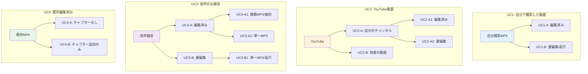

### 処理フロー統合図

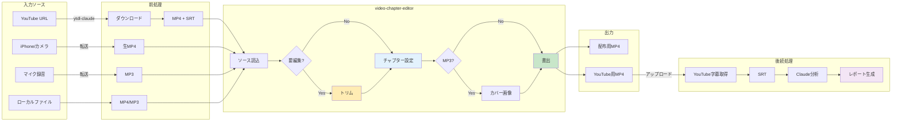

### ユースケース詳細マトリクス

| UC | パターン | 入力 | トリム | 結合 | カバー | 後続処理 |
|----|----------|------|--------|------|--------|----------|
| UC1-A | 自撮/編集済 | MP4 | - | - | - | 字幕取得→分析 |
| UC1-B | 自撮/長尺 | MP4 | 必要 | - | - | 字幕取得→分析 |
| UC2-A1 | YouTube/自/編集済 | MP4+SRT | - | - | - | 焼込+チャプタ |
| UC2-A2 | YouTube/自/要編集 | MP4+SRT | 必要 | - | - | 字幕取得→分析 |
| UC2-B | YouTube/他者 | MP4+SRT | - | - | - | 個人学習用 |
| UC3-A1 | 音声/曲別MP3 | 複数MP3 | - | 必要 | 必要 | 字幕取得→分析 |
| UC3-A2 | 音声/単一編集済 | MP3 | - | - | 必要 | 字幕取得→分析 |
| UC3-B1 | 音声/長尺未編集 | MP3 | 必要 | - | 必要 | 字幕取得→分析 |
| UC4-A | 既存/チャプタなし | MP4 | - | - | - | 焼込+チャプタ |
| UC4-B | 既存/チャプタ追加 | MP4 | - | - | - | 焼込+チャプタ |

### 配管/陶器 分界マトリクス

各処理ステップの担当を明確化。**境界線**はvideo-chapter-editorの入出力点。

```
凡例:
  🔧 配管（CLI/外部ツール）
  🏺 陶器（video-chapter-editor）
  ─── 境界線
```

| ステップ | ツール | ユーザー操作 | プラットフォーム提供 | 要実装 | 分類 |
|----------|--------|-------------|-------------------|--------|------|
| **入力取得** ||||||
| YouTube DL | ytdl | URLコピペ → コマンド実行 | - | ytdl (yt-dlpラッパー) | 🔧 |
| YouTube DL（統合） | rehearsal-download | URLコピペ → コマンド実行 | - | rehearsal-download + whisper-remote | 🔧 |
| 字幕のみ取得 | yt-srt | URLコピペ → コマンド実行 | - | yt-srt (yt-dlpラッパー) | 🔧 |
| ファイル転送 | Finder | iPhoneからAirDrop / D&D | macOS (AirDrop, Finder) | - | 🔧 |
| **─── 境界線（入力）───** ||||||
| **動画編集** ||||||
| ソース選択 | video-chapter-editor | ボタン押下 → ファイル選択 | QFileDialog | ダイアログ呼出ロジック | 🏺 |
| 波形生成 | video-chapter-editor | （自動） | numpy (FFT) | 波形描画Widget | 🏺 |
| 結合（MP3） | video-chapter-editor | 複数ファイル選択で自動実行 | ffmpeg (-c copy) | コマンド構築 + subprocess | 🏺 |
| トリム | video-chapter-editor | 波形クリック → `--`名前入力 | - | 除外区間ロジック + UI | 🏺 |
| カバー設定 | video-chapter-editor | ボタン押下 → 画像選択 → クロップ | QFileDialog, QImage | クロップUI + リサイズ処理 | 🏺 |
| チャプター編集 | video-chapter-editor | 波形クリック → 名前入力 | QTableWidget | テーブル⇔波形連携 | 🏺 |
| プレビュー | video-chapter-editor | 再生ボタン / シーク | QMediaPlayer | 波形⇔再生位置同期 | 🏺 |
| 書出 | video-chapter-editor | ボタン押下 → 進捗待機 | ffmpeg (drawtext, エンコード) | コマンド構築 + 進捗パース | 🏺 |
| **─── 境界線（出力）───** ||||||
| **後続処理** ||||||
| YouTubeアップロード | yt-upload (予定) | コマンド実行 → URL取得 | YouTube Data API v3 | yt-upload (APIラッパー) | 🔧 |
| 字幕取得 | yt-srt | 新URLコピペ → コマンド実行 | - | yt-srt (yt-dlpラッパー) | 🔧 |
| AI分析 | Claude Code | `/rehearsal` 入力 → 指示に従う | Claude API | skill定義 (.md) | 🔧 |
| PDF生成 | rehearsal-finalize | .texファイル指定 → コマンド実行 | - | luatex-pdf + rehearsal-finalize | 🔧 |
| チャプター抽出 | tex2chapters | （PDF生成に含まれる） | grep, sed, awk | 正規表現 + 出力整形 | 🔧 |

**コマンドリファレンス:**

```bash
# === 前処理（配管）===

# YouTube動画+字幕ダウンロード
ytdl "https://youtu.be/VIDEO_ID" -o "20251229_rehearsal"
# → 20251229_rehearsal.mp4, 20251229_rehearsal_yt.srt

# 統合ダウンロード（DL + Whisper起動）
rehearsal-download "https://youtu.be/VIDEO_ID"
# → MP4 + YouTube字幕 + Whisper字幕（非同期）

# 字幕のみ取得
yt-srt "https://youtu.be/VIDEO_ID"           # 字幕のみ
yt-srt "https://youtu.be/VIDEO_ID" -v        # 動画も
yt-srt "https://youtu.be/VIDEO_ID" -l en     # 英語字幕

# === 動画編集（陶器）===

# GUIを起動
video-chapter-editor ./work_dir

# === 後続処理（配管）===

# 字幕取得（YouTube処理後）
yt-srt "https://youtu.be/NEW_VIDEO_ID"

# AI分析 + LaTeX生成
claude code
/rehearsal

# PDF生成 + チャプター抽出
rehearsal-finalize "リハーサル記録.tex"
# → リハーサル記録.pdf
# → リハーサル記録_youtube.txt
# → リハーサル記録_movieviewer.txt

# チャプター抽出のみ
tex2chapters "リハーサル記録.tex"
```

**ユースケース別 責務分担:**

| UC | 配管（前） | 陶器 | 配管（後） |
|----|-----------|------|-----------|
| UC1-A | - | 編集→書出 | YT→SRT→分析 |
| UC1-B | - | トリム→編集→書出 | YT→SRT→分析 |
| UC2-A1 | ytdl | 編集→書出 | 配布のみ |
| UC2-A2 | ytdl | トリム→編集→書出 | YT→SRT→分析 |
| UC2-B | ytdl | 閲覧のみ | - |
| UC3-A1 | - | 結合→カバー→編集→書出 | YT→SRT→分析 |
| UC3-A2 | - | カバー→編集→書出 | YT→SRT→分析 |
| UC3-B1 | - | トリム→カバー→編集→書出 | YT→SRT→分析 |
| UC4-A | - | 編集→書出 | 配布のみ |
| UC4-B | - | 編集→書出 | 配布のみ |

**視覚化:**

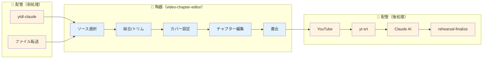

**設計上の意味:**

1. **video-chapter-editorの責務範囲が明確**: ソース選択〜書出まで
2. **入出力インターフェースが2箇所**: 入力（ファイル）と出力（MP4）
3. **後続処理は独立**: 字幕取得〜分析は別ワークフロー
4. **UC2-Bは例外**: 陶器を通過するが書出せず（閲覧用途）

### 処理パス分類

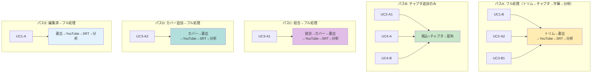

### 設計への影響

1. **トリム機能の重要性**: UC1-B, UC2-A2, UC3-B1 で必須 → video-chapter-editorに統合済み
2. **YouTube連携**: 字幕取得インフラとしての活用が複数パスで発生
3. **配布用 vs 字幕取得用**: 出力が2系統（ローカル配布、YouTube経由分析）
4. **カバー画像**: MP3入力時のみ必要、MP4では不要

---

## 2025-12-29: UI大改造計画

### 背景・課題

現状のワークフローでMP3からMP4を生成する際、2回のエンコードが発生：

```
現状（2回エンコード）:
  MP3 → [enc] → 中間MP4 → [enc] → 最終MP4
              ↑ここで劣化    ↑さらに劣化
```

### 設計目標

- エンコード1回のみで劣化最小化
- 処理オーバーヘッドの最小化
- タイトル焼込は必須要件として維持

### 検討過程

#### 1. 一筆書き問題の認識（グラフ理論的アプローチ）

ワークフロー設計を**グラフ理論**の観点から分析。

**問題の本質**: 入力パターン（起点）が3つ以上存在する場合、機能重複が発生しやすい。
これは**オイラー路（一筆書き）問題**に類似：奇数次数の頂点が2つより多いと一筆書き不可能。

**起点（入力パターン）:**
1. 複数のカット済みMP3
2. 単一の長尺未編集MP3
3. 既存のMP4

**終点:**
- チャプター付きMP4

**処理ノード:**

| ノード | 必要な起点 |
|--------|-----------|
| 結合 | 起点1のみ |
| カバー画像 | MP3入力時のみ |
| チャプター編集 | 全起点 |
| 書出 | 全起点 |

**一筆書きできない構造（初期設計）:**

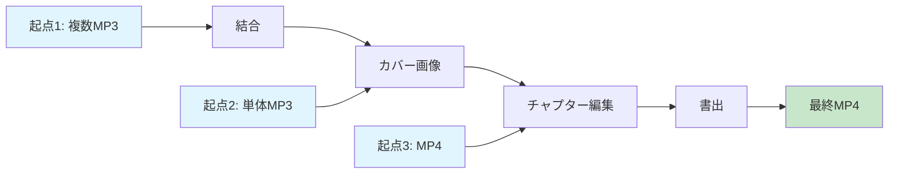

問題: 起点2→カバー画像、起点3→チャプター編集と、経路が分散している。

**解決策: 共通パスを1つにし、入口を分岐**

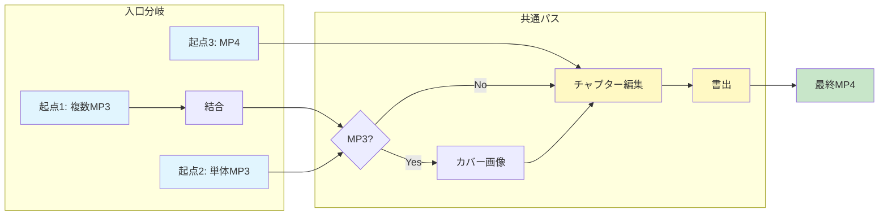

**洞察**: 機能重複は「起点が3つ以上ある」ことに起因。共通パスを明確にし、
入口のみを分岐させることで重複を排除できる。

#### 2. 制約条件による設計空間の縮小

制約を追加することで設計が明確化される逆説的な効果を確認。

**制約なし（最初の状態）:**

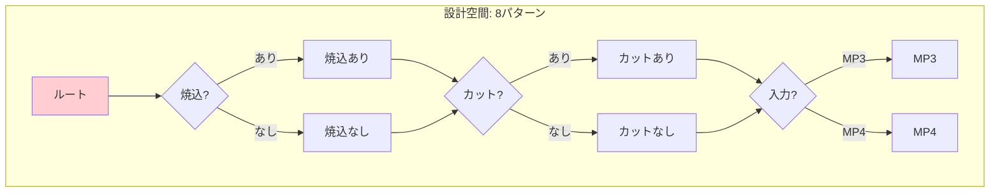

**制約追加後（タイトル焼込必須）:**

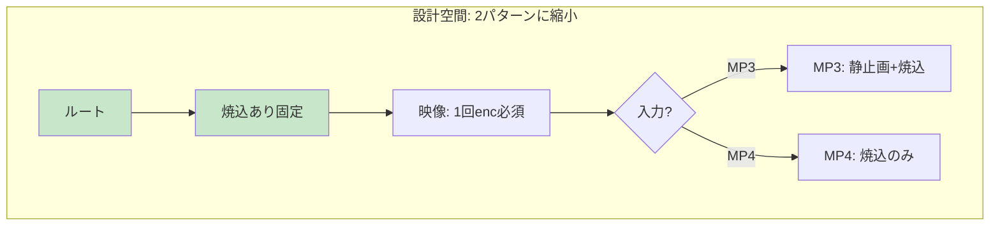

**最適化されたエンコード戦略:**

| 入力 | 映像処理 | 音声処理 |
|------|----------|----------|
| MP3 | enc(静止画+焼込) 1回 | enc 1回 |
| MP4 | enc(焼込) 1回 | **copy（無劣化）** |

**洞察**: 制約は自由度を狭めるが、設計空間を明確にし、最適解を見つけやすくする。

#### 3. Tab構成の検討

**初期案**: 2タブ構成（入力準備 + 編集・書出）

**問題点**: Tab 1のMP3結合は無劣化（-c copy）で可能。中間ファイルが不要ならタブを分ける意味が薄い。

**議論の流れ:**
1. 「タブ1とタブ2を分けなくても良いのでは？」→ 陶器（UI）が巨大化する懸念
2. 「入力ソースも別画面では？」→ ダイアログパターンの発見
3. 「チャプター自動挿入、カバー画像も自動適用」→ 統一的なUXパターン

#### 4. 最終決定: 単一画面 + ダイアログ（モーダル分離パターン）

**アーキテクチャ:**

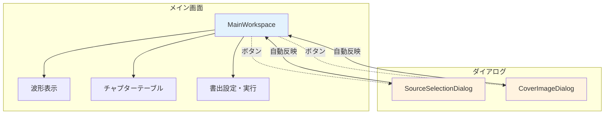

**UI構成:**

```
┌─────────────────────────────────────────────┐
│ [ソース選択] [カバー画像]  ← ボタンで別画面 │
│                                             │
│ ソース: audio.mp3 (14:20)                   │
│ カバー: cover.jpg (1920x1080)               │
│                                             │
│ [波形表示]                                  │
│ ════════════════════════════════════════    │
│                                             │
│ [チャプターテーブル]                        │
│ │ 00:00 | 第1曲 ホルスト 木星              │
│ │ 05:23 | 第2曲 エルガー 威風堂々          │
│                                             │
│ [書出設定] [書出]                           │
└─────────────────────────────────────────────┘
```

### 決定事項

1. **単一画面構成**: タブを廃止、メイン画面1つに統合
2. **ダイアログパターン**:
   - ソース選択ダイアログ: MP3/MP4追加・並替 → 自動でチャプター挿入
   - カバー画像ダイアログ: 選択・クロップ → 自動適用
3. **エンコード最適化**:
   - MP3結合は無劣化（-c copy）
   - 最終書出で1回のみエンコード
   - MP4入力時の音声は無劣化copy

### 各ケースのフロー

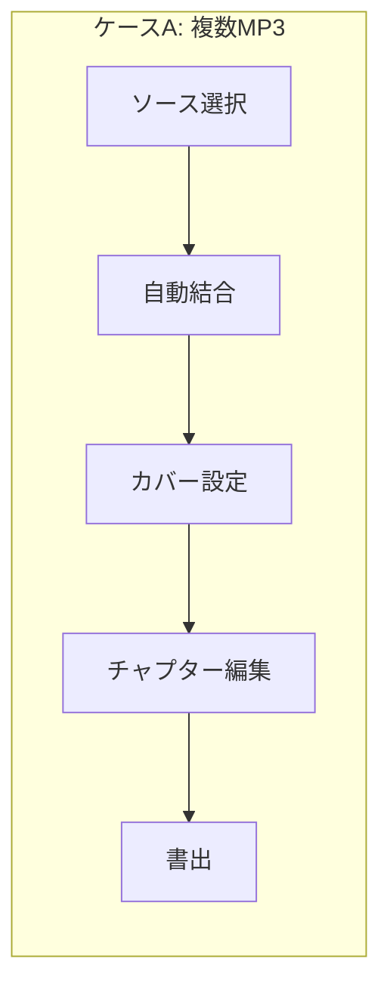

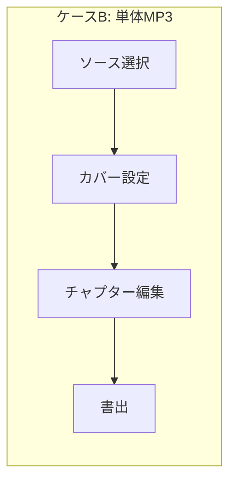

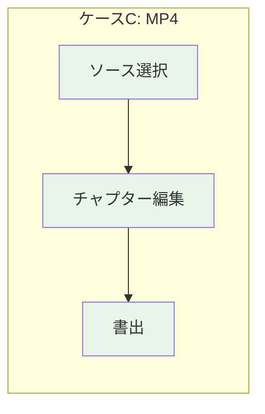

| ケース | カバー画像 | 結合 | エンコード |
|--------|-----------|------|-----------|
| A. 複数MP3 | 必要 | 必要 | 映像1回 + 音声1回 |
| B. 単体MP3 | 必要 | 不要 | 映像1回 + 音声1回 |
| C. MP4 | 不要 | 不要 | 映像1回 + 音声copy |

### メリット

- メイン画面はシンプル（表示と編集に集中）
- 各ダイアログは単一責務
- 明示的な「保存」「適用」ボタン不要
- タブ切替なし、迷わない
- エンコード1回のみ、劣化最小

### 設計原則（本議論から得られた知見）

1. **グラフ構造での問題分析**: ワークフローを有向グラフとして捉え、起点・終点・ノードを明確化
2. **共通パスの抽出**: 複数の起点が合流する「共通パス」を見つけ、そこを中心に設計
3. **制約による単純化**: 制約は選択肢を狭めるが、設計を明確にする効果がある
4. **モーダル分離パターン**: 複雑な入力はダイアログに分離し、メイン画面をシンプルに保つ
5. **自動適用の原則**: ダイアログを閉じると自動で反映、明示的な「保存」ボタン不要

### 次のステップ

- [ ] 現在の2タブ構成を単一画面に統合
- [ ] SourceSelectionDialog の実装
- [ ] CoverImageDialog の実装
- [ ] MainWorkspace の実装
- [ ] ffmpegコマンドの最適化（1パス処理）
- [ ] 実装完了後: PAD図による処理ロジックの文書化

### ダイアグラム方針

| フェーズ | 形式 | 用途 |
|----------|------|------|
| 設計 | Mermaid | グラフ構造、コンポーネント関係 |
| 実装記録 | PAD | 処理ロジック、条件分岐の詳細 |

PADは構造化プログラミング時代の産物であり、実装レベルの処理フローを階層的に記述するのに適している。

### 関連ファイル

- `docs/dev-log-ui-redesign-2025-12-29.md` - 詳細な議論ログ

---

**更新**: 2026-01-08
