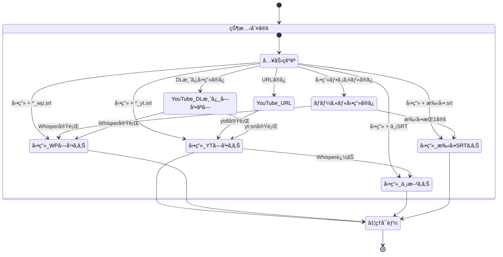

# 開発ログ 2026-01-03

メッセージ数: 284

---

## 👤 User (01:22:26)

次ã«ã€æ–‡å­—èµ·ã“ã—ã®UI作æˆã«ç§»è¡Œã—ãŸã„ã¨æ€ã„ã¾ã™ã€‚./rehaearsal-workflow/report_workflow.pyã§ã™ã‹ã­ã€‚

---

## 🤖 Assistant (01:22:34)

[Tool: Glob]

---

## 🤖 Assistant (01:22:41)

[Tool: Read] /Users/mashi/Dropbox/01_Projects/00_Works/git/portfolio/rehearsal-workflow/rehearsal_workflow/report_workflow.py

---

## 🤖 Assistant (01:22:57)

`report_workflow.py`を確èªã—ã¾ã—ãŸã€‚ã™ã§ã«å……実ã—ãŸæ–‡å­—èµ·ã“ã—ワークフローGUIã§ã™ã­ã€‚

## ç¾åœ¨ã®æ©Ÿèƒ½

| 機能 | 内容 |
|------|------|
| ゴールé¸æŠ | リãƒãƒ¼ã‚µãƒ«è¨˜éŒ² / 会議議事録 / 講義ãƒãƒ¼ãƒˆ / ãã®ä»– |
| 入力ソース | YouTube URL / ローカルファイル |
| 文字起ã“ã— | YouTube字幕 / Whisper / 両方 |
| å‡ºåŠ›å½¢å¼ | Markdown / LaTeX / Word |
| ãƒ—ãƒ­ãƒ³ãƒ—ãƒˆç”Ÿæˆ | ゴール別テンプレート + メタデータ埋ã‚込㿠|
| 設定ä¿å­˜ | JSONå½¢å¼ã§ä¿å­˜/読込 |

## 構æˆ

```
WorkflowGUI (QMainWindow)
├── GoalSelector      # ゴールé¸æŠãƒœã‚¿ãƒ³ç¾¤
├── MetadataForm      # 基本情報入力（動的ラベル）
├── SourceInput       # 入力ソース指定
├── LogPanel          # 実行ログ
├── OutputPanel       # 出力（コピー/ä¿å­˜æ©Ÿèƒ½ï¼‰
└── PromptPanel       # プロンプトテンプレート表示
```

ã©ã®ã‚ˆã†ãªæ”¹å–„・追加を行ã„ãŸã„ã§ã™ã‹ï¼Ÿ

例:
1. Video Chapter Editorã¨ã®çµ±åˆ
2. SRTファイルã®ç›´æ¥èª­ã¿è¾¼ã¿æ©Ÿèƒ½
3. UI/UXã®æ”¹å–„
4. 新機能ã®è¿½åŠ 

---

## 👤 User (01:23:39)

å‰å‡¦ç†ã®ãƒ¯ãƒ¼ã‚¯ãƒ•ãƒ­ãƒ¼ã¨åŒæ§˜ãªè¨­è¨ˆæ€æƒ³ã«ã¦å®Ÿè£…ã—ãŸã„ã¨æ€ã„ã¾ã™ã€‚ã¾ãšã€æ©Ÿèƒ½ã‚’æ•´ç†ã—ã¾ã—ょã†ã€‚

---

## 👤 User (01:24:43)

This session is being continued from a previous conversation that ran out of context. The conversation is summarized below:
Analysis:
Let me analyze this conversation chronologically:

1. **Session Start**: This was a continuation from a previous session working on `rehearsal-workflow` video-chapter-editor app.

2. **Split Chapters Export Feature** (v2.1.23):
   - User requested: "エンコード時ã«ã€ãƒãƒ£ãƒ—ターã”ã¨å€‹åˆ¥ã®ãƒ•ã‚¡ã‚¤ãƒ«ã¨ã—ã¦å‡ºåŠ›ã™ã‚‹ã‚ªãƒ—ションを追加ã—ã€Exportã®å·¦ã«ãƒˆã‚°ãƒ«ã‚’追加ã—ã¦ãã ã•ã„"
   - Created `SplitExportWorker` class in `workers.py`
   - Added `sanitize_filename()` helper function
   - Modified `_start_export()` in `main_workspace.py` to branch based on `split_chapters` checkbox
   - Added handlers `_on_chapter_completed()` and `_on_split_export_completed()`

3. **Error Fix - get_encoder_args()** (v2.1.23):
   - Error: `get_encoder_args() takes from 1 to 3 positional arguments but 4 were given`
   - Fixed by calling `get_encoder_args()` with 3 args and adding `colorspace.get_ffmpeg_args()` separately

4. **Title Overlay for Split Export**:
   - User requested: "個別ã®ã‚¨ãƒ³ã‚³ãƒ¼ãƒ‰ã§ã‚‚Embed ChapãŒãƒã‚§ãƒƒã‚¯ã•ã‚Œã¦ã„ã‚‹å ´åˆã€ã‚¿ã‚¤ãƒˆãƒ«ã®ç„¼ãè¾¼ã¿ã‚’è¡Œã£ã¦ãã ã•ã„"
   - Added `overlay_title` parameter to `SplitExportWorker`
   - Added `_create_title_textfile()`, `_create_title_overlay_filter()`, `_cleanup_temp_files()` methods
   - Updated `main_workspace.py` to pass `overlay_title=embed_chapters`

5. **Release v2.1.23**: Committed and pushed with tag

6. **PyInstaller Bug** (v2.1.24):
   - macOS app wouldn't open - `ModuleNotFoundError: No module named 'email'`
   - Cause: `email`, `html`, `http` were excluded in spec file, but `urllib.request` (used by updater) depends on them
   - Fixed by commenting out those excludes in `video_chapter_editor.spec`

7. **VERSION Constant Bug** (v2.1.25):
   - User noticed About dialog showed wrong version
   - `app.py` had `VERSION = "2.1.22"` instead of current version
   - Fixed by updating to `VERSION = "2.1.25"`

8. **Update Process Discussion**:
   - User asked about update process - explained the semi-automatic flow
   - User asked about differential updates - explained current is full download

9. **iPad/Tauri Discussion**:
   - User asked about iPad release - explained it's difficult due to PySide6/Python/ffmpeg limitations
   - User suggested Tauri → Swift path - agreed it's a good approach
   - User said they'll think about it

10. **Current Work - Transcription UI**:
    - User wants to work on transcription UI: "次ã«ã€æ–‡å­—èµ·ã“ã—ã®UI作æˆã«ç§»è¡Œã—ãŸã„ã¨æ€ã„ã¾ã™"
    - Asked about `report_workflow.py`
    - I read the file - it's a comprehensive transcription workflow GUI
    - User's latest message: "å‰å‡¦ç†ã®ãƒ¯ãƒ¼ã‚¯ãƒ•ãƒ­ãƒ¼ã¨åŒæ§˜ãªè¨­è¨ˆæ€æƒ³ã«ã¦å®Ÿè£…ã—ãŸã„ã¨æ€ã„ã¾ã™ã€‚ã¾ãšã€æ©Ÿèƒ½ã‚’æ•´ç†ã—ã¾ã—ょã†ã€‚"

Key files modified:
- `rehearsal_workflow/ui/workers.py` - Added SplitExportWorker, sanitize_filename()
- `rehearsal_workflow/ui/main_workspace.py` - Split chapters logic, handlers
- `rehearsal_workflow/ui/app.py` - VERSION constant fix
- `video_chapter_editor.spec` - PyInstaller excludes fix
- `pyproject.toml`, `README.md` - Version updates

Releases:
- v2.1.23: Split Chapters feature
- v2.1.24: PyInstaller excludes fix
- v2.1.25: VERSION constant fix

Summary:
1. Primary Request and Intent:
   - **Split Chapters Export**: Add option to export each chapter as individual files with "Split Chapters" toggle
   - **Title Overlay**: When "Embed Chap" is checked, burn chapter title into each split video
   - **Bug Fixes**: Fix PyInstaller module errors and VERSION constant mismatch
   - **Current**: Start work on transcription UI based on `report_workflow.py`, using similar design philosophy as the video chapter editor

2. Key Technical Concepts:
   - `QThread` worker pattern for background video processing
   - ffmpeg `-ss` and `-t` for segment extraction
   - `drawtext` filter for text overlay/burn-in
   - PyInstaller excludes and hidden imports
   - GitHub Actions for automated releases
   - Semi-automatic app updater using GitHub Releases API
   - PySide6 GUI development patterns

3. Files and Code Sections:

   - **`rehearsal_workflow/ui/workers.py`** - Added SplitExportWorker for chapter-by-chapter export
     ```python
     def sanitize_filename(name: str) -> str:
         """ファイルåã«ä½¿ç”¨ã§ããªã„文字を除å»ãƒ»ç½®æ›"""
         invalid_chars = r'[<>:"/\\|?*]'
         sanitized = re.sub(invalid_chars, '_', name)
         sanitized = re.sub(r'_+', '_', sanitized)
         sanitized = sanitized.strip(' _')
         return sanitized if sanitized else "chapter"

     class SplitExportWorker(QThread):
         """ãƒãƒ£ãƒ—ターã”ã¨ã«åˆ†å‰²ã‚¨ã‚¯ã‚¹ãƒãƒ¼ãƒˆã™ã‚‹ãƒ¯ãƒ¼ã‚«ãƒ¼"""
         progress_update = Signal(str)
         progress_percent = Signal(int, str)
         chapter_completed = Signal(int, str)
         export_completed = Signal(int)
         error_occurred = Signal(str)
         
         EXCLUDE_PREFIX = "--"
         FONT_SIZE_RATIO = 0.054
         
         def __init__(self, input_file: str, output_dir: str, output_base: str,
                      chapters: List[ChapterInfo], total_duration_ms: int = 0,
                      encoder_id: str = "libx264", bitrate_kbps: int = 4000,
                      crf: int = 23, colorspace: Optional[ColorspaceInfo] = None,
                      is_audio_only: bool = False, overlay_title: bool = False,
                      parent=None):
             # ... initialization with overlay_title, font_path, _temp_files
         
         def _create_title_overlay_filter(self, title: str, duration_sec: float) -> str:
             """ãƒãƒ£ãƒ—タータイトル焼ãè¾¼ã¿ç”¨ã®ãƒ•ã‚£ãƒ«ã‚¿ãƒ¼ã‚’生æˆ"""
             # Creates drawtext filter for burning in chapter title
     ```

   - **`rehearsal_workflow/ui/main_workspace.py`** - Split chapters integration
     ```python
     # Import added
     from .workers import WaveformWorker, SpectrogramWorker, ExportWorker, SplitExportWorker
     
     # In _start_export():
     if split_chapters:
         self._export_worker = SplitExportWorker(
             input_file=str(input_path),
             output_dir=str(self._state.work_dir),
             output_base=Path(output_base).name,
             chapters=chapters,
             total_duration_ms=duration_ms,
             encoder_id=encoder_id,
             bitrate_kbps=bitrate,
             crf=crf,
             colorspace=colorspace,
             is_audio_only=input_path.suffix.lower() in AUDIO_EXTENSIONS,
             overlay_title=embed_chapters  # Embed ChapãŒãƒã‚§ãƒƒã‚¯ã•ã‚Œã¦ã„ã‚‹å ´åˆã€ã‚¿ã‚¤ãƒˆãƒ«ç„¼ãè¾¼ã¿
         )
     
     # New handlers added:
     def _on_chapter_completed(self, chapter_num: int, output_path: str):
         self._log_panel.info(f"Chapter {chapter_num} exported: {Path(output_path).name}", source="Export")

     def _on_split_export_completed(self, count: int):
         self._log_panel.info(f"Split export completed: {count} files", source="Export")
         self._reset_export_btn()
         self.export_finished.emit(True, f"{count} chapters exported")
     ```

   - **`rehearsal_workflow/ui/app.py`** - VERSION constant fix
     ```python
     VERSION = "2.1.25"  # Was "2.1.22", causing About dialog to show wrong version
     ```

   - **`video_chapter_editor.spec`** - PyInstaller excludes fix
     ```python
     excludes=[
         'tkinter',
         'unittest',
         # 'email',  # urllib.requestãŒä¾å­˜
         # 'html',   # urllib.requestãŒä¾å­˜
         # 'http',   # urllib.requestãŒä¾å­˜
         'xml',
         'pydoc',
         # ...
     ]
     ```

   - **`rehearsal_workflow/report_workflow.py`** - Transcription workflow GUI (read for reference)
     - 1337 lines, comprehensive PySide6 application
     - Features: GoalSelector, MetadataForm, SourceInput, LogPanel, OutputPanel, PromptPanel
     - Supports: YouTube/Whisper transcription, multiple output formats, prompt templates

4. Errors and fixes:
   - **`get_encoder_args() takes from 1 to 3 positional arguments but 4 were given`**:
     - Cause: Called with 4 args including colorspace
     - Fix: Call with 3 args, add `colorspace.get_ffmpeg_args()` separately
   
   - **`ModuleNotFoundError: No module named 'email'`** (macOS app wouldn't open):
     - Cause: PyInstaller spec excluded `email`, `html`, `http` but `urllib.request` depends on them
     - Fix: Commented out those excludes in `video_chapter_editor.spec`
   
   - **About dialog showing wrong version**:
     - Cause: `VERSION = "2.1.22"` in app.py wasn't updated
     - Fix: Updated to `VERSION = "2.1.25"`

5. Problem Solving:
   - Successfully implemented split chapter export with title overlay
   - Fixed all release blockers (PyInstaller modules, VERSION constant)
   - Released v2.1.23, v2.1.24, v2.1.25 successfully
   - Discussed iPad/Tauri migration path (user is considering)

6. All user messages:
   - Log output showing split export error with get_encoder_args
   - "個別ã®ã‚¨ãƒ³ã‚³ãƒ¼ãƒ‰ã§ã‚‚Embed ChapãŒãƒã‚§ãƒƒã‚¯ã•ã‚Œã¦ã„ã‚‹å ´åˆã€ã‚¿ã‚¤ãƒˆãƒ«ã®ç„¼ãè¾¼ã¿ã‚’è¡Œã£ã¦ãã ã•ã„"
   - "githubã®æ–¹ã¯ã©ã†ãªã£ã¦ã„ã¾ã™ã‹ï¼Ÿ"
   - "ã§ã™ã­ã€‚リリースã¾ã§ãŠé¡˜ã„ã—ã¾ã™ã€‚アップデーターも作æˆã§ãã¾ã™ï¼Ÿ"
   - "ãã®å¾Œã®ã‚¢ãƒƒãƒ—デートã¯ã©ã®ã‚ˆã†ãªæ‰‹é †ã«ãªã‚Šã¾ã™ã‹ï¼Ÿ"
   - "差分ã§ã¯ãªã„ã‚“ã§ã™ã­ã€‚"
   - "OK"
   - "mac版を実行ã™ã‚‹ã¨é–‹ã‘ãªã„ã‚“ã§ã™ã‘ã©ã€‚ãªã‚“ã§ã—ょã†ã€‚"
   - "何も出ãªã„ã‚“ã§ã™ã‚ˆã€‚ã“ã®ã¾ã¾é–‹ãã§ã€åŒã˜ã‚ˆã†ã«é–‹ã„ã¦ã„ã‚‹ã‚“ã§ã™ã‘ã©ã€‚"
   - Terminal error output showing `ModuleNotFoundError: No module named 'email'`
   - "Aboutã®ãƒãƒ¼ã‚¸ãƒ§ãƒ³ã€é–“é•ã£ã¦ã¾ã›ã‚“？"
   - "ã“ã®ã‚¢ãƒ—リã€iPad用ã«ãƒªãƒªãƒ¼ã‚¹ã™ã‚‹ã¨ãªã‚‹ã¨å¤§å¤‰ã§ã™ã‹ã­ã€‚"
   - "Tauri版を作æˆã—ã¦ã€Swiftã«å‘ã‹ã†ã®ã¯ã„ã‹ãŒã§ã—ょã†ã€‚"
   - "ã¡ã‚‡ã£ã¨è€ƒãˆã¾ã™ã­ã€‚"
   - "次ã«ã€æ–‡å­—èµ·ã“ã—ã®UI作æˆã«ç§»è¡Œã—ãŸã„ã¨æ€ã„ã¾ã™ã€‚./rehaearsal-workflow/report_workflow.pyã§ã™ã‹ã­ã€‚"
   - "å‰å‡¦ç†ã®ãƒ¯ãƒ¼ã‚¯ãƒ•ãƒ­ãƒ¼ã¨åŒæ§˜ãªè¨­è¨ˆæ€æƒ³ã«ã¦å®Ÿè£…ã—ãŸã„ã¨æ€ã„ã¾ã™ã€‚ã¾ãšã€æ©Ÿèƒ½ã‚’æ•´ç†ã—ã¾ã—ょã†ã€‚"

7. Pending Tasks:
   - Organize and plan transcription UI features based on `report_workflow.py`
   - Design with similar philosophy as video chapter editor

8. Current Work:
   User wants to work on transcription UI. They said:
   - "次ã«ã€æ–‡å­—èµ·ã“ã—ã®UI作æˆã«ç§»è¡Œã—ãŸã„ã¨æ€ã„ã¾ã™" (I want to move on to creating the transcription UI)
   - "å‰å‡¦ç†ã®ãƒ¯ãƒ¼ã‚¯ãƒ•ãƒ­ãƒ¼ã¨åŒæ§˜ãªè¨­è¨ˆæ€æƒ³ã«ã¦å®Ÿè£…ã—ãŸã„ã¨æ€ã„ã¾ã™ã€‚ã¾ãšã€æ©Ÿèƒ½ã‚’æ•´ç†ã—ã¾ã—ょã†ã€‚" (I want to implement it with a similar design philosophy as the preprocessing workflow. First, let's organize the features.)
   
   I read `report_workflow.py` which is an existing transcription workflow GUI with:
   - Goal selection (rehearsal/meeting/lecture/other)
   - Metadata forms with dynamic labels
   - YouTube URL and local file input
   - Transcription methods (YouTube subtitles/Whisper/both)
   - Output formats (Markdown/LaTeX/Word)
   - Prompt template generation
   - Settings save/load

9. Optional Next Step:
   Organize and discuss the features for the transcription UI with the user. The user explicitly said "ã¾ãšã€æ©Ÿèƒ½ã‚’æ•´ç†ã—ã¾ã—ょã†" (First, let's organize the features), so the next step is to discuss what features to include and how to structure the UI, following similar design patterns as the video chapter editor..
Please continue the conversation from where we left it off without asking the user any further questions. Continue with the last task that you were asked to work on.

---

## 🤖 Assistant (01:24:50)

文字起ã“ã—UIã®æ©Ÿèƒ½æ•´ç†ã‚’è¡Œã„ã¾ã™ã€‚ã¾ãšã€æ—¢å­˜ã®`report_workflow.py`を確èªã—ã¦æ©Ÿèƒ½ã‚’æ•´ç†ã—ã¾ã™ã€‚

---

## 🤖 Assistant (01:24:51)

[Tool: Read] /Users/mashi/Dropbox/01_Projects/00_Works/git/portfolio/rehearsal-workflow/rehearsal_workflow/report_workflow.py

---

## 🤖 Assistant (01:25:24)

`report_workflow.py`ã®å†…容を確èªã—ã¾ã—ãŸã€‚å‰å‡¦ç†ãƒ¯ãƒ¼ã‚¯ãƒ•ãƒ­ãƒ¼ï¼ˆVideo Chapter Editor）ã¨åŒæ§˜ã®è¨­è¨ˆæ€æƒ³ã§å®Ÿè£…ã™ã‚‹ãŸã‚ã€æ©Ÿèƒ½ã‚’æ•´ç†ã—ã¾ã™ã€‚

## ç¾è¡Œ `report_workflow.py` ã®æ©Ÿèƒ½åˆ†æ

### 1. 入力機能
| 機能 | ç¾çŠ¶å®Ÿè£… | 備考 |
|------|----------|------|
| ゴールé¸æŠ | 4種é¡ï¼ˆãƒªãƒãƒ¼ã‚µãƒ«/会議/講義/ãã®ä»–） | ボタンå¼ã€å‹•çš„ラベル切替 |
| メタデータ入力 | 5項目（タイトル/日時/キーパーソン/団体/利用者） | ゴール連動ラベル |
| YouTube URL入力 | ã‚ã‚Š | |
| ローカルファイルé¸æŠ | ã‚ã‚Š | å‹•ç”»/音声 |
| ãƒãƒ£ãƒ—ターファイル | ã‚り（オプション） | |
| 文字起ã“ã—方法 | 3æŠï¼ˆYouTube字幕/Whisper/両方） | |
| å‡ºåŠ›å½¢å¼ | 3æŠï¼ˆMarkdown/LaTeX/Word） | |

### 2. 処ç†æ©Ÿèƒ½
| 機能 | ç¾çŠ¶å®Ÿè£… | 備考 |
|------|----------|------|
| YouTube字幕å–å¾— | QProcess経由ã§ytdl | |
| Whisper文字起ã“ã— | QProcess経由ã§whisper-remote | |
| 複åˆå®Ÿè¡Œ | YouTube + Whisper両方 | |

### 3. 出力機能
| 機能 | ç¾çŠ¶å®Ÿè£… | 備考 |
|------|----------|------|
| 実行ログ表示 | LogPanel | |
| 文字起ã“ã—çµæœè¡¨ç¤º | OutputPanel | コピー/ä¿å­˜æ©Ÿèƒ½ |
| ãƒ—ãƒ­ãƒ³ãƒ—ãƒˆç”Ÿæˆ | PromptPanel | テンプレート＋変数展開 |
| 設定ä¿å­˜/読込 | JSONå½¢å¼ | |

---

## Video Chapter Editorã¨ã®è¨­è¨ˆæ¯”較

| 観点 | Video Chapter Editor | report_workflow.py |
|------|---------------------|-------------------|
| çŠ¶æ…‹ç®¡ç† | `AppState`ãƒ‡ãƒ¼ã‚¿ã‚¯ãƒ©ã‚¹é›†ä¸­ç®¡ç† | インスタンス変数分散 |
| é‡ã„å‡¦ç† | `QThread` Worker パターン | `QProcess` ç›´æ¥å‘¼ã³å‡ºã— |
| UI構造 | モジュラーウィジェット + Signal | å˜ä¸€ã‚¯ãƒ©ã‚¹ã«é›†ç´„ |
| ã‚¨ãƒ©ãƒ¼å‡¦ç† | 構造化ã•ã‚ŒãŸã‚¨ãƒ©ãƒ¼ãƒãƒ³ãƒ‰ãƒªãƒ³ã‚° | 基本的ãªtry-except |
| ファイル監視 | `QFileSystemWatcher` | ãªã— |

---

## æ案：統åˆã™ã¹ã機能ã®æ•´ç†

### A. コア機能（必須）
1. **SRTファイル読ã¿è¾¼ã¿** - ãƒãƒ£ãƒ—ター付ãSRTã‹ã‚‰ã®å…¥åŠ›
2. **プロンプト生æˆ** - メタデータ＋文字起ã“ã—çµåˆ
3. **クリップボードコピー** - Web AI用

### B. å‰å‡¦ç†é€£æº
1. **Video Chapter Editorã‹ã‚‰ã®å¼•ã継ã** - 作業ディレクトリã€ãƒãƒ£ãƒ—ター情報
2. **SRT自動検出** - 作業ディレクトリ内ã®æœ€æ–°SRT

### C. 出力機能
1. **Markdown生æˆ**
2. **LaTeX生æˆ** - LuaLaTeX用テンプレート
3. **Word生æˆ** - pandoc連æº

ç¾åœ¨ã®UIã‚’Video Chapter Editorã®ã‚µã‚¤ãƒ‰ãƒ‘ãƒãƒ«ã¨ã—ã¦çµ±åˆã™ã‚‹ã‹ã€ç‹¬ç«‹ã—ãŸã‚¦ã‚£ãƒ³ãƒ‰ã‚¦ã¨ã—ã¦ç¶­æŒã™ã‚‹ã‹ã€ã©ã¡ã‚‰ã®æ–¹å‘性ãŒè‰¯ã„ã§ã—ょã†ã‹ï¼Ÿ

---

## 👤 User (01:28:31)

最終的ã«ã¯ã€å†ç¾æ€§ã¨å†åˆ©ç”¨æ€§ã‚’確ä¿ã—ãŸã„ã®ã§ã€è¨­å®šãƒ•ã‚¡ã‚¤ãƒ«ã‚’ä¿å­˜ã™ã‚‹ä»•æ§˜ã«ã—ãŸã„ã¨è€ƒãˆã¦ã„ã¾ã™ã€‚フローをæ˜ç¢ºã«ã™ã‚‹ãŸã‚ã«ã€è¨­å®šãƒ•ã‚¡ã‚¤ãƒ«ã®ãƒ‡ã‚¶ã‚¤ãƒ³ã‹ã‚‰è¡Œã†ã®ãŒè‰¯ã„ã¨è€ƒãˆã¦ã„ã¾ã™ãŒã„ã‹ãŒã§ã—ょã†ã€‚

---

## 🤖 Assistant (01:29:10)

設定ファイルã‹ã‚‰ãƒ‡ã‚¶ã‚¤ãƒ³ã™ã‚‹ã‚¢ãƒ—ローãƒã¯æ­£ã—ã„設計方é‡ã§ã™ã€‚データ構造を先ã«å®šç¾©ã™ã‚‹ã“ã¨ã§ã€UIã¨ãƒ­ã‚¸ãƒƒã‚¯ã®åˆ†é›¢ãŒæ˜ç¢ºã«ãªã‚Šã¾ã™ã€‚

## 設定ファイル設計案

```yaml
# rehearsal_workflow.yaml
version: "1.0"

# ============================================================
# Phase 1: ソース情報（å‰å‡¦ç†ã‹ã‚‰å¼•ã継ã or 手動入力）
# ============================================================
source:
  type: "local"                    # local | youtube
  path: "/path/to/video.mp4"       # ローカルファイルパス or YouTube URL
  working_dir: "/path/to/workdir"  # 作業ディレクトリ

# ============================================================
# Phase 2: å‰å‡¦ç†çµæœï¼ˆVideo Chapter Editorã‹ã‚‰ã®å‡ºåŠ›ï¼‰
# ============================================================
preprocessing:
  srt_file: "video_chapters.srt"   # ãƒãƒ£ãƒ—ター付ãSRT
  chapters_file: "video.chapters"  # ãƒãƒ£ãƒ—ターファイル（オプション）
  exported_video: "video_out.mp4"  # エクスãƒãƒ¼ãƒˆæ¸ˆã¿å‹•ç”»ï¼ˆã‚ªãƒ—ション）

# ============================================================
# Phase 3: 文字起ã“ã—設定
# ============================================================
transcription:
  method: "youtube"                # youtube | whisper | both | manual
  whisper:
    model: "large-v3"
    language: "ja"
    remote_host: "server.local"
  youtube:
    auto_generated: true           # 自動生æˆå­—幕を使用

# ============================================================
# Phase 4: コンテンツメタデータ
# ============================================================
metadata:
  goal_type: "rehearsal"           # rehearsal | meeting | lecture | other
  title: "ブラームス交響曲第1番"
  datetime: "2025-01-03"
  key_person: "指æ®è€…å"
  organization: "〇〇交響楽団"
  consumer: "団員"

# ============================================================
# Phase 5: 出力設定
# ============================================================
output:
  format: "markdown"               # markdown | latex | docx
  prompt_template: "rehearsal"     # テンプレートå or カスタムパス
  filename_base: "rehearsal_record"
  
# ============================================================
# 生æˆç‰©ï¼ˆè‡ªå‹•æ›´æ–°ï¼‰
# ============================================================
artifacts:
  transcript_srt: "video.srt"
  transcript_text: "video_transcript.txt"
  prompt_file: "prompt_for_ai.md"
  final_output: "rehearsal_record.md"
```

## ワークフロー図

```
┌─────────────────────────────────────────────────────────────â”
│  Phase 1: Source                                            │
│  ┌──────────────┠   ┌──────────────┠                      │
│  │ Local File   │ or │ YouTube URL  │                       │
│  └──────┬───────┘    └──────┬───────┘                       │
│         └─────────┬─────────┘                               │
└───────────────────┼─────────────────────────────────────────┘
                    â–¼
┌─────────────────────────────────────────────────────────────â”
│  Phase 2: Preprocessing (Video Chapter Editor)              │
│  ┌──────────────┠   ┌──────────────┠   ┌──────────────┠  │
│  │ Trim/Edit    │ → │ Add Chapters │ → │ Export       │   │
│  └──────────────┘    └──────────────┘    └──────┬───────┘   │
│                                                  │           │
│  Output: *.srt, *.chapters, *_out.mp4           │           │
└──────────────────────────────────────────────────┼───────────┘
                    â–¼                              â–¼
┌─────────────────────────────────────────────────────────────â”
│  Phase 3: Transcription                                     │
│  ┌──────────────┠   ┌──────────────┠   ┌──────────────┠  │
│  │ YouTube Sub  │ or │ Whisper      │ or │ Manual SRT   │   │
│  └──────┬───────┘    └──────┬───────┘    └──────┬───────┘   │
│         └─────────────┬─────────────────────────┘           │
│                       ▼                                     │
│  Output: *_transcript.txt                                   │
└───────────────────────┼─────────────────────────────────────┘
                        â–¼
┌─────────────────────────────────────────────────────────────â”
│  Phase 4: Metadata Input                                    │
│  ┌─────────────────────────────────────────────────────┠   │
│  │ Goal Type | Title | DateTime | KeyPerson | Org      │    │
│  └─────────────────────────────────────────────────────┘    │
└───────────────────────┼─────────────────────────────────────┘
                        â–¼
┌─────────────────────────────────────────────────────────────â”
│  Phase 5: Output Generation                                 │
│  ┌──────────────┠   ┌──────────────┠   ┌──────────────┠  │
│  │ Prompt Gen   │ → │ Copy to AI   │ → │ Final Doc    │   │
│  └──────────────┘    └──────────────┘    └──────────────┘   │
│                                                             │
│  Output: prompt.md, final_record.{md|tex|docx}              │
└─────────────────────────────────────────────────────────────┘
```

## 設計上ã®åˆ¤æ–­ãƒã‚¤ãƒ³ãƒˆ

| é …ç›® | é¸æŠè‚¢ | æ¨å¥¨ |
|------|--------|------|
| ãƒ•ã‚¡ã‚¤ãƒ«å½¢å¼ | YAML / JSON / TOML | **YAML**（å¯èª­æ€§é‡è¦–） |
| ä¿å­˜å ´æ‰€ | 作業ディレクトリ / 中央集約 | **作業ディレクトリ**（プロジェクトå˜ä½ï¼‰ |
| ファイルå | 固定 / å¯å¤‰ | **固定**（`.rehearsal_workflow.yaml`） |
| å±¥æ­´ç®¡ç† | ãªã— / ãƒãƒ¼ã‚¸ãƒ§ãƒ‹ãƒ³ã‚° | å°†æ¥æ¤œè¨ |

YAMLã‚’Pythonã§æ‰±ã†ã«ã¯`pyyaml`ã‹`ruamel.yaml`ãŒå¿…è¦ã§ã™ã€‚ç¾åœ¨ã®ä¾å­˜é–¢ä¿‚ã«å«ã¾ã‚Œã¦ã„ã¾ã™ã‹ï¼Ÿ

---

## 👤 User (01:31:28)

相談ã§ã™ã‘ã©ã€‚Video Chapter Editorã‹ã‚‰å‡¦ç†ã‚’呼ã³å‡ºã—ã¦å®Ÿè¡Œã™ã‚‹ã€‚rehearsal_workflow.pyã¯ã€è¨­å®šãƒ•ã‚¡ã‚¤ãƒ«ã‚’作æˆã€ãƒ†ã‚¹ãƒˆã™ã‚‹UIã«ã™ã‚‹ã¨ã„ã†ã®ã¯ã‚ã‚Šã§ã™ã‹ã€‚ãã‚Œã¨ã‚‚エラー対応ãªã©ã®ãƒ•ã‚£ãƒ¼ãƒ‰ãƒãƒƒã‚¯ã®å¯èƒ½æ€§ã‚’考慮ã—ã¦åˆ¥ã«è¨­å®šã¨å‡¦ç†ã‚’è¡Œã†ã‚¢ãƒ—リã¨ã—ã¦ä½œæˆã™ã‚‹æ–¹ãŒæœ›ã¾ã—ã„ã¨è€ƒãˆã¾ã™ã‹ã€‚

---

## 🤖 Assistant (01:32:02)

良ã„å•ã„ã§ã™ã€‚両方ã®ã‚¢ãƒ—ローãƒã‚’分æã—ã¾ã™ã€‚

## é¸æŠè‚¢ã®æ¯”較

| 観点 | A: çµ±åˆå‹ï¼ˆVCEã‹ã‚‰å‘¼ã³å‡ºã—） | B: 分離å‹ï¼ˆç‹¬ç«‹ã‚¢ãƒ—リ） |
|------|---------------------------|----------------------|
| **ワークフロー** | シームレス（ワンストップ） | æ˜ç¤ºçš„ãªå¼•ã継ã |
| **エラー対応** | 複åˆçš„ã§åˆ‡ã‚Šåˆ†ã‘困難 | å•é¡Œã®å±€æ‰€åŒ–ãŒå®¹æ˜“ |
| **テスト** | çµ±åˆãƒ†ã‚¹ãƒˆå¿…é ˆ | å˜ä½“テストå¯èƒ½ |
| **å˜ç‹¬åˆ©ç”¨** | ä¸å¯ï¼ˆVCE必須） | å¯èƒ½ï¼ˆæ—¢å­˜SRTã‹ã‚‰é–‹å§‹å¯ï¼‰ |
| **ä¿å®ˆæ€§** | VCEãŒè‚¥å¤§åŒ– | å„ツールå°è¦æ¨¡ç¶­æŒ |
| **設計æ€æƒ³** | モãƒãƒªã‚·ãƒƒã‚¯ | 「é…管ã¨é™¶å™¨ã€ã«åˆè‡´ |

## æ¨å¥¨ï¼šãƒã‚¤ãƒ–リッドå‹

```
┌─────────────────────────────────────────────────────────────â”
│  Video Chapter Editor                                       │
│  ┌─────────────────────────────────────────────────────┠   │
│  │ Export完了時                                         │    │
│  │   [文字起ã“ã—ã¸é€²ã‚€] â† è¨­å®šãƒ•ã‚¡ã‚¤ãƒ«ç”Ÿæˆ + èµ·å‹•       │    │
│  └─────────────────────────────────────────────────────┘    │
└───────────────────────┼─────────────────────────────────────┘
                        │ .rehearsal_workflow.yaml
                        â–¼
┌─────────────────────────────────────────────────────────────â”
│  Transcription Workflow (独立アプリ)                        │
│  ┌─────────────────────────────────────────────────────┠   │
│  │ - 設定ファイル読込ã§çŠ¶æ…‹å¾©å…ƒ                         │    │
│  │ - å˜ç‹¬èµ·å‹•ã‚‚å¯èƒ½ï¼ˆSRTドロップãªã©ï¼‰                  │    │
│  │ - エラー時ã¯è‡ªå·±å®Œçµã§å¯¾å¿œ                           │    │
│  └─────────────────────────────────────────────────────┘    │
└─────────────────────────────────────────────────────────────┘
```

**ç†ç”±**：

1. **エラー対応ã®ç‹¬ç«‹æ€§** - Whisperã®ã‚¿ã‚¤ãƒ ã‚¢ã‚¦ãƒˆã€YouTube API制é™ãªã©æ–‡å­—èµ·ã“ã—固有ã®å•é¡Œã¯ç‹¬ç«‹UIã§å¯¾å‡¦ã™ã‚‹æ–¹ãŒæ˜ç¢º

2. **利用パターンã®å¤šæ§˜æ€§** - 「既ã«SRTãŒã‚ã‚‹ã€ã€ŒYouTubeã‹ã‚‰ç›´æ¥ã€ãªã©ã€VCEを経由ã—ãªã„ケースも存在

3. **設定ファイルãŒé€£æºã®æ©‹æ¸¡ã—** - YAMLファイルãŒ2ã¤ã®ã‚¢ãƒ—リをç–çµåˆã§ç¹‹ã

4. **CLAUDE.mdã®æ€æƒ³ã¨ã®æ•´åˆ** - 「å˜ä¸€ç›®çš„ã®ãƒ„ールを組ã¿åˆã‚ã›ã¦ãƒ¯ãƒ¼ã‚¯ãƒ•ãƒ­ãƒ¼ã‚’構築ã™ã‚‹ã€

VCEã«ã€Œæ–‡å­—èµ·ã“ã—ã¸é€²ã‚€ã€ãƒœã‚¿ãƒ³ã‚’追加ã—ã€è¨­å®šãƒ•ã‚¡ã‚¤ãƒ«ç”Ÿæˆï¼‹åˆ¥ã‚¦ã‚£ãƒ³ãƒ‰ã‚¦èµ·å‹•ã¨ã„ã†å½¢ãŒã€ä¿å®ˆæ€§ã¨ä½¿ã„å‹æ‰‹ã®ãƒãƒ©ãƒ³ã‚¹ãŒè‰¯ã„ã¨è€ƒãˆã¾ã™ã€‚

---

## 👤 User (01:33:42)

ãªã‚‹ã»ã©ã€‚処ç†ã‚„UIを従å±ã•ã›ã‚‹ã®ã¯ãŠå¥½ã¿ã§ã¯ãªã„ã®ã§ã€ç‹¬ç«‹ã—ãŸã‚¢ãƒ—リã¨ã—ã¦ã€å‡¦ç†ã®ã‚¹ã‚±ãƒ¼ãƒ©ãƒ“リティを確ä¿ã™ã‚‹æ–¹é‡ã§ä½œæˆã—ãŸã„ã¨æ€ã„ã¾ã™ã€‚

---

## 🤖 Assistant (01:33:51)

了解ã—ã¾ã—ãŸã€‚独立アプリã¨ã—ã¦è¨­è¨ˆã™ã‚‹ã“ã¨ã§ã€å°†æ¥çš„ãªãƒãƒƒãƒå‡¦ç†ã‚„CLI連æºã‚‚視é‡ã«å…¥ã‚Œã‚‰ã‚Œã¾ã™ã€‚

設定ファイルã®è©³ç´°è¨­è¨ˆã‚’進ã‚ã¾ã™ã€‚

---

## 🤖 Assistant (01:33:55)

[Tool: TodoWrite] ['設定ファイル(YAML)ã®ã‚¹ã‚­ãƒ¼ãƒå®šç¾©', 'データモデル(dataclass)ã®è¨­è¨ˆ', '設定ファイルã®èª­ã¿æ›¸ãモジュール作æˆ', 'UIã®åŸºæœ¬æ§‹é€ è¨­è¨ˆ', '文字起ã“ã—処ç†ãƒ¯ãƒ¼ã‚«ãƒ¼ã®å®Ÿè£…']

---

## 🤖 Assistant (01:34:05)

[Tool: Read] /Users/mashi/Dropbox/01_Projects/00_Works/git/portfolio/rehearsal-workflow/pyproject.toml

---

## 🤖 Assistant (01:34:36)

`PyYAML>=6.0`ãŒæ—¢ã«å«ã¾ã‚Œã¦ã„ã¾ã™ã€‚設定ファイルã®ã‚¹ã‚­ãƒ¼ãƒã‚’詳細ã«å®šç¾©ã—ã¾ã™ã€‚

## 設定ファイルスキームv1.0

```yaml
# transcription_workflow.yaml
# 文字起ã“ã—ワークフロー設定ファイル
# ============================================================

schema_version: "1.0"

# ============================================================
# ソース定義
# ============================================================
source:
  # ソースタイプ: local | youtube
  type: "local"
  
  # ローカルファイルã®å ´åˆ: å‹•ç”»/音声ファイルパス
  # YouTubeã®å ´åˆ: URL
  path: ""
  
  # 作業ディレクトリ（相対パスã®åŸºæº–）
  working_dir: ""
  
  # 関連ファイル（Video Chapter Editorã‹ã‚‰ã®å¼•ã継ã）
  related_files:
    srt: ""           # ãƒãƒ£ãƒ—ター付ãSRT
    chapters: ""      # .chaptersファイル
    exported: ""      # エクスãƒãƒ¼ãƒˆæ¸ˆã¿å‹•ç”»

# ============================================================
# 文字起ã“ã—設定
# ============================================================
transcription:
  # æ–¹å¼: youtube | whisper | manual | skip
  method: "youtube"
  
  # YouTube字幕設定
  youtube:
    prefer_manual: true      # 手動字幕優先
    fallback_auto: true      # 自動生æˆã«ãƒ•ã‚©ãƒ¼ãƒ«ãƒãƒƒã‚¯
    language: "ja"
  
  # Whisper設定
  whisper:
    model: "large-v3"
    language: "ja"
    # リモート実行設定（オプション）
    remote:
      enabled: false
      host: ""
      port: 22

# ============================================================
# メタデータ
# ============================================================
metadata:
  # ゴールタイプ: rehearsal | meeting | lecture | other
  goal_type: "rehearsal"
  
  # 共通フィールド（ラベルã¯goal_typeã§å¤‰åŒ–）
  title: ""
  datetime: ""
  key_person: ""
  organization: ""
  consumer: ""
  
  # 追加メモ（自由記述）
  notes: ""

# ============================================================
# 出力設定
# ============================================================
output:
  # ベースファイルå（拡張å­ãªã—）
  basename: ""
  
  # 出力形å¼: markdown | latex | docx
  format: "markdown"
  
  # プロンプトテンプレート: builtin:rehearsal | builtin:meeting | カスタムパス
  prompt_template: "builtin:rehearsal"
  
  # 最終出力ã«å«ã‚ã‚‹è¦ç´ 
  include:
    chapters: true       # ãƒãƒ£ãƒ—ター情報
    timestamps: false    # タイムスタンプ
    speaker_labels: true # 話者ラベル（検出時）

# ============================================================
# 処ç†çŠ¶æ…‹ï¼ˆã‚¢ãƒ—リãŒè‡ªå‹•æ›´æ–°ï¼‰
# ============================================================
status:
  # ç¾åœ¨ã®ãƒ•ã‚§ãƒ¼ã‚º: init | transcribing | editing | exporting | done
  phase: "init"
  
  # 生æˆæ¸ˆã¿ãƒ•ã‚¡ã‚¤ãƒ«
  artifacts:
    transcript_raw: ""    # 生ã®æ–‡å­—èµ·ã“ã—çµæœ
    transcript_edited: "" # 編集後
    prompt_file: ""       # 生æˆã—ãŸãƒ—ロンプト
    final_output: ""      # 最終æˆæœç‰©
  
  # 最終更新
  updated_at: ""
```

## 設計判断

| é …ç›® | 決定 | ç†ç”± |
|------|------|------|
| ファイルå | `transcription_workflow.yaml` | 目的ãŒæ˜ç¢º |
| ä¿å­˜å ´æ‰€ | 作業ディレクトリ | プロジェクトå˜ä½ç®¡ç† |
| `status`セクション | 自動更新 | 中断・å†é–‹å¯¾å¿œ |
| `related_files` | 相対パス | ãƒãƒ¼ã‚¿ãƒ“リティ |
| `prompt_template` | `builtin:` prefix | 内蔵/カスタム識別 |

## 次ã®ã‚¹ãƒ†ãƒƒãƒ—

1. ã“ã®ã‚¹ã‚­ãƒ¼ãƒã«å¯¾å¿œã™ã‚‹`dataclass`を定義
2. YAML読ã¿æ›¸ãモジュール作æˆ
3. ãƒãƒªãƒ‡ãƒ¼ã‚·ãƒ§ãƒ³å®Ÿè£…

ã“ã®ã‚¹ã‚­ãƒ¼ãƒã§é€²ã‚ã¦ã‚ˆã‚ã—ã„ã§ã™ã‹ï¼Ÿä¿®æ­£ç‚¹ãŒã‚ã‚Œã°ã”指摘ãã ã•ã„。

---

## 👤 User (01:38:56)

ã§ã™ã­ã€‚ã‚ã¨ã¯YamlãŒå¤§ãããªã‚Šã™ãã‚‹ã®ã¯æœ›ã¾ã—ããªãスケーラブルã«CLIã§åˆ©ç”¨ã—ã¥ã‚‰ããªã‚‹ã®ã§ã€Claudeã®ã‚«ã‚¹ã‚¿ãƒ ã‚³ãƒãƒ³ãƒ‰ãªã©ã¯æ¥µåŠ›å¤–部ファイルã«ã—ãŸã„ã¨è€ƒãˆã¦ã„ã¾ã™ã€‚

---

## 🤖 Assistant (01:39:19)

ãã®é€šã‚Šã§ã™ã€‚設定ファイルã¯ã‚¹ãƒªãƒ ã«ä¿ã¡ã€å¤–部ファイルå‚ç…§ã§æ‹¡å¼µã™ã‚‹è¨­è¨ˆã«ä¿®æ­£ã—ã¾ã™ã€‚

## 改訂版スキーãƒ

```yaml
# transcription_workflow.yaml（スリム版）
schema_version: "1.0"

# ============================================================
# ソース
# ============================================================
source:
  type: "local"              # local | youtube
  path: ""
  working_dir: ""

# ============================================================
# 文字起ã“ã—
# ============================================================
transcription:
  method: "youtube"          # youtube | whisper | manual | skip
  language: "ja"

# ============================================================
# メタデータ
# ============================================================
metadata:
  goal_type: "rehearsal"     # rehearsal | meeting | lecture | other
  title: ""
  datetime: ""
  key_person: ""
  organization: ""

# ============================================================
# 出力
# ============================================================
output:
  basename: ""
  format: "markdown"         # markdown | latex | docx
  prompt_template: "rehearsal.md"  # 外部ファイルå‚ç…§

# ============================================================
# 状態（自動更新）
# ============================================================
status:
  phase: "init"
  updated_at: ""
```

## ファイル構æˆ

```
作業ディレクトリ/
├── transcription_workflow.yaml    # 設定（スリム）
├── video.mp4                      # ソース
├── video.srt                      # 文字起ã“ã—çµæœ
└── output/
    └── rehearsal_record.md        # 最終出力

~/.config/rehearsal-workflow/      # 共通設定
├── prompts/                       # プロンプトテンプレート
│   ├── rehearsal.md
│   ├── meeting.md
│   ├── lecture.md
│   └── custom/                    # ユーザー定義
│       └── my_template.md
├── whisper.yaml                   # Whisper設定
└── defaults.yaml                  # デフォルト値
```

## 外部ファイルå‚照ルール

| フィールド | å‚照方法 | 例 |
|-----------|---------|-----|
| `prompt_template` | ファイルåã®ã¿ → `~/.config/.../prompts/` ã‹ã‚‰æ¤œç´¢ | `rehearsal.md` |
| | 相対パス → 作業ディレクトリ基準 | `./my_prompt.md` |
| | 絶対パス → ãã®ã¾ã¾ä½¿ç”¨ | `/path/to/template.md` |

## CLIã§ã®åˆ©ç”¨ã‚¤ãƒ¡ãƒ¼ã‚¸

```bash
# 設定ファイルã‹ã‚‰å®Ÿè¡Œ
transcribe run workflow.yaml

# 設定ã®ä¸€éƒ¨ã‚’オーãƒãƒ¼ãƒ©ã‚¤ãƒ‰
transcribe run workflow.yaml --method whisper --format latex

# テンプレート確èª
transcribe template list
transcribe template show rehearsal.md

# 設定ファイル生æˆ
transcribe init --goal rehearsal --source video.mp4
```

ã“ã®æ–¹å‘ã§`dataclass`ã®è¨­è¨ˆã«é€²ã‚ã¾ã™ã‹ï¼Ÿ

---

## 👤 User (01:42:04)

ã‚‚ã†ä¸€ã¤ã€å­¦è¡“講義動画ã€ãƒ¨ã‚¬ã‚„楽器å¥æ³•ãªã©ã®ãƒ¬ãƒƒã‚¹ãƒ³ã€ãã®ä»–ã®å‹•ç”»ãªã©ã€ã‚’ã©ã®ã‚ˆã†ã«Yamlã§å¸åã™ã‚‹ã®ãŒè¨­è¨ˆæ€æƒ³ã«å¯¾ã—ã¦ã‚½ãƒ†ã‚£ã‚¹ãƒ•ã‚£ã‚±ãƒ¼ãƒˆã§ã—ょã†ã‹ã€‚

---

## 🤖 Assistant (01:42:44)

良ã„å•ã„ã§ã™ã€‚固定ã®`goal_type`列挙ã§ã¯æ‹¡å¼µæ€§ãŒä¸è¶³ã—ã¾ã™ã€‚

## アプローãƒæ¯”較

| æ–¹å¼ | æ¦‚è¦ | å•é¡Œç‚¹ |
|------|------|--------|
| A. 列挙拡張 | `goal_type`ã®é¸æŠè‚¢ã‚’増や㙠| ç„¡é™ã«å¢—ãˆã‚‹ã€YAML肥大化 |
| B. 継承 | 基本タイプ + ãƒãƒªã‚¢ãƒ³ãƒˆ | 複雑ã•ãŒå¢—ã™ |
| C. **プロファイルå‚ç…§** | 外部ファイルã§å®šç¾© | ◠スリムã€æ‹¡å¼µè‡ªç”± |

## æ¨å¥¨ï¼šãƒ—ロファイル方å¼

```yaml
# transcription_workflow.yaml（最終版）
schema_version: "1.0"

source:
  type: "local"
  path: ""

transcription:
  method: "youtube"
  language: "ja"

metadata:
  profile: "rehearsal"       # ↠プロファイルå‚ç…§
  title: ""
  datetime: ""
  key_person: ""
  organization: ""

output:
  basename: ""
  format: "markdown"

status:
  phase: "init"
```

## プロファイル定義（外部ファイル）

```yaml
# ~/.config/rehearsal-workflow/profiles/rehearsal.yaml
name: "リãƒãƒ¼ã‚µãƒ«è¨˜éŒ²"
icon: "ğŸ¼"
category: "music"

labels:
  title: "曲目"
  title_with_chapters: "åˆå¥ã®ç›®çš„"
  datetime: "ç·´ç¿’æ—¥"
  key_person: "指æ®è€…"
  organization: "団体å"

defaults:
  consumer: "団員"

prompt_template: "rehearsal.md"
output_template: "rehearsal_output.md"  # 最終出力テンプレート（オプション）
```

```yaml
# ~/.config/rehearsal-workflow/profiles/yoga_lesson.yaml
name: "ヨガレッスン"
icon: "🧘"
category: "lesson"

labels:
  title: "レッスン内容"
  datetime: "日付"
  key_person: "インストラクター"
  organization: "スタジオ"

defaults:
  consumer: "å—講者"

prompt_template: "lesson.md"

# レッスン固有ã®ã‚ªãƒ—ション
options:
  include_poses: true        # ãƒãƒ¼ã‚ºå抽出
  difficulty_levels: true    # 難易度記載
```

```yaml
# ~/.config/rehearsal-workflow/profiles/academic_lecture.yaml
name: "学術講義"
icon: "ğŸ“"
category: "education"

labels:
  title: "講義å"
  datetime: "開催日"
  key_person: "講師"
  organization: "大学/機関"

defaults:
  consumer: "å—講者"

prompt_template: "academic.md"

options:
  extract_citations: true    # 引用抽出
  include_equations: true    # æ•°å¼è¨˜è¼‰
```

## ファイル構æˆ

```
~/.config/rehearsal-workflow/
├── profiles/                    # プロファイル定義
│   ├── builtin/                 # ビルトイン（読ã¿å–り専用）
│   │   ├── rehearsal.yaml
│   │   ├── meeting.yaml
│   │   └── lecture.yaml
│   └── custom/                  # ユーザー定義
│       ├── yoga_lesson.yaml
│       ├── academic_lecture.yaml
│       └── instrument_lesson.yaml
│
├── prompts/                     # プロンプトテンプレート
│   ├── builtin/
│   └── custom/
│
└── defaults.yaml                # グローãƒãƒ«ãƒ‡ãƒ•ã‚©ãƒ«ãƒˆ
```

## プロファイル検索順åº

1. `custom/` → ユーザー定義優先
2. `builtin/` → ビルトインã«ãƒ•ã‚©ãƒ¼ãƒ«ãƒãƒƒã‚¯
3. 作業ディレクトリ内 `.profiles/` → プロジェクト固有

## CLIã§ã®åˆ©ç”¨

```bash
# プロファイル一覧
transcribe profile list
# builtin:
#   rehearsal    🼠リãƒãƒ¼ã‚µãƒ«è¨˜éŒ²
#   meeting      📋 会議議事録
#   lecture      📚 講義ãƒãƒ¼ãƒˆ
# custom:
#   yoga_lesson  🧘 ヨガレッスン

# プロファイル作æˆ
transcribe profile new instrument_lesson --base lecture

# 設定生æˆæ™‚ã«ãƒ—ロファイル指定
transcribe init --profile yoga_lesson --source lesson.mp4
```

ã“ã®è¨­è¨ˆã«ã‚ˆã‚Šï¼š
- **設定ファイルã¯ã‚¹ãƒªãƒ **（プロファイルåã®ã¿ï¼‰
- **ç„¡é™ã«æ‹¡å¼µå¯èƒ½**（ユーザー定義プロファイル）
- **å†åˆ©ç”¨æ€§ç¢ºä¿**（プロファイル共有å¯èƒ½ï¼‰
- **CLIフレンドリー**

ã“ã®æ–¹å‘ã§ã‚ˆã‚ã—ã„ã§ã™ã‹ï¼Ÿ

---

## 👤 User (01:43:48)

YAML自体ãŒã€å¤šãã®ãƒ¦ãƒ¼ã‚¶ãƒ¼ã®èˆˆå‘³ã«åˆã‚ã›ã¦æŸ”軟ã«å¯¾å¿œã§ãるよã†ãªã‚‚ã®ã«ãªã‚Œã°è‰¯ã„ã¨è€ƒãˆã¦ã„ã¾ã™ã€‚

---

## 🤖 Assistant (01:44:29)

ç†è§£ã—ã¾ã—ãŸã€‚YAMLを「器ã€ã¨ã—ã¦æ±ç”¨åŒ–ã—ã€å…·ä½“çš„ãªæ„味付ã‘ã¯ãƒ—ロファイルã«å§”ã­ã‚‹è¨­è¨ˆã«ã—ã¾ã™ã€‚

## æ±ç”¨YAML設計

```yaml
# transcription_workflow.yaml
schema_version: "1.0"

# ============================================================
# プロファイル（æ„味付ã‘ã¨æŒ¯ã‚‹èˆã„を外部化）
# ============================================================
profile: "rehearsal"

# ============================================================
# ソース（共通）
# ============================================================
source:
  type: "local"
  path: "video.mp4"

# ============================================================
# 文字起ã“ã—（共通）
# ============================================================
transcription:
  method: "whisper"
  language: "ja"

# ============================================================
# フィールド（プロファイルã«ä¾å­˜ã—ãªã„æ±ç”¨æ§‹é€ ï¼‰
# ============================================================
fields:
  field1: "ブラームス交響曲第1番"
  field2: "2025-01-03"
  field3: "山田太éƒ"
  field4: "〇〇交響楽団"
  field5: ""

# ============================================================
# 出力（共通）
# ============================================================
output:
  basename: "rehearsal_record"
  format: "markdown"
```

## プロファイルãŒæ„味をä¸ãˆã‚‹

```yaml
# profiles/rehearsal.yaml
name: "リãƒãƒ¼ã‚µãƒ«è¨˜éŒ²"
icon: "ğŸ¼"

# フィールド定義（field1〜fieldNã«æ„味を付ä¸ï¼‰
field_definitions:
  field1:
    label: "曲目"
    label_with_chapters: "åˆå¥ã®ç›®çš„"
    required: true
  field2:
    label: "ç·´ç¿’æ—¥"
    type: "date"
  field3:
    label: "指æ®è€…"
  field4:
    label: "団体å"
  field5:
    label: "備考"
    required: false

prompt_template: "rehearsal.md"
```

```yaml
# profiles/yoga_lesson.yaml
name: "ヨガレッスン"
icon: "🧘"

field_definitions:
  field1:
    label: "レッスンå"
    required: true
  field2:
    label: "日付"
    type: "date"
  field3:
    label: "インストラクター"
  field4:
    label: "スタジオ"
  field5:
    label: "難易度"
    options: ["åˆç´š", "中級", "上級"]

prompt_template: "yoga.md"
```

## 比較：柔軟性ã®å‘上

| 観点 | 固定フィールド | æ±ç”¨ãƒ•ã‚£ãƒ¼ãƒ«ãƒ‰ |
|------|--------------|--------------|
| YAML構造 | プロファイルä¾å­˜ | **全プロファイル共通** |
| フィールド追加 | スキーãƒå¤‰æ›´å¿…è¦ | **プロファイルã®ã¿å¤‰æ›´** |
| CLIã§ã®æ‰±ã„ | `--title`, `--key-person` | **`--field1`, `--f1`** |
| ãƒãƒªãƒ‡ãƒ¼ã‚·ãƒ§ãƒ³ | ãƒãƒ¼ãƒ‰ã‚³ãƒ¼ãƒ‰ | **プロファイル定義** |
| 互æ›æ€§ | プロファイル間ã§ç•°ãªã‚‹ | **構造ã¯å¸¸ã«åŒä¸€** |

## ã©ã¡ã‚‰ã‚’é¸ã¶ã‹

```
é¸æŠè‚¢A: æ„味ã®ã‚るフィールドå（ç¾åœ¨æ¡ˆï¼‰
  fields:
    title: "..."
    datetime: "..."
    key_person: "..."
  
  → å¯èª­æ€§é«˜ã„ãŒã€ãƒ—ロファイル間ã§æ§‹é€ ãŒå¤‰ã‚ã‚Šã†ã‚‹

é¸æŠè‚¢B: æ±ç”¨ãƒ•ã‚£ãƒ¼ãƒ«ãƒ‰å
  fields:
    field1: "..."
    field2: "..."
    field3: "..."
  
  → å¯èª­æ€§ä½ã„ãŒã€å®Œå…¨ã«æ±ç”¨ã€CLIフレンドリー

é¸æŠè‚¢C: ãƒã‚¤ãƒ–リッド（æ¨å¥¨ï¼‰
  fields:
    - id: "title"
      value: "ブラームス交響曲第1番"
    - id: "datetime"
      value: "2025-01-03"
  
  → プロファイルãŒidを定義ã€æ§‹é€ ã¯å…±é€š
```

**é¸æŠè‚¢C**ãŒæœ€ã‚‚ãƒãƒ©ãƒ³ã‚¹ãŒè‰¯ã„ã¨è€ƒãˆã¾ã™ãŒã€ã„ã‹ãŒã§ã—ょã†ã‹ï¼Ÿ

---

## 👤 User (01:47:53)

プロファイルã¯ã©ã®ã‚ˆã†ãªæŒã¡æ–¹ã«ãªã‚Šã¾ã™ã‹ã€‚YAMLã®ä¸­ã§ã™ã‹ã€‚別ファイルã§ã™ã‹

---

## 🤖 Assistant (01:48:16)

別ファイルã§ã™ã€‚設計æ€æƒ³ã«æ²¿ã£ã¦æ•´ç†ã—ã¾ã™ã€‚

## ファイル構æˆ

```
~/.config/rehearsal-workflow/          # ユーザー設定（グローãƒãƒ«ï¼‰
├── profiles/
│   ├── rehearsal.yaml                 # ビルトイン
│   ├── meeting.yaml
│   ├── lecture.yaml
│   └── yoga_lesson.yaml               # ユーザー追加
│
├── prompts/
│   ├── rehearsal.md
│   ├── meeting.md
│   └── yoga_lesson.md
│
└── config.yaml                        # グローãƒãƒ«è¨­å®šï¼ˆãƒ‡ãƒ•ã‚©ãƒ«ãƒˆè¨€èªç­‰ï¼‰


作業ディレクトリ/                       # プロジェクトå˜ä½
├── transcription_workflow.yaml        # 設定ファイル（スリム）
├── video.mp4
├── video.srt
└── output/
    └── record.md
```

## å‚照関係

```
transcription_workflow.yaml
        │
        │ profile: "rehearsal"
        │
        â–¼
~/.config/rehearsal-workflow/profiles/rehearsal.yaml
        │
        │ prompt_template: "rehearsal.md"
        │
        â–¼
~/.config/rehearsal-workflow/prompts/rehearsal.md
```

## å„ファイルã®å½¹å‰²

| ファイル | 場所 | 内容 | 編集頻度 |
|----------|------|------|---------|
| `transcription_workflow.yaml` | 作業ディレクトリ | プロジェクト固有ã®å€¤ | æ¯å› |
| `profiles/*.yaml` | `~/.config/` | フィールド定義ã€ãƒ©ãƒ™ãƒ« | 稀 |
| `prompts/*.md` | `~/.config/` | プロンプトテンプレート | 稀 |
| `config.yaml` | `~/.config/` | グローãƒãƒ«ãƒ‡ãƒ•ã‚©ãƒ«ãƒˆ | åˆå›ã®ã¿ |

## 設定ファイル（作業ディレクトリ）

```yaml
# transcription_workflow.yaml
schema_version: "1.0"
profile: "rehearsal"              # 外部å‚ç…§

source:
  type: "local"
  path: "video.mp4"

transcription:
  method: "whisper"
  language: "ja"

fields:
  title: "ブラームス交響曲第1番"
  datetime: "2025-01-03"
  key_person: "山田太éƒ"
  organization: "〇〇交響楽団"

output:
  basename: "rehearsal_record"
  format: "markdown"
```

## プロファイル（~/.config/）

```yaml
# ~/.config/rehearsal-workflow/profiles/rehearsal.yaml
name: "リãƒãƒ¼ã‚µãƒ«è¨˜éŒ²"
icon: "ğŸ¼"

field_schema:
  title:
    label: "曲目"
    required: true
  datetime:
    label: "ç·´ç¿’æ—¥"
    type: "date"
  key_person:
    label: "指æ®è€…"
  organization:
    label: "団体å"

prompt_template: "rehearsal.md"
```

## 検索順åº

プロファイル `yoga_lesson` を解決ã™ã‚‹éš›ï¼š

1. `./profiles/yoga_lesson.yaml` （作業ディレクトリ内）
2. `~/.config/rehearsal-workflow/profiles/yoga_lesson.yaml` （ユーザー設定）
3. `/usr/share/rehearsal-workflow/profiles/yoga_lesson.yaml` （システムã€å°†æ¥ï¼‰

ã“ã®æ§‹æˆã§ã‚ˆã‚ã—ã„ã§ã™ã‹ï¼Ÿ

---

## 👤 User (01:55:01)

ãã®å ´åˆã€ãƒ¦ãƒ¼ã‚¶ãƒ¼ãŒç·¨é›†ã™ã‚‹ã®ã¯ãƒ—ロファイルã ã‘ã§äº‹è¶³ã‚Šã¾ã™ã‹ï¼Ÿ

---

## 🤖 Assistant (01:55:26)

ã„ã„指摘ã§ã™ã€‚ç¾çŠ¶ã®è¨­è¨ˆã§ã¯**2箇所**ã®ç·¨é›†ãŒå¿…è¦ã«ãªã‚Šã¾ã™ï¼š

| ファイル | 編集内容 |
|----------|----------|
| `profiles/yoga.yaml` | フィールド定義ã€ãƒ©ãƒ™ãƒ« |
| `prompts/yoga.md` | プロンプトテンプレート |

ã“ã‚Œã¯ç…©é›‘ã§ã™ã€‚改善案をæ示ã—ã¾ã™ã€‚

## 改善案：プロファイル完çµå‹

```yaml
# ~/.config/rehearsal-workflow/profiles/yoga_lesson.yaml
name: "ヨガレッスン"
icon: "🧘"

# フィールド定義
field_schema:
  title:
    label: "レッスンå"
    required: true
  datetime:
    label: "日付"
  key_person:
    label: "インストラクター"
  organization:
    label: "スタジオ"

# プロンプト（埋ã‚込㿠or å‚照）
prompt:
  # é¸æŠè‚¢1: ç›´æ¥åŸ‹ã‚è¾¼ã¿ï¼ˆã‚·ãƒ³ãƒ—ルãªå ´åˆï¼‰
  inline: |
    以下ã¯{{field_schema.title.label}}「{{title}}ã€ã®æ–‡å­—èµ·ã“ã—ã§ã™ã€‚
    {{field_schema.key_person.label}}: {{key_person}}
    
    ãƒãƒ¼ã‚ºã®åå‰ã¨èª¬æ˜ã‚’抽出ã—ã€é›£æ˜“度別ã«æ•´ç†ã—ã¦ãã ã•ã„。
    
    ---
    {{transcript}}

  # é¸æŠè‚¢2: 外部å‚照（長ã„å ´åˆï¼‰
  # file: "yoga_lesson.md"
```

## 判断基準

| æ–¹å¼ | ユースケース | メリット |
|------|-------------|---------|
| `inline` | 短ã„プロンプト（〜20行） | **1ファイル完çµ** |
| `file` | é•·ã„プロンプトã€è¤‡é›‘ãªæŒ‡ç¤º | å¯èª­æ€§ã€å†åˆ©ç”¨æ€§ |

## デフォルトプロンプト自動生æˆ

プロファイルã«`prompt`ãŒæœªå®šç¾©ã®å ´åˆã€`field_schema`ã‹ã‚‰è‡ªå‹•ç”Ÿæˆï¼š

```markdown
# {{name}}

## 基本情報

- {{field.label}}: {{field.value}}


## 文字起ã“ã—
{{transcript}}
```

## çµè«–

| 編集対象 | å¿…è¦æ€§ |
|----------|--------|
| プロファイル（必須） | フィールド定義 + シンプルãªãƒ—ロンプト |
| プロンプトファイル（任æ„） | 複雑ãªæŒ‡ç¤ºãŒå¿…è¦ãªå ´åˆã®ã¿ |

**基本的ã«ã¯ãƒ—ロファイル1ファイルã®ç·¨é›†ã§å®Œçµ**ã—ã¾ã™ã€‚

ã“ã®æ–¹å‘ã§ã‚ˆã‚ã—ã„ã§ã™ã‹ï¼Ÿ

---

## 👤 User (01:58:04)

プロファイルãŒãƒã‚¯ãƒ­ãªå®šç¾©ã«ãªã‚‹ã¨ã„ã†ç†è§£ã§è‰¯ã„ã§ã™ã‹ã€‚

---

## 🤖 Assistant (01:58:23)

ãã®é€šã‚Šã§ã™ã€‚æ•´ç†ã—ã¾ã™ã€‚

## 役割分担

```
┌─────────────────────────────────────────────────────────────â”
│  プロファイル（ãƒã‚¯ãƒ­å®šç¾©ï¼‰                                  │
│  ─────────────────────────────                              │
│  • 構造ã®å®šç¾©ï¼ˆã©ã‚“ãªãƒ•ã‚£ãƒ¼ãƒ«ãƒ‰ãŒã‚ã‚‹ã‹ï¼‰                    │
│  • ラベルã®å®šç¾©ï¼ˆUIã«ä½•ã¨è¡¨ç¤ºã™ã‚‹ã‹ï¼‰                        │
│  • 振るèˆã„ã®å®šç¾©ï¼ˆãƒ—ロンプトã®é››å½¢ï¼‰                        │
│  • å†åˆ©ç”¨å¯èƒ½ï¼ˆè¤‡æ•°ãƒ—ロジェクトã§å…±æœ‰ï¼‰                      │
└─────────────────────────────────────────────────────────────┘
                          â–¼ å‚ç…§
┌─────────────────────────────────────────────────────────────â”
│  設定ファイル（インスタンス）                                │
│  ─────────────────────────                                  │
│  • 具体的ãªå€¤ï¼ˆæ›²ç›®åã€æ—¥ä»˜ã€æŒ‡æ®è€…å...）                   │
│  • プロジェクト固有                                         │
│  • æ¯å›ä½œæˆ                                                 │
└─────────────────────────────────────────────────────────────┘
```

## オブジェクト指å‘çš„ãªå¯¾æ¯”

| 概念 | プロファイル | 設定ファイル |
|------|-------------|-------------|
| 役割 | **クラス定義** | **インスタンス** |
| 内容 | スキーãƒã€ãƒ†ãƒ³ãƒ—レート | 具体値 |
| 編集者 | 開発者/パワーユーザー | 一般ユーザー |
| 編集頻度 | 稀（åˆæœŸè¨­å®šæ™‚） | æ¯å› |
| 共有範囲 | 全プロジェクト | å˜ä¸€ãƒ—ロジェクト |

## 具体例

```yaml
# プロファイル（ãƒã‚¯ãƒ­ï¼‰: "rehearsal"ã¨ã¯ä½•ã‹
# ~/.config/rehearsal-workflow/profiles/rehearsal.yaml

name: "リãƒãƒ¼ã‚µãƒ«è¨˜éŒ²"
field_schema:
  title:      { label: "曲目" }
  datetime:   { label: "ç·´ç¿’æ—¥" }
  key_person: { label: "指æ®è€…" }
prompt:
  inline: |
    指æ®è€…ã®æŒ‡ç¤ºã‚’è¦ç´„ã—ã¦ãã ã•ã„...
```

```yaml
# 設定ファイル（インスタンス）: 今日ã®ãƒªãƒãƒ¼ã‚µãƒ«
# ./transcription_workflow.yaml

profile: "rehearsal"
fields:
  title: "ブラームス交響曲第1番"
  datetime: "2025-01-03"
  key_person: "山田太éƒ"
```

**プロファイル = å‹å®šç¾©ã€è¨­å®šãƒ•ã‚¡ã‚¤ãƒ« = 実データ**ã¨ã„ã†ç†è§£ã§æ­£ã—ã„ã§ã™ã€‚

---

## 👤 User (01:59:08)

TeXã¨LatexåŒã˜æ„Ÿã˜ã§ã™ã­ã€‚

---

## 🤖 Assistant (01:59:22)

ã¾ã•ã«ãã®é€šã‚Šã§ã™ã€‚

```
TeX / LaTeX                    設定ファイル / プロファイル
─────────────────────────────────────────────────────────
TeX     = プリミティブ         YAML    = 生データ構造
LaTeX   = ãƒã‚¯ãƒ­ãƒ‘ッケージ     Profile = æ„味付ã‘・テンプレート

\documentclass{article}        profile: "rehearsal"
        ↓                              ↓
article.cls ãŒæ§‹é€ ã‚’定義       rehearsal.yaml ãŒæ§‹é€ ã‚’定義
```

## 対応関係

| TeX/LaTeX | 本システム |
|-----------|-----------|
| `.tex` ファイル | `transcription_workflow.yaml` |
| `.cls` / `.sty` | `profiles/*.yaml` |
| `\section{...}` | `fields.title: "..."` |
| ãƒã‚¯ãƒ­å±•é–‹ | ãƒ—ãƒ­ãƒ³ãƒ—ãƒˆç”Ÿæˆ |

## 設計æ€æƒ³ã®å…±é€šç‚¹

- **分離**: 内容（値）ã¨ä½“è£ï¼ˆæ§‹é€ ï¼‰ã‚’分離
- **å†åˆ©ç”¨**: クラス/プロファイルã¯ä½¿ã„å›ã—å¯èƒ½
- **æ‹¡å¼µ**: ユーザーãŒç‹¬è‡ªå®šç¾©ã‚’追加å¯èƒ½
- **éšå±¤**: プリミティブ → ãƒã‚¯ãƒ­ → ユーザー文書

ã“ã®ç†è§£ã§ã‚¹ã‚­ãƒ¼ãƒè¨­è¨ˆã‚’確定ã—ã€dataclass実装ã«é€²ã‚ã¾ã™ã‹ï¼Ÿ

---

## 👤 User (02:05:45)

一例ã«å¯¾ã—ã¦é©ç”¨ã™ã‚‹ã“ã¨ã«ã‚ˆã‚Šã‚‚ã†å°‘ã—解åƒåº¦ã‚’高ã‚ã¾ã—ょã†ã€‚~/.claude/commands/rehearsal.mdã¯ã€ã‚ªãƒ¼ã‚±ã‚¹ãƒˆãƒ©ã®ãƒªãƒãƒ¼ã‚µãƒ«ã«å¯¾ã—ã¦è¡Œã£ãŸã‚«ã‚¹ã‚¿ãƒ ã‚³ãƒãƒ³ãƒ‰ã§ã™ã€‚オーケストラã®ãƒªãƒãƒ¼ã‚µãƒ«ã®å‹•ç”»ã®SRTã‹ã‚‰ãƒ¬ãƒãƒ¼ãƒˆã‚’作æˆã™ã‚‹ã¾ã§ã®ä¸€é€£ã®ä¾‹ã«ãŠã„ã¦ã€ä»Šå›ã®è¨­è¨ˆãŒã©ã®ã‚ˆã†ã«é©ç”¨ã•ã‚Œã‚‹ã‹ç¤ºã—ã¦ãã ã•ã„。

---

## 🤖 Assistant (02:05:52)

[Tool: Read] /Users/mashi/.claude/commands/rehearsal.md

---

## 🤖 Assistant (02:06:55)

ã“ã®ã‚«ã‚¹ã‚¿ãƒ ã‚³ãƒãƒ³ãƒ‰ã‚’例ã«ã€è¨­è¨ˆãŒã©ã®ã‚ˆã†ã«é©ç”¨ã•ã‚Œã‚‹ã‹ç¤ºã—ã¾ã™ã€‚

## ç¾çŠ¶ã® `rehearsal.md` ã®æ§‹é€ åˆ†æ

```
~/.claude/commands/rehearsal.md（302行）
├── å‰ææ¡ä»¶ã®ç¢ºèªï¼ˆå…¥åŠ›ãƒ•ã‚£ãƒ¼ãƒ«ãƒ‰å®šç¾©ï¼‰
├── 字幕ファイルã®åˆ†ææ–¹é‡ï¼ˆå‡¦ç†ãƒ­ã‚¸ãƒƒã‚¯ï¼‰
├── レãƒãƒ¼ãƒˆç”Ÿæˆè¦ä»¶ï¼ˆå‡ºåŠ›æ§‹é€ ï¼‰
├── LuaTeX出力仕様（出力テンプレート）
└── å“質基準（ãƒãƒªãƒ‡ãƒ¼ã‚·ãƒ§ãƒ³ï¼‰
```

**å•é¡Œ**: 1ファイルã«å…¨ã¦ãŒæ··åœ¨ → å†åˆ©ç”¨ãƒ»ã‚«ã‚¹ã‚¿ãƒã‚¤ã‚ºå›°é›£

---

## 新設計ã¸ã®åˆ†è§£

```
┌─────────────────────────────────────────────────────────────â”
│ 設定ファイル（プロジェクト固有）                             │
│ ./transcription_workflow.yaml                               │
└─────────────────────────────────────────────────────────────┘
        │
        │ profile: "orchestral_rehearsal"
        â–¼
┌─────────────────────────────────────────────────────────────â”
│ プロファイル（ãƒã‚¯ãƒ­å®šç¾©ï¼‰                                   │
│ ~/.config/rehearsal-workflow/profiles/orchestral_rehearsal.yaml
└─────────────────────────────────────────────────────────────┘
        │
        ├── prompt_template: "orchestral_rehearsal.md"
        │           ▼
        │   ~/.config/rehearsal-workflow/prompts/orchestral_rehearsal.md
        │   （分ææ–¹é‡ã€ãƒ¬ãƒãƒ¼ãƒˆæ§‹é€ ã€å“質基準）
        │
        └── output_template: "luatex_twocolumn.tex"
                    â–¼
            ~/.config/rehearsal-workflow/templates/luatex_twocolumn.tex
            （LuaTeX設定ã€ãƒ•ã‚©ãƒ³ãƒˆã€ãƒ˜ãƒƒãƒ€ãƒ¼/フッター）
```

---

## 具体的ãªãƒ•ã‚¡ã‚¤ãƒ«å†…容

### 1. 設定ファイル（æ¯å›ç·¨é›†ï¼‰

```yaml
# ./transcription_workflow.yaml
schema_version: "1.0"
profile: "orchestral_rehearsal"

source:
  type: "local"
  working_dir: "/path/to/project"
  files:
    youtube_srt: "20250103_yt.srt"
    whisper_srt: "20250103_wp.srt"

transcription:
  method: "skip"  # æ—¢ã«SRTãŒã‚ã‚‹
  merge_strategy: "complement"  # YouTube + Whisperçµ±åˆ

fields:
  date: "2025年1月3日"
  organization: "創価大学 新世紀管弦楽団"
  conductor: "阪本正彦先生"
  piece: "ブラームス：交響曲第1番 ãƒçŸ­èª¿ Op.68"
  concert_date: "2025å¹´3月15æ—¥ 定期演å¥ä¼š"
  author: "ホルンå¥è€…有志"
  perspective: "ホルンセクション"

output:
  basename: "20250103_ブラームス交響曲第1番_リãƒãƒ¼ã‚µãƒ«è¨˜éŒ²"
  format: "latex"
```

### 2. プロファイル（稀ã«ç·¨é›†ï¼‰

```yaml
# ~/.config/rehearsal-workflow/profiles/orchestral_rehearsal.yaml
name: "オーケストラリãƒãƒ¼ã‚µãƒ«è¨˜éŒ²"
icon: "ğŸ¼"
category: "music"

field_schema:
  date:
    label: "ç·´ç¿’æ—¥"
    type: "date"
    required: true
  organization:
    label: "団体å"
    required: true
  conductor:
    label: "指æ®è€…"
    required: true
  piece:
    label: "曲目"
    required: true
  concert_date:
    label: "本番日程"
  author:
    label: "記録者"
  perspective:
    label: "視点"
    hint: "例：ホルンセクションã€å…¨ä½“記録"

# 入力ソースã®ç‰¹æ®Šè¨­å®š
source_schema:
  multi_srt: true
  files:
    youtube_srt:
      label: "YouTube字幕"
      pattern: "*_yt.srt"
    whisper_srt:
      label: "Whisper字幕"
      pattern: "*_wp.srt"

# 外部ファイルå‚ç…§
prompt_template: "orchestral_rehearsal.md"
output_template: "luatex_twocolumn.tex"
```

### 3. プロンプトテンプレート（稀ã«ç·¨é›†ï¼‰

```markdown
# ~/.config/rehearsal-workflow/prompts/orchestral_rehearsal.md

# オーケストラリãƒãƒ¼ã‚µãƒ«è¨˜éŒ²ä½œæˆ

## 基本情報
- {{labels.date}}: {{date}}
- {{labels.organization}}: {{organization}}
- {{labels.conductor}}: {{conductor}}
- {{labels.piece}}: {{piece}}
- {{labels.concert_date}}: {{concert_date}}
- {{labels.author}}: {{author}}

## 字幕ファイルã®åˆ†ææ–¹é‡

### YouTube字幕（`*_yt.srt`）ã®ç‰¹å¾´
- **長所**: 音楽演å¥ä¸­ã‚‚継続的ã«è¨˜éŒ²
- **短所**: 精度ãŒä½ã„
- **用途**: 時系列構造ã®æŠŠæ¡

### Whisper字幕（`*_wp.srt`）ã®ç‰¹å¾´
- **長所**: 発話内容ã®ç²¾åº¦ãŒé«˜ã„
- **用途**: 指æ®è€…ã®å…·ä½“çš„ãªæŒ‡ç¤ºå†…容

## レãƒãƒ¼ãƒˆæ§‹é€ 

1. リãƒãƒ¼ã‚µãƒ«æ¦‚è¦
2. 時系列展開（タイムスタンプ必須）
3. パート別指示ã¾ã¨ã‚（{{perspective}}å‘ã‘）
4. 音楽用èªé›†
5. Summary

## タイムスタンプ形å¼
- `[HH:MM:SS.mmm]`

## 文脈校正ルール
- 「ã»ã‚‹ã‚‚ã‚“ã€â†’「ホルンã€
- 音楽用èªã¯æ­£ç¢ºãªè¡¨è¨˜ã«çµ±ä¸€

---
## 字幕データ

### YouTube字幕
{{youtube_srt}}

### Whisper字幕
{{whisper_srt}}
```

### 4. 出力テンプレート（稀ã«ç·¨é›†ï¼‰

```latex
% ~/.config/rehearsal-workflow/templates/luatex_twocolumn.tex
\documentclass[a4paper,10pt,twocolumn]{ltjsarticle}

\usepackage{luatexja-fontspec}
\usepackage{amsmath,amssymb}
\usepackage{unicode-math}

% フォント設定（CLAUDE.mdã®æ¨™æº–構æˆï¼‰
\setmainfont{Libertinus Serif}[...]
\setmainjfont{HaranoAjiMincho-Regular}[...]
\setmathfont{Libertinus Math}

% ヘッダー・フッター
\usepackage{fancyhdr}
\pagestyle{fancy}
\fancyhead[R]{\small {{generated_date}} {{generated_time}} JST}

% ãƒã‚¤ãƒ‘ーリンク
\hypersetup{colorlinks=true, linkcolor=blue}

\title{ã€{{organization}}】リãƒãƒ¼ã‚µãƒ«è¨˜éŒ²\\
\large {{piece}}}
\author{{{author}}}
\date{}

\begin{document}
\maketitle
\tableofcontents

{{content}}

\end{document}
```

---

## 編集頻度ã¾ã¨ã‚

| ファイル | 編集者 | 頻度 | 内容 |
|----------|--------|------|------|
| `transcription_workflow.yaml` | 一般ユーザー | **æ¯å›** | 曲目ã€æ—¥ä»˜ã€æŒ‡æ®è€…å |
| `profiles/*.yaml` | パワーユーザー | 稀 | フィールド定義 |
| `prompts/*.md` | パワーユーザー | 稀 | 分ææ–¹é‡ã€æ§‹é€  |
| `templates/*.tex` | パワーユーザー | 稀 | LaTeX設定 |

---

## ワークフロー実行

```bash
# 1. 設定ファイル生æˆï¼ˆå¯¾è©±çš„）
transcribe init --profile orchestral_rehearsal

# 2. 設定ファイル編集（エディタ or UI）
# → transcription_workflow.yaml ã«å€¤ã‚’入力

# 3. プロンプト生æˆ
transcribe prompt generate
# → prompt_for_claude.md ãŒç”Ÿæˆã•ã‚Œã‚‹

# 4. Claude Code実行
claude code
> /project:prompt_for_claude.md

# 5. 出力生æˆ
transcribe output finalize
# → luatex-pdf ã§ã‚³ãƒ³ãƒ‘イル
```

ã“ã®åˆ†è§£ã«ã‚ˆã‚Šã€302è¡Œã®ãƒ¢ãƒãƒªã‚·ãƒƒã‚¯ãªãƒ•ã‚¡ã‚¤ãƒ«ãŒ**役割ã”ã¨ã«åˆ†é›¢**ã•ã‚Œã€å†åˆ©ç”¨ãƒ»ã‚«ã‚¹ã‚¿ãƒã‚¤ã‚ºãŒå®¹æ˜“ã«ãªã‚Šã¾ã™ã€‚

---

## 👤 User (02:08:14)

~/.claude/commands/ã«ã‚ã‚‹ã€horn_hamaji.mdãŠã‚ˆã³srt_meeting-report.mdã‚‚åŒæ§˜ã«ã“ã®ã‚¹ã‚­ãƒ¼ãƒè¨­è¨ˆã‚’é©ç”¨ã—ãŸã„対象ã«ãªã‚Šã¾ã™ãŒã€ã“れらã¯ã„ã‹ãŒã§ã—ょã†ã‹ã€‚

---

## 🤖 Assistant (02:08:19)

[Tool: Read] /Users/mashi/.claude/commands/horn_hamaji.md

---

## 🤖 Assistant (02:08:19)

[Tool: Read] /Users/mashi/.claude/commands/srt_meeting-report.md

---

## 🤖 Assistant (02:08:34)

`srt_meeting-report.md`ãŒè¦‹ã¤ã‹ã‚Šã¾ã›ã‚“ã§ã—ãŸã€‚ファイルåを確èªã—ã¾ã™ã€‚

---

## 🤖 Assistant (02:08:34)

[Tool: Bash] ls -la ~/.claude/commands/

---

## 🤖 Assistant (02:09:25)

[Tool: Read] /Users/mashi/.claude/commands/srt-meeting-report.md

---

## 🤖 Assistant (02:10:48)

3ã¤ã®ã‚«ã‚¹ã‚¿ãƒ ã‚³ãƒãƒ³ãƒ‰ã‚’分æã—ã¾ã—ãŸã€‚共通点ã¨å·®ç•°ã‚’æ•´ç†ã—ã¾ã™ã€‚

## 共通点分æ（共有å¯èƒ½ãªè¦ç´ ï¼‰

| è¦ç´  | rehearsal | horn_hamaji | meeting-report |
|------|-----------|-------------|----------------|
| LuaTeX 2段組 | ✓ | ✓ | ✓ |
| フォント設定 | **åŒä¸€** | **åŒä¸€** | **åŒä¸€** |
| JST日時表示 | ✓ | ✓ | ✓ |
| ã‚¿ã‚¤ãƒ ã‚¹ã‚¿ãƒ³ãƒ—å½¢å¼ | ✓ | ✓ | ✓ |
| 目次 | ✓ | ✓ | ✓ |
| 表スタイル | ✓ | ✓ | ✓ |
| Summary | ✓ | ✓ | ✓ |
| Claudeè¬è¾ | ✓ | ✓ | ✓ |

**→ LuaTeX設定ã¯å®Œå…¨ã«å…±é€šåŒ–å¯èƒ½**

---

## 差異点分æ（プロファイル/プロンプトã§å·®åˆ¥åŒ–）

| 観点 | rehearsal | horn_hamaji | meeting-report |
|------|-----------|-------------|----------------|
| **対象** | オケリム| ホルンレッスン | 国際会議 |
| **入力SRT** | YouTube + Whisper | 複数SRT | AM/PMセッション |
| **field_schema** | 曲目,指æ®è€…,団体... | 講師（固定） | 会議å,å‚加者... |
| **特殊処ç†** | 音楽用èªæ ¡æ­£ | åˆå¿ƒè€…å‘ã‘補足 | 発言者識別,footnote |
| **追加出力** | ãªã— | ãªã— | ãƒãƒ£ãƒ—ターファイル |

---

## 設計é©ç”¨æ¡ˆ

```
~/.config/rehearsal-workflow/
│
├── templates/                          # 共通テンプレート
│   ├── luatex_twocolumn.tex           # ★ 全プロファイル共有
│   └── luatex_onecolumn.tex           # å°†æ¥ç”¨
│
├── macros/                             # LaTeX ãƒã‚¯ãƒ­å®šç¾©
│   ├── common.tex                      # 共通（JST日時ã€ãƒã‚¤ãƒ‘ーリンク）
│   └── meeting_speakers.tex           # 会議用発言者ãƒã‚¯ãƒ­
│
├── profiles/
│   ├── orchestral_rehearsal.yaml
│   ├── horn_lesson.yaml
│   └── meeting_report.yaml
│
├── prompts/
│   ├── orchestral_rehearsal.md        # 音楽用èªæ ¡æ­£ãƒ«ãƒ¼ãƒ«
│   ├── horn_lesson.md                 # åˆå¿ƒè€…å‘ã‘補足ルール
│   └── meeting_report.md              # footnoteルールã€ç™ºè¨€è€…識別
│
└── glossaries/                         # 用èªé›†ï¼ˆã‚ªãƒ—ション）
    ├── music_terms.yaml               # 音楽用èª
    ├── horn_techniques.yaml           # ホルンå¥æ³•
    └── defense_acronyms.yaml          # 国防略èª
```

---

## プロファイル例

### orchestral_rehearsal.yaml
```yaml
name: "オーケストラリãƒãƒ¼ã‚µãƒ«"
icon: "ğŸ¼"
base_template: "luatex_twocolumn.tex"
macros: ["common.tex"]

field_schema:
  date: { label: "ç·´ç¿’æ—¥", required: true }
  organization: { label: "団体å", required: true }
  conductor: { label: "指æ®è€…", required: true }
  piece: { label: "曲目", required: true }
  concert_date: { label: "本番日程" }
  author: { label: "記録者" }
  perspective: { label: "視点" }

source_schema:
  multi_srt: true
  files:
    youtube_srt: { pattern: "*_yt.srt" }
    whisper_srt: { pattern: "*_wp.srt" }

prompt_template: "orchestral_rehearsal.md"
glossary: "music_terms.yaml"
```

### horn_lesson.yaml
```yaml
name: "ホルンレッスン"
icon: "ğŸº"
base_template: "luatex_twocolumn.tex"
macros: ["common.tex"]

field_schema:
  instructor:
    label: "講師"
    default: "濵地 宗（群馬交響楽団首席ホルンå¥è€…）"
  video_file: { label: "動画ファイル", required: true }

source_schema:
  multi_srt: true

prompt_template: "horn_lesson.md"
glossary: "horn_techniques.yaml"

output_options:
  target_audience: "åˆå¿ƒè€…"
  include_practice_tips: true
```

### meeting_report.yaml
```yaml
name: "会議レãƒãƒ¼ãƒˆ"
icon: "📋"
base_template: "luatex_twocolumn.tex"
macros: ["common.tex", "meeting_speakers.tex"]

field_schema:
  meeting_name: { label: "会議å", required: true }
  participants:
    label: "å‚加者"
    type: "list"
    items: ["日本å´", "米国å´", "米国å´B"]
  sessions:
    label: "セッション"
    type: "list"
    items: ["AM", "PM"]

source_schema:
  multi_srt: true
  session_based: true  # AM/PM分割対応

prompt_template: "meeting_report.md"
glossary: "defense_acronyms.yaml"

output:
  additional_files:
    - type: "chapters"
      pattern: "{basename}_{session}_Chapter.txt"
  footnote_rules:
    enabled: true
    categories: ["acronyms", "technical", "proper_nouns"]
```

---

## éšå±¤æ§‹é€ ã¾ã¨ã‚

```
┌─────────────────────────────────────────────────────────────â”
│  templates/luatex_twocolumn.tex                             │
│  （フォントã€ãƒ¬ã‚¤ã‚¢ã‚¦ãƒˆã€ãƒ˜ãƒƒãƒ€ãƒ¼/フッター）                  │
│  ★ 全プロファイル共有                                       │
└─────────────────────────────────────────────────────────────┘
                          â–²
                          │ base_template
┌─────────────────────────────────────────────────────────────â”
│  profiles/*.yaml                                            │
│  （field_schema, source_schema, output_options）            │
│  ★ ドメイン固有ã®æ§‹é€ å®šç¾©                                   │
└─────────────────────────────────────────────────────────────┘
                          │
          ┌───────────────┼───────────────â”
          â–¼               â–¼               â–¼
    prompts/*.md     macros/*.tex    glossaries/*.yaml
    （分æ指示）     （LaTeXãƒã‚¯ãƒ­ï¼‰  （用èªé›†ï¼‰
```

ã“ã®è¨­è¨ˆã«ã‚ˆã‚Šï¼š
- **共通部分ã®é‡è¤‡æ’除**（LuaTeX設定ã¯1箇所）
- **ドメイン固有ã®ã‚«ã‚¹ã‚¿ãƒã‚¤ã‚º**（プロファイル + プロンプト）
- **拡張性**（新ã—ã„プロファイル追加ãŒå®¹æ˜“）

ã„ã‹ãŒã§ã—ょã†ã‹ï¼Ÿ

---

## 👤 User (02:12:02)

ã‚ã¨ã¯ã€è¬›å¸«ã¨ç”Ÿå¾’ã®å ´åˆã¨ã€å‡ºå¸­è€…ãŒè¤‡æ•°ã§ãƒ•ãƒ©ãƒƒãƒˆãªå ´åˆãŒè€ƒæ…®ã§ãã‚Œã°ã€å分ã‹ãªã¨æ€ã„ã¾ã™ãŒã„ã‹ãŒã§ã—ょã†ã‹ã€‚

---

## 🤖 Assistant (02:12:28)

ãã®é€šã‚Šã§ã™ã€‚å‚加者構造を2パターンã«ä¸€èˆ¬åŒ–ã—ã¾ã™ã€‚

## å‚加者構造ã®é¡å‹

| パターン | 構造 | 例 |
|----------|------|-----|
| **éšå±¤å‹** | 講師 → 生徒 | レッスンã€è¬›ç¾©ã€ã‚»ãƒŸãƒŠãƒ¼ |
| **フラットå‹** | å‚加者A = å‚加者B | 会議ã€ãƒªãƒãƒ¼ã‚µãƒ«ã€åº§è«‡ä¼š |

---

## field_schema ã§ã®è¡¨ç¾

```yaml
# パターン1: éšå±¤å‹ï¼ˆè¬›å¸«-生徒）
participants:
  type: "hierarchical"
  roles:
    instructor:
      label: "講師"
      count: 1
    student:
      label: "生徒"
      count: "1+"  # 1人以上

# パターン2: フラットå‹ï¼ˆå¯¾ç­‰ãªå‚加者）
participants:
  type: "flat"
  roles:
    - { id: "japan", label: "日本å´" }
    - { id: "usa", label: "米国å´" }
    - { id: "usab", label: "米国å´B" }
```

---

## çµ±åˆã—ãŸãƒ—ロファイル例

### horn_lesson.yaml（éšå±¤å‹ï¼‰
```yaml
name: "ホルンレッスン"
icon: "ğŸº"

participants:
  type: "hierarchical"
  instructor:
    label: "講師"
    default: "濵地 宗（群馬交響楽団首席ホルンå¥è€…）"
  students:
    label: "生徒"
    count: "1+"

field_schema:
  title: { label: "レッスン内容" }
  date: { label: "日付" }

prompt_template: "lesson.md"
```

### meeting_report.yaml（フラットå‹ï¼‰
```yaml
name: "会議レãƒãƒ¼ãƒˆ"
icon: "📋"

participants:
  type: "flat"
  roles:
    - { id: "japan", label: "日本å´" }
    - { id: "usa", label: "米国å´" }
    - { id: "usab", label: "米国å´B" }

field_schema:
  title: { label: "会議å" }
  date: { label: "開催日" }

prompt_template: "meeting.md"
```

### orchestral_rehearsal.yaml（éšå±¤å‹ + 特殊）
```yaml
name: "オーケストラリãƒãƒ¼ã‚µãƒ«"
icon: "ğŸ¼"

participants:
  type: "hierarchical"
  instructor:
    label: "指æ®è€…"
  students:
    label: "å¥è€…"
    sections: true  # パート別分é¡

field_schema:
  piece: { label: "曲目" }
  organization: { label: "団体å" }
  concert_date: { label: "本番日程" }

prompt_template: "orchestral_rehearsal.md"
```

---

## 完æˆã—ãŸè¨­è¨ˆã®å…¨ä½“åƒ

```
設定ファイル (YAML)
├── profile: "xxx"
├── source: { type, path, files }
├── transcription: { method, language }
├── fields: { 具体値... }
└── output: { basename, format }

プロファイル (YAML)
├── name, icon
├── base_template: "luatex_twocolumn.tex"
├── participants: { type: hierarchical|flat, roles... }
├── field_schema: { フィールド定義... }
├── source_schema: { multi_srt, session_based... }
├── prompt_template: "xxx.md"
├── glossary: "xxx.yaml" (optional)
└── output: { additional_files... }

共有リソース
├── templates/*.tex    （LaTeX基本設定）
├── macros/*.tex       （発言者ãƒã‚¯ãƒ­ç­‰ï¼‰
├── prompts/*.md       （AI指示）
└── glossaries/*.yaml  （用èªé›†ï¼‰
```

ã“ã‚Œã§**æ±ç”¨çš„ã‹ã¤æ‹¡å¼µå¯èƒ½ãªã‚¹ã‚­ãƒ¼ãƒè¨­è¨ˆ**ãŒå®Œæˆã—ãŸã¨è€ƒãˆã¾ã™ã€‚

次ã®ã‚¹ãƒ†ãƒƒãƒ—：**dataclass実装**ã«é€²ã¿ã¾ã™ã‹ï¼Ÿ

---

## 👤 User (02:16:45)

スキーãƒã‚’グラフ化ã—ã€PADã«ã¦å®Ÿè£…ã‚’å¯è¦–化ã—ã¦ãã ã•ã„。

---

## 🤖 Assistant (02:16:51)

[Tool: Glob]

---

## 🤖 Assistant (02:16:55)

[Tool: Read] /Users/mashi/Dropbox/01_Projects/00_Works/git/portfolio/rehearsal-workflow/docs/pad/workflow-basic.spd

---

## 🤖 Assistant (02:17:00)

[Tool: Read] /Users/mashi/Dropbox/01_Projects/00_Works/git/portfolio/rehearsal-workflow/docs/pad/workflow-advanced.spd

---

## 🤖 Assistant (02:17:06)

PADファイルã®å½¢å¼ã‚’確èªã—ã¾ã—ãŸã€‚スキーãƒæ§‹é€ ã¨å‡¦ç†ãƒ•ãƒ­ãƒ¼ã®2ã¤ã®PADを作æˆã—ã¾ã™ã€‚

---

## 🤖 Assistant (02:17:24)

[Tool: Write] /Users/mashi/Dropbox/01_Projects/00_Works/git/portfolio/rehearsal-workflow/docs/pad/transcription-schema.spd

---

## 🤖 Assistant (02:17:56)

[Tool: Write] /Users/mashi/Dropbox/01_Projects/00_Works/git/portfolio/rehearsal-workflow/docs/pad/transcription-workflow.spd

---

## 🤖 Assistant (02:18:04)

[Tool: Bash] ./bin/spd2png docs/pad/transcription-schema.spd docs/pad/transcription-schema.png 2.0 && ./bin/spd2png docs/pad/transcription-workflow.spd docs/pad/transcription-workflow.png 2.0

---

## 🤖 Assistant (02:18:16)

PNG生æˆã•ã‚Œã¾ã—ãŸãŒè­¦å‘ŠãŒã‚ã‚Šã¾ã™ã€‚PADtoolsã®æ§‹æ–‡ã«åˆã‚ã›ã¦ä¿®æ­£ã—ã¾ã™ã€‚

---

## 🤖 Assistant (02:18:17)

[Tool: Read] /Users/mashi/Dropbox/01_Projects/00_Works/git/portfolio/rehearsal-workflow/docs/pad/transcription-schema.png

---

## 🤖 Assistant (02:18:18)

[Tool: Read] /Users/mashi/Dropbox/01_Projects/00_Works/git/portfolio/rehearsal-workflow/docs/pad/transcription-workflow.png

---

## 🤖 Assistant (02:18:32)

PAD図ãŒç”Ÿæˆã•ã‚Œã¾ã—ãŸã€‚

## 生æˆã•ã‚ŒãŸPAD図

### 1. スキーãƒæ§‹é€ å›³ (`transcription-schema.png`)

設定ファイルã¨ãƒ—ロファイルã®éšå±¤é–¢ä¿‚ã‚’å¯è¦–化：
- **設定ファイル**: source, transcription, fields, output
- **プロファイル**: participants（éšå±¤å‹/フラットå‹ï¼‰ã€field_schema
- **共有リソース**: templates, macros, prompts, glossaries

### 2. 処ç†ãƒ•ãƒ­ãƒ¼å›³ (`transcription-workflow.png`)

7フェーズã®å‡¦ç†ãƒ•ãƒ­ãƒ¼ã‚’å¯è¦–化：
- **Phase 1**: åˆæœŸåŒ–（設定ファイル読込 or æ–°è¦ä½œæˆï¼‰
- **Phase 2**: プロファイル解決（検索順åºï¼‰
- **Phase 3**: ソース処ç†ï¼ˆlocal/youtube）
- **Phase 4**: 文字起ã“ã—（youtube/whisper/manual/skip）
- **Phase 5**: プロンプト生æˆï¼ˆå¤‰æ•°å±•é–‹ã€å‚加者情報）
- **Phase 6**: AI処ç†ï¼ˆå¤–部）
- **Phase 7**: 出力生æˆï¼ˆmarkdown/latex/docx）

---

## 生æˆãƒ•ã‚¡ã‚¤ãƒ«

```
docs/pad/
├── transcription-schema.spd      # スキーãƒæ§‹é€ ï¼ˆã‚½ãƒ¼ã‚¹ï¼‰
├── transcription-schema.png      # スキーãƒæ§‹é€ ï¼ˆç”»åƒï¼‰
├── transcription-workflow.spd    # 処ç†ãƒ•ãƒ­ãƒ¼ï¼ˆã‚½ãƒ¼ã‚¹ï¼‰
└── transcription-workflow.png    # 処ç†ãƒ•ãƒ­ãƒ¼ï¼ˆç”»åƒï¼‰
```

スキーãƒè¨­è¨ˆã®å¯è¦–化ãŒå®Œäº†ã—ã¾ã—ãŸã€‚次㯠**dataclass実装**ã«é€²ã¿ã¾ã™ã‹ï¼Ÿ

---

## 👤 User (02:18:35)

スキーãƒæ§‹é€ ã®å¯è¦–化ã¯ã€ã‚°ãƒ©ãƒ•ãŒè‰¯ã„ã¨æ€ã†ã‚“ã§ã™ã‘ã©ã©ã†ã§ã—ょã†ã­ã€‚構造ãªã®ã§ã€PADã®æ–¹ãŒã‚ˆã‹ã£ãŸã‚Šã—ã¾ã™ã‹ã€‚

---

## 🤖 Assistant (02:18:50)

ã”指摘ã®é€šã‚Šã§ã™ã€‚用途ã«å¿œã˜ãŸä½¿ã„分ã‘ãŒé©åˆ‡ã§ã™ã€‚

## å¯è¦–化手法ã®æ¯”較

| 対象 | é©åˆ‡ãªæ‰‹æ³• | ç†ç”± |
|------|-----------|------|
| **スキーãƒæ§‹é€ ** | グラフ（ER図ã€ä¾å­˜é–¢ä¿‚図） | エンティティ間ã®**å‚照関係**ã‚’è¡¨ç¾ |
| **処ç†ãƒ•ãƒ­ãƒ¼** | PAD | **手続ã・分å²ãƒ»é †åº**ã‚’è¡¨ç¾ |

## スキーãƒæ§‹é€ ã¯ã‚°ãƒ©ãƒ•ãŒé©åˆ‡

```mermaid
graph TD
    subgraph "作業ディレクトリ"
        YAML[transcription_workflow.yaml]
    end

    subgraph "~/.config/rehearsal-workflow/"
        PROFILE[profiles/*.yaml]
        PROMPT[prompts/*.md]
        TEMPLATE[templates/*.tex]
        MACRO[macros/*.tex]
        GLOSSARY[glossaries/*.yaml]
    end

    YAML -->|profile: "xxx"| PROFILE
    PROFILE -->|prompt_template| PROMPT
    PROFILE -->|base_template| TEMPLATE
    PROFILE -->|macros| MACRO
    PROFILE -->|glossary| GLOSSARY
```

## çµè«–

| ファイル | 手法 | 用途 |
|----------|------|------|
| `transcription-schema` | **Mermaid グラフ** | å‚照関係ã®å¯è¦–化 |
| `transcription-workflow` | **PAD** | 処ç†ãƒ•ãƒ­ãƒ¼ã®å¯è¦–化 |

Mermaidã§ã‚¹ã‚­ãƒ¼ãƒæ§‹é€ å›³ã‚’作æˆã—ã¾ã—ょã†ã‹ï¼Ÿ `docs/workflow-diagrams.md` ã«è¿½åŠ ã™ã‚‹å½¢å¼ãŒè‰¯ã„ã¨æ€ã„ã¾ã™ã€‚

---

## 👤 User (02:19:31)

ã§ã™ã­ã€‚別ã®é–‹ç™ºãƒ­ã‚°ã¨ã—ã¦ä½œæˆã—ã€ã“ã®ä¸€é€£ã®è­°è«–ã¨ã¨ã‚‚ã«ã‚ã¨ã§ãƒˆãƒ¬ãƒ¼ã‚¹ã§ãるよã†ã«è¨˜éŒ²ã—ã¦ã‚³ãƒŸãƒƒãƒˆã€ãƒ—ッシュã—ã¦ãã ã•ã„。

---

## 🤖 Assistant (02:19:37)

[Tool: TodoWrite] ['開発ログ（設計議論）をMarkdownã§ä½œæˆ', 'Mermaidã§ã‚¹ã‚­ãƒ¼ãƒæ§‹é€ å›³ã‚’作æˆ', 'コミット・プッシュ']

---

## 🤖 Assistant (02:20:26)

[Tool: Write] /Users/mashi/Dropbox/01_Projects/00_Works/git/portfolio/rehearsal-workflow/docs/design/transcription-workflow-design.md

---

## 🤖 Assistant (02:20:38)

[Tool: TodoWrite] ['開発ログ（設計議論）をMarkdownã§ä½œæˆ', 'Mermaidã§ã‚¹ã‚­ãƒ¼ãƒæ§‹é€ å›³ã‚’作æˆ', 'コミット・プッシュ']

---

## 🤖 Assistant (02:20:42)

[Tool: Read] /Users/mashi/Dropbox/01_Projects/00_Works/git/portfolio/rehearsal-workflow/docs/workflow-diagrams.md

---

## 🤖 Assistant (02:21:11)

[Tool: Edit] /Users/mashi/Dropbox/01_Projects/00_Works/git/portfolio/rehearsal-workflow/docs/workflow-diagrams.md

---

## 🤖 Assistant (02:21:20)

[Tool: TodoWrite] ['開発ログ（設計議論）をMarkdownã§ä½œæˆ', 'Mermaidã§ã‚¹ã‚­ãƒ¼ãƒæ§‹é€ å›³ã‚’作æˆ', 'コミット・プッシュ']

---

## 🤖 Assistant (02:21:24)

[Tool: Bash] git status

---

## 🤖 Assistant (02:21:25)

[Tool: Bash] git log --oneline -5

---

## 🤖 Assistant (02:21:33)

[Tool: Bash] git add docs/design/ docs/pad/transcription-schema.spd docs/pad/transcription-schema.png docs/pad/transcription-workflow.spd docs/pad/transcription-workflow.png docs/workflow-diagrams.md && git commit

---

## 🤖 Assistant (02:21:40)

[Tool: Bash] git push origin main

---

## 🤖 Assistant (02:21:52)

[Tool: TodoWrite] ['開発ログ（設計議論）をMarkdownã§ä½œæˆ', 'Mermaidã§ã‚¹ã‚­ãƒ¼ãƒæ§‹é€ å›³ã‚’作æˆ', 'コミット・プッシュ']

---

## 🤖 Assistant (02:22:00)

コミット・プッシュãŒå®Œäº†ã—ã¾ã—ãŸã€‚

## 作æˆã•ã‚ŒãŸãƒ•ã‚¡ã‚¤ãƒ«

| ファイル | 内容 |
|----------|------|
| `docs/design/transcription-workflow-design.md` | 設計ログ（議論ã®è¨˜éŒ²ï¼‰ |
| `docs/pad/transcription-schema.spd` | スキーãƒæ§‹é€ PAD（ソース） |
| `docs/pad/transcription-schema.png` | スキーãƒæ§‹é€ PAD（画åƒï¼‰ |
| `docs/pad/transcription-workflow.spd` | 処ç†ãƒ•ãƒ­ãƒ¼PAD（ソース） |
| `docs/pad/transcription-workflow.png` | 処ç†ãƒ•ãƒ­ãƒ¼PAD（画åƒï¼‰ |
| `docs/workflow-diagrams.md` | Mermaidスキーãƒæ§‹é€ å›³ï¼ˆè¿½åŠ ï¼‰ |

## コミット情報

```
8aa21dc Add transcription workflow design documentation
```

**変更内容**:
- 設計ドキュメント（TeX/LaTeXアナロジーã€ãƒ—ロファイルアーキテクãƒãƒ£ã€å‚加者構造ã€7フェーズ処ç†ï¼‰
- PAD図（スキーãƒæ§‹é€ ã€å‡¦ç†ãƒ•ãƒ­ãƒ¼ï¼‰
- Mermaid図（ファイルå‚照関係ã€æ¤œç´¢é †åºã€å‡¦ç†ãƒ•ã‚§ãƒ¼ã‚ºï¼‰

ã“ã‚Œã§è¨­è¨ˆè­°è«–ãŒãƒˆãƒ¬ãƒ¼ã‚¹å¯èƒ½ãªå½¢ã§è¨˜éŒ²ã•ã‚Œã¾ã—ãŸã€‚次ã¯**dataclass実装**ã«é€²ã¿ã¾ã™ã‹ï¼Ÿ

---

## 👤 User (02:22:02)

padã®pngã‚‚Markdownã‹ã‚‰è¦‹ãˆã‚‹ã‚ˆã†ã«ã—ã¦ãã ã•ã„ã­ã€‚

---

## 🤖 Assistant (02:22:10)

[Tool: Edit] /Users/mashi/Dropbox/01_Projects/00_Works/git/portfolio/rehearsal-workflow/docs/design/transcription-workflow-design.md

---

## 🤖 Assistant (02:22:15)

[Tool: Bash] git add docs/design/transcription-workflow-design.md && git commit -m "$(cat <<'EOF'
Add PAD image references to design document

🤖 Generated with [Claude Code](https://claude.com/claude-code)

Co-Aut

---

## 🤖 Assistant (02:22:43)

完了ã—ã¾ã—ãŸã€‚

```
01fe6e8 Add PAD image references to design document
```

設計ドキュメント（`docs/design/transcription-workflow-design.md`）ã«PAD図ã¸ã®å‚照を追加ã—ã¾ã—ãŸã€‚GitHubã§é–²è¦§ã™ã‚‹ã¨PNGç”»åƒãŒè¡¨ç¤ºã•ã‚Œã¾ã™ã€‚

---

## 👤 User (09:04:47)

ワークフローをã€UMLã®ã‚¢ã‚¯ãƒ†ã‚£ãƒ“ティ図ã«ã™ã‚‹ã®ã¯ã©ã†ã§ã—ょã†ã€‚

---

## 🤖 Assistant (09:04:59)

良ã„æ案ã§ã™ã€‚アクティビティ図ã®æ–¹ãŒæ¨™æº–çš„ã§åºƒãç†è§£ã•ã‚Œã¾ã™ã€‚

## PAD vs UMLアクティビティ図

| 観点 | PAD | UMLアクティビティ図 |
|------|-----|-------------------|
| 標準化 | 日本ローカル | **国際標準** |
| ツール | PADtools専用 | **Mermaid対応** |
| 表ç¾åŠ› | 手続ãé‡è¦– | **並列・åŒæœŸã‚‚表ç¾å¯** |
| GitHub表示 | PNGç”»åƒã®ã¿ | **Mermaidç›´æ¥ãƒ¬ãƒ³ãƒ€ãƒªãƒ³ã‚°** |

Mermaidã§ã‚¢ã‚¯ãƒ†ã‚£ãƒ“ティ図を作æˆã—ã¾ã™ã€‚

---

## 🤖 Assistant (09:05:28)

[Tool: Edit] /Users/mashi/Dropbox/01_Projects/00_Works/git/portfolio/rehearsal-workflow/docs/workflow-diagrams.md

---

## 🤖 Assistant (09:05:36)

[Tool: Bash] git add docs/workflow-diagrams.md && git commit -m "$(cat <<'EOF'
Add UML activity diagrams for transcription workflow

- Main workflow with 7 phases (state diagram)
- Participant structure branching 

---

## 👤 User (09:06:25)

[Request interrupted by user for tool use]

---

## 👤 User (09:06:44)

ã‚ã€ã‚¹ã‚­ãƒ¼ãƒã‚’アクティビティ図ã«ã™ã‚‹ã®ã¯ã©ã†ã‹ãªã¨æ€ã„ã¾ã—ãŸã€‚

---

## 👤 User (09:07:54)

This session is being continued from a previous conversation that ran out of context. The conversation is summarized below:
Analysis:
Let me analyze the conversation chronologically:

1. **Session Start**: This was a continuation from a previous session about rehearsal-workflow/video-chapter-editor.

2. **Initial Discussion - Transcription UI Design**:
   - User wanted to work on transcription UI based on `report_workflow.py`
   - User said: "å‰å‡¦ç†ã®ãƒ¯ãƒ¼ã‚¯ãƒ•ãƒ­ãƒ¼ã¨åŒæ§˜ãªè¨­è¨ˆæ€æƒ³ã«ã¦å®Ÿè£…ã—ãŸã„ã¨æ€ã„ã¾ã™ã€‚ã¾ãšã€æ©Ÿèƒ½ã‚’æ•´ç†ã—ã¾ã—ょã†ã€‚"

3. **Feature Organization**:
   - I read and analyzed `report_workflow.py` (1337 lines)
   - Organized features comparing with Video Chapter Editor

4. **Configuration File Design**:
   - User wanted settings file design for reproducibility and reusability
   - User said: "最終的ã«ã¯ã€å†ç¾æ€§ã¨å†åˆ©ç”¨æ€§ã‚’確ä¿ã—ãŸã„ã®ã§ã€è¨­å®šãƒ•ã‚¡ã‚¤ãƒ«ã‚’ä¿å­˜ã™ã‚‹ä»•æ§˜ã«ã—ãŸã„ã¨è€ƒãˆã¦ã„ã¾ã™ã€‚フローをæ˜ç¢ºã«ã™ã‚‹ãŸã‚ã«ã€è¨­å®šãƒ•ã‚¡ã‚¤ãƒ«ã®ãƒ‡ã‚¶ã‚¤ãƒ³ã‹ã‚‰è¡Œã†ã®ãŒè‰¯ã„ã¨è€ƒãˆã¦ã„ã¾ã™ãŒã„ã‹ãŒã§ã—ょã†ã€‚"

5. **YAML Schema Design**:
   - Initially designed comprehensive YAML schema
   - User feedback: "ã‚ã¨ã¯YamlãŒå¤§ãããªã‚Šã™ãã‚‹ã®ã¯æœ›ã¾ã—ããªãスケーラブルã«CLIã§åˆ©ç”¨ã—ã¥ã‚‰ããªã‚‹ã®ã§ã€Claudeã®ã‚«ã‚¹ã‚¿ãƒ ã‚³ãƒãƒ³ãƒ‰ãªã©ã¯æ¥µåŠ›å¤–部ファイルã«ã—ãŸã„ã¨è€ƒãˆã¦ã„ã¾ã™ã€‚"
   - Revised to slim YAML with external file references

6. **Profile System Design**:
   - User asked about different content types (academic lectures, yoga, instrument lessons)
   - Designed profile-based architecture
   - User confirmed: "プロファイルãŒãƒã‚¯ãƒ­ãªå®šç¾©ã«ãªã‚‹ã¨ã„ã†ç†è§£ã§è‰¯ã„ã§ã™ã‹ã€‚"
   - I explained TeX/LaTeX analogy
   - User confirmed: "TeXã¨LatexåŒã˜æ„Ÿã˜ã§ã™ã­ã€‚"

7. **Concrete Example Application**:
   - User asked to apply design to `~/.claude/commands/rehearsal.md`
   - I read and analyzed rehearsal.md (302 lines), horn_hamaji.md (127 lines), srt-meeting-report.md (549 lines)
   - Identified common elements (LuaTeX settings) and differences (field schemas, prompts)

8. **Participant Structure**:
   - User noted: "ã‚ã¨ã¯ã€è¬›å¸«ã¨ç”Ÿå¾’ã®å ´åˆã¨ã€å‡ºå¸­è€…ãŒè¤‡æ•°ã§ãƒ•ãƒ©ãƒƒãƒˆãªå ´åˆãŒè€ƒæ…®ã§ãã‚Œã°ã€å分ã‹ãªã¨æ€ã„ã¾ã™ãŒã„ã‹ãŒã§ã—ょã†ã‹ã€‚"
   - Added hierarchical/flat participant types

9. **Visualization with PAD**:
   - User requested: "スキーãƒã‚’グラフ化ã—ã€PADã«ã¦å®Ÿè£…ã‚’å¯è¦–化ã—ã¦ãã ã•ã„。"
   - Created PAD files: transcription-schema.spd, transcription-workflow.spd
   - Generated PNG images

10. **Visualization Discussion**:
    - User asked: "スキーãƒæ§‹é€ ã®å¯è¦–化ã¯ã€ã‚°ãƒ©ãƒ•ãŒè‰¯ã„ã¨æ€ã†ã‚“ã§ã™ã‘ã©ã©ã†ã§ã—ょã†ã­ã€‚構造ãªã®ã§ã€PADã®æ–¹ãŒã‚ˆã‹ã£ãŸã‚Šã—ã¾ã™ã‹ã€‚"
    - I agreed: schema = graph, workflow = PAD
    - Added Mermaid diagrams to workflow-diagrams.md

11. **Documentation and Commit**:
    - User requested: "別ã®é–‹ç™ºãƒ­ã‚°ã¨ã—ã¦ä½œæˆã—ã€ã“ã®ä¸€é€£ã®è­°è«–ã¨ã¨ã‚‚ã«ã‚ã¨ã§ãƒˆãƒ¬ãƒ¼ã‚¹ã§ãるよã†ã«è¨˜éŒ²ã—ã¦ã‚³ãƒŸãƒƒãƒˆã€ãƒ—ッシュã—ã¦ãã ã•ã„。"
    - Created `docs/design/transcription-workflow-design.md`
    - Committed and pushed

12. **PAD Image References**:
    - User feedback: "padã®pngã‚‚Markdownã‹ã‚‰è¦‹ãˆã‚‹ã‚ˆã†ã«ã—ã¦ãã ã•ã„ã­ã€‚"
    - Added image references to design document
    - Committed and pushed

13. **UML Activity Diagram**:
    - User asked: "ワークフローをã€UMLã®ã‚¢ã‚¯ãƒ†ã‚£ãƒ“ティ図ã«ã™ã‚‹ã®ã¯ã©ã†ã§ã—ょã†ã€‚"
    - I added Mermaid stateDiagram-v2 for UML-style activity diagrams
    - Was about to commit when user interrupted

14. **User Clarification**:
    - User said: "ã‚ã€ã‚¹ã‚­ãƒ¼ãƒã‚’アクティビティ図ã«ã™ã‚‹ã®ã¯ã©ã†ã‹ãªã¨æ€ã„ã¾ã—ãŸã€‚"
    - User was asking about schema (not workflow) as activity diagram
    - User interrupted the commit

Key files created/modified:
- `docs/design/transcription-workflow-design.md` - Design log
- `docs/pad/transcription-schema.spd` - PAD source
- `docs/pad/transcription-schema.png` - PAD image
- `docs/pad/transcription-workflow.spd` - PAD source
- `docs/pad/transcription-workflow.png` - PAD image
- `docs/workflow-diagrams.md` - Added Mermaid diagrams

Commits made:
- 8aa21dc: Add transcription workflow design documentation
- 01fe6e8: Add PAD image references to design document

Summary:
1. Primary Request and Intent:
   - Design transcription workflow UI with similar philosophy as Video Chapter Editor
   - Create YAML-based configuration system for reproducibility and reusability
   - Design profile-based architecture (like TeX/LaTeX class files)
   - Support multiple use cases: orchestral rehearsal, horn lessons, meeting reports, lectures
   - Keep YAML slim, externalize prompts and templates
   - Visualize schema structure and workflow
   - Document design decisions for traceability
   - User's latest clarification: considering whether schema (not workflow) should be represented as activity diagram

2. Key Technical Concepts:
   - TeX/LaTeX analogy: YAML = .tex (instance), Profile = .cls (class definition)
   - Profile-based architecture with external file references
   - Participant structure types: hierarchical (instructor→student) vs flat (equal participants)
   - 7-phase processing: init → profile resolution → source → transcription → prompt gen → AI → output
   - PAD for procedural flow, Mermaid graph for entity relationships
   - UML activity diagrams (stateDiagram-v2 in Mermaid)

3. Files and Code Sections:

   - **`docs/design/transcription-workflow-design.md`** (created)
     - Comprehensive design log documenting the entire discussion
     - Contains schema design, TeX/LaTeX analogy, file structure, processing phases
     - References PAD images

   - **`docs/pad/transcription-schema.spd`** (created)
     - PAD source for schema structure visualization
     
   - **`docs/pad/transcription-workflow.spd`** (created)
     - PAD source for 7-phase processing flow

   - **`docs/workflow-diagrams.md`** (modified)
     - Added Mermaid diagrams for schema structure
     - Added UML activity diagrams (pending commit)
     - Key addition - file reference relationships:
     ```mermaid
     graph TD
         YAML["transcription_workflow.yaml"] -->|"profile:"| PROFILES
         P1 -->|"prompt_template:"| PR1
         P1 -->|"base_template:"| T1
     ```

   - **YAML Schema Design** (conceptual):
     ```yaml
     # transcription_workflow.yaml (slim)
     schema_version: "1.0"
     profile: "orchestral_rehearsal"
     source:
       type: "local"
       path: "video.mp4"
     transcription:
       method: "whisper"
       language: "ja"
     fields:
       title: "ブラームス交響曲第1番"
       date: "2025-01-03"
     output:
       basename: "rehearsal_record"
       format: "latex"
     ```

   - **Profile Schema Design** (conceptual):
     ```yaml
     # profiles/orchestral_rehearsal.yaml
     name: "オーケストラリãƒãƒ¼ã‚µãƒ«"
     participants:
       type: "hierarchical"
       instructor: { label: "指æ®è€…" }
       students: { label: "å¥è€…" }
     field_schema:
       title: { label: "曲目", required: true }
     prompt_template: "orchestral_rehearsal.md"
     base_template: "luatex_twocolumn.tex"
     ```

4. Errors and fixes:
   - PAD generation warnings about `:loop` command not recognized - PNG still generated successfully, cosmetic issue only

5. Problem Solving:
   - Solved: How to handle diverse content types (rehearsal, lessons, meetings) → Profile-based architecture
   - Solved: YAML bloat concern → External file references for prompts, templates, glossaries
   - Solved: Participant structure variation → hierarchical/flat types
   - Solved: Visualization approach → PAD for flow, Mermaid for structure
   - Ongoing: User reconsidering whether schema should be activity diagram

6. All user messages:
   - "最終的ã«ã¯ã€å†ç¾æ€§ã¨å†åˆ©ç”¨æ€§ã‚’確ä¿ã—ãŸã„ã®ã§ã€è¨­å®šãƒ•ã‚¡ã‚¤ãƒ«ã‚’ä¿å­˜ã™ã‚‹ä»•æ§˜ã«ã—ãŸã„ã¨è€ƒãˆã¦ã„ã¾ã™ã€‚フローをæ˜ç¢ºã«ã™ã‚‹ãŸã‚ã«ã€è¨­å®šãƒ•ã‚¡ã‚¤ãƒ«ã®ãƒ‡ã‚¶ã‚¤ãƒ³ã‹ã‚‰è¡Œã†ã®ãŒè‰¯ã„ã¨è€ƒãˆã¦ã„ã¾ã™ãŒã„ã‹ãŒã§ã—ょã†ã€‚"
   - "相談ã§ã™ã‘ã©ã€‚Video Chapter Editorã‹ã‚‰å‡¦ç†ã‚’呼ã³å‡ºã—ã¦å®Ÿè¡Œã™ã‚‹ã€‚rehearsal_workflow.pyã¯ã€è¨­å®šãƒ•ã‚¡ã‚¤ãƒ«ã‚’作æˆã€ãƒ†ã‚¹ãƒˆã™ã‚‹UIã«ã™ã‚‹ã¨ã„ã†ã®ã¯ã‚ã‚Šã§ã™ã‹ã€‚ãã‚Œã¨ã‚‚エラー対応ãªã©ã®ãƒ•ã‚£ãƒ¼ãƒ‰ãƒãƒƒã‚¯ã®å¯èƒ½æ€§ã‚’考慮ã—ã¦åˆ¥ã«è¨­å®šã¨å‡¦ç†ã‚’è¡Œã†ã‚¢ãƒ—リã¨ã—ã¦ä½œæˆã™ã‚‹æ–¹ãŒæœ›ã¾ã—ã„ã¨è€ƒãˆã¾ã™ã‹ã€‚"
   - "ãªã‚‹ã»ã©ã€‚処ç†ã‚„UIを従å±ã•ã›ã‚‹ã®ã¯ãŠå¥½ã¿ã§ã¯ãªã„ã®ã§ã€ç‹¬ç«‹ã—ãŸã‚¢ãƒ—リã¨ã—ã¦ã€å‡¦ç†ã®ã‚¹ã‚±ãƒ¼ãƒ©ãƒ“リティを確ä¿ã™ã‚‹æ–¹é‡ã§ä½œæˆã—ãŸã„ã¨æ€ã„ã¾ã™ã€‚"
   - "YAML自体ãŒã€å¤šãã®ãƒ¦ãƒ¼ã‚¶ãƒ¼ã®èˆˆå‘³ã«åˆã‚ã›ã¦æŸ”軟ã«å¯¾å¿œã§ãるよã†ãªã‚‚ã®ã«ãªã‚Œã°è‰¯ã„ã¨è€ƒãˆã¦ã„ã¾ã™ã€‚"
   - "プロファイルã¯ã©ã®ã‚ˆã†ãªæŒã¡æ–¹ã«ãªã‚Šã¾ã™ã‹ã€‚YAMLã®ä¸­ã§ã™ã‹ã€‚別ファイルã§ã™ã‹"
   - "プロファイルãŒãƒã‚¯ãƒ­ãªå®šç¾©ã«ãªã‚‹ã¨ã„ã†ç†è§£ã§è‰¯ã„ã§ã™ã‹ã€‚"
   - "TeXã¨LatexåŒã˜æ„Ÿã˜ã§ã™ã­ã€‚"
   - "一例ã«å¯¾ã—ã¦é©ç”¨ã™ã‚‹ã“ã¨ã«ã‚ˆã‚Šã‚‚ã†å°‘ã—解åƒåº¦ã‚’高ã‚ã¾ã—ょã†ã€‚~/.claude/commands/rehearsal.mdã¯ã€ã‚ªãƒ¼ã‚±ã‚¹ãƒˆãƒ©ã®ãƒªãƒãƒ¼ã‚µãƒ«ã«å¯¾ã—ã¦è¡Œã£ãŸã‚«ã‚¹ã‚¿ãƒ ã‚³ãƒãƒ³ãƒ‰ã§ã™ã€‚オーケストラã®ãƒªãƒãƒ¼ã‚µãƒ«ã®å‹•ç”»ã®SRTã‹ã‚‰ãƒ¬ãƒãƒ¼ãƒˆã‚’作æˆã™ã‚‹ã¾ã§ã®ä¸€é€£ã®ä¾‹ã«ãŠã„ã¦ã€ä»Šå›ã®è¨­è¨ˆãŒã©ã®ã‚ˆã†ã«é©ç”¨ã•ã‚Œã‚‹ã‹ç¤ºã—ã¦ãã ã•ã„。"
   - "~/.claude/commands/ã«ã‚ã‚‹ã€horn_hamaji.mdãŠã‚ˆã³srt_meeting-report.mdã‚‚åŒæ§˜ã«ã“ã®ã‚¹ã‚­ãƒ¼ãƒè¨­è¨ˆã‚’é©ç”¨ã—ãŸã„対象ã«ãªã‚Šã¾ã™ãŒã€ã“れらã¯ã„ã‹ãŒã§ã—ょã†ã‹ã€‚"
   - "ã‚ã¨ã¯ã€è¬›å¸«ã¨ç”Ÿå¾’ã®å ´åˆã¨ã€å‡ºå¸­è€…ãŒè¤‡æ•°ã§ãƒ•ãƒ©ãƒƒãƒˆãªå ´åˆãŒè€ƒæ…®ã§ãã‚Œã°ã€å分ã‹ãªã¨æ€ã„ã¾ã™ãŒã„ã‹ãŒã§ã—ょã†ã‹ã€‚"
   - "スキーãƒã‚’グラフ化ã—ã€PADã«ã¦å®Ÿè£…ã‚’å¯è¦–化ã—ã¦ãã ã•ã„。"
   - "スキーãƒæ§‹é€ ã®å¯è¦–化ã¯ã€ã‚°ãƒ©ãƒ•ãŒè‰¯ã„ã¨æ€ã†ã‚“ã§ã™ã‘ã©ã©ã†ã§ã—ょã†ã­ã€‚構造ãªã®ã§ã€PADã®æ–¹ãŒã‚ˆã‹ã£ãŸã‚Šã—ã¾ã™ã‹ã€‚"
   - "ã§ã™ã­ã€‚別ã®é–‹ç™ºãƒ­ã‚°ã¨ã—ã¦ä½œæˆã—ã€ã“ã®ä¸€é€£ã®è­°è«–ã¨ã¨ã‚‚ã«ã‚ã¨ã§ãƒˆãƒ¬ãƒ¼ã‚¹ã§ãるよã†ã«è¨˜éŒ²ã—ã¦ã‚³ãƒŸãƒƒãƒˆã€ãƒ—ッシュã—ã¦ãã ã•ã„。"
   - "padã®pngã‚‚Markdownã‹ã‚‰è¦‹ãˆã‚‹ã‚ˆã†ã«ã—ã¦ãã ã•ã„ã­ã€‚"
   - "ワークフローをã€UMLã®ã‚¢ã‚¯ãƒ†ã‚£ãƒ“ティ図ã«ã™ã‚‹ã®ã¯ã©ã†ã§ã—ょã†ã€‚"
   - "ã‚ã€ã‚¹ã‚­ãƒ¼ãƒã‚’アクティビティ図ã«ã™ã‚‹ã®ã¯ã©ã†ã‹ãªã¨æ€ã„ã¾ã—ãŸã€‚"

7. Pending Tasks:
   - Clarify user's intent about schema visualization (activity diagram vs other)
   - Commit the UML activity diagrams added to workflow-diagrams.md (if user approves)
   - Implement dataclass for the schema design
   - Create config file I/O module
   - Design UI basic structure
   - Implement transcription worker

8. Current Work:
   I added UML activity diagrams to `docs/workflow-diagrams.md` using Mermaid stateDiagram-v2 for the **workflow** (processing flow). The commit was interrupted by the user who clarified:
   
   > "ã‚ã€ã‚¹ã‚­ãƒ¼ãƒã‚’アクティビティ図ã«ã™ã‚‹ã®ã¯ã©ã†ã‹ãªã¨æ€ã„ã¾ã—ãŸã€‚"
   
   The user was asking about whether the **schema** (not the workflow) should be represented as an activity diagram. This is a reconsideration of visualization approach for schema structure.

9. Optional Next Step:
   Clarify with user what they meant - the user said "スキーãƒã‚’アクティビティ図ã«ã™ã‚‹ã®ã¯ã©ã†ã‹ãª" which could mean:
   - They're reconsidering whether activity diagram is appropriate for schema
   - They want to discuss alternative visualization for schema structure
   
   The changes to workflow-diagrams.md (UML activity diagrams for workflow) are uncommitted and may need to be reviewed based on user's clarification..
Please continue the conversation from where we left it off without asking the user any further questions. Continue with the last task that you were asked to work on.

---

## 🤖 Assistant (09:08:13)

スキーãƒã‚’アクティビティ図ã§è¡¨ç¾ã™ã‚‹ã‹ã©ã†ã‹ã«ã¤ã„ã¦ã€ç§ã®è¦‹è§£ã‚’è¿°ã¹ã¾ã™ã€‚

**çµè«–: スキーãƒã«ã¯ã‚¢ã‚¯ãƒ†ã‚£ãƒ“ティ図ã¯é©ã•ãªã„**

ç†ç”±ã¯ä»¥ä¸‹ã®é€šã‚Šã§ã™ï¼š

| 対象 | 性質 | é©ã—ãŸå›³ |
|------|------|----------|
| **スキーãƒ** | é™çš„構造（エンティティ間ã®å‚照関係） | ERダイアグラムã€ã‚¯ãƒ©ã‚¹å›³ã€ã‚°ãƒ©ãƒ• |
| **ワークフロー** | 動的振るèˆã„（処ç†ã®æµã‚Œã€çŠ¶æ…‹é·ç§»ï¼‰ | アクティビティ図ã€PADã€ãƒ•ãƒ­ãƒ¼ãƒãƒ£ãƒ¼ãƒˆ |

スキーãƒã¯ã€Œä½•ãŒä½•ã‚’å‚ç…§ã—ã¦ã„ã‚‹ã‹ã€ã¨ã„ã†**関係性**を表ç¾ã™ã‚‹ã‚‚ã®ã§ã‚ã‚Šã€ã€Œä½•ãŒã„ã¤èµ·ã“ã‚‹ã‹ã€ã¨ã„ã†**é †åº**を表ç¾ã™ã‚‹ãƒ¯ãƒ¼ã‚¯ãƒ•ãƒ­ãƒ¼ã¨ã¯æœ¬è³ªçš„ã«ç•°ãªã‚Šã¾ã™ã€‚

ç¾çŠ¶ã®å¯è¦–化方é‡ã¯é©åˆ‡ã ã¨è€ƒãˆã¾ã™ï¼š
- **スキーãƒæ§‹é€ ** → Mermaidグラフ（`graph TD`）ã§å‚照関係を表ç¾
- **処ç†ãƒ•ãƒ­ãƒ¼** → PAD + UMLアクティビティ図ã§æ‰‹ç¶šãを表ç¾

ç¾åœ¨ `docs/workflow-diagrams.md` ã«è¿½åŠ ã—ãŸUMLアクティビティ図ã¯**ワークフロー用**ãªã®ã§ã€ã“ã‚Œã¯é©åˆ‡ã§ã™ã€‚コミットã—ã¦è¨˜éŒ²ã‚’残ã—ã¾ã—ょã†ã€‚

---

## 🤖 Assistant (09:08:16)

[Tool: Bash] git status

---

## 🤖 Assistant (09:08:20)

[Tool: Bash] git diff docs/workflow-diagrams.md

---

## 🤖 Assistant (09:08:25)

ワークフロー用ã®UMLアクティビティ図ãŒè¿½åŠ ã•ã‚Œã¦ã„ã¾ã™ã€‚ã“れをコミットã—ã¾ã™ã€‚

---

## 🤖 Assistant (09:08:30)

[Tool: Bash] git add docs/workflow-diagrams.md && git commit -m "$(cat <<'EOF'
Add UML activity diagrams for transcription workflow

- Add overall workflow state diagram (7 phases)
- Add participant structure bran

---

## 👤 User (09:09:05)

[Request interrupted by user for tool use]

---

## 👤 User (09:09:14)

ã¾ãšãã†ã—ã¾ã—ょã†ã€‚

---

## 🤖 Assistant (09:09:21)

コミットã—ã¾ã™ã€‚

---

## 🤖 Assistant (09:09:23)

[Tool: Bash] git add docs/workflow-diagrams.md && git commit -m "$(cat <<'EOF'
Add UML activity diagrams for transcription workflow

- Add overall workflow state diagram (7 phases)
- Add participant structure bran

---

## 🤖 Assistant (09:09:30)

[Tool: Bash] git push

---

## 🤖 Assistant (09:09:51)

完了ã—ã¾ã—ãŸã€‚

**コミット**: `a593b5c` - Add UML activity diagrams for transcription workflow

ç¾åœ¨ã®å¯è¦–化体系ã¯ä»¥ä¸‹ã®ã¨ãŠã‚Šã§ã™ï¼š

| 対象 | å¯è¦–化手法 | ファイル |
|------|-----------|---------|
| スキーãƒæ§‹é€  | Mermaidグラフ | `docs/workflow-diagrams.md` |
| 処ç†ãƒ•ãƒ­ãƒ¼ | PAD | `docs/pad/transcription-workflow.spd` |
| 処ç†ãƒ•ãƒ­ãƒ¼ | UMLアクティビティ図 | `docs/workflow-diagrams.md` |

設計ドキュメントãŒæ•´ç†ã•ã‚Œã¾ã—ãŸã€‚次ã®ã‚¿ã‚¹ã‚¯ã¯è¨­è¨ˆãƒ­ã‚°ã«è¨˜è¼‰ã®å®Ÿè£…タスクã§ã™ï¼š

1. dataclass実装
2. 設定ファイル読ã¿æ›¸ãモジュール作æˆ
3. UIã®åŸºæœ¬æ§‹é€ è¨­è¨ˆ
4. 文字起ã“ã—処ç†ãƒ¯ãƒ¼ã‚«ãƒ¼ã®å®Ÿè£…
5. プロファイル/テンプレートã®æ•´å‚™

---

## 👤 User (09:18:55)

処ç†ãƒ•ãƒ­ãƒ¼ã€ã‚„ã¯ã‚Šæ·±ã•ã¨é †åºãŒã‚ã‹ã‚Šã‚„ã™ã„ã®ã§ã€PADã®æ–¹ãŒå¥½ãã§ã™ã­ã€‚

---

## 🤖 Assistant (09:19:12)

åŒæ„ã—ã¾ã™ã€‚PADã®åˆ©ç‚¹ã¯ï¼š

1. **éšå±¤ã®æ·±ã•ãŒè¦–覚的ã«æ˜ç¢º** - インデントã§åˆ¶å¾¡æ§‹é€ ã®ãƒã‚¹ãƒˆãŒä¸€ç›®ç­ç„¶
2. **é †åºãŒå³å¯†** - 上ã‹ã‚‰ä¸‹ã¸ã®æµã‚ŒãŒçµ¶å¯¾çš„
3. **制御構造ãŒæ§‹æ–‡çš„** - `:switch`ã€`:if`ã€`:loop`ã€`:call` ãŒæ˜ç¤ºçš„

UMLアクティビティ図ã¯çŠ¶æ…‹é·ç§»ãŒè¤‡é›‘ã«ãªã‚‹ã¨ã€çŸ¢å°ãŒäº¤éŒ¯ã—ã¦å¯èª­æ€§ãŒè½ã¡ã¾ã™ã€‚PADã¯æ§‹é€ åŒ–プログラミングã®æ€æƒ³ãã®ã‚‚ã®ãªã®ã§ã€æ‰‹ç¶šãçš„ãªãƒ¯ãƒ¼ã‚¯ãƒ•ãƒ­ãƒ¼ã«ã¯æœ€é©ã§ã™ã€‚

補足資料ã¨ã—ã¦UMLアクティビティ図ã¯æ®‹ã—ã¦ãŠãã¾ã™ãŒã€**æ­£å¼ãªå‡¦ç†ãƒ•ãƒ­ãƒ¼ä»•æ§˜ã¯PAD**ã¨ã„ã†ä½ç½®ã¥ã‘ã§è‰¯ã„ã¨æ€ã„ã¾ã™ã€‚

---

## 👤 User (09:22:53)

åŒã˜ã“ã¨ã‚’è¡Œã†éš›ã«ã€åˆ¥è¡¨ç¾ãŒå¯èƒ½ã¨ã„ã†ã®ãŒæœ€ã‚‚ã‚ã‹ã‚Šã¥ã‚‰ã„点ã§ã™ã€‚

---

## 🤖 Assistant (09:23:02)

ãã®é€šã‚Šã§ã™ã€‚åŒä¸€ã®å‡¦ç†ãƒ•ãƒ­ãƒ¼ã«å¯¾ã—ã¦è¤‡æ•°ã®è¡¨ç¾ãŒå­˜åœ¨ã™ã‚‹ã¨ï¼š

- **ã©ã¡ã‚‰ãŒæ­£ã‹ä¸æ˜** - 矛盾ã—ãŸå ´åˆã©ã¡ã‚‰ã‚’ä¿¡ã˜ã‚‹ã‹
- **ä¿å®ˆã‚³ã‚¹ãƒˆãŒå€** - 変更時ã«ä¸¡æ–¹ã‚’æ›´æ–°ã™ã‚‹å¿…è¦
- **読者ã®æ··ä¹±** - åŒã˜å†…容を2å›èª­ã‚€å¿…è¦ãŒã‚ã‚‹ã®ã‹ç–‘å•

UMLアクティビティ図を削除ã—ã€**処ç†ãƒ•ãƒ­ãƒ¼ã¯PAD一本**ã«çµ±ä¸€ã—ã¾ã—ょã†ã€‚

---

## 🤖 Assistant (09:23:03)

[Tool: Read] /Users/mashi/Dropbox/01_Projects/00_Works/git/portfolio/rehearsal-workflow/docs/workflow-diagrams.md

---

## 🤖 Assistant (09:23:10)

UMLアクティビティ図ã®ã‚»ã‚¯ã‚·ãƒ§ãƒ³ï¼ˆ353行目以é™ï¼‰ã‚’削除ã—ã¾ã™ã€‚

---

## 🤖 Assistant (09:23:41)

[Tool: Edit] /Users/mashi/Dropbox/01_Projects/00_Works/git/portfolio/rehearsal-workflow/docs/workflow-diagrams.md

---

## 👤 User (09:23:45)

[Request interrupted by user]

---

## 👤 User (09:23:58)

ã‚ã–ã™ã€‚workflow-diagrams.mdã«ã€padã®pngを入れã¦ãã ã•ã„。

---

## 🤖 Assistant (09:24:06)

[Tool: Edit] /Users/mashi/Dropbox/01_Projects/00_Works/git/portfolio/rehearsal-workflow/docs/workflow-diagrams.md

---

## 🤖 Assistant (09:24:14)

[Tool: Edit] /Users/mashi/Dropbox/01_Projects/00_Works/git/portfolio/rehearsal-workflow/docs/workflow-diagrams.md

---

## 🤖 Assistant (09:24:21)

[Tool: Bash] git add docs/workflow-diagrams.md && git commit -m "$(cat <<'EOF'
Remove redundant UML diagrams, add PAD image references

- Remove UML activity diagrams (redundant with PAD)
- Add PAD image reference

---

## 🤖 Assistant (09:24:33)

[Tool: Bash] git push

---

## 🤖 Assistant (09:24:44)

完了ã—ã¾ã—ãŸã€‚

**コミット**: `6021c06` - Remove redundant UML diagrams, add PAD image references

変更内容:
- UMLアクティビティ図を削除（-181行）
- PADç”»åƒå‚照を追加（+5行）

ç¾åœ¨ã®å¯è¦–化体系：

| 対象 | 手法 | ファイル |
|------|------|----------|
| スキーãƒæ§‹é€  | Mermaidグラフ + PAD | `workflow-diagrams.md` |
| 処ç†ãƒ•ãƒ­ãƒ¼ | **PAD一本** | `pad/transcription-workflow.spd/.png` |

「åŒã˜ã“ã¨ã‚’表ç¾ã™ã‚‹è¤‡æ•°ã®å›³ã€ã¨ã„ã†å†—長性をæ’除ã—ã¾ã—ãŸã€‚

---

## 👤 User (09:26:18)

ワークフローをアクティビティ図ã«ã™ã‚‹æ„味ã¯ã‚ã‚Šã¾ã™ã‹

---

## 🤖 Assistant (09:26:36)

ã“ã®æ–‡å­—èµ·ã“ã—ワークフローã«é–¢ã—ã¦ã¯ã€**ãªã„**ã¨è€ƒãˆã¾ã™ã€‚

ç†ç”±ï¼š

| 観点 | PAD | UMLアクティビティ図 |
|------|-----|---------------------|
| é †åº | 上→下ã§çµ¶å¯¾çš„ | 矢å°è¿½è·¡ãŒå¿…è¦ |
| 深㕠| インデントã§ä¸€ç›®ç­ç„¶ | ãƒã‚¹ãƒˆãŒæ·±ã„ã¨èª­ã¿ã«ãã„ |
| åˆ†å² | `:switch`/`:if`ã§æ§‹æ–‡çš„ | ã²ã—å½¢ã‹ã‚‰çŸ¢å°ãŒæ•£ã‚‹ |
| 並列 | 苦手 | fork/joinã§è‡ªç„¶ã«è¡¨ç¾ |
| 複数アクター | é対応 | スイムレーンã§è¡¨ç¾ |

UMLアクティビティ図ãŒæœ‰åŠ¹ãªã‚±ãƒ¼ã‚¹ï¼š
- **並列処ç†ãŒæœ¬è³ªçš„**（例：ãƒã‚¤ã‚¯ãƒ­ã‚µãƒ¼ãƒ“ス間ã®å”調）
- **複数アクターã®è²¬å‹™åˆ†æ‹…**を示ã—ãŸã„（例：ユーザー/システム/外部API）

今å›ã®ãƒ¯ãƒ¼ã‚¯ãƒ•ãƒ­ãƒ¼ã¯ï¼š
- 本質的ã«**é€æ¬¡å‡¦ç†**
- アクターã¯å®Ÿè³ª**å˜ä¸€**（システム内部処ç†ï¼‰
- 分å²ã¯ã‚ã‚‹ãŒ**並列ã§ã¯ãªã„**

PADã§å分ã§ã‚ã‚Šã€ã‚¢ã‚¯ãƒ†ã‚£ãƒ“ティ図を追加ã™ã‚‹æ„味ã¯ã‚ã‚Šã¾ã›ã‚“。

---

## 👤 User (09:27:54)

複数アクターã®ã«é–¢é€£ã—ã¦ã€ãƒ¦ãƒ¼ã‚¶ãƒ¼ã¨UIã®é–¢ä¿‚ã‚’æ˜ç¢ºã«ã™ã‚‹ã¨æ„味ãŒã‚ã‚‹ã‹ãªã¨æ€ã„ã¾ã—ã¦ã€‚ã§ã€ãã®ãã®UIã®è£ã§PADã«ã¦è¡¨ç¾ã—ãŸå‡¦ç†ãŒå‹•ãã¨ã„ã†ã€‚

---

## 🤖 Assistant (09:28:10)

ãªã‚‹ã»ã©ã€‚ãã‚Œã¯æ„味ãŒã‚ã‚Šã¾ã™ã€‚

**éšå±¤çš„ãªè¡¨ç¾ã®åˆ†é›¢**：

```
[アクティビティ図（スイムレーン）]
┌─────────────┬─────────────┬─────────────â”
│   ユーザー   │     UI      │  ãƒãƒƒã‚¯ã‚¨ãƒ³ãƒ‰ │
├─────────────┼─────────────┼─────────────┤
│ 設定入力    │→ フォーム表示 │             │
│             │→ ãƒãƒªãƒ‡ãƒ¼ã‚·ãƒ§ãƒ³â”‚             │
│ 実行クリック │→            │→ 処ç†é–‹å§‹    │
│             │ プログレス表示│↠進æ—通知    │
│             │↠çµæœè¡¨ç¤º    │↠処ç†å®Œäº†    │
│ ç¢ºèª        │             │             │
└─────────────┴─────────────┴─────────────┘

[PAD]
ãƒãƒƒã‚¯ã‚¨ãƒ³ãƒ‰å†…部ã®å‡¦ç†è©³ç´°
（Phase 1〜7ã®é€æ¬¡å‡¦ç†ï¼‰
```

**役割分担**：

| 図 | 表ç¾ã™ã‚‹ã‚‚ã® | 関心事 |
|----|-------------|--------|
| アクティビティ図 | **誰ãŒä½•ã‚’ã™ã‚‹ã‹**（å”調） | インタラクション |
| PAD | **ã©ã†å‡¦ç†ã™ã‚‹ã‹**（手続ã） | アルゴリズム |

ã“ã‚Œãªã‚‰é‡è¤‡ã§ã¯ãªã**補完関係**ã«ãªã‚Šã¾ã™ã€‚アクティビティ図ã®ãƒãƒƒã‚¯ã‚¨ãƒ³ãƒ‰åˆ—ã‹ã‚‰ã€Œè©³ç´°ã¯PADå‚ç…§ã€ã¨ãƒªãƒ³ã‚¯ã™ã‚‹å½¢ãŒæ•´ç†ã•ã‚Œã¾ã™ã€‚

作æˆã—ã¾ã™ã‹ï¼Ÿ

---

## 👤 User (09:28:34)

ã§ã™ã­ã€‚ãŠé¡˜ã„ã—ã¾ã™ã€‚

---

## 🤖 Assistant (09:28:46)

[Tool: TodoWrite] ['ユーザー/UI/ãƒãƒƒã‚¯ã‚¨ãƒ³ãƒ‰ã®ã‚¢ã‚¯ãƒ†ã‚£ãƒ“ティ図を作æˆ', 'workflow-diagrams.mdã«è¿½åŠ ', 'コミット・プッシュ']

---

## 🤖 Assistant (09:29:23)

[Tool: Edit] /Users/mashi/Dropbox/01_Projects/00_Works/git/portfolio/rehearsal-workflow/docs/workflow-diagrams.md

---

## 🤖 Assistant (09:29:30)

[Tool: TodoWrite] ['ユーザー/UI/ãƒãƒƒã‚¯ã‚¨ãƒ³ãƒ‰ã®ã‚¢ã‚¯ãƒ†ã‚£ãƒ“ティ図を作æˆ', 'workflow-diagrams.mdã«è¿½åŠ ', 'コミット・プッシュ']

---

## 🤖 Assistant (09:29:37)

[Tool: Bash] git add docs/workflow-diagrams.md && git commit -m "$(cat <<'EOF'
Add User/UI/Backend interaction diagrams

- Add sequence diagram showing actor collaboration (User ↔ UI ↔ Backend)
- Add error handlin

---

## 🤖 Assistant (09:29:50)

[Tool: Bash] git push

---

## 🤖 Assistant (09:30:08)

[Tool: TodoWrite] ['ユーザー/UI/ãƒãƒƒã‚¯ã‚¨ãƒ³ãƒ‰ã®ã‚¢ã‚¯ãƒ†ã‚£ãƒ“ティ図を作æˆ', 'workflow-diagrams.mdã«è¿½åŠ ', 'コミット・プッシュ']

---

## 🤖 Assistant (09:30:19)

完了ã—ã¾ã—ãŸã€‚

**コミット**: `925f4a1` - Add User/UI/Backend interaction diagrams

追加ã—ãŸå›³ï¼š

| 図 | å½¢å¼ | 内容 |
|----|------|------|
| 全体フロー | シーケンス図 | ユーザー↔UI↔ãƒãƒƒã‚¯ã‚¨ãƒ³ãƒ‰é–“ã®ãƒ¡ãƒƒã‚»ãƒ¼ã‚¸ãƒ³ã‚°ï¼ˆPhase 1-7） |
| エラー処ç†ãƒ•ãƒ­ãƒ¼ | シーケンス図 | 正常/ãƒãƒªãƒ‡ãƒ¼ã‚·ãƒ§ãƒ³/外部ツール/致命的エラーã®åˆ†å² |
| 状態é·ç§» | 状態図 | UI視点ã§ã®ç”»é¢é·ç§» |

**å¯è¦–化ã®å½¹å‰²åˆ†æ‹…ãŒæ˜ç¢ºåŒ–**：

```
[インタラクション図]        [PAD]
   誰ãŒä½•ã‚’ã™ã‚‹ã‹    →    ã©ã†å‡¦ç†ã™ã‚‹ã‹
   （å”調・責務）         （アルゴリズム）
   
   ユーザー ─â”
      UI ───┼→ ãƒãƒƒã‚¯ã‚¨ãƒ³ãƒ‰ → 処ç†è©³ç´°ã¯PADå‚ç…§
ãƒãƒƒã‚¯ã‚¨ãƒ³ãƒ‰ ─┘
```

---

## 👤 User (09:41:58)

å‰åŠã®å‰å‡¦ç†ã®ãƒ¯ãƒ¼ã‚¯ãƒ•ãƒ­ãƒ¼ã‚‚ã€åŒæ§˜ã«ã‚¢ã‚¯ãƒ†ã‚£ãƒ“ティ図ã¨PADã«ã—ã¦ãã ã•ã„。

---

## 🤖 Assistant (09:42:08)

å‰å‡¦ç†ãƒ¯ãƒ¼ã‚¯ãƒ•ãƒ­ãƒ¼ï¼ˆVideo Chapter Editor）ã®ã‚¤ãƒ³ã‚¿ãƒ©ã‚¯ã‚·ãƒ§ãƒ³å›³ã¨PADを作æˆã—ã¾ã™ã€‚

---

## 🤖 Assistant (09:42:12)

[Tool: TodoWrite] ['å‰å‡¦ç†ãƒ¯ãƒ¼ã‚¯ãƒ•ãƒ­ãƒ¼ã®PADファイル作æˆ', 'å‰å‡¦ç†ãƒ¯ãƒ¼ã‚¯ãƒ•ãƒ­ãƒ¼ã®ã‚¤ãƒ³ã‚¿ãƒ©ã‚¯ã‚·ãƒ§ãƒ³å›³ä½œæˆ', 'workflow-diagrams.mdã«è¿½åŠ ', 'PADã‚’PNG変æ›', 'コミット・プッシュ']

---

## 🤖 Assistant (09:42:36)

[Tool: Write] /Users/mashi/Dropbox/01_Projects/00_Works/git/portfolio/rehearsal-workflow/docs/pad/preprocessing-workflow.spd

---

## 🤖 Assistant (09:42:44)

[Tool: Bash] bin/spd2png docs/pad/preprocessing-workflow.spd docs/pad/preprocessing-workflow.png 2.0

---

## 🤖 Assistant (09:44:03)

[Tool: TodoWrite] ['å‰å‡¦ç†ãƒ¯ãƒ¼ã‚¯ãƒ•ãƒ­ãƒ¼ã®PADファイル作æˆ', 'å‰å‡¦ç†ãƒ¯ãƒ¼ã‚¯ãƒ•ãƒ­ãƒ¼ã®ã‚¤ãƒ³ã‚¿ãƒ©ã‚¯ã‚·ãƒ§ãƒ³å›³ä½œæˆ', 'workflow-diagrams.mdã«è¿½åŠ ', 'PADã‚’PNG変æ›', 'コミット・プッシュ']

---

## 🤖 Assistant (09:44:12)

[Tool: Read] /Users/mashi/Dropbox/01_Projects/00_Works/git/portfolio/rehearsal-workflow/docs/workflow-diagrams.md

---

## 🤖 Assistant (09:45:02)

[Tool: Edit] /Users/mashi/Dropbox/01_Projects/00_Works/git/portfolio/rehearsal-workflow/docs/workflow-diagrams.md

---

## 🤖 Assistant (09:45:17)

[Tool: TodoWrite] ['å‰å‡¦ç†ãƒ¯ãƒ¼ã‚¯ãƒ•ãƒ­ãƒ¼ã®PADファイル作æˆ', 'å‰å‡¦ç†ãƒ¯ãƒ¼ã‚¯ãƒ•ãƒ­ãƒ¼ã®ã‚¤ãƒ³ã‚¿ãƒ©ã‚¯ã‚·ãƒ§ãƒ³å›³ä½œæˆ', 'workflow-diagrams.mdã«è¿½åŠ ', 'PADã‚’PNG変æ›', 'コミット・プッシュ']

---

## 🤖 Assistant (09:45:27)

[Tool: Bash] git add docs/pad/preprocessing-workflow.spd docs/pad/preprocessing-workflow.png docs/workflow-diagrams.md && git commit -m "$(cat <<'EOF'
Add preprocessing workflow diagrams (interaction + PAD)

- Add

---

## 🤖 Assistant (09:45:57)

[Tool: Bash] git push

---

## 🤖 Assistant (09:46:37)

[Tool: TodoWrite] ['å‰å‡¦ç†ãƒ¯ãƒ¼ã‚¯ãƒ•ãƒ­ãƒ¼ã®PADファイル作æˆ', 'å‰å‡¦ç†ãƒ¯ãƒ¼ã‚¯ãƒ•ãƒ­ãƒ¼ã®ã‚¤ãƒ³ã‚¿ãƒ©ã‚¯ã‚·ãƒ§ãƒ³å›³ä½œæˆ', 'workflow-diagrams.mdã«è¿½åŠ ', 'PADã‚’PNG変æ›', 'コミット・プッシュ']

---

## 🤖 Assistant (09:46:49)

完了ã—ã¾ã—ãŸã€‚

**コミット**: `35115f8` - Add preprocessing workflow diagrams (interaction + PAD)

追加ã—ãŸãƒ•ã‚¡ã‚¤ãƒ«ï¼š
- `docs/pad/preprocessing-workflow.spd` - PADソース
- `docs/pad/preprocessing-workflow.png` - PADç”»åƒ

追加ã—ãŸå›³ï¼ˆworkflow-diagrams.md）：

| 図 | å½¢å¼ | 内容 |
|----|------|------|
| 全体フロー | シーケンス図 | 動画読込→トリミング→ãƒãƒ£ãƒ—ター→çµåˆâ†’字幕準備 |
| トリミングæ“作詳細 | シーケンス図 | [I]/[O]/[X]キーæ“作ã¨ã‚¿ã‚¤ãƒ ãƒ©ã‚¤ãƒ³é€£æº |
| ãƒãƒ£ãƒ—ター編集詳細 | シーケンス図 | [M]キーã€ãƒãƒ¼ã‚«ãƒ¼ãƒ‰ãƒ©ãƒƒã‚°ã€åå‰ç·¨é›† |
| 状態é·ç§» | 状態図 | 待機→トリミング→ãƒãƒ£ãƒ—ター→çµåˆâ†’字幕準備 |
| 処ç†ãƒ•ãƒ­ãƒ¼ | PAD | ãƒãƒƒã‚¯ã‚¨ãƒ³ãƒ‰å†…部処ç†è©³ç´° |

**ç¾åœ¨ã®å¯è¦–化体系（統一済ã¿ï¼‰**：

```
å‰å‡¦ç†ãƒ¯ãƒ¼ã‚¯ãƒ•ãƒ­ãƒ¼
├── インタラクション図（シーケンス図）── 誰ãŒä½•ã‚’ã™ã‚‹ã‹
└── PAD ── ã©ã†å‡¦ç†ã™ã‚‹ã‹

文字起ã“ã—ワークフロー
├── インタラクション図（シーケンス図）── 誰ãŒä½•ã‚’ã™ã‚‹ã‹
└── PAD ── ã©ã†å‡¦ç†ã™ã‚‹ã‹
```

---

## 👤 User (09:54:25)

改ã‚ã¦ã€ä¸€é€£ã®ãƒ•ãƒ­ãƒ¼ã‚’俯ç°ã—ãŸæ™‚ã«ã€è¨­è¨ˆãƒ¬ãƒ™ãƒ«ã§ãƒªãƒ•ã‚¡ã‚¯ã‚¿ãƒªãƒ³ã‚°ã™ã¹ããƒã‚¤ãƒ³ãƒˆãŒã‚ã£ãŸã‚‰æŒ‡æ‘˜ã—ã¦ãã ã•ã„。

---

## 🤖 Assistant (09:54:35)

全体を俯ç°ã—ã¦åˆ†æã—ã¾ã™ã€‚

---

## 🤖 Assistant (09:54:37)

[Tool: Read] /Users/mashi/Dropbox/01_Projects/00_Works/git/portfolio/rehearsal-workflow/docs/workflow-diagrams.md

---

## 🤖 Assistant (09:55:26)

全体を俯ç°ã—ãŸåˆ†æçµæœã§ã™ã€‚

---

## 設計レベルã®ãƒªãƒ•ã‚¡ã‚¯ã‚¿ãƒªãƒ³ã‚°ãƒã‚¤ãƒ³ãƒˆ

### 1. フェーズ番å·ã®ä¸æ•´åˆ

**ç¾çŠ¶**：
| ワークフロー | フェーズ |
|-------------|---------|
| å‰å‡¦ç† | Phase 1-5（動画読込→字幕準備） |
| 文字起ã“ã— | Phase 1-7（åˆæœŸåŒ–→出力生æˆï¼‰ |

**å•é¡Œ**: 両者ãŒç‹¬ç«‹ã—ãŸPhase 1ã‹ã‚‰å§‹ã¾ã£ã¦ãŠã‚Šã€å…¨ä½“フローを見ãŸã¨ãã«é€£ç¶šæ€§ãŒä¸æ˜ã€‚

**æ案**：
```
[統一フェーズ体系]
Phase 1-5: å‰å‡¦ç†ï¼ˆVideo Chapter Editor）
Phase 6-12: 文字起ã“ã—（Transcription Workflow）

ã¾ãŸã¯

[モジュール分離]
å‰å‡¦ç†ãƒ¢ã‚¸ãƒ¥ãƒ¼ãƒ«: P1-P5
文字起ã“ã—モジュール: T1-T7
（æ˜ç¤ºçš„ã«ç‹¬ç«‹ã¨å®£è¨€ï¼‰
```

---

### 2. ワークフロー間ã®å¢ƒç•ŒãŒæ›–昧

**ç¾çŠ¶**：
- å‰å‡¦ç†ã®ã€ŒPhase 5: 字幕å–得準備ã€
- 文字起ã“ã—ã®ã€ŒPhase 3: ソース処ç†ã€ã€ŒPhase 4: 文字起ã“ã—ã€

ã“れらãŒé‡è¤‡ã—ã¦ã„る。

**æ案**：

```
[æ˜ç¢ºãªå¢ƒç•Œå®šç¾©]
å‰å‡¦ç†ã®å‡ºåŠ›:
├── 最終動画（ãƒãƒ£ãƒ—ター埋込済ã¿.mp4）
├── chapters.txt
└── 作業ディレクトリパス

文字起ã“ã—ã®å…¥åŠ›:
├── source.path（動画 or 既存SRT）
├── source.working_dir
└── transcription.method
```

**インターフェース契約をæ˜æ–‡åŒ–**ã™ã¹ã。

---

### 3. SRTå–å¾—ã®è²¬å‹™ãŒåˆ†æ•£

**ç¾çŠ¶**：
- å‰å‡¦ç†: 「字幕å–得準備ã€ã§yt-srt/whisperé¸æŠ
- 文字起ã“ã—: 「ソース処ç†ã€ã€Œæ–‡å­—èµ·ã“ã—ã€ã§å®Ÿéš›ã«å®Ÿè¡Œ

**å•é¡Œ**: 「準備ã€ã¨ã€Œå®Ÿè¡Œã€ãŒåˆ¥ãƒ¯ãƒ¼ã‚¯ãƒ•ãƒ­ãƒ¼ã«åˆ†æ–­ã€‚

**æ案**：
```
Option A: å‰å‡¦ç†ã§SRTå–å¾—ã¾ã§å®Œçµ
  å‰å‡¦ç†ã®å‡ºåŠ› = SRTファイル（確定）
  
Option B: 文字起ã“ã—ã§SRTå–得を完çµ
  å‰å‡¦ç†ã®å‡ºåŠ› = 動画ファイルã®ã¿
  文字起ã“ã—ãŒSRTå–得を全担当
```

ç¾çŠ¶ã¯ä¸­é€”åŠç«¯ã€‚**Option B** ãŒè²¬å‹™åˆ†é›¢ã¨ã—ã¦æ˜ç¢ºã€‚

---

### 4. 設定ファイル（YAML）ã®ã‚¹ã‚³ãƒ¼ãƒ—

**ç¾çŠ¶**: `transcription_workflow.yaml` ã¯æ–‡å­—èµ·ã“ã—専用

**å•é¡Œ**: å‰å‡¦ç†ã®è¨­å®šï¼ˆãƒˆãƒªãƒŸãƒ³ã‚°åŒºé–“ã€ãƒãƒ£ãƒ—ター情報）ã¯ï¼Ÿ

**æ案**：
```yaml
# project_workflow.yaml（統åˆç‰ˆï¼‰
preprocessing:
  video_path: "raw_video.mp4"
  trim_regions: [...] # video-trim設定
  chapters: [...]     # ãƒãƒ£ãƒ—ター情報
  output_video: "final.mp4"

transcription:
  profile: "orchestral_rehearsal"
  source:
    path: "final.mp4"  # preprocessingã‹ã‚‰å‚ç…§
  ...
```

ã¾ãŸã¯åˆ¥ãƒ•ã‚¡ã‚¤ãƒ«ã«ã—ã¦å‚照：
```yaml
# transcription_workflow.yaml
preprocessing_config: "./preprocessing.yaml"  # å‚ç…§
```

---

### 5. 全体フロー図ã®æŠ½è±¡åº¦ä¸ä¸€è‡´

**ç¾çŠ¶**：
- 「基本ワークフローã€ã€Œæ‹¡å¼µãƒ¯ãƒ¼ã‚¯ãƒ•ãƒ­ãƒ¼ã€ã€Œå…¨ä½“フローã€ãŒä¸¦åˆ—
- 冒頭ã®å›³ã¨å¾ŒåŠã®è©³ç´°å›³ã®é–¢ä¿‚ãŒä¸æ˜ç¢º

**æ案**：

```
[éšå±¤çš„構æˆ]
1. 概è¦å›³ï¼ˆ1æšï¼‰
   └── å‰å‡¦ç† → SRT → 文字起ã“㗠→ 出力

2. å‰å‡¦ç†è©³ç´°
   ├── インタラクション図
   └── PAD

3. 文字起ã“ã—詳細
   ├── スキーãƒæ§‹é€ 
   ├── インタラクション図
   └── PAD
```

冒頭ã«ã€Œã“ã®æ–‡æ›¸ã®æ§‹æˆã€ã‚’æ˜è¨˜ã€‚

---

### 6. エラー処ç†ã®çµ±ä¸€

**ç¾çŠ¶**: 文字起ã“ã—ワークフローã«ã®ã¿ã‚¨ãƒ©ãƒ¼å‡¦ç†ãƒ•ãƒ­ãƒ¼ãŒã‚ã‚‹

**å•é¡Œ**: å‰å‡¦ç†ã®ã‚¨ãƒ©ãƒ¼å‡¦ç†ãƒ•ãƒ­ãƒ¼ãŒãªã„

**æ案**: 両方ã«åŒã˜å½¢å¼ã§ã‚¨ãƒ©ãƒ¼å‡¦ç†ãƒ•ãƒ­ãƒ¼ã‚’追加ã€ã¾ãŸã¯å…±é€šã‚¨ãƒ©ãƒ¼å‡¦ç†ãƒ‘ターンを定義

---

### 7. 状態é·ç§»å›³é–“ã®æ¥ç¶š

**ç¾çŠ¶**: 2ã¤ã®ç‹¬ç«‹ã—ãŸçŠ¶æ…‹é·ç§»å›³

**å•é¡Œ**: 「å‰å‡¦ç†å®Œäº†ã€ã‹ã‚‰ã€Œæ–‡å­—èµ·ã“ã—開始ã€ã¸ã®é·ç§»ãŒä¸æ˜

**æ案**：
```mermaid
stateDiagram-v2
    [*] --> å‰å‡¦ç†
    state å‰å‡¦ç† {
        ...
    }
    å‰å‡¦ç† --> 文字起ã“ã—: SRT準備完了
    state 文字起ã“ã— {
        ...
    }
    文字起ã“ã— --> [*]
```

---

## 優先度順リファクタリングæ¨å¥¨

| 優先度 | é …ç›® | ç†ç”± |
|--------|------|------|
| **高** | SRTå–å¾—ã®è²¬å‹™æ˜ç¢ºåŒ– | 実装時ã«æ··ä¹±ã®åŸå›  |
| **高** | ワークフロー境界ã®æ˜æ–‡åŒ– | インターフェース定義ãŒå®Ÿè£…ã®åŸºç›¤ |
| **中** | フェーズ番å·ã®çµ±ä¸€ | 文書ã®å¯èª­æ€§ |
| **中** | 設定ファイルスコープ拡張 | å†ç¾æ€§ç¢ºä¿ |
| **ä½** | 図ã®éšå±¤æ§‹æˆæ•´ç† | 文書å“質 |
| **ä½** | エラー処ç†çµ±ä¸€ | 実装時ã«å¯¾å¿œå¯ |

---

ã“れらをè¸ã¾ãˆã¦ä¿®æ­£ã—ã¾ã™ã‹ï¼Ÿ

---

## 👤 User (09:59:06)

SRTå–å¾—ã®è²¬å‹™ã«é–¢ã—ã¦ã€Youtubeã®ãƒ€ã‚¦ãƒ³ãƒ­ãƒ¼ãƒ‰ã‚’è¡Œã†æ™‚点ã§SRTãŒå–å¾—ã•ã‚Œã‚‹ã®ãŒå¢ƒç•ŒãŒæ›–昧ã«ãªã£ã¦ã„る点ã ã¨è€ƒãˆã¦ã„ã¾ã™ã€‚Bã‚ã‚“ã«ã™ã‚‹ãŸã‚ã«ã¯ã€å‰å‡¦ç†ã§SRTã‚’å–å¾—ã—ãªã„ã®ã‚‚一案ã‹ã¨ã‚‚æ€ã„ã¾ã™ãŒã€äºŒåº¦ã‚‚ytdlを使ã†ã®ã‚‚ãªã€‚ã¨æ‚©ã¾ã—ã„ã§ã™ã­ã€‚

---

## 🤖 Assistant (09:59:49)

ãã®é€šã‚Šã§ã™ã€‚YouTube経由ã®å ´åˆã€`yt-dlp` ã§å‹•ç”»ã¨å­—幕ãŒåŒæ™‚ã«å–å¾—ã•ã‚Œã‚‹ã®ãŒè‡ªç„¶ãªæµã‚Œã§ã™ã€‚

**本質的ãªå•é¡Œ**：

```
[ç¾å®Ÿã®å‡¦ç†]
yt-dlp → å‹•ç”».mp4 + 字幕.srt （åŒæ™‚出力）

[設計上ã®å¢ƒç•Œ]
å‰å‡¦ç† | 文字起ã“ã—
       ↑ ã“ã“ã§åˆ‡ã‚ŠãŸã„ãŒ...
```

**3ã¤ã®é¸æŠè‚¢**：

| é¸æŠè‚¢ | 内容 | å•é¡Œç‚¹ |
|--------|------|--------|
| A | å‰å‡¦ç†ã§SRTå–å¾—å®Œçµ | 文字起ã“ã—ワークフローãŒã€ŒSRT→AI→出力ã€ã ã‘ã«ãªã‚Šã€source.typeã®æ„味ãŒè–„れる |
| B | 文字起ã“ã—ã§SRTå–å¾— | ytdl二é‡å®Ÿè¡Œï¼ˆå‹•ç”»DL→å†åº¦SRTã®ã¿DL） |
| C | **ソースタイプã§åˆ†å²** | 複雑ã ãŒç¾å®Ÿã«å³ã—ã¦ã„ã‚‹ |

---

## æ案: ソースタイプ別ã®è²¬å‹™åˆ†æ‹…

```
[YouTube経由]
å‰å‡¦ç†: ytdl → å‹•ç”» + SRT（両方å–得）
文字起ã“ã—: method = "skip"（SRT既存）

[ローカル動画]
å‰å‡¦ç†: video-trim → ãƒãƒ£ãƒ—ター → 最終動画
文字起ã“ã—: method = "whisper" or "manual"（SRTå–得）

[YouTubeã‹ã‚‰ç›´æ¥ï¼ˆå‰å‡¦ç†ã‚¹ã‚­ãƒƒãƒ—）]
文字起ã“ã—å˜ç‹¬èµ·å‹•: method = "youtube"（ytdl実行）
```

ã¤ã¾ã‚Šï¼š

```yaml
# å‰å‡¦ç†çµŒç”±ã®å ´åˆï¼ˆè‡ªå‹•è¨­å®šï¼‰
transcription:
  method: "skip"  # SRTã¯å‰å‡¦ç†ã§å–得済ã¿

# 文字起ã“ã—å˜ç‹¬èµ·å‹•ã®å ´åˆï¼ˆãƒ¦ãƒ¼ã‚¶ãƒ¼é¸æŠï¼‰
transcription:
  method: "youtube"  # or "whisper" or "manual"
```

**境界ã®å†å®šç¾©**：

```
å‰å‡¦ç†ã®è²¬å‹™:
  「SRTファイルãŒä½œæ¥­ãƒ‡ã‚£ãƒ¬ã‚¯ãƒˆãƒªã«å­˜åœ¨ã™ã‚‹çŠ¶æ…‹ã€ã‚’ä¿è¨¼

文字起ã“ã—ã®è²¬å‹™:
  SRTファイルを読ã¿è¾¼ã¿ã€AI処ç†â†’出力
  （ãŸã ã—å˜ç‹¬èµ·å‹•æ™‚ã¯SRTå–å¾—ã‚‚å¯èƒ½ï¼‰
```

ã“ã‚Œãªã‚‰ï¼š
- ytdlã¯ä¸€åº¦ã ã‘
- 境界ã¯ã€ŒSRTã®å­˜åœ¨ã€ã§æ˜ç¢º
- 文字起ã“ã—ワークフローã¯å‰å‡¦ç†ãªã—ã§ã‚‚å˜ç‹¬å‹•ä½œå¯èƒ½

ã“ã®æ–¹å‘ã§ã‚¹ã‚­ãƒ¼ãƒã‚’æ•´ç†ã—ã¾ã™ã‹ï¼Ÿ

---

## 👤 User (10:02:27)

ãã†ã ã€‚文字起ã“ã—ã¯ã€WhisperãŠã‚ˆã³Youtubeを使ã†å‰æã§ã—ãŸã€‚根本的ãªå•é¡Œã¯å…¥åŠ›ãƒ•ã‚¡ã‚¤ãƒ«ã®çŠ¶æ…‹ã®å ´åˆã‚ã‘ãŒå分ã§ãªã„ã“ã¨ã§ã™ã­ã€‚

---

## 🤖 Assistant (10:03:07)

ãã®é€šã‚Šã§ã™ã€‚入力ファイルã®çŠ¶æ…‹ã‚’網羅的ã«æ•´ç†ã—ã¾ã—ょã†ã€‚

## 入力状態ã®å ´åˆåˆ†ã‘

```
入力ã®æ¬¡å…ƒ:
1. 動画ソース: YouTube URL | ローカルファイル | 処ç†æ¸ˆã¿å‹•ç”»
2. SRT状態: ãªã— | YouTube字幕ã‚ã‚Š | Whisper字幕ã‚ã‚Š | 両方ã‚ã‚Š | 手動SRTã‚ã‚Š
```

### 全状態ã®åˆ—挙

| # | å‹•ç”» | YT字幕 | Whisper | 手動SRT | å¿…è¦ãªå‡¦ç† |
|---|------|--------|---------|---------|-----------|
| 1 | YouTube URL | - | - | - | ytdl（動画+YT字幕）ã€ä»»æ„ã§Whisper |
| 2 | ローカル動画ã®ã¿ | - | - | - | Whisperã¾ãŸã¯æ‰‹å‹•SRT |
| 3 | ローカル動画 | ✓ | - | - | ä»»æ„ã§Whisper追加 |
| 4 | ローカル動画 | - | ✓ | - | 処ç†å¯èƒ½ |
| 5 | ローカル動画 | ✓ | ✓ | - | 処ç†å¯èƒ½ï¼ˆçµ±åˆï¼‰ |
| 6 | ローカル動画 | - | - | ✓ | 処ç†å¯èƒ½ |
| 7 | YouTube DL済㿠| - | - | - | yt-srt or Whisper |

### 状態é·ç§»å›³



### å‰å‡¦ç†ã¨ã®é–¢ä¿‚

| å‰å‡¦ç†ã®å‡ºåŠ›çŠ¶æ…‹ | 文字起ã“ã—ã¸ã®å¼•ã継ã |
|-----------------|---------------------|
| YouTube経由ã§å®Œäº† | 状態3 or 5（YT字幕ã‚り） |
| ローカル動画をWhisper | 状態4（WP字幕ã‚り） |
| ローカル動画ã®ã¿ç·¨é›† | 状態2 or 7（字幕ãªã—） |

### スキーãƒã¸ã®å映案

```yaml
source:
  type: "local"  # local | youtube
  path: "video.mp4"
  
  # 状態をæ˜ç¤ºçš„ã«è¨˜è¿°
  state:
    video: "ready"           # ready | url_only | missing
    youtube_srt: "exists"    # exists | missing | not_applicable
    whisper_srt: "missing"   # exists | missing
    manual_srt: "missing"    # exists | missing
  
  files:
    youtube_srt: "video_yt.srt"   # 存在ã™ã‚‹å ´åˆ
    whisper_srt: null             # 未å–å¾—
    manual_srt: null

transcription:
  # 状態ã«å¿œã˜ã¦è‡ªå‹•æ±ºå®š or ユーザー指定
  method: "auto"  # auto | youtube | whisper | manual | skip
  
  # autoã®å ´åˆã®å„ªå…ˆé †ä½
  auto_priority: ["whisper", "youtube"]
```

`state` ã‚’æ˜ç¤ºã™ã‚‹ã“ã¨ã§ï¼š
- ç¾åœ¨ã®çŠ¶æ…‹ãŒæ˜ç¢º
- 何ãŒè¶³ã‚Šãªã„ã‹åˆ¤æ–­å¯èƒ½
- 次ã«å¿…è¦ãªå‡¦ç†ã‚’自動決定å¯èƒ½

ã“ã®æ–¹å‘ã§è¨­è¨ˆã‚’修正ã—ã¾ã™ã‹ï¼Ÿ

---

## 👤 User (10:04:05)

ã§ã™ã­ã€‚よã‚ã´ã。

---

## 🤖 Assistant (10:04:15)

[Tool: TodoWrite] ['入力状態ã®å ´åˆåˆ†ã‘をスキーãƒè¨­è¨ˆã«è¿½åŠ ', 'workflow-diagrams.mdã«çŠ¶æ…‹é·ç§»å›³ã‚’追加', 'transcription-workflow-design.mdã‚’æ›´æ–°', 'PADファイルを更新', 'コミット・プッシュ']

---

## 🤖 Assistant (10:04:21)

[Tool: Read] /Users/mashi/Dropbox/01_Projects/00_Works/git/portfolio/rehearsal-workflow/docs/design/transcription-workflow-design.md

---

## 🤖 Assistant (10:04:50)

[Tool: Edit] /Users/mashi/Dropbox/01_Projects/00_Works/git/portfolio/rehearsal-workflow/docs/design/transcription-workflow-design.md

---

## 🤖 Assistant (10:04:54)

セクション番å·ã‚’修正ã—ã€ã‚¹ã‚­ãƒ¼ãƒã‚‚æ›´æ–°ã—ã¾ã™ã€‚

---

## 🤖 Assistant (10:05:05)

[Tool: Edit] /Users/mashi/Dropbox/01_Projects/00_Works/git/portfolio/rehearsal-workflow/docs/design/transcription-workflow-design.md

---

## 🤖 Assistant (10:05:11)

[Tool: Edit] /Users/mashi/Dropbox/01_Projects/00_Works/git/portfolio/rehearsal-workflow/docs/design/transcription-workflow-design.md

---

## 🤖 Assistant (10:05:16)

[Tool: Edit] /Users/mashi/Dropbox/01_Projects/00_Works/git/portfolio/rehearsal-workflow/docs/design/transcription-workflow-design.md

---

## 🤖 Assistant (10:05:22)

[Tool: Edit] /Users/mashi/Dropbox/01_Projects/00_Works/git/portfolio/rehearsal-workflow/docs/design/transcription-workflow-design.md

---

## 🤖 Assistant (10:05:29)

[Tool: Edit] /Users/mashi/Dropbox/01_Projects/00_Works/git/portfolio/rehearsal-workflow/docs/design/transcription-workflow-design.md

---

## 🤖 Assistant (10:05:35)

[Tool: Edit] /Users/mashi/Dropbox/01_Projects/00_Works/git/portfolio/rehearsal-workflow/docs/design/transcription-workflow-design.md

---

## 🤖 Assistant (10:05:40)

[Tool: Edit] /Users/mashi/Dropbox/01_Projects/00_Works/git/portfolio/rehearsal-workflow/docs/design/transcription-workflow-design.md

---

## 🤖 Assistant (10:05:45)

[Tool: Edit] /Users/mashi/Dropbox/01_Projects/00_Works/git/portfolio/rehearsal-workflow/docs/design/transcription-workflow-design.md

---

## 🤖 Assistant (10:05:51)

[Tool: Edit] /Users/mashi/Dropbox/01_Projects/00_Works/git/portfolio/rehearsal-workflow/docs/design/transcription-workflow-design.md

---

## 🤖 Assistant (10:05:56)

[Tool: Edit] /Users/mashi/Dropbox/01_Projects/00_Works/git/portfolio/rehearsal-workflow/docs/design/transcription-workflow-design.md

---

## 🤖 Assistant (10:06:01)

[Tool: Edit] /Users/mashi/Dropbox/01_Projects/00_Works/git/portfolio/rehearsal-workflow/docs/design/transcription-workflow-design.md

---

## 🤖 Assistant (10:06:14)

[Tool: TodoWrite] ['入力状態ã®å ´åˆåˆ†ã‘をスキーãƒè¨­è¨ˆã«è¿½åŠ ', 'transcription-workflow-design.mdã‚’æ›´æ–°', 'workflow-diagrams.mdã«å…¥åŠ›çŠ¶æ…‹é·ç§»å›³ã‚’追加', 'PADファイルを更新', 'コミット・プッシュ']

---

## 🤖 Assistant (10:06:45)

[Tool: Edit] /Users/mashi/Dropbox/01_Projects/00_Works/git/portfolio/rehearsal-workflow/docs/workflow-diagrams.md

---

## 🤖 Assistant (10:07:01)

[Tool: TodoWrite] ['入力状態ã®å ´åˆåˆ†ã‘をスキーãƒè¨­è¨ˆã«è¿½åŠ ', 'transcription-workflow-design.mdã‚’æ›´æ–°', 'workflow-diagrams.mdã«å…¥åŠ›çŠ¶æ…‹é·ç§»å›³ã‚’追加', 'PADファイルを更新', 'コミット・プッシュ']

---

## 🤖 Assistant (10:07:06)

[Tool: Read] /Users/mashi/Dropbox/01_Projects/00_Works/git/portfolio/rehearsal-workflow/docs/pad/transcription-workflow.spd

---

## 🤖 Assistant (10:07:28)

[Tool: Edit] /Users/mashi/Dropbox/01_Projects/00_Works/git/portfolio/rehearsal-workflow/docs/pad/transcription-workflow.spd

---

## 🤖 Assistant (10:07:35)

[Tool: Edit] /Users/mashi/Dropbox/01_Projects/00_Works/git/portfolio/rehearsal-workflow/docs/pad/transcription-workflow.spd

---

## 🤖 Assistant (10:07:42)

[Tool: Edit] /Users/mashi/Dropbox/01_Projects/00_Works/git/portfolio/rehearsal-workflow/docs/pad/transcription-workflow.spd

---

## 🤖 Assistant (10:07:47)

[Tool: Edit] /Users/mashi/Dropbox/01_Projects/00_Works/git/portfolio/rehearsal-workflow/docs/pad/transcription-workflow.spd

---

## 🤖 Assistant (10:07:54)

[Tool: Bash] bin/spd2png docs/pad/transcription-workflow.spd docs/pad/transcription-workflow.png 2.0

---

## 🤖 Assistant (10:12:01)

[Tool: Read] /Users/mashi/Dropbox/01_Projects/00_Works/git/portfolio/rehearsal-workflow/docs/pad/transcription-schema.spd

---

## 🤖 Assistant (10:12:12)

[Tool: Edit] /Users/mashi/Dropbox/01_Projects/00_Works/git/portfolio/rehearsal-workflow/docs/pad/transcription-schema.spd

---

## 🤖 Assistant (10:12:18)

[Tool: Bash] bin/spd2png docs/pad/transcription-schema.spd docs/pad/transcription-schema.png 2.0

---

## 🤖 Assistant (10:12:36)

[Tool: TodoWrite] ['入力状態ã®å ´åˆåˆ†ã‘をスキーãƒè¨­è¨ˆã«è¿½åŠ ', 'transcription-workflow-design.mdã‚’æ›´æ–°', 'workflow-diagrams.mdã«å…¥åŠ›çŠ¶æ…‹é·ç§»å›³ã‚’追加', 'PADファイルを更新', 'コミット・プッシュ']

---

## 🤖 Assistant (10:12:48)

[Tool: Bash] git add docs/design/transcription-workflow-design.md docs/workflow-diagrams.md docs/pad/transcription-workflow.spd docs/pad/transcription-workflow.png docs/pad/transcription-schema.spd docs/pad/transc

---

## 🤖 Assistant (10:13:21)

[Tool: Bash] git push

---

## 🤖 Assistant (10:13:39)

[Tool: TodoWrite] ['入力状態ã®å ´åˆåˆ†ã‘をスキーãƒè¨­è¨ˆã«è¿½åŠ ', 'transcription-workflow-design.mdã‚’æ›´æ–°', 'workflow-diagrams.mdã«å…¥åŠ›çŠ¶æ…‹é·ç§»å›³ã‚’追加', 'PADファイルを更新', 'コミット・プッシュ']

---

## 🤖 Assistant (10:13:56)

完了ã—ã¾ã—ãŸã€‚

**コミット**: `10c62bf` - Add input state enumeration and workflow boundary clarification

## 変更内容サãƒãƒª

### 1. 入力状態ã®å ´åˆåˆ†ã‘（7状態）

| # | 状態 | å¿…è¦ãªå‡¦ç† |
|---|------|-----------|
| S1 | YouTube URL ã®ã¿ | ytdl（動画+YT字幕） |
| S2 | ローカル動画ã®ã¿ | Whisper or 手動 |
| S3 | å‹•ç”» + YT字幕 | 処ç†å¯èƒ½ |
| S4 | å‹•ç”» + Whisper字幕 | 処ç†å¯èƒ½ |
| S5 | å‹•ç”» + 両方 | 処ç†å¯èƒ½ï¼ˆçµ±åˆï¼‰ |
| S6 | å‹•ç”» + 手動SRT | 処ç†å¯èƒ½ |
| S7 | YouTube DL済㿠字幕ãªã— | yt-srt or Whisper |

### 2. スキーãƒæ›´æ–°ï¼ˆv1.1）

```yaml
source:
  state:
    video: ready | url_only | missing
    youtube_srt: exists | missing | not_applicable
    whisper_srt: exists | missing
    manual_srt: exists | missing

transcription:
  method: auto | youtube | whisper | manual | skip
  auto_priority: ["whisper", "youtube"]
```

### 3. ワークフロー境界ã®æ˜ç¢ºåŒ–

```
å‰å‡¦ç†ã®è²¬å‹™: SRTファイルãŒä½œæ¥­ãƒ‡ã‚£ãƒ¬ã‚¯ãƒˆãƒªã«å­˜åœ¨ã™ã‚‹ã“ã¨ã‚’ä¿è¨¼
文字起ã“ã—ã®è²¬å‹™: SRT読込→AI処ç†â†’出力（å˜ç‹¬èµ·å‹•æ™‚ã¯SRTå–å¾—ã‚‚å¯èƒ½ï¼‰
```

### 4. PADæ›´æ–°

- Phase 3: 入力状態判定（新è¦ï¼‰
- Phase 4: ソース処ç†ï¼ˆçŠ¶æ…‹ã«å¿œã˜ãŸå‡¦ç†ï¼‰
- Phase 5: 文字起ã“ã—（SRTå–得）
- Phase 6-8: プロンプト生æˆâ†’AI→出力

ã“ã‚Œã§YouTubeダウンロード時ã®å‹•ç”»+SRTåŒæ™‚å–å¾—ã¨ã„ã†è‡ªç„¶ãªãƒ•ãƒ­ãƒ¼ã¨ã€è¨­è¨ˆä¸Šã®å¢ƒç•ŒãŒæ•´åˆã—ã¾ã—ãŸã€‚

---

## 👤 User (10:27:30)

workflow-diagrams.mdã¯ã‚¢ãƒƒãƒ—デートã—ã¾ã—ãŸï¼Ÿ

---

## 🤖 Assistant (10:27:38)

ã¯ã„ã€æ›´æ–°ã—ã¾ã—ãŸã€‚確èªã—ã¾ã™ã€‚

---

## 🤖 Assistant (10:27:39)

[Tool: Bash] git show --stat 10c62bf

---

## 🤖 Assistant (10:27:48)

更新済ã¿ã§ã™ã€‚`workflow-diagrams.md` ã« +112行追加ã•ã‚Œã¦ã„ã¾ã™ã€‚

追加ã—ãŸå†…容：

| セクション | 内容 |
|-----------|------|
| 入力状態ã®åˆ—挙 | 7状態ã®è¡¨ |
| 入力状態é·ç§»å›³ | Mermaid stateDiagram-v2 |
| å‰å‡¦ç†å‡ºåŠ›ã¨æ–‡å­—èµ·ã“ã—入力ã®å¯¾å¿œ | flowchart（状態→method対応） |
| ワークフロー境界ã®å®šç¾© | flowchart（責務分担図） |

確èªã•ã‚Œã¾ã™ã‹ï¼Ÿ

---

## 👤 User (10:31:50)

ワークフロー境界ã®æ˜ç¢ºåŒ–ã¯ã€ä½•ã‹æ±ºã‚ã‚‹ã“ã¨ã¯ã‚ã‚Šã¾ã™ã‹

---

## 🤖 Assistant (10:32:12)

ç¾çŠ¶ã®å¢ƒç•Œå®šç¾©ã‚’æ•´ç†ã™ã‚‹ã¨ã€ä»¥ä¸‹ã®ç‚¹ã§æ±ºå®šãŒå¿…è¦ã§ã™ï¼š

## 決定ãŒå¿…è¦ãªé …ç›®

### 1. 引ã継ã方法

| é¸æŠè‚¢ | 内容 | メリット | デメリット |
|--------|------|---------|-----------|
| A | 共有YAML | å‰å‡¦ç†ãŒ `transcription_workflow.yaml` を生æˆ/æ›´æ–° | シンプル | å˜ä¸€ãƒ•ã‚¡ã‚¤ãƒ«ä¾å­˜ |
| B | 別ファイルå‚ç…§ | `preprocessing.yaml` → `transcription_workflow.yaml` ãŒå‚ç…§ | 関心分離 | ファイル管ç†è¤‡é›‘ |
| C | ディレクトリè¦ç´„ | 作業ディレクトリ構造ã§æš—黙的ã«å¼•ã継ã | 設定ä¸è¦ | 暗黙知ãŒå¢—ãˆã‚‹ |

### 2. 状態ã®æ¤œè¨¼è²¬ä»»

```
å‰å‡¦ç†å®Œäº†æ™‚:
  → 誰ãŒSRTã®å­˜åœ¨ã‚’検証ã™ã‚‹ã‹ï¼Ÿ
  → å‰å‡¦ç†å´ï¼Ÿ 文字起ã“ã—起動時？
```

### 3. å†é–‹ãƒã‚¤ãƒ³ãƒˆ

```
途中ã§å¤±æ•—ã—ãŸå ´åˆ:
  → ã©ã“ã‹ã‚‰å†é–‹å¯èƒ½ã«ã™ã‚‹ã‹ï¼Ÿ
  → å„Phaseã®çŠ¶æ…‹ã‚’ä¿å­˜ã™ã‚‹ã‹ï¼Ÿ
```

### 4. å˜ç‹¬èµ·å‹•æ™‚ã®ãƒ‡ãƒ•ã‚©ãƒ«ãƒˆå‹•ä½œ

```
transcription.method = "auto" ã®å ´åˆ:
  → SRT存在 → skip
  → SRTä¸åœ¨ → auto_priority ã«å¾“ã†

ã“ã‚Œã§è‰¯ã„ã‹ï¼Ÿ
```

---

## ç§ã®æ¨å¥¨

| é …ç›® | æ¨å¥¨ | ç†ç”± |
|------|------|------|
| 引ã継ã | **A: 共有YAML** | å˜ç´”æ˜å¿«ã€çŠ¶æ…‹ãŒ1箇所 |
| 検証責任 | **文字起ã“ã—起動時** | 防御的設計ã€å‰å‡¦ç†ãªã—ã§ã‚‚動作 |
| å†é–‹ | **Phaseå˜ä½ã§çŠ¶æ…‹ä¿å­˜** | `status.phase` フィールドã§ç®¡ç† |
| デフォルト | **上記ã®é€šã‚Š** | æ—¢ã«è¨­è¨ˆæ¸ˆã¿ |

追加ã§æ¤œè¨ãŒå¿…è¦ãªç‚¹ã¯ã‚ã‚Šã¾ã™ã‹ï¼Ÿ

---

## 👤 User (10:38:55)

transcription_workflow.yamlã®å†…容ã£ã¦ãªã‚“ã§ã—ãŸã£ã‘

---

## 🤖 Assistant (10:39:12)

設計ドキュメントã«è¨˜è¼‰ã—ãŸå†…容ã§ã™ï¼š

```yaml
schema_version: "1.1"
profile: "orchestral_rehearsal"

source:
  type: "local"              # local | youtube
  path: "video.mp4"
  working_dir: "/path/to/project"

  # 入力状態をæ˜ç¤ºçš„ã«è¨˜è¿°
  state:
    video: "ready"           # ready | url_only | missing
    youtube_srt: "exists"    # exists | missing | not_applicable
    whisper_srt: "missing"   # exists | missing
    manual_srt: "missing"    # exists | missing

  files:
    youtube_srt: "video_yt.srt"   # state.youtube_srt = exists ã®å ´åˆ
    whisper_srt: null             # state.whisper_srt = missing ã®å ´åˆ
    manual_srt: null

transcription:
  method: "auto"             # auto | youtube | whisper | manual | skip
  language: "ja"
  auto_priority: ["whisper", "youtube"]

fields:
  title: "ブラームス交響曲第1番"
  date: "2025-01-03"
  key_person: "山田太éƒ"
  organization: "〇〇交響楽団"

output:
  basename: "rehearsal_record"
  format: "latex"            # markdown | latex | docx
```

**役割**: 文字起ã“ã—ワークフローã®è¨­å®šãƒ•ã‚¡ã‚¤ãƒ«ï¼ˆãƒ—ロジェクト固有）

**TeX/LaTeXアナロジーã§ã®ä½ç½®ã¥ã‘**:
- ã“ã®ãƒ•ã‚¡ã‚¤ãƒ« = `.tex`（具体的ãªå€¤ï¼‰
- `profile` ã§å‚ç…§ã™ã‚‹ãƒ•ã‚¡ã‚¤ãƒ« = `.cls`（構造定義）

å‰å‡¦ç†ã‹ã‚‰å¼•ã継ãå ´åˆã€`source.state` 㨠`source.files` ãŒæ›´æ–°ã•ã‚Œã‚‹æƒ³å®šã§ã™ã€‚

---

## 👤 User (10:40:57)

基本的ã«ã¯ã€ã“ã®ãƒ•ã‚¡ã‚¤ãƒ«ã ã‘を書ãæ›ãˆã‚‹ã¨ã„ã†ã—ãã†ã§ã—ãŸã‚ˆã­ã€‚

---

## 🤖 Assistant (10:41:11)

ãã®é€šã‚Šã§ã™ã€‚

**設計æ€æƒ³**:

```
æ¯å›ç·¨é›†ã™ã‚‹ã‚‚ã®:
  └── transcription_workflow.yaml（プロジェクト固有ã®å€¤ï¼‰

使ã„å›ã™ã‚‚ã®ï¼ˆç¨€ã«ç·¨é›†ï¼‰:
  ├── profiles/*.yaml（構造定義）
  ├── prompts/*.md（AI指示）
  ├── templates/*.tex（出力テンプレート）
  └── glossaries/*.yaml（用èªé›†ï¼‰
```

**TeX/LaTeXアナロジー**:

| æ¯å›æ›¸ã | 使ã„å›ã™ |
|---------|---------|
| `.tex`（内容） | `.cls`（クラス） |
| `transcription_workflow.yaml` | `profile` + リソース群 |

ãªã®ã§ã€å¼•ã継ã方法㯠**A: 共有YAML** ã§è‰¯ã„ã¨æ€ã„ã¾ã™ã€‚å‰å‡¦ç†ãŒ `transcription_workflow.yaml` を生æˆ/æ›´æ–°ã—ã€æ–‡å­—èµ·ã“ã—ãŒãれを読ã¿è¾¼ã‚€ã€‚

---

## 👤 User (10:43:21)

å‰å‡¦ç†ã‚’è¡Œã†å‰ã«YAMLを作æˆã—ã€ãã‚Œã«æ²¿ã£ã¦å‰å‡¦ç†ã‚’è¡Œã†ã®ãŒè‡ªç„¶ãªæµã‚Œã ã¨æ€ã†ã‚“ã§ã™ã‘ã©ã©ã†ã§ã—ょã†ã€‚

---

## 👤 User (10:44:36)

This session is being continued from a previous conversation that ran out of context. The conversation is summarized below:
Analysis:
Let me analyze the conversation chronologically:

1. **Session Start**: This was a continuation from a previous session about transcription workflow design.

2. **Initial Context**: The conversation had already established:
   - Transcription workflow design with YAML-based configuration
   - Profile-based architecture (TeX/LaTeX analogy)
   - PAD and interaction diagrams for visualization
   - Two workflows: preprocessing (Video Chapter Editor) and transcription

3. **UML Activity Diagram Discussion**:
   - User asked about using activity diagrams for schema
   - I explained that schema should use graphs, workflow should use PAD/activity diagrams
   - Committed UML activity diagrams for workflow

4. **Redundancy Discussion**:
   - User said "åŒã˜ã“ã¨ã‚’è¡Œã†éš›ã«ã€åˆ¥è¡¨ç¾ãŒå¯èƒ½ã¨ã„ã†ã®ãŒæœ€ã‚‚ã‚ã‹ã‚Šã¥ã‚‰ã„点ã§ã™" (having multiple representations for the same thing is confusing)
   - I agreed and removed UML activity diagrams, keeping only PAD for processing flow
   - User confirmed preference for PAD: "処ç†ãƒ•ãƒ­ãƒ¼ã€ã‚„ã¯ã‚Šæ·±ã•ã¨é †åºãŒã‚ã‹ã‚Šã‚„ã™ã„ã®ã§ã€PADã®æ–¹ãŒå¥½ãã§ã™ã­"

5. **User/UI/Backend Interaction Diagrams**:
   - User suggested: "複数アクターã®ã«é–¢é€£ã—ã¦ã€ãƒ¦ãƒ¼ã‚¶ãƒ¼ã¨UIã®é–¢ä¿‚ã‚’æ˜ç¢ºã«ã™ã‚‹ã¨æ„味ãŒã‚ã‚‹ã‹ãª"
   - I created sequence diagrams showing User ↔ UI ↔ Backend interactions
   - This complements PAD (internal processing) with interaction view

6. **Preprocessing Workflow Diagrams**:
   - User requested: "å‰åŠã®å‰å‡¦ç†ã®ãƒ¯ãƒ¼ã‚¯ãƒ•ãƒ­ãƒ¼ã‚‚ã€åŒæ§˜ã«ã‚¢ã‚¯ãƒ†ã‚£ãƒ“ティ図ã¨PADã«ã—ã¦ãã ã•ã„"
   - Created preprocessing-workflow.spd and interaction diagrams

7. **Design Refactoring Review**:
   - User asked: "改ã‚ã¦ã€ä¸€é€£ã®ãƒ•ãƒ­ãƒ¼ã‚’俯ç°ã—ãŸæ™‚ã«ã€è¨­è¨ˆãƒ¬ãƒ™ãƒ«ã§ãƒªãƒ•ã‚¡ã‚¯ã‚¿ãƒªãƒ³ã‚°ã™ã¹ããƒã‚¤ãƒ³ãƒˆãŒã‚ã£ãŸã‚‰æŒ‡æ‘˜ã—ã¦ãã ã•ã„"
   - I identified 7 refactoring points including phase numbering, workflow boundary, SRT responsibility

8. **SRT Responsibility Discussion**:
   - User identified: "SRTå–å¾—ã®è²¬å‹™ã«é–¢ã—ã¦ã€Youtubeã®ãƒ€ã‚¦ãƒ³ãƒ­ãƒ¼ãƒ‰ã‚’è¡Œã†æ™‚点ã§SRTãŒå–å¾—ã•ã‚Œã‚‹ã®ãŒå¢ƒç•ŒãŒæ›–昧ã«ãªã£ã¦ã„る点"
   - User was concerned about running ytdl twice if separating responsibilities
   - I proposed source-type-based responsibility division

9. **Input State Enumeration**:
   - User concluded: "根本的ãªå•é¡Œã¯å…¥åŠ›ãƒ•ã‚¡ã‚¤ãƒ«ã®çŠ¶æ…‹ã®å ´åˆã‚ã‘ãŒå分ã§ãªã„ã“ã¨ã§ã™ã­"
   - I created 7 input states enumeration
   - Updated schema to v1.1 with source.state field
   - Updated PAD files with new phases
   - Added state transition diagrams to workflow-diagrams.md

10. **Workflow Boundary Decisions**:
    - User asked: "ワークフロー境界ã®æ˜ç¢ºåŒ–ã¯ã€ä½•ã‹æ±ºã‚ã‚‹ã“ã¨ã¯ã‚ã‚Šã¾ã™ã‹"
    - I presented decision points: handoff method, validation responsibility, resume points
    - Recommended shared YAML approach

11. **Latest Exchange**:
    - User asked to confirm transcription_workflow.yaml contents
    - User confirmed the design philosophy of editing only this file
    - User's latest point: "å‰å‡¦ç†ã‚’è¡Œã†å‰ã«YAMLを作æˆã—ã€ãã‚Œã«æ²¿ã£ã¦å‰å‡¦ç†ã‚’è¡Œã†ã®ãŒè‡ªç„¶ãªæµã‚Œã ã¨æ€ã†ã‚“ã§ã™ã‘ã©ã©ã†ã§ã—ょã†"
    - This suggests YAML should be created BEFORE preprocessing, not generated BY preprocessing

Key files modified:
- docs/design/transcription-workflow-design.md
- docs/workflow-diagrams.md
- docs/pad/transcription-workflow.spd
- docs/pad/transcription-schema.spd
- docs/pad/preprocessing-workflow.spd

Commits made:
- 6021c06: Remove redundant UML diagrams, add PAD image references
- 925f4a1: Add User/UI/Backend interaction diagrams
- 35115f8: Add preprocessing workflow diagrams
- 10c62bf: Add input state enumeration and workflow boundary clarification

Summary:
1. Primary Request and Intent:
   - Design transcription workflow UI with YAML-based configuration for reproducibility and reusability
   - Create profile-based architecture following TeX/LaTeX analogy
   - Visualize workflows using PAD (for processing flow) and sequence diagrams (for actor interactions)
   - Clarify workflow boundary between preprocessing (Video Chapter Editor) and transcription workflow
   - Enumerate all input states to resolve ambiguity around YouTube download producing both video and SRT
   - User's latest insight: YAML should be created BEFORE preprocessing starts, not generated by it

2. Key Technical Concepts:
   - TeX/LaTeX analogy: YAML = .tex (instance), Profile = .cls (structure definition)
   - 7 input states: S1-S7 covering YouTube URL, local video, with/without various SRT types
   - source.state field for explicit state tracking (video, youtube_srt, whisper_srt, manual_srt)
   - transcription.method = "auto" with auto_priority for automatic method selection
   - PAD for procedural flow visualization (depth and sequence clarity)
   - Sequence diagrams for User/UI/Backend actor interactions
   - Workflow boundary: preprocessing guarantees SRT existence, transcription consumes SRT

3. Files and Code Sections:

   - **docs/design/transcription-workflow-design.md**
     - Main design document for transcription workflow
     - Added section 3 "入力状態ã®å ´åˆåˆ†ã‘" with 7 states enumeration
     - Updated schema to v1.1 with source.state field
     - Key schema design:
     ```yaml
     schema_version: "1.1"
     profile: "orchestral_rehearsal"
     
     source:
       type: "local"
       path: "video.mp4"
       working_dir: "/path/to/project"
       state:
         video: "ready"           # ready | url_only | missing
         youtube_srt: "exists"    # exists | missing | not_applicable
         whisper_srt: "missing"   # exists | missing
         manual_srt: "missing"    # exists | missing
       files:
         youtube_srt: "video_yt.srt"
         whisper_srt: null
         manual_srt: null
     
     transcription:
       method: "auto"             # auto | youtube | whisper | manual | skip
       language: "ja"
       auto_priority: ["whisper", "youtube"]
     
     fields:
       title: "ブラームス交響曲第1番"
       date: "2025-01-03"
       key_person: "山田太éƒ"
       organization: "〇〇交響楽団"
     
     output:
       basename: "rehearsal_record"
       format: "latex"
     ```

   - **docs/workflow-diagrams.md**
     - Added preprocessing workflow interaction diagrams (sequence diagrams)
     - Added input state enumeration table and state transition diagram
     - Added workflow boundary definition diagram
     - Removed redundant UML activity diagrams (per user feedback)
     - Added PAD image references

   - **docs/pad/transcription-workflow.spd**
     - Updated with Phase 3 (入力状態判定) for 7 input states
     - Phase 4: ã‚½ãƒ¼ã‚¹å‡¦ç† (state-dependent processing)
     - Phase 5: 文字起ã“ã— (SRT acquisition)
     - Phases renumbered 6-8 for prompt generation, AI, output

   - **docs/pad/transcription-schema.spd**
     - Updated schema_version to 1.1
     - Added state section under source
     - Added auto_priority under transcription

   - **docs/pad/preprocessing-workflow.spd**
     - New file for preprocessing workflow PAD
     - Covers: video loading, trimming, chapter creation, video merge, subtitle preparation

4. Errors and fixes:
   - PAD generation warnings about `:loop` command not recognized - cosmetic only, PNG generated successfully
   - Section numbering got misaligned after adding new section 3 - fixed by renumbering sections 4-10

5. Problem Solving:
   - **Solved**: Redundant visualization (UML + PAD) → Removed UML, kept PAD only
   - **Solved**: SRT responsibility ambiguity → Source-type-based responsibility division
   - **Solved**: Input state ambiguity → 7 states enumeration with explicit source.state field
   - **Ongoing**: Workflow boundary decision - user's latest suggestion that YAML should be created BEFORE preprocessing, not BY it

6. All user messages:
   - "ã¾ãšãã†ã—ã¾ã—ょã†ã€‚" (agreeing to commit changes)
   - "ã‚ã–ã™ã€‚workflow-diagrams.mdã«ã€padã®pngを入れã¦ãã ã•ã„。"
   - "処ç†ãƒ•ãƒ­ãƒ¼ã€ã‚„ã¯ã‚Šæ·±ã•ã¨é †åºãŒã‚ã‹ã‚Šã‚„ã™ã„ã®ã§ã€PADã®æ–¹ãŒå¥½ãã§ã™ã­ã€‚"
   - "åŒã˜ã“ã¨ã‚’è¡Œã†éš›ã«ã€åˆ¥è¡¨ç¾ãŒå¯èƒ½ã¨ã„ã†ã®ãŒæœ€ã‚‚ã‚ã‹ã‚Šã¥ã‚‰ã„点ã§ã™ã€‚"
   - "複数アクターã®ã«é–¢é€£ã—ã¦ã€ãƒ¦ãƒ¼ã‚¶ãƒ¼ã¨UIã®é–¢ä¿‚ã‚’æ˜ç¢ºã«ã™ã‚‹ã¨æ„味ãŒã‚ã‚‹ã‹ãªã¨æ€ã„ã¾ã—ã¦ã€‚ã§ã€ãã®ãã®UIã®è£ã§PADã«ã¦è¡¨ç¾ã—ãŸå‡¦ç†ãŒå‹•ãã¨ã„ã†ã€‚"
   - "ã§ã™ã­ã€‚ãŠé¡˜ã„ã—ã¾ã™ã€‚" (requesting interaction diagrams)
   - "å‰åŠã®å‰å‡¦ç†ã®ãƒ¯ãƒ¼ã‚¯ãƒ•ãƒ­ãƒ¼ã‚‚ã€åŒæ§˜ã«ã‚¢ã‚¯ãƒ†ã‚£ãƒ“ティ図ã¨PADã«ã—ã¦ãã ã•ã„。"
   - "改ã‚ã¦ã€ä¸€é€£ã®ãƒ•ãƒ­ãƒ¼ã‚’俯ç°ã—ãŸæ™‚ã«ã€è¨­è¨ˆãƒ¬ãƒ™ãƒ«ã§ãƒªãƒ•ã‚¡ã‚¯ã‚¿ãƒªãƒ³ã‚°ã™ã¹ããƒã‚¤ãƒ³ãƒˆãŒã‚ã£ãŸã‚‰æŒ‡æ‘˜ã—ã¦ãã ã•ã„。"
   - "SRTå–å¾—ã®è²¬å‹™ã«é–¢ã—ã¦ã€Youtubeã®ãƒ€ã‚¦ãƒ³ãƒ­ãƒ¼ãƒ‰ã‚’è¡Œã†æ™‚点ã§SRTãŒå–å¾—ã•ã‚Œã‚‹ã®ãŒå¢ƒç•ŒãŒæ›–昧ã«ãªã£ã¦ã„る点ã ã¨è€ƒãˆã¦ã„ã¾ã™ã€‚Bã‚ã‚“ã«ã™ã‚‹ãŸã‚ã«ã¯ã€å‰å‡¦ç†ã§SRTã‚’å–å¾—ã—ãªã„ã®ã‚‚一案ã‹ã¨ã‚‚æ€ã„ã¾ã™ãŒã€äºŒåº¦ã‚‚ytdlを使ã†ã®ã‚‚ãªã€‚ã¨æ‚©ã¾ã—ã„ã§ã™ã­ã€‚"
   - "ãã†ã ã€‚文字起ã“ã—ã¯ã€WhisperãŠã‚ˆã³Youtubeを使ã†å‰æã§ã—ãŸã€‚根本的ãªå•é¡Œã¯å…¥åŠ›ãƒ•ã‚¡ã‚¤ãƒ«ã®çŠ¶æ…‹ã®å ´åˆã‚ã‘ãŒå分ã§ãªã„ã“ã¨ã§ã™ã­ã€‚"
   - "ã§ã™ã­ã€‚よã‚ã´ã。" (requesting implementation of input state enumeration)
   - "workflow-diagrams.mdã¯ã‚¢ãƒƒãƒ—デートã—ã¾ã—ãŸï¼Ÿ"
   - "ワークフロー境界ã®æ˜ç¢ºåŒ–ã¯ã€ä½•ã‹æ±ºã‚ã‚‹ã“ã¨ã¯ã‚ã‚Šã¾ã™ã‹"
   - "transcription_workflow.yamlã®å†…容ã£ã¦ãªã‚“ã§ã—ãŸã£ã‘"
   - "基本的ã«ã¯ã€ã“ã®ãƒ•ã‚¡ã‚¤ãƒ«ã ã‘を書ãæ›ãˆã‚‹ã¨ã„ã†ã—ãã†ã§ã—ãŸã‚ˆã­ã€‚"
   - "å‰å‡¦ç†ã‚’è¡Œã†å‰ã«YAMLを作æˆã—ã€ãã‚Œã«æ²¿ã£ã¦å‰å‡¦ç†ã‚’è¡Œã†ã®ãŒè‡ªç„¶ãªæµã‚Œã ã¨æ€ã†ã‚“ã§ã™ã‘ã©ã©ã†ã§ã—ょã†ã€‚"

7. Pending Tasks:
   - Decide on workflow boundary: User suggests YAML should be created BEFORE preprocessing
   - Implementation tasks from design doc:
     - dataclass implementation
     - Config file I/O module
     - UI basic structure design
     - Transcription processing worker
     - Profile/template preparation

8. Current Work:
   Discussing workflow boundary decisions. I had recommended "A: 共有YAML" approach where preprocessing generates/updates the YAML. User's latest response challenges this:

   > "å‰å‡¦ç†ã‚’è¡Œã†å‰ã«YAMLを作æˆã—ã€ãã‚Œã«æ²¿ã£ã¦å‰å‡¦ç†ã‚’è¡Œã†ã®ãŒè‡ªç„¶ãªæµã‚Œã ã¨æ€ã†ã‚“ã§ã™ã‘ã©ã©ã†ã§ã—ょã†ã€‚"
   
   (Translation: "I think it would be more natural to create the YAML before preprocessing and then perform preprocessing according to it. What do you think?")

   This suggests a different flow:
   - Current assumption: Preprocessing → generates YAML → Transcription reads YAML
   - User's suggestion: Create YAML first → Preprocessing reads it → Transcription reads it

9. Optional Next Step:
   Respond to user's latest question about whether YAML should be created before preprocessing starts. The user is questioning the assumed workflow order and suggesting that YAML creation should precede preprocessing, making it a configuration that guides the entire workflow rather than something generated mid-process.

   User's exact words: "å‰å‡¦ç†ã‚’è¡Œã†å‰ã«YAMLを作æˆã—ã€ãã‚Œã«æ²¿ã£ã¦å‰å‡¦ç†ã‚’è¡Œã†ã®ãŒè‡ªç„¶ãªæµã‚Œã ã¨æ€ã†ã‚“ã§ã™ã‘ã©ã©ã†ã§ã—ょã†ã€‚".
Please continue the conversation from where we left it off without asking the user any further questions. Continue with the last task that you were asked to work on.

---

## 🤖 Assistant (10:44:59)

åŒæ„ã—ã¾ã™ã€‚YAMLを「プロジェクトãƒãƒ‹ãƒ•ã‚§ã‚¹ãƒˆã€ã¨ã—ã¦æœ€åˆã«ä½œæˆã—ã€ãã‚Œã«åŸºã¥ã„ã¦å…¨ãƒ¯ãƒ¼ã‚¯ãƒ•ãƒ­ãƒ¼ãŒå‹•ä½œã™ã‚‹è¨­è¨ˆã®æ–¹ãŒè‡ªç„¶ã§ã™ã€‚

```
[ç¾åœ¨ã®æƒ³å®š]
å‰å‡¦ç† → YAMLç”Ÿæˆ â†’ 文字起ã“ã—

[æ案ã•ã‚ŒãŸè¨­è¨ˆ]
YAMLä½œæˆ â†’ å‰å‡¦ç†ï¼ˆYAMLå‚照・更新）→ 文字起ã“ã—（YAMLå‚照）
```

ã“ã‚Œã¯TeX/LaTeXアナロジーã¨ã‚‚æ•´åˆã—ã¾ã™ï¼š

| 工程 | TeX | 本システム |
|------|-----|-----------|
| 1. è¨­å®šä½œæˆ | `.tex`ファイルを書ã | YAML作æˆï¼ˆprofile, fields, source.path指定）|
| 2. 処ç†å®Ÿè¡Œ | `lualatex`ã§ã‚³ãƒ³ãƒ‘イル | å‰å‡¦ç†/文字起ã“ã—ãŒYAMLã‚’å‚ç…§ |
| 3. 状態更新 | `.aux`, `.log`ç”Ÿæˆ | `source.state`セクション更新 |

YAMLã®å½¹å‰²ãŒæ˜ç¢ºã«ãªã‚Šã¾ã™ï¼š

```yaml
# 最åˆã«ãƒ¦ãƒ¼ã‚¶ãƒ¼ãŒè¨˜å…¥ï¼ˆé™çš„）
schema_version: "1.1"
profile: "orchestral_rehearsal"
source:
  type: "local"
  path: "raw_video.mp4"
  working_dir: "/path/to/project"
fields:
  title: "ブラームス交響曲第1番"
  date: "2025-01-03"
  ...

# 処ç†ä¸­ã«è‡ªå‹•æ›´æ–°ï¼ˆå‹•çš„）
source:
  state:
    video: "ready"        # å‰å‡¦ç†ã§æ›´æ–°
    youtube_srt: "exists" # 文字起ã“ã—ã§æ›´æ–°
```

設計ドキュメントを更新ã—ã¾ã™ã€‚

---

## 🤖 Assistant (10:45:00)

[Tool: Read] /Users/mashi/Dropbox/01_Projects/00_Works/git/portfolio/rehearsal-workflow/docs/design/transcription-workflow-design.md

---

## 🤖 Assistant (10:45:24)

[Tool: Edit] /Users/mashi/Dropbox/01_Projects/00_Works/git/portfolio/rehearsal-workflow/docs/design/transcription-workflow-design.md

---

## 🤖 Assistant (10:45:31)

次ã«å‡¦ç†ãƒ•ãƒ­ãƒ¼ï¼ˆã‚»ã‚¯ã‚·ãƒ§ãƒ³7）を更新ã—ã¾ã™ï¼š

---

## 🤖 Assistant (10:45:51)

[Tool: Edit] /Users/mashi/Dropbox/01_Projects/00_Works/git/portfolio/rehearsal-workflow/docs/design/transcription-workflow-design.md

---

## 🤖 Assistant (10:45:56)

workflow-diagrams.md ã‚‚æ›´æ–°ã—ã¾ã™ï¼š

---

## 🤖 Assistant (10:45:57)

[Tool: Read] /Users/mashi/Dropbox/01_Projects/00_Works/git/portfolio/rehearsal-workflow/docs/workflow-diagrams.md

---

## 🤖 Assistant (10:46:01)

YAMLライフサイクルã«é–¢ã™ã‚‹ã‚»ã‚¯ã‚·ãƒ§ãƒ³ã‚’workflow-diagrams.mdã«è¿½åŠ ã—ã¾ã™ï¼š

---

## 🤖 Assistant (10:46:26)

[Tool: Edit] /Users/mashi/Dropbox/01_Projects/00_Works/git/portfolio/rehearsal-workflow/docs/workflow-diagrams.md

---

## 🤖 Assistant (10:46:30)

処ç†ãƒ•ã‚§ãƒ¼ã‚ºã®å›³ã‚‚æ›´æ–°ã—ã¾ã™ï¼š

---

## 🤖 Assistant (10:46:44)

[Tool: Edit] /Users/mashi/Dropbox/01_Projects/00_Works/git/portfolio/rehearsal-workflow/docs/workflow-diagrams.md

---

## 🤖 Assistant (10:46:48)

preprocessing-workflow.spd ã‚‚æ›´æ–°ã—ã¦ã€YAML読込・更新をæ˜ç¤ºã—ã¾ã™ï¼š

---

## 🤖 Assistant (10:46:49)

[Tool: Read] /Users/mashi/Dropbox/01_Projects/00_Works/git/portfolio/rehearsal-workflow/docs/pad/preprocessing-workflow.spd

---

## 🤖 Assistant (10:47:17)

[Tool: Write] /Users/mashi/Dropbox/01_Projects/00_Works/git/portfolio/rehearsal-workflow/docs/pad/preprocessing-workflow.spd

---

## 🤖 Assistant (10:47:25)

PAD PNGã‚’å†ç”Ÿæˆã—ã¦ã‚³ãƒŸãƒƒãƒˆã—ã¾ã™ï¼š

---

## 🤖 Assistant (10:47:28)

[Tool: Bash] bin/spd2png docs/pad/preprocessing-workflow.spd docs/pad/preprocessing-workflow.png 2.0

---

## 🤖 Assistant (10:47:28)

[Tool: Bash] git status

---

## 🤖 Assistant (10:48:39)

[Tool: Bash] git log --oneline -5

---

## 🤖 Assistant (10:48:44)

[Tool: Bash] git diff --stat

---

## 🤖 Assistant (10:48:54)

[Tool: Bash] git add docs/design/transcription-workflow-design.md docs/pad/preprocessing-workflow.spd docs/pad/preprocessing-workflow.png docs/workflow-diagrams.md && git commit -m "$(cat <<'EOF'
Add YAML lifecycl

---

## 🤖 Assistant (10:49:20)

コミット完了ã—ã¾ã—ãŸã€‚YAMLをプロジェクトãƒãƒ‹ãƒ•ã‚§ã‚¹ãƒˆã¨ã—ã¦å…ˆã«ä½œæˆã—ã€ãã‚Œã«åŸºã¥ã„ã¦å…¨ãƒ¯ãƒ¼ã‚¯ãƒ•ãƒ­ãƒ¼ãŒå‹•ä½œã™ã‚‹è¨­è¨ˆã«æ›´æ–°ã—ã¾ã—ãŸã€‚

**更新内容:**

| ファイル | 変更点 |
|---------|--------|
| `transcription-workflow-design.md` | 3.5 YAMLライフサイクル追加ã€3.6 ワークフロー境界更新ã€Phase 0追加 |
| `workflow-diagrams.md` | YAMLライフサイクル図ã€YAML中心シーケンス図ã€å‡¦ç†ãƒ•ã‚§ãƒ¼ã‚ºå›³æ›´æ–° |
| `preprocessing-workflow.spd` | Phase 0 YAML読込ã€å„フェーズã§YAML更新処ç†è¿½åŠ  |

**設計ã®è¦ç‚¹:**

```
é™çš„セクション（最åˆã«ãƒ¦ãƒ¼ã‚¶ãƒ¼ãŒå…¥åŠ›ï¼‰
├── schema_version, profile
├── source.type, path, working_dir
├── fields（title, date, key_person...）
├── transcription.method
└── output

動的セクション（処ç†ä¸­ã«è‡ªå‹•æ›´æ–°ï¼‰
├── source.state
└── source.files
```

---

## 👤 User (11:37:18)

rehearsal_workflow.mdã®ãƒ¯ãƒ¼ã‚¯ãƒ•ãƒ­ãƒ¼å›³tte

---

## 👤 User (11:37:20)

[Request interrupted by user]

---

## 👤 User (11:37:29)

rehearsal_workflow.mdã®ãƒ¯ãƒ¼ã‚¯ãƒ•ãƒ­ãƒ¼å›³ã£ã¦å¿…è¦ã§ã—ãŸã£ã‘。

---

## 🤖 Assistant (11:37:36)

`rehearsal_workflow.md` ã¨ã„ã†ãƒ•ã‚¡ã‚¤ãƒ«ã‚’確èªã—ã¾ã™ï¼š

---

## 🤖 Assistant (11:37:37)

[Tool: Glob]

---

## 🤖 Assistant (11:37:44)

[Tool: Glob]

---

## 🤖 Assistant (11:37:54)

`rehearsal_workflow.md` ã¨ã„ã†ãƒ•ã‚¡ã‚¤ãƒ«ã¯å­˜åœ¨ã—ã¾ã›ã‚“。ç¾åœ¨ã‚ã‚‹ã®ã¯ï¼š

- `docs/workflow-diagrams.md` — Mermaidå½¢å¼ã®ãƒ¯ãƒ¼ã‚¯ãƒ•ãƒ­ãƒ¼å›³ï¼ˆä»Šå›æ›´æ–°ã—ãŸã‚‚ã®ï¼‰
- `docs/design/transcription-workflow-design.md` — 設計ログ
- `docs/workflow-comparison.md`

`workflow-diagrams.md` ã®ã“ã¨ã§ã—ょã†ã‹ï¼Ÿãã‚Œã¨ã‚‚別ã®ãƒ•ã‚¡ã‚¤ãƒ«ã‚’指ã—ã¦ã„ã¾ã™ã‹ï¼Ÿ

---

## 👤 User (11:38:08)

ã§ã™ã­ã€‚失礼ã„ãŸã—ã¾ã—ãŸã€‚

---

## 🤖 Assistant (11:38:26)

ã„ãˆã„ãˆã€‚`workflow-diagrams.md` ã¯å¼•ã続ãå¿…è¦ã§ã™ã€‚役割分担ã¨ã—ã¦ï¼š

| ファイル | 役割 | 内容 |
|---------|------|------|
| `docs/pad/*.spd` | **内部処ç†ãƒ•ãƒ­ãƒ¼** | æ·±ã•ã¨é †åºã‚’表ç¾ï¼ˆPAD） |
| `docs/workflow-diagrams.md` | **アクター間å”調** | シーケンス図ã€çŠ¶æ…‹é·ç§»å›³ã€ã‚¹ã‚­ãƒ¼ãƒå‚照関係 |

PADã ã‘ã§ã¯è¡¨ç¾ã—ã«ãã„ã‚‚ã®ï¼š
- ユーザー ↔ UI ↔ ãƒãƒƒã‚¯ã‚¨ãƒ³ãƒ‰ ã®ã‚„ã‚Šã¨ã‚Š
- UI状態é·ç§»ï¼ˆå¾…機中→処ç†ä¸­â†’完了）
- ファイルå‚照関係（YAML → Profile → Template）
- YAMLライフサイクル（é™çš„/動的セクション）

ã“れらã¯`workflow-diagrams.md`ã®Mermaid図ã§è£œå®Œã—ã¦ã„ã¾ã™ã€‚

---

## 👤 User (11:38:51)

アクティビティ図ã«çµ±åˆã§ãã¾ã›ã‚“？

---

## 🤖 Assistant (11:39:17)

UMLアクティビティ図ã®ã‚¹ã‚¤ãƒ ãƒ¬ãƒ¼ãƒ³ï¼ˆãƒ‘ーティション）を使ãˆã°çµ±åˆå¯èƒ½ã§ã™ï¼š

```
┌─────────────┬─────────────┬─────────────â”
│   ユーザー   │     UI      │ ãƒãƒƒã‚¯ã‚¨ãƒ³ãƒ‰ │
├─────────────┼─────────────┼─────────────┤
│ ファイルé¸æŠ │             │             │
│      ↓      │             │             │
│             │ â†â”€â”€â”€â”€â”€â”€â”€â”€â”€  │             │
│             │ ダイアログ   │             │
│             │      ↓      │             │
│             │ 読込è¦æ±‚ ───→│             │
│             │             │ YAMLè§£æ    │
│             │             │      ↓      │
│             │ â†â”€â”€â”€â”€â”€â”€â”€â”€â”€  │ è¨­å®šè¿”å´    │
└─────────────┴─────────────┴─────────────┘
```

ãŸã ã—ã€ä»¥å‰ã€ŒPADã®æ–¹ãŒå¥½ãã€ã¨ãŠã£ã—ゃã£ã¦ã„ãŸã®ã§ï¼š

**é¸æŠè‚¢:**
1. **PAD + スイムレーン付ãアクティビティ図** — 処ç†è©³ç´°ã¯PADã€ã‚¢ã‚¯ã‚¿ãƒ¼å”調ã¯ã‚¢ã‚¯ãƒ†ã‚£ãƒ“ティ図
2. **スイムレーン付ãアクティビティ図ã®ã¿** — PADを廃止ã—統一
3. **PADã®ã¿** — シーケンス図を廃止ã€ã‚¢ã‚¯ã‚¿ãƒ¼æƒ…å ±ã¯PADã«ã‚³ãƒ¡ãƒ³ãƒˆã§æ³¨è¨˜

ã©ã‚ŒãŒãŠå¥½ã¿ã§ã™ã‹ï¼Ÿ

---

## 👤 User (11:39:30)

1ã§ã™ã­ã€‚

---

## 🤖 Assistant (11:39:35)

了解ã§ã™ã€‚シーケンス図をスイムレーン付ãアクティビティ図ã«å¤‰æ›ã—ã¾ã™ã€‚

---

## 🤖 Assistant (11:39:37)

[Tool: Read] /Users/mashi/Dropbox/01_Projects/00_Works/git/portfolio/rehearsal-workflow/docs/workflow-diagrams.md

---

## 🤖 Assistant (11:39:45)

シーケンス図をスイムレーン付ãアクティビティ図ã«å¤‰æ›ã—ã¾ã™ï¼š

---

## 🤖 Assistant (11:40:40)

[Tool: Edit] /Users/mashi/Dropbox/01_Projects/00_Works/git/portfolio/rehearsal-workflow/docs/workflow-diagrams.md

---

## 🤖 Assistant (11:40:45)

残りã®å¤ã„シーケンス図を確èªã—ã¦å‰Šé™¤ã—ã¾ã™ï¼š

---

## 🤖 Assistant (11:40:47)

[Tool: Read] /Users/mashi/Dropbox/01_Projects/00_Works/git/portfolio/rehearsal-workflow/docs/workflow-diagrams.md

---

## 🤖 Assistant (11:40:56)

[Tool: Edit] /Users/mashi/Dropbox/01_Projects/00_Works/git/portfolio/rehearsal-workflow/docs/workflow-diagrams.md

---

## 🤖 Assistant (11:41:01)

文字起ã“ã—ワークフローã®ã‚·ãƒ¼ã‚±ãƒ³ã‚¹å›³ã‚‚åŒæ§˜ã«å¤‰æ›ã—ã¾ã™ï¼š

---

## 🤖 Assistant (11:41:02)

[Tool: Read] /Users/mashi/Dropbox/01_Projects/00_Works/git/portfolio/rehearsal-workflow/docs/workflow-diagrams.md

---

## 🤖 Assistant (11:41:09)

[Tool: Read] /Users/mashi/Dropbox/01_Projects/00_Works/git/portfolio/rehearsal-workflow/docs/workflow-diagrams.md

---

## 🤖 Assistant (11:41:15)

文字起ã“ã—ワークフローã®ã‚·ãƒ¼ã‚±ãƒ³ã‚¹å›³ã‚‚アクティビティ図ã«å¤‰æ›ã—ã¾ã™ï¼š

---

## 🤖 Assistant (11:42:06)

[Tool: Edit] /Users/mashi/Dropbox/01_Projects/00_Works/git/portfolio/rehearsal-workflow/docs/workflow-diagrams.md

---

## 🤖 Assistant (11:42:11)

変更をコミットã—ã¾ã™ï¼š

---

## 🤖 Assistant (11:42:12)

[Tool: Bash] git diff --stat

---

## 🤖 Assistant (11:42:21)

[Tool: Bash] git add docs/workflow-diagrams.md && git commit -m "$(cat <<'EOF'
Convert sequence diagrams to swimlane activity diagrams

- Replace sequenceDiagram with flowchart + subgraphs for swimlanes
- Keep sta

---

## 🤖 Assistant (11:42:35)

完了ã—ã¾ã—ãŸã€‚図ã®å½¹å‰²åˆ†æ‹…ãŒæ•´ç†ã•ã‚Œã¾ã—ãŸï¼š

| 図ã®ç¨®é¡ | 用途 | 場所 |
|---------|------|------|
| **PAD** | 処ç†ã®è©³ç´°ï¼ˆæ·±ã•ã¨é †åºï¼‰ | `docs/pad/*.spd` → `*.png` |
| **スイムレーン付ãアクティビティ図** | アクター間å”調（ユーザー/UI/ãƒãƒƒã‚¯ã‚¨ãƒ³ãƒ‰ï¼‰ | `docs/workflow-diagrams.md` |
| **状態é·ç§»å›³** | UI状態ã®é·ç§» | `docs/workflow-diagrams.md` |
| **フローãƒãƒ£ãƒ¼ãƒˆ** | スキーãƒå‚照関係ã€æ¤œç´¢é †åºãªã© | `docs/workflow-diagrams.md` |

シーケンス図ã¯å»ƒæ­¢ã—ã€ã‚¹ã‚¤ãƒ ãƒ¬ãƒ¼ãƒ³ä»˜ãアクティビティ図ã«çµ±ä¸€ã—ã¾ã—ãŸã€‚

---

## 👤 User (11:43:10)

プッシュã—ã¾ã—ãŸï¼Ÿ

---

## 🤖 Assistant (11:43:14)

ã¾ã ã§ã™ã€‚プッシュã—ã¾ã™ï¼š

---

## 🤖 Assistant (11:43:15)

[Tool: Bash] git push

---

## 🤖 Assistant (11:43:24)

プッシュ完了ã—ã¾ã—ãŸã€‚2コミット分：
- `52b46fd` - Add YAML lifecycle design: manifest-first workflow
- `66f83b2` - Convert sequence diagrams to swimlane activity diagrams

---

## 👤 User (11:43:53)

ん？ワークフロー図ãŒæ®‹ã£ã¦ã¾ã™ã­ã€‚

---

## 🤖 Assistant (11:43:58)

確èªã—ã¾ã™ï¼š

---

## 🤖 Assistant (11:43:59)

[Tool: Read] /Users/mashi/Dropbox/01_Projects/00_Works/git/portfolio/rehearsal-workflow/docs/workflow-diagrams.md

---

## 🤖 Assistant (11:44:14)

冒頭ã®3ã¤ã®ãƒ•ãƒ­ãƒ¼ãƒãƒ£ãƒ¼ãƒˆï¼ˆåŸºæœ¬ãƒ¯ãƒ¼ã‚¯ãƒ•ãƒ­ãƒ¼ã€æ‹¡å¼µãƒ¯ãƒ¼ã‚¯ãƒ•ãƒ­ãƒ¼ã€å…¨ä½“フロー）ã§ã™ã­ã€‚

ã“れらã¯PADã¨ã‚¹ã‚¤ãƒ ãƒ¬ãƒ¼ãƒ³ã‚¢ã‚¯ãƒ†ã‚£ãƒ“ティ図ã¨é‡è¤‡ã—ã¦ã„ã¾ã™ã€‚削除ã—ã¾ã™ã‹ï¼Ÿ

**残ã™ç†ç”±:**
- READMEå‘ã‘ã®ç°¡æ˜“概è¦ã¨ã—ã¦ä½¿ãˆã‚‹
- ツールåãŒæ˜ç¤ºã•ã‚Œã¦ã„ã‚‹

**削除ã™ã‚‹ç†ç”±:**
- PAD + スイムレーンã§å分カãƒãƒ¼ã•ã‚Œã¦ã„ã‚‹
- åŒã˜å†…容ã®è¤‡æ•°è¡¨ç¾ã¯æ··ä¹±ã®å…ƒï¼ˆä»¥å‰ã®è­°è«–ã®é€šã‚Šï¼‰

---

## 👤 User (11:44:14)

ãªã‚‹ã»ã©ã€‚シムレーンã«ã—ãŸã‚“ã§ã™ã­ã€‚

---

## 🤖 Assistant (11:44:20)

ã¯ã„。冒頭ã®3ã¤ã¯ãƒ„ール中心ã®æ¦‚è¦å›³ã§ã€ã‚¹ã‚¤ãƒ ãƒ¬ãƒ¼ãƒ³ã¯ã‚¢ã‚¯ã‚¿ãƒ¼å”調を示ã™å›³ã§ã™ã€‚

役割ãŒç•°ãªã‚‹ã®ã§ä¸¡æ–¹æ®‹ã™å½¢ã«ã—ã¦ã„ã¾ã™ãŒã€é‡è¤‡æ„ŸãŒã‚ã‚Œã°å†’é ­ã®3ã¤ã¯å‰Šé™¤ã§ãã¾ã™ã€‚ã©ã†ã—ã¾ã™ã‹ï¼Ÿ

---

## 👤 User (11:44:20)

ãªã‚‹ã»ã©ã€‚シムレーンã«ã—ãŸã‚“ã§ã™ã­ã€‚

---

## 🤖 Assistant (11:44:25)

ã¯ã„ã€ã‚·ãƒ¼ã‚±ãƒ³ã‚¹å›³ã‚’スイムレーン付ãアクティビティ図ã«å¤‰æ›ã—ã¾ã—ãŸã€‚

---

## 👤 User (11:45:09)

スイムレーンã®ã¾ã¾ã«ã—ã¾ã—ょã†ã€‚

---

## 🤖 Assistant (11:45:12)

了解ã§ã™ã€‚ç¾çŠ¶ã®ã¾ã¾ã§é€²ã‚ã¾ã™ã€‚

---

## 👤 User (12:57:37)

ワークフローã®ä¸­ã«ã€YAMLã®å‡ºåŠ›ã‚’入れã¾ã—ょã†ã‹ã€‚

---

## 🤖 Assistant (12:57:51)

良ã„ã§ã™ã­ã€‚YAMLを中心ã«æ®ãˆãŸè¨­è¨ˆãªã®ã§ã€å›³ã«ã‚‚å映ã™ã¹ãã§ã™ã€‚

ã©ã®ã‚ˆã†ã«å…¥ã‚Œã¾ã™ã‹ï¼š

**A: YAMLをデータストアã¨ã—ã¦è¿½åŠ **
```
subgraph YAML["📄 YAML"]
    Y1[é™çš„セクション]
    Y2[source.state]
end
```

**B: å„アクションã«YAML読ã¿æ›¸ãã‚’æ˜ç¤º**
```
U5[フィールド入力] --> Y1[YAMLä¿å­˜]
B3[処ç†å®Œäº†] --> Y2[stateæ›´æ–°]
```

**C: 両方（データストア + 読ã¿æ›¸ã矢å°ï¼‰**

ã©ã‚ŒãŒãŠå¥½ã¿ã§ã™ã‹ï¼Ÿ

---

## 👤 User (12:58:11)

Cã§ã™ã­ã€‚

---

## 🤖 Assistant (12:58:20)

両方入れã¾ã™ã€‚å‰å‡¦ç†ã¨æ–‡å­—èµ·ã“ã—両方ã®ã‚¹ã‚¤ãƒ ãƒ¬ãƒ¼ãƒ³å›³ã‚’æ›´æ–°ã—ã¾ã™ï¼š

---

## 🤖 Assistant (12:58:22)

[Tool: Read] /Users/mashi/Dropbox/01_Projects/00_Works/git/portfolio/rehearsal-workflow/docs/workflow-diagrams.md

---

## 🤖 Assistant (12:59:00)

[Tool: Edit] /Users/mashi/Dropbox/01_Projects/00_Works/git/portfolio/rehearsal-workflow/docs/workflow-diagrams.md

---

## 🤖 Assistant (12:59:04)

次ã«æ–‡å­—èµ·ã“ã—ワークフローも更新ã—ã¾ã™ï¼š

---

## 🤖 Assistant (12:59:06)

[Tool: Read] /Users/mashi/Dropbox/01_Projects/00_Works/git/portfolio/rehearsal-workflow/docs/workflow-diagrams.md

---

## 🤖 Assistant (12:59:39)

[Tool: Edit] /Users/mashi/Dropbox/01_Projects/00_Works/git/portfolio/rehearsal-workflow/docs/workflow-diagrams.md

---

## 🤖 Assistant (12:59:44)

コミットã—ã¦ãƒ—ッシュã—ã¾ã™ï¼š

---

## 🤖 Assistant (12:59:49)

[Tool: Bash] git add docs/workflow-diagrams.md && git commit -m "$(cat <<'EOF'
Add YAML data store to swimlane activity diagrams

- Add YAML subgraph with static/dynamic sections
- Show read/write arrows between a

---

## 🤖 Assistant (13:00:21)

完了ã—ã¾ã—ãŸã€‚両方ã®ã‚¹ã‚¤ãƒ ãƒ¬ãƒ¼ãƒ³å›³ã«YAMLデータストアを追加ã—ã¾ã—ãŸï¼š

**å‰å‡¦ç†ãƒ¯ãƒ¼ã‚¯ãƒ•ãƒ­ãƒ¼:**
```
Y1（é™çš„） â†â”€ source.path読込
Y2（動的） â†â”€ video: ready, youtube_srt/whisper_srtæ›´æ–°
```

**文字起ã“ã—ワークフロー:**
```
Y1（é™çš„） â†â”€ profile読込, fields展開
Y2（動的） â†â”€ source.state確èª, SRT状態更新
```

---

## 👤 User (13:06:09)

プロファイル作æˆã€ã¾ãŸã¯ç·¨é›†ã®UIã£ã¦åˆ¥ã«ã—ãŸæ–¹ãŒè‰¯ã„ã§ã™ã‹ã­ã€‚

---

## 🤖 Assistant (13:06:29)

良ã„指摘ã§ã™ã€‚TeX/LaTeXアナロジーã§è€ƒãˆã‚‹ã¨ï¼š

| 対象 | TeX | 本システム | 編集頻度 |
|------|-----|-----------|---------|
| インスタンス | `.tex` | `transcription_workflow.yaml` | æ¯å› |
| 構造定義 | `.cls`/`.sty` | `profiles/*.yaml` | 稀 |

**分離ã™ã‚‹ç†ç”±:**
- 編集頻度ãŒç•°ãªã‚‹ï¼ˆæ¯å› vs 稀）
- 影響範囲ãŒç•°ãªã‚‹ï¼ˆ1プロジェクト vs 複数プロジェクト）
- 複雑ã•ãŒç•°ãªã‚‹ï¼ˆå€¤å…¥åŠ› vs スキーãƒå®šç¾©ï¼‰
- ユーザー層ãŒç•°ãªã‚‹ï¼ˆä¸€èˆ¬ vs パワーユーザー）

**çµ±åˆã™ã‚‹ç†ç”±:**
- 学習コスト削減
- 「ã“ã®ãƒ•ã‚£ãƒ¼ãƒ«ãƒ‰è¿½åŠ ã—ãŸã„ã€æ™‚ã«ã™ã編集å¯èƒ½

**æ案:**
```
メインUI（æ¯å›ä½¿ç”¨ï¼‰
├── YAML編集（fields, source, output）
└── ワークフロー実行

プロファイルエディタ（別ウィンドウ/別ツール）
├── field_schema 定義
├── participants 構造
├── prompt_template é¸æŠ
└── glossary 設定
```

分離ãŒè‡ªç„¶ã ã¨æ€ã„ã¾ã™ã€‚

---

## 👤 User (13:09:02)

実際ã®ã‚‚ã®ã‚’ã¿ã¦è€ƒãˆã¾ã—ょã†ã€‚ã“ã‚Œã¾ã§ã®ã‚„ã‚Šã¨ã‚Šã‚’è¸ã¾ãˆã¦ã€transcription_workflow.yamlã¨profiles/*.yamlを作ã£ã¦ã¿ã¦ãã ã•ã„。

---

## 🤖 Assistant (13:09:11)

設計ã«åŸºã¥ã„ã¦å…·ä½“çš„ãªYAMLを作æˆã—ã¾ã™ã€‚ã¾ãšç¾åœ¨ã®æ§‹é€ ã‚’確èªã—ã¾ã™ï¼š

---

## 🤖 Assistant (13:09:12)

[Tool: Bash] ls -la /Users/mashi/Dropbox/01_Projects/00_Works/git/portfolio/rehearsal-workflow/

---

## 🤖 Assistant (13:09:21)

[Tool: Bash] ls -la /Users/mashi/Dropbox/01_Projects/00_Works/git/portfolio/rehearsal-workflow/examples/

---

## 🤖 Assistant (13:09:28)

[Tool: Bash] ls -la /Users/mashi/Dropbox/01_Projects/00_Works/git/portfolio/rehearsal-workflow/examples/prompts/

---

## 🤖 Assistant (13:09:37)

[Tool: Read] /Users/mashi/Dropbox/01_Projects/00_Works/git/portfolio/rehearsal-workflow/examples/prompts/rehearsal.md

---

## 🤖 Assistant (13:09:46)

[Tool: Read] /Users/mashi/Dropbox/01_Projects/00_Works/git/portfolio/rehearsal-workflow/examples/prompts/meeting.md

---

## 🤖 Assistant (13:09:53)

設計ã«åŸºã¥ã„ã¦YAMLを作æˆã—ã¾ã™ï¼š

---

## 🤖 Assistant (13:09:54)

[Tool: Bash] mkdir -p /Users/mashi/Dropbox/01_Projects/00_Works/git/portfolio/rehearsal-workflow/profiles

---

## 🤖 Assistant (13:10:12)

[Tool: Write] /Users/mashi/Dropbox/01_Projects/00_Works/git/portfolio/rehearsal-workflow/profiles/orchestral_rehearsal.yaml

---

## 🤖 Assistant (13:10:31)

[Tool: Write] /Users/mashi/Dropbox/01_Projects/00_Works/git/portfolio/rehearsal-workflow/profiles/horn_lesson.yaml

---

## 🤖 Assistant (13:10:59)

[Tool: Write] /Users/mashi/Dropbox/01_Projects/00_Works/git/portfolio/rehearsal-workflow/profiles/meeting_report.yaml

---

## 🤖 Assistant (13:11:10)

次ã«è¨­å®šãƒ•ã‚¡ã‚¤ãƒ«ã®ä¾‹ã‚’作æˆã—ã¾ã™ï¼š

---

## 🤖 Assistant (13:11:36)

[Tool: Write] /Users/mashi/Dropbox/01_Projects/00_Works/git/portfolio/rehearsal-workflow/examples/transcription_workflow.yaml

---

## 🤖 Assistant (13:11:46)

最å°é™ã®ãƒ†ãƒ³ãƒ—レートも作æˆã—ã¾ã™ï¼š

---

## 🤖 Assistant (13:11:52)

[Tool: Write] /Users/mashi/Dropbox/01_Projects/00_Works/git/portfolio/rehearsal-workflow/examples/transcription_workflow.template.yaml

---

## 👤 User (13:12:52)

This session is being continued from a previous conversation that ran out of context. The conversation is summarized below:
Analysis:
Let me analyze the conversation chronologically:

1. **Session Start**: This was a continuation from a previous session about transcription workflow design. The context includes previous work on:
   - YAML-based configuration design
   - PAD diagrams for processing flow
   - Input state enumeration (7 states)
   - Workflow boundary clarification

2. **YAML Lifecycle Discussion**:
   - User suggested: "å‰å‡¦ç†ã‚’è¡Œã†å‰ã«YAMLを作æˆã—ã€ãã‚Œã«æ²¿ã£ã¦å‰å‡¦ç†ã‚’è¡Œã†ã®ãŒè‡ªç„¶ãªæµã‚Œã ã¨æ€ã†ã‚“ã§ã™ã‘ã©ã©ã†ã§ã—ょã†ã€‚"
   - I agreed and updated the design to treat YAML as a "project manifest" created before preprocessing
   - Updated docs/design/transcription-workflow-design.md with:
     - Section 3.5 YAMLライフサイクル (static vs dynamic sections)
     - Section 3.6 ワークフロー境界ã®å®šç¾©
     - Section 7 処ç†ãƒ•ãƒ­ãƒ¼ with Phase 0: YAML作æˆ
   - Updated docs/pad/preprocessing-workflow.spd with YAML read/write operations
   - Committed: "Add YAML lifecycle design: manifest-first workflow"

3. **Workflow Diagrams Discussion**:
   - User asked about "rehearsal_workflow.md" - clarified they meant workflow-diagrams.md
   - User said diagrams are still there

4. **Sequence to Activity Diagram Conversion**:
   - User asked: "アクティビティ図ã«çµ±åˆã§ãã¾ã›ã‚“？" (Can we consolidate to activity diagrams?)
   - I presented 3 options: PAD + swimlane activity, activity only, PAD only
   - User chose option 1: "1ã§ã™ã­ã€‚" (PAD + swimlane activity diagrams)
   - Converted all sequence diagrams to swimlane activity diagrams using Mermaid flowchart with subgraphs
   - Kept state diagrams for UI state transitions
   - Committed: "Convert sequence diagrams to swimlane activity diagrams"

5. **Push Reminder**:
   - User asked: "プッシュã—ã¾ã—ãŸï¼Ÿ"
   - I pushed the commits

6. **Keeping Swimlane Format**:
   - User confirmed twice: "ãªã‚‹ã»ã©ã€‚シムレーンã«ã—ãŸã‚“ã§ã™ã­ã€‚"
   - User said: "スイムレーンã®ã¾ã¾ã«ã—ã¾ã—ょã†ã€‚"

7. **Adding YAML to Workflow Diagrams**:
   - User suggested: "ワークフローã®ä¸­ã«ã€YAMLã®å‡ºåŠ›ã‚’入れã¾ã—ょã†ã‹ã€‚"
   - I presented 3 options: A (data store only), B (read/write arrows), C (both)
   - User chose: "Cã§ã™ã­ã€‚"
   - Updated both swimlane diagrams to include YAML subgraph with static/dynamic sections
   - Added read/write arrows between actors and YAML
   - Committed and pushed: "Add YAML data store to swimlane activity diagrams"

8. **Profile Editor UI Discussion**:
   - User asked: "プロファイル作æˆã€ã¾ãŸã¯ç·¨é›†ã®UIã£ã¦åˆ¥ã«ã—ãŸæ–¹ãŒè‰¯ã„ã§ã™ã‹ã­ã€‚"
   - I presented analysis based on TeX/LaTeX analogy (edit frequency, impact scope, complexity)
   - Suggested separating profile editor from main UI

9. **Creating Concrete YAML Files**:
   - User said: "実際ã®ã‚‚ã®ã‚’ã¿ã¦è€ƒãˆã¾ã—ょã†ã€‚ã“ã‚Œã¾ã§ã®ã‚„ã‚Šã¨ã‚Šã‚’è¸ã¾ãˆã¦ã€transcription_workflow.yamlã¨profiles/*.yamlを作ã£ã¦ã¿ã¦ãã ã•ã„。"
   - Created profiles directory
   - Created 3 profile files:
     - profiles/orchestral_rehearsal.yaml
     - profiles/horn_lesson.yaml
     - profiles/meeting_report.yaml
   - Created 2 example config files:
     - examples/transcription_workflow.yaml
     - examples/transcription_workflow.template.yaml

Key files created/modified:
- docs/design/transcription-workflow-design.md
- docs/workflow-diagrams.md
- docs/pad/preprocessing-workflow.spd
- profiles/orchestral_rehearsal.yaml (new)
- profiles/horn_lesson.yaml (new)
- profiles/meeting_report.yaml (new)
- examples/transcription_workflow.yaml (new)
- examples/transcription_workflow.template.yaml (new)

Summary:
1. Primary Request and Intent:
   - Design transcription workflow with YAML as "project manifest" created before preprocessing
   - Convert sequence diagrams to swimlane activity diagrams (user chose option 1: PAD + swimlane)
   - Add YAML data store to swimlane diagrams showing read/write flows (user chose option C: both data store and arrows)
   - Create concrete YAML files based on design discussions:
     - Profile definitions (profiles/*.yaml)
     - Example configuration file (transcription_workflow.yaml)
   - Discuss whether profile editor UI should be separate from main UI

2. Key Technical Concepts:
   - YAML as "project manifest" with static (user input) and dynamic (auto-update) sections
   - TeX/LaTeX analogy: YAML = .tex (instance), Profile = .cls/.sty (structure definition)
   - Swimlane activity diagrams using Mermaid flowchart with subgraphs
   - PAD for detailed processing flow, swimlane for actor coordination
   - Profile schema with field_schema, participants (hierarchical/flat), source_schema
   - 7 input states for video/SRT combinations
   - Schema version 1.1 with source.state tracking

3. Files and Code Sections:

   - **profiles/orchestral_rehearsal.yaml** (newly created)
     - Profile for orchestra rehearsal recording
     ```yaml
     name: "オーケストラリãƒãƒ¼ã‚µãƒ«"
     icon: "ğŸ¼"
     description: "オーケストラ・å¹å¥æ¥½å›£ç­‰ã®ãƒªãƒãƒ¼ã‚µãƒ«è¨˜éŒ²ä½œæˆ"
     base_template: "luatex_twocolumn.tex"
     macros:
       - "common.tex"
     participants:
       type: "hierarchical"
       instructor:
         id: "conductor"
         label: "指æ®è€…"
       students:
         id: "players"
         label: "å¥è€…"
     field_schema:
       title:
         label: "曲目"
         type: "string"
         required: true
       date:
         label: "ç·´ç¿’æ—¥"
         type: "date"
         required: true
         default: "today"
       key_person:
         label: "指æ®è€…"
         type: "string"
         required: true
       # ... more fields
     prompt_template: "rehearsal.md"
     glossary: "music_terms.yaml"
     ```

   - **profiles/horn_lesson.yaml** (newly created)
     - Profile for horn lessons with student_level enum field

   - **profiles/meeting_report.yaml** (newly created)
     - Profile for meetings with flat participant structure and attendees list field

   - **examples/transcription_workflow.yaml** (newly created)
     - Full example configuration file with detailed comments
     ```yaml
     schema_version: "1.1"
     profile: "orchestral_rehearsal"
     source:
       type: "local"
       path: "rehearsal_2025-01-03.mp4"
       working_dir: "/Users/username/Projects/orchestra/2025-01-03"
       state:
         video: "ready"
         youtube_srt: "missing"
         whisper_srt: "missing"
         manual_srt: "missing"
       files:
         youtube_srt: null
         whisper_srt: null
         manual_srt: null
     transcription:
       method: "auto"
       language: "ja"
       auto_priority: ["whisper", "youtube"]
     fields:
       title: "ブラームス交響曲第1番"
       date: "2025-01-03"
       key_person: "山田太éƒ"
       organization: "〇〇交響楽団"
       consumer: "団員"
     output:
       basename: "rehearsal_record_2025-01-03"
       format: "latex"
     status:
       phase: "init"
       artifacts: []
       updated_at: null
     ```

   - **examples/transcription_workflow.template.yaml** (newly created)
     - Minimal template for users to copy and fill in

   - **docs/workflow-diagrams.md** (updated)
     - Converted sequence diagrams to swimlane activity diagrams
     - Added YAML subgraph with static/dynamic sections
     - Added read/write arrows between actors and YAML
     ```mermaid
     flowchart TB
         subgraph YAML["📄 YAML（プロジェクトãƒãƒ‹ãƒ•ã‚§ã‚¹ãƒˆï¼‰"]
             direction LR
             Y1[("é™çš„セクション<br>profile, source.path<br>fields, output")]
             Y2[("動的セクション<br>source.state<br>source.files")]
         end
         subgraph USER["👤 ユーザー"]
             ...
         end
         subgraph UI_LAYER["ğŸ–¥ï¸ UI"]
             ...
         end
         subgraph BACKEND["âš™ï¸ ãƒãƒƒã‚¯ã‚¨ãƒ³ãƒ‰"]
             ...
         end
         %% YAML read/write arrows
         U1 --> Y1
         Y1 -->|source.path読込| B1
         B1 -->|video: ready| Y2
         ...
     ```

   - **docs/design/transcription-workflow-design.md** (updated)
     - Added section 3.5 YAMLライフサイクル
     - Added section 3.6 ワークフロー境界ã®å®šç¾©
     - Updated section 7 with Phase 0: YAML作æˆ

   - **docs/pad/preprocessing-workflow.spd** (updated)
     - Added Phase 0: YAML読込
     - Added YAMLæ›´æ–° calls throughout workflow

4. Errors and fixes:
   - PAD generation warnings about `:loop` command not recognized - cosmetic only, PNG generated successfully
   - Leftover sequence diagram text after conversion - found and removed orphaned code block

5. Problem Solving:
   - **Solved**: Sequence diagram to swimlane conversion - used Mermaid flowchart with subgraphs for swimlanes
   - **Solved**: YAML lifecycle representation - added YAML as data store with bidirectional arrows
   - **Ongoing**: Profile editor UI separation decision - discussed but not implemented, user wanted to see concrete YAML first

6. All user messages:
   - "ん？ワークフロー図ãŒæ®‹ã£ã¦ã¾ã™ã­ã€‚"
   - "ãªã‚‹ã»ã©ã€‚シムレーンã«ã—ãŸã‚“ã§ã™ã­ã€‚" (twice)
   - "スイムレーンã®ã¾ã¾ã«ã—ã¾ã—ょã†ã€‚"
   - "ワークフローã®ä¸­ã«ã€YAMLã®å‡ºåŠ›ã‚’入れã¾ã—ょã†ã‹ã€‚"
   - "Cã§ã™ã­ã€‚"
   - "プッシュã—ã¾ã—ãŸï¼Ÿ"
   - "プロファイル作æˆã€ã¾ãŸã¯ç·¨é›†ã®UIã£ã¦åˆ¥ã«ã—ãŸæ–¹ãŒè‰¯ã„ã§ã™ã‹ã­ã€‚"
   - "実際ã®ã‚‚ã®ã‚’ã¿ã¦è€ƒãˆã¾ã—ょã†ã€‚ã“ã‚Œã¾ã§ã®ã‚„ã‚Šã¨ã‚Šã‚’è¸ã¾ãˆã¦ã€transcription_workflow.yamlã¨profiles/*.yamlを作ã£ã¦ã¿ã¦ãã ã•ã„。"

7. Pending Tasks:
   - Commit and push newly created YAML files
   - Get user feedback on the created YAML structure
   - Decide on profile editor UI separation based on YAML review
   - Implementation tasks from design doc (dataclass, config I/O module, etc.)

8. Current Work:
   Just finished creating concrete YAML files based on design discussions:
   - Created `profiles/` directory with 3 profile files (orchestral_rehearsal, horn_lesson, meeting_report)
   - Created `examples/transcription_workflow.yaml` as full example
   - Created `examples/transcription_workflow.template.yaml` as minimal template
   
   User's exact request: "実際ã®ã‚‚ã®ã‚’ã¿ã¦è€ƒãˆã¾ã—ょã†ã€‚ã“ã‚Œã¾ã§ã®ã‚„ã‚Šã¨ã‚Šã‚’è¸ã¾ãˆã¦ã€transcription_workflow.yamlã¨profiles/*.yamlを作ã£ã¦ã¿ã¦ãã ã•ã„。"

9. Optional Next Step:
   The YAML files have been created but not yet committed/pushed. Should commit and push these new files, then await user feedback on the YAML structure to inform the profile editor UI decision..
Please continue the conversation from where we left it off without asking the user any further questions. Continue with the last task that you were asked to work on.

---

## 🤖 Assistant (13:12:59)

作æˆã—ãŸYAMLファイルをコミット・プッシュã—ã¾ã™ã€‚

---

## 🤖 Assistant (13:13:00)

[Tool: Bash] git status

---

## 🤖 Assistant (13:13:11)

[Tool: Bash] git add profiles/ examples/transcription_workflow.yaml examples/transcription_workflow.template.yaml && git commit -m "$(cat <<'EOF'
Add profile definitions and example workflow YAML

- profiles/orche

---

## 🤖 Assistant (13:13:59)

[Tool: Bash] git push

---

## 🤖 Assistant (13:14:16)

コミット・プッシュ完了ã—ã¾ã—ãŸã€‚

## 作æˆã—ãŸYAMLファイルã®æ¦‚è¦

### プロファイル定義（profiles/）

| ファイル | 用途 | å‚加者構造 | 特徴 |
|----------|------|-----------|------|
| `orchestral_rehearsal.yaml` | オケリム| hierarchical（指æ®è€…→å¥è€…） | 音楽用èªè¾æ›¸å‚ç…§ |
| `horn_lesson.yaml` | レッスン | hierarchical（講師→å—講生） | student_level（enumå‹ï¼‰ |
| `meeting_report.yaml` | 会議 | flat（議長＋å‚加者リスト） | attendees（listå‹ï¼‰ |

### 設計ãƒã‚¤ãƒ³ãƒˆ

1. **プロファイルã®å½¹å‰²**（.cls/.sty相当）
   - `field_schema`: 入力フィールドã®å®šç¾©
   - `participants`: å‚加者構造（éšå±¤å‹ or フラット）
   - `prompt_template`: AI用プロンプトã®æŒ‡å®š
   - `base_template`: 出力テンプレート

2. **ワークフロー設定ã®å½¹å‰²**（.tex相当）
   - é™çš„セクション: profile, source.path, fields, output（ユーザー記入）
   - 動的セクション: source.state, source.files, status（自動更新）

3. **スキーãƒãƒãƒ¼ã‚¸ãƒ§ãƒ³ 1.1**
   - `source.state` ã§7ã¤ã®å…¥åŠ›çŠ¶æ…‹ã‚’追跡
   - `transcription.auto_priority` ã§å„ªå…ˆé †ä½æŒ‡å®š

ã“れを見ã¦ã€ãƒ—ロファイルエディタUIã®åˆ†é›¢ã«ã¤ã„ã¦æ¤œè¨ã§ãã¾ã™ã€‚

---

