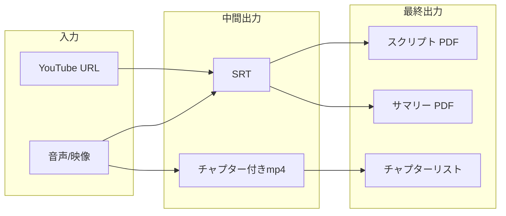
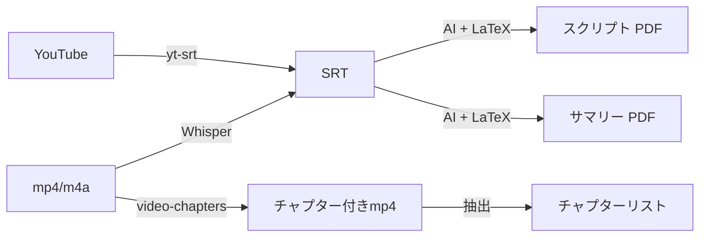
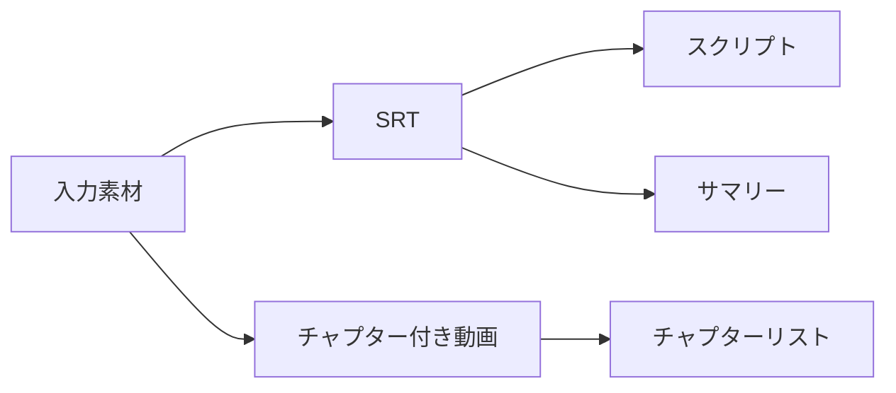

# 開発ログ 2026-01-04

メッセージ数: 594

---

## 👤 User (01:44:41)

もう一度、整理したいと思います。

---

## 🤖 Assistant (01:44:53)

承知しました。何を整理しましょうか？

1. **YAML設計** - transcription_workflow.yaml と profiles/*.yaml の構造
2. **ワークフロー全体** - PAD図、スイムレーン図、処理フローの関係
3. **UIの分離方針** - メインUI vs プロファイルエディタ
4. **実装タスク** - 今後やるべきことのリスト

または別の観点があればお聞かせください。

---

## 👤 User (01:59:49)

2ですね。まず大きく成果物ベースでは入力は、
- [ ] 外部から提供される曲ごとの音声（m4a, mp3）／映像（mov, mp4）ファイル
- [ ] 外部から提供される未編集音声ファイル（m4a, mp3）
- [ ] 外部から提供される未編集mp4
- [ ] Youtubeからダウンロードできる講義／レッスンなどの動画

中間出力は、
- [ ] SRT（Youtube, Open AI）
- [ ] Youtubeアップロード用の動画（VLCなどの動画でもチャプタ利用可能）


最終的な出力は、
- [ ] 講義の学習教材や欠席者の自習用に活用できるレベルの資料（PDF）
- [ ] 講義の詳細なスクリプト
- [ ] 自習、確認用のチャプター付き、タイトル埋め込み動画
- [ ] Youtube動画用のチャプターリスト
と認識しています。Claude氏の認識とあっていますか。

---

## 🤖 Assistant (02:00:19)

概ね一致していますが、いくつか補足・明確化があります。

## 入力について

ユーザーの整理に同意しますが、構造化すると：

| 分類 | 形式 | 状態 | 例 |
|------|------|------|-----|
| ローカル映像 | mov, mp4 | 未編集 | 長時間リハーサル動画 |
| ローカル映像 | mov, mp4 | 編集済（曲ごと） | チャプター分け済み |
| ローカル音声 | m4a, mp3 | 未編集/編集済 | 外部マイク録音 |
| YouTube | URL | - | 公開済み講義動画 |

**補足**: 「未編集」と「曲ごと」の区別は、前処理（トリミング、チャプター分け）の要否を決定する重要な分岐点です。

## 中間出力について

```
SRT
├── YouTube自動字幕
├── Whisper（OpenAI）
└── 手動編集済み

編集済み動画
├── チャプター埋め込みmp4（VLC等で利用可能）
└── YouTubeアップロード用mp4
```

## 最終出力について

一致していますが、1点確認：

> 講義の詳細なスクリプト

これは以下のどちらを指しますか？
- **A**: SRTを整形したもの（タイムスタンプ付きテキスト）
- **B**: AIが内容を構造化・要約したもの

## ワークフロー境界の確認

```
[rehearsal-workflow スコープ]
入力 → 前処理 → SRT取得 → 中間出力

[外部ツール]
SRT + プロンプト → AI → レポート → LaTeX → PDF
```

この境界認識は合っていますか？

---

## 👤 User (02:01:19)

講義の詳細なスクリプトは、Aです。可能であれば、話者特定もしたいですね。

---

## 🤖 Assistant (02:01:40)

了解しました。話者特定（Speaker Diarization）を含めて整理します。

## 成果物ベース整理（更新版）

### 入力

| # | 種別 | 形式 | 前処理要否 |
|---|------|------|-----------|
| 1 | 曲ごとの音声/映像 | m4a, mp3, mov, mp4 | 不要 |
| 2 | 未編集音声 | m4a, mp3 | 要（トリミング） |
| 3 | 未編集映像 | mov, mp4 | 要（トリミング、チャプター） |
| 4 | YouTube動画 | URL | 不要 |

### 中間出力

| # | 成果物 | 生成方法 | 備考 |
|---|--------|----------|------|
| 1 | SRT | YouTube自動字幕 | 話者情報なし |
| 2 | SRT | Whisper | 話者情報なし |
| 3 | SRT + 話者 | Whisper + Diarization | **新規** |
| 4 | チャプター付きmp4 | video-chapters | VLC/YouTube両対応 |

### 最終出力

| # | 成果物 | 生成元 | 用途 |
|---|--------|--------|------|
| 1 | PDF資料 | SRT → AI → LaTeX | 学習教材、欠席者自習用 |
| 2 | スクリプト | SRT整形（話者付き） | 講義の詳細記録 |
| 3 | チャプター付き動画 | mp4 + メタデータ | 自習・確認用 |
| 4 | チャプターリスト | チャプター情報 | YouTube概要欄用 |

## 話者特定について

```
音声 → Whisper → SRT（文字起こし）
         ↓
音声 → Diarization → 話者セグメント
         ↓
    ┌────┴────┐
    │  結合処理  │
    └────┬────┘
         ↓
SRT + 話者情報 → スクリプト
```

**選択肢**：

| ツール | 特徴 | コスト |
|--------|------|--------|
| whisperX | Whisper + pyannote統合 | 無料（ローカル） |
| pyannote.audio | 話者特定専用 | 無料（ローカル） |
| AssemblyAI | 高精度、API | 有料 |
| AWS Transcribe | 話者特定込み | 有料 |

話者特定をスコープに含めますか？含める場合、whisperXが有力候補です。

---

## 👤 User (02:02:44)

いつも必要となるとは考えていませんが、会議の録音など話者特定を行いたい場合はありますね。

---

## 🤖 Assistant (02:02:57)

なるほど。プロファイルによって必要性が異なりますね。

## 話者特定の必要性（プロファイル別）

| プロファイル | 話者特定 | 理由 |
|--------------|----------|------|
| orchestral_rehearsal | 不要 | 基本的に指揮者のみ |
| horn_lesson | △ あると便利 | 講師と生徒の区別 |
| meeting_report | ◎ 有用 | 複数参加者の発言記録 |

## 成果物整理（確定版）

### 入力
1. 曲ごとの音声/映像（m4a, mp3, mov, mp4）
2. 未編集音声（m4a, mp3）
3. 未編集映像（mov, mp4）
4. YouTube動画（URL）

### 中間出力
1. SRT（YouTube / Whisper）
2. SRT + 話者情報（オプション、会議等）
3. チャプター付きmp4

### 最終出力
1. PDF資料（学習教材、欠席者自習用）
2. スクリプト（話者付き、オプション）
3. チャプター付き動画（自習・確認用）
4. チャプターリスト（YouTube概要欄用）

---

この成果物整理を踏まえて、次はワークフロー全体の処理フローを整理しましょうか？それとも別の観点から整理しますか？

---

## 👤 User (02:04:42)

最終出力のスクリプトは、一次資料として要すればどのケースにおいても出力できるようにすることが望ましいですね。

---

## 🤖 Assistant (02:05:01)

その通りです。整理を修正します。

## 成果物整理（修正版）

### 入力
1. 曲ごとの音声/映像（m4a, mp3, mov, mp4）
2. 未編集音声（m4a, mp3）
3. 未編集映像（mov, mp4）
4. YouTube動画（URL）

### 中間出力
1. SRT（YouTube / Whisper）
2. 話者セグメント（オプション、会議等）
3. チャプター付きmp4

### 最終出力
| # | 成果物 | 必須/任意 | 備考 |
|---|--------|----------|------|
| 1 | PDF資料 | 任意 | AI処理が必要 |
| 2 | スクリプト | 任意 | 一次資料として常に出力可能 |
| 3 | チャプター付き動画 | 任意 | 自習・確認用 |
| 4 | チャプターリスト | 任意 | YouTube概要欄用 |

### スクリプトの構成

```
スクリプト
├── 基本形式: タイムスタンプ + テキスト（常に可能）
└── 拡張形式: タイムスタンプ + 話者 + テキスト（話者特定時）
```

**例（基本形式）**:
```
[00:01:23] それでは4楽章の練習に入ります。
[00:01:45] 冒頭のテンポですが、あまり走らないように。
```

**例（拡張形式）**:
```
[00:01:23] 田中: それでは4楽章の練習に入ります。
[00:01:45] 田中: 冒頭のテンポですが、あまり走らないように。
[00:02:10] 鈴木: 2小節目のアクセントはどの程度ですか？
```

これで成果物の整理は完了でしょうか？

---

## 👤 User (02:06:00)

スクリプトは、/Users/mashi/.claude/commands/srt-meeting-report.mdで示した内容をイメージしています。

---

## 🤖 Assistant (02:06:05)

[Tool: Read] /Users/mashi/.claude/commands/srt-meeting-report.md

---

## 🤖 Assistant (02:06:31)

なるほど、理解しました。このファイルを見ると、「スクリプト」の定義がより明確になりました。

## スクリプトの定義（修正）

単なるSRT整形ではなく、以下を含む構造化文書：

```
スクリプト
├── 発言者識別（タイムスタンプ付き）
├── セクション/サブセクション構造
├── 略語・専門用語のfootnote
├── チャプター情報
└── 文脈補足
```

**形式**: LuaTeX → PDF（一次資料として保存価値あり）

## 成果物整理（再修正版）

### 入力
1. 曲ごとの音声/映像（m4a, mp3, mov, mp4）
2. 未編集音声（m4a, mp3）
3. 未編集映像（mov, mp4）
4. YouTube動画（URL）

### 中間出力
1. SRT（YouTube / Whisper）
2. 話者セグメント（オプション）
3. チャプター付きmp4

### 最終出力

| # | 成果物 | 内容 | 用途 |
|---|--------|------|------|
| 1 | スクリプト（.tex → .pdf） | 発言者+タイムスタンプ+構造化、一次資料 | 詳細記録、アーカイブ |
| 2 | サマリーレポート（.tex → .pdf） | AI要約+分析+所感 | 学習教材、欠席者自習用 |
| 3 | チャプター付き動画 | mp4 + メタデータ | 自習・確認用 |
| 4 | チャプターリスト | タイムスタンプ一覧 | YouTube概要欄用 |

### スクリプトとサマリーの関係

```
SRT
 ├─→ スクリプト: 原文忠実、全発言記録（一次資料）
 │     └─ srt-meeting-report.md の出力
 │
 └─→ サマリーレポート: AI分析・要約（二次資料）
       └─ 学習ポイント抽出、構造化
```

この整理で合っていますか？

---

## 👤 User (02:08:27)

ですね。これをチャートにする場合どのような方法が良いでしょう。

---

## 🤖 Assistant (02:08:52)

成果物の変換関係を示すには、いくつかの選択肢があります。

## チャート形式の選択肢

### A. Mermaid flowchart（左→右）

**利点**: 既存のスイムレーン図と統一、シンプル

### B. データ変換図（処理ノード付き）

**利点**: 処理方法も明示

### C. 層別図（縦方向）
```
┌─────────────────────────────────────┐
│ 最終出力  スクリプト│サマリー│動画│リスト│
├─────────────────────────────────────┤
│ 中間出力      SRT    │  チャプター付きmp4  │
├─────────────────────────────────────┤
│ 入力    音声/映像 │ 未編集素材 │ YouTube │
└─────────────────────────────────────┘
```
**利点**: 階層関係が明確

### D. PAD図（処理詳細）
既存のPADと組み合わせ、成果物の関係はMermaidで表現

---

**推奨**: **B（データ変換図）** 
- 入力→処理→出力の関係が一目でわかる
- 既存のMermaid資産と統一
- 処理ツール名も明示できる

いかがですか？

---

## 👤 User (02:09:07)

PADはどう？

---

## 🤖 Assistant (02:09:32)

PADの特性を考えると、使い分けが有効です。

## PADと成果物図の役割

| 図の種類 | 得意な表現 | 苦手な表現 |
|----------|-----------|-----------|
| PAD | 処理手順、分岐、繰り返し | データの流れ、並列関係 |
| データフロー図 | 成果物の変換関係 | 処理の詳細手順 |

## 提案: 併用

### 1. 成果物関係図（Mermaid）
「何が何から生成されるか」を俯瞰



### 2. PAD（処理詳細）
「どう処理するか」を詳細に

```
┌─ 入力種別判定 ─────────────────────┐
│  ├─ YouTube ─→ yt-srt実行          │
│  └─ ローカル ─┬─ 未編集 → 前処理   │
│               └─ 編集済 → 直接処理  │
├─ SRT取得 ──────────────────────────┤
│  ├─ Whisper優先                    │
│  └─ YouTube字幕フォールバック       │
├─ 出力生成 ─────────────────────────┤
│  ├─ スクリプト生成（LuaTeX→PDF）    │
│  ├─ サマリー生成（AI→LuaTeX→PDF）  │
│  └─ チャプター処理                  │
└────────────────────────────────────┘
```

## 結論

- **成果物の全体像**: Mermaid（1枚で俯瞰）
- **各処理の詳細**: PAD（既存資産を活用）

この組み合わせでいかがですか？

---

## 👤 User (02:10:08)

先ほどのBにしましょうか

---

## 🤖 Assistant (02:10:21)

承知しました。Bのデータ変換図を作成し、既存のワークフロー図に追加します。

---

## 🤖 Assistant (02:10:22)

[Tool: Read] /Users/mashi/Dropbox/01_Projects/00_Works/git/portfolio/rehearsal-workflow/docs/workflow-diagrams.md

---

## 🤖 Assistant (02:10:36)

成果物変換図を追加します。

---

## 🤖 Assistant (02:10:55)

[Tool: Edit] /Users/mashi/Dropbox/01_Projects/00_Works/git/portfolio/rehearsal-workflow/docs/workflow-diagrams.md

---

## 🤖 Assistant (02:10:59)

コミット・プッシュします。

---

## 🤖 Assistant (02:11:05)

[Tool: Bash] git add docs/workflow-diagrams.md && git commit -m "$(cat <<'EOF'
Add artifact transformation diagram to workflow docs

- New section showing input → intermediate → output flow
- Includes preprocessin

---

## 🤖 Assistant (02:12:03)

成果物変換図を追加しました。

## 追加内容

```
入力                前処理              中間出力              最終出力
┌──────────┐      ┌──────────┐      ┌──────────────┐      ┌───────────────┐
│mp4/mov   │─────→│trim      │─────→│チャプター付き│─────→│チャプター動画 │
│m4a/mp3   │      │chapters  │      │mp4          │      │チャプターリスト│
└──────────┘      └──────────┘      └──────────────┘      └───────────────┘
     │                                    │
     │ Whisper/whisperX                   │
     ↓                                    │
┌──────────┐                        ┌─────┴────┐
│YouTube   │──yt-srt──→ SRT ───────→│AI+LaTeX  │
└──────────┘           (±話者)      └────┬─────┘
                                         ↓
                                   ┌───────────┐
                                   │スクリプトPDF│
                                   │サマリーPDF │
                                   └───────────┘
```

ワークフロー図の冒頭に配置したので、全体像が把握しやすくなりました。

次に整理すべき項目はありますか？

---

## 👤 User (02:15:46)

成果物変換図に、現状の前処理の範囲を示してください。

---

## 🤖 Assistant (02:16:17)

[Tool: Edit] /Users/mashi/Dropbox/01_Projects/00_Works/git/portfolio/rehearsal-workflow/docs/workflow-diagrams.md

---

## 🤖 Assistant (02:16:26)

[Tool: Bash] git add docs/workflow-diagrams.md && git commit -m "$(cat <<'EOF'
Add scope boundaries to artifact transformation diagram

- Blue box: Current preprocessing scope (Video Chapter Editor)
  - video-trim

---

## 🤖 Assistant (02:18:26)

スコープ境界を追加しました。

## 更新内容

```
┌─────────────────────────────────────────────────────────┐
│  現状の前処理スコープ（Video Chapter Editor）  [青枠]   │
│  ┌──────────────┐  ┌──────────────┐                    │
│  │ video-trim   │  │ yt-srt       │                    │
│  │ video-chapters│  │ whisper-remote│                   │
│  └──────────────┘  └──────────────┘                    │
└─────────────────────────────────────────────────────────┘

┌ ─ ─ ─ ─ ─ ─ ─ ─ ─ ─ ─ ─ ─ ─ ─ ─ ─ ─ ─ ─ ─ ─ ─ ─ ─ ─ ─┐
│  外部処理  [オレンジ破線]                              │
│  ┌──────────────┐  ┌──────────────┐  ┌──────────────┐ │
│  │ whisperX     │  │ AI処理       │  │ LaTeX        │ │
│  │ (話者特定)   │  │ (Claude等)   │  │ (luatex-pdf) │ │
│  └──────────────┘  └──────────────┘  └──────────────┘ │
└ ─ ─ ─ ─ ─ ─ ─ ─ ─ ─ ─ ─ ─ ─ ─ ─ ─ ─ ─ ─ ─ ─ ─ ─ ─ ─ ─┘
```

これで現状のスコープと外部依存の境界が視覚的に明確になりました。

---

## 👤 User (02:25:18)

プッシュしました？

---

## 🤖 Assistant (02:25:26)

はい、プッシュ済みです。

```
[main 3e88e90] Add scope boundaries to artifact transformation diagram
To github.com:mashi727/rehearsal-workflow.git
   1c9620a..3e88e90  main -> main
```

---

## 👤 User (02:26:57)

話者特定の出力も、SRTになりますよね。

---

## 🤖 Assistant (02:27:03)

その通りです。図を修正します。

---

## 🤖 Assistant (02:27:09)

[Tool: Edit] /Users/mashi/Dropbox/01_Projects/00_Works/git/portfolio/rehearsal-workflow/docs/workflow-diagrams.md

---

## 🤖 Assistant (02:27:20)

[Tool: Edit] /Users/mashi/Dropbox/01_Projects/00_Works/git/portfolio/rehearsal-workflow/docs/workflow-diagrams.md

---

## 🤖 Assistant (02:27:28)

[Tool: Bash] git add docs/workflow-diagrams.md && git commit -m "$(cat <<'EOF'
Fix: whisperX output is also SRT format

- Moved whisperX from external processing to input→SRT path
- All transcription outputs (YouT

---

## 🤖 Assistant (02:27:42)

修正してプッシュしました。

## 修正内容

```
中間出力（SRT）
├── SRT（YouTube字幕）  ← yt-srt
├── SRT（Whisper）      ← whisper-remote
└── SRT + 話者（whisperX） ← whisperX  ※全てSRT形式
```

whisperXを外部処理から入力→SRTの変換パスに移動し、全ての文字起こし出力が一貫してSRT形式であることを明示しました。

---

## 👤 User (02:29:13)

Mermaidの図、SVGで保存できたと思うんですけど、ファイルに保存するためのUIってつけられます？

---

## 🤖 Assistant (02:29:34)

はい、可能です。いくつかのアプローチがあります。

## 実装方法の選択肢

### A. mermaid-cli（mmdc）を使用
```bash
# Node.js が必要
npm install -g @mermaid-js/mermaid-cli
mmdc -i diagram.mmd -o diagram.svg
```
**利点**: シンプル、高品質
**欠点**: Node.js依存

### B. QWebEngineView でレンダリング
```python
# PySide6のWebEngineでMermaidをレンダリング → SVGエクスポート
from PySide6.QtWebEngineWidgets import QWebEngineView
```
**利点**: Python完結
**欠点**: 実装が複雑、依存が重い

### C. Python mermaid パッケージ
```python
# pip install mermaid-py
import mermaid
```
**利点**: Pythonのみ
**欠点**: 内部でPlaywright/Puppeteerを使用

---

## 推奨: A（mermaid-cli）

既存のアプリにボタンを追加して subprocess で呼び出すのが最もシンプルです。

```python
def export_mermaid_svg(mmd_content: str, output_path: str):
    import subprocess
    import tempfile
    
    with tempfile.NamedTemporaryFile(suffix='.mmd', delete=False) as f:
        f.write(mmd_content.encode())
        mmd_path = f.name
    
    subprocess.run(['mmdc', '-i', mmd_path, '-o', output_path])
```

この機能を追加しますか？追加する場合、どの画面に配置するか教えてください。

---

## 👤 User (02:31:09)

Aにしましょう。アプリに実装ではなく、githubのページに実装してもらいたいんですけど

---

## 🤖 Assistant (02:31:27)

なるほど、GitHub Pages でMermaid図のSVGエクスポート機能を実装するということですね。

## 実装案

```
docs/
├── index.html          # GitHub Pages のトップ
└── mermaid-viewer.html # Mermaid図 → SVGエクスポートUI
```

### 機能
1. workflow-diagrams.md から Mermaid コードを読み込み
2. Mermaid.js でレンダリング
3. 「Download SVG」ボタンでエクスポート

### イメージ

```
┌─────────────────────────────────────────────┐
│  Mermaid Diagram Viewer                     │
├─────────────────────────────────────────────┤
│  [成果物変換図 ▼]  [Download SVG]           │
├─────────────────────────────────────────────┤
│                                             │
│     ┌───────┐      ┌───────┐               │
│     │ 入力   │ ──→ │ 中間  │ ──→ ...       │
│     └───────┘      └───────┘               │
│                                             │
└─────────────────────────────────────────────┘
```

この方向で実装しますか？

---

## 👤 User (02:31:36)

はい！

---

## 🤖 Assistant (02:31:43)

実装します。まず、workflow-diagrams.mdのMermaid図を確認します。

---

## 🤖 Assistant (02:31:46)

[Tool: Bash] grep -n "^## " /Users/mashi/Dropbox/01_Projects/00_Works/git/portfolio/rehearsal-workflow/docs/workflow-diagrams.md | head -20

---

## 🤖 Assistant (02:31:54)

[Tool: TodoWrite] ['Create docs/mermaid-viewer.html with SVG export', 'Create docs/index.html for GitHub Pages', 'Extract Mermaid diagrams from workflow-diagrams.md', 'Commit and push to GitHub']

---

## 🤖 Assistant (02:33:50)

[Tool: Write] /Users/mashi/Dropbox/01_Projects/00_Works/git/portfolio/rehearsal-workflow/docs/mermaid-viewer.html

---

## 🤖 Assistant (02:34:31)

[Tool: TodoWrite] ['Create docs/mermaid-viewer.html with SVG export', 'Create docs/index.html for GitHub Pages', 'Commit and push to GitHub']

---

## 🤖 Assistant (02:35:09)

[Tool: Write] /Users/mashi/Dropbox/01_Projects/00_Works/git/portfolio/rehearsal-workflow/docs/index.html

---

## 🤖 Assistant (02:35:20)

[Tool: TodoWrite] ['Create docs/mermaid-viewer.html with SVG export', 'Create docs/index.html for GitHub Pages', 'Commit and push to GitHub']

---

## 🤖 Assistant (02:35:29)

[Tool: Bash] git add docs/index.html docs/mermaid-viewer.html && git commit -m "$(cat <<'EOF'
Add GitHub Pages with Mermaid diagram viewer

- docs/index.html: Landing page with links to diagrams and tools
- docs/m

---

## 🤖 Assistant (02:35:39)

[Tool: TodoWrite] ['Create docs/mermaid-viewer.html with SVG export', 'Create docs/index.html for GitHub Pages', 'Commit and push to GitHub']

---

## 🤖 Assistant (02:35:50)

完了しました。

## 作成したファイル

```
docs/
├── index.html          # トップページ
└── mermaid-viewer.html # Mermaid図ビューア + SVGダウンロード
```

## 機能

1. **ドロップダウンで図を選択**
2. **Download SVG ボタン**でファイル保存
3. **ダークモード対応**（OS設定に連動）
4. **URL直リンク対応**（例: `#artifact-transformation`）

## GitHub Pages の有効化

リポジトリの Settings → Pages で：
- Source: `Deploy from a branch`
- Branch: `main` / `docs`

有効化後のURL:
```
https://mashi727.github.io/rehearsal-workflow/
https://mashi727.github.io/rehearsal-workflow/mermaid-viewer.html
```

直接ダイアグラムを開く:
```
https://mashi727.github.io/rehearsal-workflow/mermaid-viewer.html#artifact-transformation
```

---

## 👤 User (02:37:24)

htmlをクリックするとコードが見えますね。

---

## 🤖 Assistant (02:37:34)

はい、GitHubはHTMLをソースとして表示します。GitHub Pages を有効化すると、レンダリングされたページが見られます。

## GitHub Pages の有効化手順

1. リポジトリページで **Settings** をクリック
2. 左サイドバーで **Pages** をクリック
3. **Source** で:
   - Branch: `main`
   - Folder: `/docs`
4. **Save** をクリック

数分後にアクセス可能になります:
```
https://mashi727.github.io/rehearsal-workflow/
```

---

または、今すぐローカルで確認する場合:

```bash
open /Users/mashi/Dropbox/01_Projects/00_Works/git/portfolio/rehearsal-workflow/docs/mermaid-viewer.html
```

ローカルで開いてみますか？

---

## 👤 User (04:57:15)

OKです。Githubって初めて使うんですけど、どのような用途が想定されたものですか？

---

## 🤖 Assistant (04:57:30)

GitHubは主に以下の用途で設計されています。

## 主要な用途

### 1. ソースコードのバージョン管理
```
コミット履歴
├── 2025-01-04: スコープ境界を追加
├── 2025-01-03: 成果物変換図を追加
├── 2025-01-02: YAML設計を追加
└── ...（全ての変更履歴を保持）
```
- いつでも過去の状態に戻せる
- 誰が何を変更したか追跡可能

### 2. チーム開発の協調
- **ブランチ**: 機能ごとに独立して開発
- **プルリクエスト**: 変更をレビューしてからマージ
- **Issue**: バグ報告、機能要望の管理

### 3. コードの公開・共有
- オープンソースプロジェクトの公開
- 他の開発者との協力

### 4. GitHub Pages（今回使った機能）
- 静的ウェブサイトのホスティング
- ドキュメントサイトの公開

## 今回のリポジトリでの活用

| 機能 | 使い方 |
|------|--------|
| バージョン管理 | 設計変更の履歴を保持 |
| Pages | Mermaid図ビューアの公開 |
| README | プロジェクト説明 |

個人プロジェクトでも「変更履歴の保存」と「バックアップ」として非常に有用です。

---

## 👤 User (05:00:16)

あ、Github Pagesって初めて使うんですけど。ということでした。

---

## 🤖 Assistant (05:00:29)

なるほど、GitHub Pages についてですね。

## GitHub Pages とは

**静的ウェブサイトを無料でホスティングするサービス**です。

```
リポジトリ                    公開URL
docs/index.html      →   https://mashi727.github.io/rehearsal-workflow/
docs/mermaid-viewer.html →   https://mashi727.github.io/rehearsal-workflow/mermaid-viewer.html
```

## 想定用途

| 用途 | 例 |
|------|-----|
| プロジェクトのドキュメント | API リファレンス、使い方ガイド |
| ポートフォリオ | 個人サイト、作品集 |
| ブログ | Jekyll等と組み合わせ |
| デモページ | 今回のMermaidビューアのような |

## 特徴

- **無料**（パブリックリポジトリ）
- **静的ファイルのみ**（HTML, CSS, JS, 画像）
- **サーバーサイド処理なし**（PHP, Python等は動かない）
- **HTTPS対応**
- **カスタムドメイン可能**

## 今回の活用

```
通常のGitHub     → ソースコードが見える
GitHub Pages     → HTMLがレンダリングされて表示
                   + SVGダウンロード機能が動作
```

Settings → Pages で有効化すれば、すぐに公開されます。

---

## 👤 User (05:01:16)

JSが動くんですね。Leafletはいける感じですか

---

## 🤖 Assistant (05:01:29)

はい、問題なく動きます。

## Leaflet on GitHub Pages

Leafletは完全にクライアントサイドJSなので、GitHub Pagesと相性抜群です。

```html
<!DOCTYPE html>
<html>
<head>
    <link rel="stylesheet" href="https://unpkg.com/leaflet@1.9.4/dist/leaflet.css" />
    <script src="https://unpkg.com/leaflet@1.9.4/dist/leaflet.js"></script>
    <style>
        #map { height: 400px; }
    </style>
</head>
<body>
    <div id="map"></div>
    <script>
        const map = L.map('map').setView([35.6812, 139.7671], 13);
        L.tileLayer('https://tile.openstreetmap.org/{z}/{x}/{y}.png', {
            attribution: '© OpenStreetMap'
        }).addTo(map);
    </script>
</body>
</html>
```

## 動くもの・動かないもの

| 動く | 動かない |
|------|----------|
| Leaflet | サーバーサイド処理 |
| Mermaid.js | データベース接続 |
| D3.js | PHP, Python, Node.js |
| Three.js | API認証が必要なもの（キー露出） |
| React/Vue（ビルド済み） | 動的バックエンド |

## 注意点

- **APIキー**: 公開リポジトリだとキーが見える
- **タイルサーバー**: OpenStreetMapは無料、商用地図は制限あり

地図を使ったページを作りますか？

---

## 👤 User (05:03:33)

聞いてみただけです。このリポジトリでは不要ですね。

---

## 🤖 Assistant (05:03:41)

了解です。GitHub Pagesの機能確認ということで。

今回のリポジトリでは Mermaid.js で十分ですね。

他に整理すべき項目はありますか？

---

## 👤 User (16:38:27)

成果物変換図をさらに正確に作り込みましょう。

---

## 🤖 Assistant (16:38:35)

現状の成果物変換図を確認します。

---

## 🤖 Assistant (16:38:36)

[Tool: Read] /Users/mashi/Dropbox/01_Projects/00_Works/git/portfolio/rehearsal-workflow/docs/workflow-diagrams.md

---

## 🤖 Assistant (16:38:57)

現状の図を確認しました。いくつか改善点が考えられます。

## 現状の課題

| 項目 | 現状 | 改善案 |
|------|------|--------|
| 入力の分類 | 形式のみ（mp4, m4a等） | 状態も区別（未編集/編集済み） |
| YouTube経由 | URL → SRTのみ | URL → 動画DL → SRTもあり得る |
| 前処理スキップ | パスがない | 編集済み素材は前処理不要 |
| チャプター情報 | 生成パスがない | chapters.txt の位置づけ |
| スクリプト/サマリー | 同じパス | 処理の違いを明示 |

## 確認したい点

1. **入力の状態区別は必要ですか？**
   - 未編集動画 → 前処理必要
   - 曲ごとファイル → 前処理不要

2. **YouTube経由のパターン**
   - URL → SRTのみ取得（動画は別途ある）
   - URL → 動画+SRT両方取得

3. **スクリプトとサマリーの違い**
   - 同じSRTから異なるプロンプトで生成？
   - それとも別の処理フロー？

どこから詳細化しましょうか？

---

## 👤 User (16:40:27)

未実装ですが、Youtubeのリンクから動画をダウンロードし、表示、編集する機能を追加しましょう。そうすると、現在の成果物変換図のVideo Chapter Editorのスコープが全ての入力に対応できるようになりますね。

---

## 🤖 Assistant (16:40:34)

その通りです。YouTube URLからの動画ダウンロード機能を追加すると、全ての入力がVideo Chapter Editorを経由できます。

---

## 🤖 Assistant (16:40:36)

[Tool: TodoWrite] ['Update artifact transformation diagram with YouTube download feature', 'Update mermaid-viewer.html with new diagram']

---

## 🤖 Assistant (16:41:09)

[Tool: Edit] /Users/mashi/Dropbox/01_Projects/00_Works/git/portfolio/rehearsal-workflow/docs/workflow-diagrams.md

---

## 🤖 Assistant (16:41:16)

成果物一覧も更新します。

---

## 🤖 Assistant (16:41:33)

[Tool: Edit] /Users/mashi/Dropbox/01_Projects/00_Works/git/portfolio/rehearsal-workflow/docs/workflow-diagrams.md

---

## 🤖 Assistant (16:41:37)

余分な行を削除します。

---

## 🤖 Assistant (16:41:41)

[Tool: Edit] /Users/mashi/Dropbox/01_Projects/00_Works/git/portfolio/rehearsal-workflow/docs/workflow-diagrams.md

---

## 🤖 Assistant (16:41:49)

[Tool: TodoWrite] ['Update artifact transformation diagram with YouTube download feature', 'Update mermaid-viewer.html with new diagram']

---

## 🤖 Assistant (16:41:53)

[Tool: Read] /Users/mashi/Dropbox/01_Projects/00_Works/git/portfolio/rehearsal-workflow/docs/mermaid-viewer.html

---

## 🤖 Assistant (16:41:59)

[Tool: Read] /Users/mashi/Dropbox/01_Projects/00_Works/git/portfolio/rehearsal-workflow/docs/mermaid-viewer.html

---

## 🤖 Assistant (16:42:25)

[Tool: Edit] /Users/mashi/Dropbox/01_Projects/00_Works/git/portfolio/rehearsal-workflow/docs/mermaid-viewer.html

---

## 🤖 Assistant (16:42:31)

[Tool: TodoWrite] ['Update artifact transformation diagram with YouTube download feature', 'Update mermaid-viewer.html with new diagram', 'Commit and push changes']

---

## 🤖 Assistant (16:42:39)

[Tool: Bash] git add docs/workflow-diagrams.md docs/mermaid-viewer.html && git commit -m "$(cat <<'EOF'
Refine artifact transformation diagram

- Add yt-dlp for YouTube video download
- All inputs now flow through

---

## 🤖 Assistant (16:42:51)

[Tool: TodoWrite] ['Update artifact transformation diagram with YouTube download feature', 'Update mermaid-viewer.html with new diagram', 'Commit and push changes']

---

## 🤖 Assistant (16:43:09)

完了しました。

## 更新内容

```
入力                    Video Chapter Editor スコープ               中間出力              外部処理        最終出力
┌────────────┐         ┌─────────────────────────────────┐         ┌──────────┐         ┌─────────┐    ┌─────────┐
│YouTube URL │────────→│ yt-dlp ─→ video-trim ─→        │────────→│チャプター │         │whisperX │───→│SRT+話者 │
│            │         │            video-chapters       │         │付きmp4   │────────→│         │    │         │
├────────────┤         │                                 │         ├──────────┤         └─────────┘    └────┬────┘
│ローカル映像│────────→│                                 │────────→│chapters  │                              │
│            │         │                                 │         │.txt      │──────────────────────────────┼───→チャプターリスト
├────────────┤         │                                 │         ├──────────┤                              │
│ローカル音声│────────→│                                 │         │SRT       │                              │
│            │         │ yt-srt ─────────────────────────│────────→│(YouTube) │──────┐                       │
│            │         │                                 │         ├──────────┤      │                       │
│            │         │ whisper-remote ←────────────────│←───────→│SRT       │──────┼──→ AI ─→ LaTeX ──────┼───→ PDF
│            │         │                                 │         │(Whisper) │──────┘     │                │
└────────────┘         └─────────────────────────────────┘         └──────────┘            ├─スクリプト用──→スクリプトPDF
                              青枠                                                          └─サマリー用───→サマリーPDF
```

### 主な変更点

| 変更 | 内容 |
|------|------|
| YouTube動画DL | yt-dlp を追加、全入力が前処理を経由 |
| Whisper入力 | 前処理後のmp4から（生素材からではなく） |
| chapters.txt | 中間出力として明示 |
| whisperX | 外部処理に移動（オプション） |
| AI処理 | スクリプト用/サマリー用プロンプトを区別 |

---

## 👤 User (16:43:32)

video-chapter-editor &                                            v24.2.0    01:40:53
Traceback (most recent call last):
  File "/Users/mashi/.3.12.3/bin/video-chapter-editor", line 3, in <module>
    from rehearsal_workflow.video_chapter_editor import main
ModuleNotFoundError: No module named 'rehearsal_workflow.video_chapter_editor'

機能を実装するために起動しようとしたところ、こんな感じになってしまいました。何かしました？

---

## 🤖 Assistant (16:43:41)

私は今回ドキュメントとHTMLのみ編集しており、Pythonコードには触れていません。

現在のパッケージ構成を確認します。

---

## 🤖 Assistant (16:43:42)

[Tool: Bash] ls -la /Users/mashi/Dropbox/01_Projects/00_Works/git/portfolio/rehearsal-workflow/

---

## 🤖 Assistant (16:43:48)

[Tool: Bash] ls -la /Users/mashi/Dropbox/01_Projects/00_Works/git/portfolio/rehearsal-workflow/rehearsal_workflow/

---

## 🤖 Assistant (16:43:54)

[Tool: Read] /Users/mashi/Dropbox/01_Projects/00_Works/git/portfolio/rehearsal-workflow/rehearsal_workflow/__init__.py

---

## 🤖 Assistant (16:43:56)

[Tool: Read] /Users/mashi/Dropbox/01_Projects/00_Works/git/portfolio/rehearsal-workflow/pyproject.toml

---

## 🤖 Assistant (16:44:06)

原因が分かりました。

## 問題

**インストール済みのバージョンが古い**

```
エラー: from rehearsal_workflow.video_chapter_editor import main
現在のpyproject.toml: rehearsal_workflow.ui.app:main
```

エントリーポイントが変更されていますが、古いバージョンがインストールされたままです。

## 解決策

パッケージを再インストールしてください：

```bash
cd /Users/mashi/Dropbox/01_Projects/00_Works/git/portfolio/rehearsal-workflow
pip install -e .
```

または：

```bash
pip uninstall rehearsal-workflow
pip install -e .
```

再インストールしますか？

---

## 👤 User (16:46:46)

しました。問題ありません。先ほどのyoutubeをダウンロードする機能を実装しましょう。まずは、Cover ImageをSelect sourceの下に移動してください。

---

## 🤖 Assistant (16:46:51)

UIコードを確認します。

---

## 🤖 Assistant (16:46:52)

[Tool: Bash] ls -la /Users/mashi/Dropbox/01_Projects/00_Works/git/portfolio/rehearsal-workflow/rehearsal_workflow/ui/

---

## 🤖 Assistant (16:46:59)

[Tool: Grep]

---

## 🤖 Assistant (16:47:05)

[Tool: Read] /Users/mashi/Dropbox/01_Projects/00_Works/git/portfolio/rehearsal-workflow/rehearsal_workflow/ui/main_workspace.py

---

## 🤖 Assistant (16:47:17)

[Tool: TodoWrite] ['Move Cover Image button below Select Source', 'Add YouTube URL input field', 'Implement yt-dlp download functionality']

---

## 🤖 Assistant (16:47:35)

[Tool: Edit] /Users/mashi/Dropbox/01_Projects/00_Works/git/portfolio/rehearsal-workflow/rehearsal_workflow/ui/main_workspace.py

---

## 🤖 Assistant (16:47:42)

[Tool: TodoWrite] ['Move Cover Image button below Select Source', 'Add YouTube URL input field', 'Implement yt-dlp download functionality']

---

## 🤖 Assistant (16:47:51)

移動しました。

```
変更前:
┌─────────────────────────────────────────────┐
│ [Select Source] [Cover Image] (info)        │
│ Output: [____________] [...]                │
└─────────────────────────────────────────────┘

変更後:
┌─────────────────────────────────────────────┐
│ [Select Source]                             │
│ [Cover Image] (info)                        │
│ Output: [____________] [...]                │
└─────────────────────────────────────────────┘
```

動作確認してください：

```bash
video-chapter-editor
```

問題なければ、次にYouTube URL入力欄を追加します。

---

## 👤 User (16:49:05)

メイン画面がビジーになるので、Select Sourceのダイアログの中に作成しましょうか。

---

## 🤖 Assistant (16:49:10)

良いアイデアです。Select Sourceダイアログを確認します。

---

## 🤖 Assistant (16:49:13)

[Tool: Grep]

---

## 🤖 Assistant (16:49:20)

[Tool: Grep]

---

## 🤖 Assistant (16:49:38)

良い提案です。ダイアログの構造を確認しました。

## 提案: SourceSelectionDialog の拡張

```
┌─────────────────────────────────────────────────────┐
│ Select Source                                       │
├─────────────────────────────────────────────────────┤
│  ○ Local Files    ○ YouTube URL                    │
├─────────────────────────────────────────────────────┤
│ [Local Files選択時]                                 │
│  [MP3] [MP4]                    /path/to/dir [Browse]│
│  ┌─────────────────────────────────────────────┐   │
│  │ □ file1.mp3                                 │   │
│  │ □ file2.mp3                                 │   │
│  │ ...                                         │   │
│  └─────────────────────────────────────────────┘   │
│                                                     │
│ [YouTube URL選択時]                                 │
│  URL: [_________________________________] [Check]   │
│  Status: Ready to download                          │
├─────────────────────────────────────────────────────┤
│ Cover Image (for audio files):                      │
│  [Select Image] cover.jpg ✓                         │
├─────────────────────────────────────────────────────┤
│                              [Cancel] [OK]          │
└─────────────────────────────────────────────────────┘
```

### 機能
1. **Local Files / YouTube URL** のラジオボタンで切替
2. **Cover Image** は音声ファイル選択時のみ有効
3. YouTube選択時は URL入力 + ダウンロード状態表示

この方向で進めますか？

---

## 👤 User (16:50:46)

加えて、Cover Imageの機能もmp3固有のものなのでこのボタンも、Select Source ダイアログへ移動しましょう。

---

## 🤖 Assistant (16:50:58)

了解です。SourceSelectionDialogにCover ImageとYouTube URL機能を統合します。

まず、現在のダイアログの全体像を確認します。

---

## 🤖 Assistant (16:51:00)

[Tool: Read] /Users/mashi/Dropbox/01_Projects/00_Works/git/portfolio/rehearsal-workflow/rehearsal_workflow/ui/dialogs.py

---

## 🤖 Assistant (16:51:09)

[Tool: Read] /Users/mashi/Dropbox/01_Projects/00_Works/git/portfolio/rehearsal-workflow/rehearsal_workflow/ui/dialogs.py

---

## 👤 User (16:52:17)

This session is being continued from a previous conversation that ran out of context. The conversation is summarized below:
Analysis:
Let me analyze the conversation chronologically:

1. **Session Start**: This is a continuation from a previous session about transcription workflow design. The context includes previous work on YAML configurations, workflow diagrams, and profile definitions.

2. **Workflow Reorganization Discussion**:
   - User wanted to organize based on artifacts (inputs, intermediate outputs, final outputs)
   - Clarified that "script" refers to SRT formatted as structured document with timestamps and speaker identification
   - Referenced `/Users/mashi/.claude/commands/srt-meeting-report.md` for script definition

3. **Chart/Diagram Discussion**:
   - User asked about best way to chart the artifact transformation
   - Options presented: Mermaid flowchart, data transformation diagram, layered diagram, PAD
   - User chose option B (data transformation diagram with processing nodes)

4. **GitHub Pages Implementation**:
   - Created `docs/mermaid-viewer.html` with SVG export functionality
   - Created `docs/index.html` as landing page
   - User asked about GitHub Pages functionality (Leaflet, etc.)
   - Explained GitHub Pages capabilities

5. **Artifact Transformation Diagram Refinement**:
   - Added scope boundaries (Video Chapter Editor scope, External processing)
   - Fixed whisperX output to be SRT format
   - User requested YouTube download feature to be added
   - Updated diagram to include yt-dlp for YouTube video download
   - All inputs now flow through Video Chapter Editor scope

6. **Video Chapter Editor Implementation**:
   - User tried to run `video-chapter-editor` and got ModuleNotFoundError
   - Diagnosed issue: old package installed with different entry point
   - Solution: reinstall package with `pip install -e .`

7. **UI Changes for Source Selection**:
   - User requested moving Cover Image below Select Source
   - Made the change to `main_workspace.py`
   - User then suggested putting Cover Image inside Select Source dialog instead
   - User also wants YouTube URL input in the same dialog

8. **Current Work - SourceSelectionDialog Enhancement**:
   - User wants to consolidate into SourceSelectionDialog:
     - Local Files selection (existing)
     - YouTube URL input (new)
     - Cover Image selection (move from main workspace)
   - Examined `dialogs.py` SourceSelectionDialog class structure
   - Was reading through the dialog code to understand full implementation

Key files modified/examined:
- `docs/workflow-diagrams.md` - artifact transformation diagram updates
- `docs/mermaid-viewer.html` - new Mermaid viewer with SVG export
- `docs/index.html` - GitHub Pages landing page
- `rehearsal_workflow/ui/main_workspace.py` - Cover Image button moved
- `rehearsal_workflow/ui/dialogs.py` - SourceSelectionDialog being examined for enhancement

Todo list at end:
1. [completed] Move Cover Image button below Select Source
2. [pending] Add YouTube URL input field
3. [pending] Implement yt-dlp download functionality

Summary:
1. Primary Request and Intent:
   - Organize workflow documentation based on artifacts (inputs → intermediate outputs → final outputs)
   - Create artifact transformation diagram showing data flow with scope boundaries
   - Implement GitHub Pages with Mermaid diagram viewer and SVG export functionality
   - Add YouTube download feature (yt-dlp) to Video Chapter Editor scope
   - Consolidate UI by moving Cover Image and YouTube URL input into SourceSelectionDialog

2. Key Technical Concepts:
   - Mermaid.js for diagram rendering and SVG export
   - GitHub Pages for static site hosting
   - yt-dlp for YouTube video downloading
   - PySide6/Qt for GUI (QDialog, QListWidget, QStackedWidget)
   - Artifact transformation: Input → Preprocessing → Intermediate → External → Output
   - Video Chapter Editor scope: yt-dlp, video-trim, video-chapters, yt-srt, whisper-remote
   - External processing scope: whisperX, AI processing, LaTeX

3. Files and Code Sections:

   - **docs/workflow-diagrams.md** - Main workflow documentation with Mermaid diagrams
     - Updated artifact transformation diagram with yt-dlp, scope boundaries
     - Key diagram structure:
     ```mermaid
     flowchart LR
         subgraph INPUT["入力"]
             I1["mp4/mov<br>（ローカル映像）"]
             I2["m4a/mp3<br>（ローカル音声）"]
             I3["YouTube URL"]
         end

         subgraph SCOPE["Video Chapter Editor スコープ"]
             subgraph DOWNLOAD["動画取得"]
                 D1["yt-dlp<br>動画DL"]
             end
             subgraph PREPROCESS["前処理"]
                 P1["video-trim<br>トリミング"]
                 P2["video-chapters<br>チャプター付与"]
             end
             subgraph SRT_ACQ["SRT取得"]
                 S1["yt-srt<br>YouTube字幕"]
                 S2["whisper-remote<br>Whisper"]
             end
         end
         ...
     ```

   - **docs/mermaid-viewer.html** - New file for interactive Mermaid diagram viewing
     - SVG download functionality
     - Dark mode support
     - Dropdown diagram selection
     - URL hash for direct linking (e.g., `#artifact-transformation`)

   - **docs/index.html** - GitHub Pages landing page
     - Links to mermaid-viewer and repository

   - **rehearsal_workflow/ui/main_workspace.py** - Main UI workspace
     - Moved Cover Image button below Select Source (lines 430-447)
     - Cover Image will be moved to dialog per user's latest request
     ```python
     # カバー画像行
     cover_row = QHBoxLayout()

     self._cover_btn = QPushButton("Cover Image")
     self._cover_btn.setStyleSheet(self._button_style())
     self._cover_btn.setToolTip("カバー画像を設定（音声ファイルの場合）")
     self._cover_btn.clicked.connect(self._open_cover_dialog)
     cover_row.addWidget(self._cover_btn)
     ```

   - **rehearsal_workflow/ui/dialogs.py** - Dialog implementations
     - SourceSelectionDialog (lines 550-949) being examined for enhancement
     - Current structure: MP3/MP4 toggle, file list, directory browser
     - Needs enhancement for: YouTube URL input, Cover Image selection

4. Errors and fixes:
   - **ModuleNotFoundError for video_chapter_editor**:
     - Error: `from rehearsal_workflow.video_chapter_editor import main`
     - Cause: Old package installed with outdated entry point
     - Current pyproject.toml has: `video-chapter-editor = "rehearsal_workflow.ui.app:main"`
     - Fix: User ran `pip install -e .` to reinstall

5. Problem Solving:
   - Solved: Diagram format selection (chose Mermaid flowchart LR with subgraphs)
   - Solved: GitHub Pages setup for Mermaid viewer with SVG export
   - Solved: Scope visualization in artifact diagram (blue box for internal, orange dashed for external)
   - In progress: Consolidating Source selection UI into single dialog

6. All user messages:
   - "もう一度、整理したいと思います。" (Want to reorganize)
   - "2ですね。まず大きく成果物ベースでは..." (Detailed artifact breakdown)
   - "講義の詳細なスクリプトは、Aです。可能であれば、話者特定もしたいですね。"
   - "いつも必要となるとは考えていませんが、会議の録音など話者特定を行いたい場合はありますね。"
   - "最終出力のスクリプトは、一次資料として要すればどのケースにおいても出力できるようにすることが望ましいですね。"
   - "スクリプトは、/Users/mashi/.claude/commands/srt-meeting-report.mdで示した内容をイメージしています。"
   - "成果物変換図をさらに正確に作り込みましょう。"
   - "先ほどのBにしましょうか" (Choose option B for diagram)
   - "PADはどう？"
   - "成果物変換図に、現状の前処理の範囲を示してください。"
   - "プッシュしました？"
   - "話者特定の出力も、SRTになりますよね。"
   - "Mermaidの図、SVGで保存できたと思うんですけど、ファイルに保存するためのUIってつけられます？"
   - "Aにしましょう。アプリに実装ではなく、githubのページに実装してもらいたいんですけど"
   - "はい！"
   - "htmlをクリックするとコードが見えますね。"
   - "OKです。Githubって初めて使うんですけど、どのような用途が想定されたものですか？"
   - "あ、Github Pagesって初めて使うんですけど。ということでした。"
   - "JSが動くんですね。Leafletはいける感じですか"
   - "聞いてみただけです。このリポジトリでは不要ですね。"
   - "未実装ですが、Youtubeのリンクから動画をダウンロードし、表示、編集する機能を追加しましょう。"
   - Error message about video-chapter-editor ModuleNotFoundError
   - "しました。問題ありません。先ほどのyoutubeをダウンロードする機能を実装しましょう。まずは、Cover ImageをSelect sourceの下に移動してください。"
   - "メイン画面がビジーになるので、Select Sourceのダイアログの中に作成しましょうか。"
   - "加えて、Cover Imageの機能もmp3固有のものなのでこのボタンも、Select Source ダイアログへ移動しましょう。"

7. Pending Tasks:
   - Add YouTube URL input field to SourceSelectionDialog
   - Move Cover Image functionality into SourceSelectionDialog
   - Implement yt-dlp download functionality
   - Remove Cover Image UI from main workspace after dialog integration

8. Current Work:
   Reading through SourceSelectionDialog in `dialogs.py` to understand its structure before implementing:
   - Local Files / YouTube URL radio button selection
   - YouTube URL input field with download status
   - Cover Image selection (for audio files only)
   
   Last examined: SourceSelectionDialog class (lines 550-949), understanding:
   - `_setup_ui()` method structure
   - MP3/MP4 toggle buttons
   - File list with directory browsing
   - `get_sources()` return method

9. Optional Next Step:
   Implement the enhanced SourceSelectionDialog with:
   1. Source type selection (Local Files / YouTube URL)
   2. YouTube URL input section
   3. Cover Image section (visible for audio/MP3 mode)
   
   User's exact request: "メイン画面がビジーになるので、Select Sourceのダイアログの中に作成しましょうか。" followed by "加えて、Cover Imageの機能もmp3固有のものなのでこのボタンも、Select Source ダイアログへ移動しましょう。"

   Proposed UI structure confirmed by user:
   ```
   ┌─────────────────────────────────────────────────────┐
   │ Select Source                                       │
   ├─────────────────────────────────────────────────────┤
   │  ○ Local Files    ○ YouTube URL                    │
   ├─────────────────────────────────────────────────────┤
   │ [Local Files / YouTube URL content]                 │
   ├─────────────────────────────────────────────────────┤
   │ Cover Image (for audio files):                      │
   │  [Select Image] cover.jpg ✓                         │
   ├─────────────────────────────────────────────────────┤
   │                              [Cancel] [OK]          │
   └─────────────────────────────────────────────────────┘
   ```.
Please continue the conversation from where we left it off without asking the user any further questions. Continue with the last task that you were asked to work on.

---

## 🤖 Assistant (16:52:24)

SourceSelectionDialogの拡張を続けます。まず現在のダイアログの構造を確認します。

---

## 🤖 Assistant (16:52:26)

[Tool: Read] /Users/mashi/Dropbox/01_Projects/00_Works/git/portfolio/rehearsal-workflow/rehearsal_workflow/ui/dialogs.py

---

## 🤖 Assistant (16:52:35)

[Tool: Read] /Users/mashi/Dropbox/01_Projects/00_Works/git/portfolio/rehearsal-workflow/rehearsal_workflow/ui/dialogs.py

---

## 🤖 Assistant (16:52:42)

Cover Imageダイアログが既に別クラスとして存在していることを確認しました。main_workspaceのCover Image機能を確認します。

---

## 🤖 Assistant (16:52:43)

[Tool: Read] /Users/mashi/Dropbox/01_Projects/00_Works/git/portfolio/rehearsal-workflow/rehearsal_workflow/ui/main_workspace.py

---

## 🤖 Assistant (16:52:50)

[Tool: Grep]

---

## 🤖 Assistant (16:53:00)

[Tool: TodoWrite] ['Move Cover Image button below Select Source', 'Add YouTube URL input field to SourceSelectionDialog', 'Add Cover Image section to SourceSelectionDialog', 'Remove Cover Image button from main workspace', 'Implement yt-dlp download functionality']

---

## 🤖 Assistant (16:53:07)

SourceSelectionDialogを拡張します。まずファイルの先頭でインポートを確認します。

---

## 🤖 Assistant (16:53:08)

[Tool: Read] /Users/mashi/Dropbox/01_Projects/00_Works/git/portfolio/rehearsal-workflow/rehearsal_workflow/ui/dialogs.py

---

## 🤖 Assistant (16:53:14)

インポートを更新し、SourceSelectionDialogを拡張します。

---

## 🤖 Assistant (16:53:16)

[Tool: Edit] /Users/mashi/Dropbox/01_Projects/00_Works/git/portfolio/rehearsal-workflow/rehearsal_workflow/ui/dialogs.py

---

## 🤖 Assistant (16:53:23)

SourceSelectionDialogクラスを拡張します。

---

## 🤖 Assistant (16:53:35)

[Tool: Edit] /Users/mashi/Dropbox/01_Projects/00_Works/git/portfolio/rehearsal-workflow/rehearsal_workflow/ui/dialogs.py

---

## 🤖 Assistant (16:53:42)

_setup_uiメソッドを更新します。

---

## 🤖 Assistant (16:54:11)

[Tool: Edit] /Users/mashi/Dropbox/01_Projects/00_Works/git/portfolio/rehearsal-workflow/rehearsal_workflow/ui/dialogs.py

---

## 🤖 Assistant (16:54:20)

新しいメソッドを追加する必要があります。まず既存の`_set_filter_mode`メソッドを確認し、カバー可視性更新を追加します。

---

## 🤖 Assistant (16:54:21)

[Tool: Read] /Users/mashi/Dropbox/01_Projects/00_Works/git/portfolio/rehearsal-workflow/rehearsal_workflow/ui/dialogs.py

---

## 🤖 Assistant (16:54:27)

`_set_filter_mode`を更新してカバー可視性を更新します。

---

## 🤖 Assistant (16:54:32)

[Tool: Edit] /Users/mashi/Dropbox/01_Projects/00_Works/git/portfolio/rehearsal-workflow/rehearsal_workflow/ui/dialogs.py

---

## 🤖 Assistant (16:54:38)

`_on_double_click`の後に新しいメソッドを追加します。

---

## 🤖 Assistant (16:54:50)

[Tool: Edit] /Users/mashi/Dropbox/01_Projects/00_Works/git/portfolio/rehearsal-workflow/rehearsal_workflow/ui/dialogs.py

---

## 🤖 Assistant (16:54:56)

getter メソッドを追加します。`get_sources`の後を確認します。

---

## 🤖 Assistant (16:54:57)

[Tool: Read] /Users/mashi/Dropbox/01_Projects/00_Works/git/portfolio/rehearsal-workflow/rehearsal_workflow/ui/dialogs.py

---

## 🤖 Assistant (16:55:05)

[Tool: Edit] /Users/mashi/Dropbox/01_Projects/00_Works/git/portfolio/rehearsal-workflow/rehearsal_workflow/ui/dialogs.py

---

## 🤖 Assistant (16:55:11)

`_update_info`メソッドを更新してYouTubeモードに対応します。

---

## 🤖 Assistant (16:55:15)

[Tool: Edit] /Users/mashi/Dropbox/01_Projects/00_Works/git/portfolio/rehearsal-workflow/rehearsal_workflow/ui/dialogs.py

---

## 🤖 Assistant (16:55:24)

[Tool: TodoWrite] ['Move Cover Image button below Select Source', 'Add YouTube URL input field to SourceSelectionDialog', 'Add Cover Image section to SourceSelectionDialog', 'Remove Cover Image button from main workspace', 'Implement yt-dlp download functionality']

---

## 🤖 Assistant (16:55:30)

main_workspaceから Cover Image ボタンを削除し、ダイアログから取得するように変更します。

---

## 🤖 Assistant (16:55:31)

[Tool: Read] /Users/mashi/Dropbox/01_Projects/00_Works/git/portfolio/rehearsal-workflow/rehearsal_workflow/ui/main_workspace.py

---

## 🤖 Assistant (16:55:39)

[Tool: Grep]

---

## 🤖 Assistant (16:55:47)

Cover Image行を削除します。

---

## 🤖 Assistant (16:55:50)

[Tool: Edit] /Users/mashi/Dropbox/01_Projects/00_Works/git/portfolio/rehearsal-workflow/rehearsal_workflow/ui/main_workspace.py

---

## 🤖 Assistant (16:55:56)

`_open_source_dialog`メソッドを確認して更新します。

---

## 🤖 Assistant (16:55:57)

[Tool: Grep]

---

## 🤖 Assistant (16:56:13)

[Tool: Edit] /Users/mashi/Dropbox/01_Projects/00_Works/git/portfolio/rehearsal-workflow/rehearsal_workflow/ui/main_workspace.py

---

## 🤖 Assistant (16:56:19)

残っている不要な行を削除します。

---

## 🤖 Assistant (16:56:22)

[Tool: Edit] /Users/mashi/Dropbox/01_Projects/00_Works/git/portfolio/rehearsal-workflow/rehearsal_workflow/ui/main_workspace.py

---

## 🤖 Assistant (16:56:28)

`__init__`で`_youtube_url`を初期化する必要があります。

---

## 🤖 Assistant (16:56:29)

[Tool: Read] /Users/mashi/Dropbox/01_Projects/00_Works/git/portfolio/rehearsal-workflow/rehearsal_workflow/ui/main_workspace.py

---

## 🤖 Assistant (16:56:36)

[Tool: Edit] /Users/mashi/Dropbox/01_Projects/00_Works/git/portfolio/rehearsal-workflow/rehearsal_workflow/ui/main_workspace.py

---

## 🤖 Assistant (16:56:44)

main_workspace.pyのインポートを確認します。

---

## 🤖 Assistant (16:56:45)

[Tool: Grep]

---

## 🤖 Assistant (16:56:51)

[Tool: Grep]

---

## 🤖 Assistant (16:56:58)

未使用のCoverImageDialogインポートを削除します。

---

## 🤖 Assistant (16:56:58)

[Tool: Edit] /Users/mashi/Dropbox/01_Projects/00_Works/git/portfolio/rehearsal-workflow/rehearsal_workflow/ui/main_workspace.py

---

## 🤖 Assistant (16:57:05)

アプリを起動して動作を確認します。

---

## 🤖 Assistant (16:57:06)

[Tool: Bash] timeout 5 python -c "from rehearsal_workflow.ui.dialogs import SourceSelectionDialog; print('Import OK')" 2>&1 || true

---

## 🤖 Assistant (16:57:16)

[Tool: Bash] python -c "from rehearsal_workflow.ui.dialogs import SourceSelectionDialog; print('Import OK')" 2>&1

---

## 🤖 Assistant (16:57:26)

[Tool: Bash] python -c "from rehearsal_workflow.ui.main_workspace import MainWorkspace; print('Import OK')" 2>&1

---

## 🤖 Assistant (16:57:37)

[Tool: TodoWrite] ['Move Cover Image button below Select Source', 'Add YouTube URL input field to SourceSelectionDialog', 'Add Cover Image section to SourceSelectionDialog', 'Remove Cover Image button from main workspace', 'Implement yt-dlp download functionality']

---

## 🤖 Assistant (16:58:02)

SourceSelectionDialogの拡張が完了しました。

## 実装内容

### dialogs.py
- **ソースタイプ選択**: Local Files / YouTube URL のラジオボタン追加
- **QStackedWidget**: ローカルファイル画面とYouTube URL入力画面を切替
- **YouTube URL入力**: バリデーション付きテキストフィールド
- **Cover Image セクション**: MP3モード時のみ表示（QGroupBox）
- 新規メソッド: `get_youtube_url()`, `get_cover_image()`, `get_source_type()`, `get_work_dir()`

### main_workspace.py
- Cover Image ボタンをメイン画面から削除
- `_open_source_dialog()`: ダイアログからソースタイプ、YouTube URL、カバー画像を取得
- `_youtube_url` インスタンス変数を追加

### UI構造
```
┌─────────────────────────────────────────────────────┐
│ Select Source                                       │
├─────────────────────────────────────────────────────┤
│  ○ Local Files    ○ YouTube URL                    │
├─────────────────────────────────────────────────────┤
│ [MP3] [MP4]                       /path/to/dir [Browse]│
│ ┌─────────────────────────────────────────────────┐ │
│ │ file1.mp3                                       │ │
│ │ file2.mp3                                       │ │
│ │ [DIR] subfolder                                 │ │
│ └─────────────────────────────────────────────────┘ │
├─────────────────────────────────────────────────────┤
│ Cover Image (for audio files):                      │
│  [Select Image] Not Set            [Clear]          │
├─────────────────────────────────────────────────────┤
│ No files selected              [Cancel] [OK]        │
└─────────────────────────────────────────────────────┘
```

YouTube URLからのダウンロード機能（yt-dlp）は次のタスクとして残っています。現在はURL入力とバリデーションのみ実装されており、実際のダウンロードは `TODO: yt-dlpでダウンロード処理` のプレースホルダーとなっています。

---

## 👤 User (17:01:00)

動作確認してませんけど、UIは良い感じです。加えて、カバー画像の有無をメイン画面で確認したいと考えています。Select Sourceとファイル名の右側に画像を表示するウィジェットを２行分で作成してください。カバー画像が作成されていないときは黒背景でUnsetと赤字で表示してください。

---

## 🤖 Assistant (17:01:11)

カバー画像プレビューウィジェットを追加します。

---

## 🤖 Assistant (17:01:12)

[Tool: Read] /Users/mashi/Dropbox/01_Projects/00_Works/git/portfolio/rehearsal-workflow/rehearsal_workflow/ui/main_workspace.py

---

## 🤖 Assistant (17:01:20)

`_create_source_section`を更新してカバー画像プレビューを追加します。

---

## 🤖 Assistant (17:01:33)

[Tool: Edit] /Users/mashi/Dropbox/01_Projects/00_Works/git/portfolio/rehearsal-workflow/rehearsal_workflow/ui/main_workspace.py

---

## 🤖 Assistant (17:01:40)

カバー画像が設定されたときにプレビューを更新するメソッドを追加し、`_open_source_dialog`から呼び出します。

---

## 🤖 Assistant (17:01:40)

[Tool: Read] /Users/mashi/Dropbox/01_Projects/00_Works/git/portfolio/rehearsal-workflow/rehearsal_workflow/ui/main_workspace.py

---

## 🤖 Assistant (17:01:53)

[Tool: Edit] /Users/mashi/Dropbox/01_Projects/00_Works/git/portfolio/rehearsal-workflow/rehearsal_workflow/ui/main_workspace.py

---

## 🤖 Assistant (17:02:00)

`_update_source_info`が他で呼ばれているか確認します。

---

## 🤖 Assistant (17:02:01)

[Tool: Grep]

---

## 🤖 Assistant (17:02:08)

[Tool: Read] /Users/mashi/Dropbox/01_Projects/00_Works/git/portfolio/rehearsal-workflow/rehearsal_workflow/ui/main_workspace.py

---

## 🤖 Assistant (17:02:16)

QPixmapがインポートされているか確認します。

---

## 🤖 Assistant (17:02:17)

[Tool: Grep]

---

## 🤖 Assistant (17:02:23)

QPixmapをインポートに追加します。

---

## 🤖 Assistant (17:02:24)

[Tool: Edit] /Users/mashi/Dropbox/01_Projects/00_Works/git/portfolio/rehearsal-workflow/rehearsal_workflow/ui/main_workspace.py

---

## 🤖 Assistant (17:02:30)

インポートをテストします。

---

## 🤖 Assistant (17:02:31)

[Tool: Bash] python -c "from rehearsal_workflow.ui.main_workspace import MainWorkspace; print('Import OK')" 2>&1

---

## 🤖 Assistant (17:02:44)

完了しました。

## 実装内容

### カバー画像プレビューウィジェット
- **サイズ**: 142×80px（16:9 アスペクト比、2行分の高さ）
- **位置**: Select Source ボタン + Output 行の右側
- **未設定時**: 黒背景（`#0a0a0a`）+ 赤字（`#ef4444`）で "Unset" 表示
- **設定時**: カバー画像をスケーリングして表示

### レイアウト
```
┌────────────────────────────────────────────────────────────────┐
│ [Select Source]                              ┌──────────────┐  │
│                                              │              │  │
│ Output: [output.mp4                    ] [..]│    Unset     │  │
│                                              │              │  │
│                                              └──────────────┘  │
└────────────────────────────────────────────────────────────────┘
```

### 追加メソッド
- `_update_cover_preview()`: カバー画像の有無に応じてプレビューを更新

---

## 👤 User (17:03:33)

video-chapter-editor                                                     4s    01:59:33
Platform: Darwin
Window size: 1680x1050
2026-01-05 02:03:11.107 Python[99824:217991943] error messaging the mach port for IMKCFRunLoopWakeUpReliable
Traceback (most recent call last):
  File "/Users/mashi/Dropbox/01_Projects/00_Works/git/portfolio/rehearsal-workflow/rehearsal_workflow/ui/main_workspace.py", line 1717, in _open_source_dialog
    self._prepare_for_new_source()
  File "/Users/mashi/Dropbox/01_Projects/00_Works/git/portfolio/rehearsal-workflow/rehearsal_workflow/ui/main_workspace.py", line 1658, in _prepare_for_new_source
    self._update_source_info()
    ^^^^^^^^^^^^^^^^^^^^^^^^
AttributeError: 'MainWorkspace' object has no attribute '_update_source_info'


---

## 🤖 Assistant (17:03:40)

`_update_source_info`メソッドが欠落しています。確認して追加します。

---

## 🤖 Assistant (17:03:40)

[Tool: Read] /Users/mashi/Dropbox/01_Projects/00_Works/git/portfolio/rehearsal-workflow/rehearsal_workflow/ui/main_workspace.py

---

## 🤖 Assistant (17:03:50)

[Tool: Edit] /Users/mashi/Dropbox/01_Projects/00_Works/git/portfolio/rehearsal-workflow/rehearsal_workflow/ui/main_workspace.py

---

## 🤖 Assistant (17:03:56)

[Tool: Bash] python -c "from rehearsal_workflow.ui.main_workspace import MainWorkspace; print('Import OK')" 2>&1

---

## 🤖 Assistant (17:04:05)

修正しました。`_update_source_info`メソッドを追加しました。再度お試しください。

---

## 👤 User (17:05:38)

OK！。youtubeの動画のダウンロードは、現状ytdl () {
    local url="" 
    local target_length=40 
    local preview_only=false 
    local keep_id=false 
    local keep_date=false 
    local help=false 
    local use_remote=false 
    local download_subs=true 
    local sub_lang="ja" 
    local srt_only=false 
    local CURRENT_GLOBAL_IP=$(curl -s https://ifconfig.me) 
    local HOME_GLOBAL_IP=$(cat ~/.home_global_ip 2>/dev/null) 
    local REMOTE_HOST
    if [ "$CURRENT_GLOBAL_IP" = "$HOME_GLOBAL_IP" ]
    then
        REMOTE_HOST="zeus" 
    else
        REMOTE_HOST="zeus-soto" 
    fi
    local REMOTE_CLAUDE_PATH="/home/mashi/.npm-global/bin/claude" 
    local LOCAL_CLAUDE_PATH=$(which claude 2>/dev/null) 
    while [[ $# -gt 0 ]]
    do
        case "$1" in
            (-h|--help) help=true 
                shift ;;
            (-l|--length) target_length="$2" 
                shift 2 ;;
            (-p|--preview) preview_only=true 
                shift ;;
            (-k|--keep-id) keep_id=true 
                shift ;;
            (-d|--keep-date) keep_date=true 
                shift ;;
            (-r|--remote) use_remote=true 
                shift ;;
            (-s|--subs) download_subs=true 
                shift ;;
            (--no-subs) download_subs=false 
                shift ;;
            (--sub-lang) sub_lang="$2" 
                shift 2 ;;
            (-S|--srt-only) srt_only=true 
                download_subs=true 
                shift ;;
            (*) url="$1" 
                shift ;;
        esac
    done
    if [[ "$help" == true ]] || [[ -z "$url" ]]
    then
        cat <<EOF
Usage: ytdl-claude <YouTube URL> [options]
Options:
  -h, --help         Show this help message
  -l, --length N     Target filename length (default: 40)
  -p, --preview      Preview filename without downloading
  -k, --keep-id      Keep video ID in filename
  -d, --keep-date    Keep upload date in filename
  -r, --remote       Force use of remote Claude (default: auto-detect)
  -s, --subs         Download subtitles (default: enabled)
  --no-subs          Do not download subtitles
  --sub-lang LANG    Subtitle language (default: ja)
  -S, --srt-only     Download subtitles only (no video)
Example:
  ytdl-claude "https://www.youtube.com/watch?v=VIDEO_ID" -l 30
  ytdl-claude "https://www.youtube.com/watch?v=VIDEO_ID" -r  # Use remote Claude
  ytdl-claude "https://www.youtube.com/watch?v=VIDEO_ID" --no-subs  # No subtitles
  ytdl-claude "https://www.youtube.com/watch?v=VIDEO_ID" --sub-lang en  # English subtitles
  ytdl-claude "https://www.youtube.com/watch?v=VIDEO_ID" --srt-only  # Download subtitles only
EOF
        return 0
    fi
    if ! command -v yt-dlp &> /dev/null
    then
        echo "Error: yt-dlp is not installed. Install with: brew install yt-dlp"
        return 1
    fi
    local CLAUDE_CMD
    if [[ "$use_remote" == true ]]
    then
        echo "Using remote Claude on $REMOTE_HOST..."
        if ! ssh $REMOTE_HOST "test -f $REMOTE_CLAUDE_PATH" &> /dev/null
        then
            echo "Error: Claude CLI is not found at $REMOTE_CLAUDE_PATH on remote $REMOTE_HOST."
            return 1
        fi
        CLAUDE_CMD="ssh $REMOTE_HOST $REMOTE_CLAUDE_PATH" 
    elif [[ -n "$LOCAL_CLAUDE_PATH" ]]
    then
        echo "Using local Claude..."
        CLAUDE_CMD="$LOCAL_CLAUDE_PATH" 
    else
        echo "Local Claude not found, using remote Claude on $REMOTE_HOST..."
        if ! ssh $REMOTE_HOST "test -f $REMOTE_CLAUDE_PATH" &> /dev/null
        then
            echo "Error: Claude CLI is not found locally or at $REMOTE_CLAUDE_PATH on remote $REMOTE_HOST."
            echo "Install locally with: npm install -g @anthropic-ai/claude-cli"
            return 1
        fi
        CLAUDE_CMD="ssh $REMOTE_HOST $REMOTE_CLAUDE_PATH" 
    fi
    if ! command -v jq &> /dev/null
    then
        echo "Error: jq is not installed. Install with: brew install jq"
        return 1
    fi
    echo "Fetching video information..."
    local video_info=$(yt-dlp -J --no-warnings "$url" 2>/dev/null | tr -d '\000-\037') 
    if [[ -z "$video_info" ]]
    then
        echo "Error: Could not fetch video information"
        return 1
    fi
    local title=$(echo "$video_info" | jq -r '.title // empty' 2>/dev/null) 
    local video_id=$(echo "$video_info" | jq -r '.id // empty' 2>/dev/null) 
    local upload_date=$(echo "$video_info" | jq -r '.upload_date // "00000000"' 2>/dev/null) 
    local channel=$(echo "$video_info" | jq -r '.channel // "Unknown"' 2>/dev/null) 
    if [[ -z "$title" ]]
    then
        echo "JSON parsing failed, trying alternative method..."
        title=$(yt-dlp --print title "$url" 2>/dev/null) 
        video_id=$(yt-dlp --print id "$url" 2>/dev/null) 
        upload_date=$(yt-dlp --print upload_date "$url" 2>/dev/null || echo "00000000") 
        channel=$(yt-dlp --print channel "$url" 2>/dev/null || echo "Unknown") 
    fi
    if [[ -z "$title" ]]
    then
        echo "Error: Could not extract video title"
        return 1
    fi
    echo "Original title: $title"
    echo "Channel: $channel"
    echo ""
    local prompt="動画タイトルを${target_length}文字以内のファイル名として短縮してください。以下の規則に従ってください：
- 重要な情報（ゲーム名、トピック、エピソード番号など）を優先的に残す
- 括弧内の情報は重要度で判断（「公式」「Official」は残す、日付などは省略可）
- 絵文字、特殊文字、ハッシュタグは削除
- スペースはアンダースコアに置換
- ファイル名に使えない文字（/\\:*?\"<>|）は削除
- 日本語は残してOK
元のタイトル: \"$title\"
短縮したファイル名のみを1行で返してください（拡張子なし）。説明は不要です。" 
    local shortened_name=$(echo "$prompt" | eval $CLAUDE_CMD 2>/dev/null | tail -1) 
    if [[ -z "$shortened_name" ]] || [[ ${#shortened_name} -gt $target_length ]] || [[ "$shortened_name" =~ ^Error ]]
    then
        echo "Claude response invalid, using fallback method..."
        shortened_name=$(echo "$title" | \
            sed 's/[／/\\:*?"<>|]/_/g' | \
            sed 's/[【\[]/_/g' | \
            sed 's/[】\]]/_/g' | \
            sed 's/\s\+/_/g' | \
            sed 's/__*/_/g' | \
            sed 's/^_//;s/_$//' | \
            cut -c1-$target_length) 
    fi
    local final_name="$shortened_name" 
    if [[ "$keep_date" == true ]]
    then
        final_name="${upload_date}_${shortened_name}" 
    fi
    if [[ "$keep_id" == true ]]
    then
        local id_suffix="_${video_id}" 
        local available_length=$((target_length - ${#id_suffix})) 
        if [[ ${#shortened_name} -gt $available_length ]]
        then
            shortened_name=${shortened_name:0:$available_length} 
        fi
        final_name="${shortened_name}${id_suffix}" 
    fi
    if [[ "$srt_only" == true ]]
    then
        echo "Suggested filename: ${final_name}_yt.srt"
    else
        echo "Suggested filename: ${final_name}.mp4"
    fi
    if [[ "$preview_only" == true ]]
    then
        return 0
    fi
    echo ""
    if [[ "$srt_only" == true ]]
    then
        echo "Downloading subtitles only..."
        echo "Subtitles: language=$sub_lang"
        local ytdlp_cmd="yt-dlp --cookies-from-browser safari --skip-download --write-auto-sub --sub-lang $sub_lang --sub-format srt --convert-subs srt -o \"${final_name}.%(ext)s\" \"$url\"" 
        eval $ytdlp_cmd
        if [[ $? -eq 0 ]]
        then
            local sub_file="${final_name}.${sub_lang}.srt" 
            local target_sub_file="${final_name}_yt.srt" 
            if [[ -f "$sub_file" ]]
            then
                mv "$sub_file" "$target_sub_file"
                echo ""
                echo "✅ Subtitle download completed: ${target_sub_file}"
            else
                echo ""
                echo "❌ No subtitles found for this video"
                return 1
            fi
        else
            echo "❌ Subtitle download failed"
            return 1
        fi
        return 0
    fi
    echo "Downloading with optimized filename..."
    local ytdlp_cmd="yt-dlp --cookies-from-browser safari -f 'bv*+ba/b' --merge-output-format mp4" 
    if [[ "$download_subs" == true ]]
    then
        ytdlp_cmd="$ytdlp_cmd --write-auto-sub --sub-lang $sub_lang --sub-format srt --convert-subs srt --no-abort-on-error --ignore-errors" 
        echo "Subtitles: Enabled (language: $sub_lang)"
    else
        echo "Subtitles: Disabled"
    fi
    ytdlp_cmd="$ytdlp_cmd -o \"${final_name}.%(ext)s\" \"$url\"" 
    eval $ytdlp_cmd
    if [[ $? -eq 0 ]]
    then
        echo ""
        echo "✅ Download completed: ${final_name}.mp4"
        if [[ "$download_subs" == true ]]
        then
            local sub_file="${final_name}.${sub_lang}.srt" 
            local target_sub_file="${final_name}_yt.srt" 
            if [[ -f "$sub_file" ]]
            then
                mv "$sub_file" "$target_sub_file"
                echo "✅ Subtitle file renamed: ${target_sub_file}"
            else
                echo "⚠️  No subtitles found for this video"
            fi
        fi
    else
        echo "❌ Download failed"
        return 1
    fi
}
で行っています。

---

## 🤖 Assistant (17:05:51)

シェル関数を参考にして、アプリ内でyt-dlpダウンロード機能を実装します。

---

## 🤖 Assistant (17:05:53)

[Tool: TodoWrite] ['Move Cover Image button below Select Source', 'Add YouTube URL input field to SourceSelectionDialog', 'Add Cover Image section to SourceSelectionDialog', 'Remove Cover Image button from main workspace', 'Implement yt-dlp download functionality']

---

## 🤖 Assistant (17:06:02)

まず、YouTubeダウンロード用のワーカークラスを作成し、main_workspaceに統合します。

---

## 🤖 Assistant (17:06:03)

[Tool: Read] /Users/mashi/Dropbox/01_Projects/00_Works/git/portfolio/rehearsal-workflow/rehearsal_workflow/ui/main_workspace.py

---

## 🤖 Assistant (17:06:10)

workersモジュールの構造を確認します。

---

## 🤖 Assistant (17:06:10)

[Tool: Read] /Users/mashi/Dropbox/01_Projects/00_Works/git/portfolio/rehearsal-workflow/rehearsal_workflow/ui/workers.py

---

## 🤖 Assistant (17:06:17)

workers.pyにYouTubeDownloadWorkerを追加します。

---

## 🤖 Assistant (17:06:19)

[Tool: Read] /Users/mashi/Dropbox/01_Projects/00_Works/git/portfolio/rehearsal-workflow/rehearsal_workflow/ui/workers.py

---

## 🤖 Assistant (17:06:24)

[Tool: Bash] wc -l /Users/mashi/Dropbox/01_Projects/00_Works/git/portfolio/rehearsal-workflow/rehearsal_workflow/ui/workers.py

---

## 🤖 Assistant (17:06:29)

[Tool: Read] /Users/mashi/Dropbox/01_Projects/00_Works/git/portfolio/rehearsal-workflow/rehearsal_workflow/ui/workers.py

---

## 🤖 Assistant (17:06:34)

workers.pyの末尾にYouTubeDownloadWorkerクラスを追加します。

---

## 🤖 Assistant (17:07:15)

[Tool: Edit] /Users/mashi/Dropbox/01_Projects/00_Works/git/portfolio/rehearsal-workflow/rehearsal_workflow/ui/workers.py

---

## 🤖 Assistant (17:07:20)

main_workspace.pyにYouTubeDownloadWorkerをインポートし、ダウンロード機能を統合します。

---

## 🤖 Assistant (17:07:23)

[Tool: Edit] /Users/mashi/Dropbox/01_Projects/00_Works/git/portfolio/rehearsal-workflow/rehearsal_workflow/ui/main_workspace.py

---

## 🤖 Assistant (17:07:28)

`__init__`にダウンロードワーカーの変数を追加します。

---

## 🤖 Assistant (17:07:32)

[Tool: Edit] /Users/mashi/Dropbox/01_Projects/00_Works/git/portfolio/rehearsal-workflow/rehearsal_workflow/ui/main_workspace.py

---

## 🤖 Assistant (17:07:36)

`_open_source_dialog`を更新してYouTubeダウンロードを開始するようにします。

---

## 🤖 Assistant (17:07:37)

[Tool: Read] /Users/mashi/Dropbox/01_Projects/00_Works/git/portfolio/rehearsal-workflow/rehearsal_workflow/ui/main_workspace.py

---

## 🤖 Assistant (17:07:46)

[Tool: Edit] /Users/mashi/Dropbox/01_Projects/00_Works/git/portfolio/rehearsal-workflow/rehearsal_workflow/ui/main_workspace.py

---

## 🤖 Assistant (17:07:51)

YouTubeダウンロード関連のメソッドを追加します。

---

## 🤖 Assistant (17:07:52)

[Tool: Read] /Users/mashi/Dropbox/01_Projects/00_Works/git/portfolio/rehearsal-workflow/rehearsal_workflow/ui/main_workspace.py

---

## 🤖 Assistant (17:08:12)

[Tool: Edit] /Users/mashi/Dropbox/01_Projects/00_Works/git/portfolio/rehearsal-workflow/rehearsal_workflow/ui/main_workspace.py

---

## 🤖 Assistant (17:08:16)

インポートをテストします。

---

## 🤖 Assistant (17:08:17)

[Tool: Bash] python -c "from rehearsal_workflow.ui.main_workspace import MainWorkspace; print('Import OK')" 2>&1

---

## 🤖 Assistant (17:08:27)

[Tool: TodoWrite] ['Move Cover Image button below Select Source', 'Add YouTube URL input field to SourceSelectionDialog', 'Add Cover Image section to SourceSelectionDialog', 'Remove Cover Image button from main workspace', 'Implement yt-dlp download functionality']

---

## 🤖 Assistant (17:08:39)

実装完了しました。

## 実装内容

### 1. カバー画像プレビュー（main_workspace.py）
- Select Source + Output 行の右側に 142×80px のプレビュー表示
- 未設定時: 黒背景 + 赤字 "Unset"
- 設定時: カバー画像をスケーリング表示

### 2. YouTubeダウンロード機能

**workers.py - YouTubeDownloadWorker**
- yt-dlpを使用したバックグラウンドダウンロード
- 動画情報取得（タイトル、チャンネル、長さ）
- ファイル名のサニタイズ（日本語対応）
- 字幕（SRT）の自動ダウンロード
- 進捗表示（パーセンテージ）
- エラーハンドリング

**main_workspace.py**
- `_start_youtube_download()`: ダウンロード開始
- `_on_youtube_progress()`: 進捗表示
- `_on_youtube_completed()`: 完了処理（動画を自動ロード）
- `_on_youtube_error()`: エラー表示

### 使用フロー
1. Select Source → YouTube URL ラジオボタン選択
2. YouTube URL を入力
3. OK をクリック
4. バックグラウンドでダウンロード開始
5. 完了後、自動的に動画をソースとしてロード
6. 字幕ファイル（`*_yt.srt`）も作業ディレクトリに保存

---

## 👤 User (17:13:01)

よい感じです。UnsetをCover Image Unsetにしましょう。Cover Imageで改行してください。

---

## 🤖 Assistant (17:13:04)

カバー画像プレビューのテキストを変更します。

---

## 🤖 Assistant (17:13:06)

[Tool: Grep]

---

## 🤖 Assistant (17:13:13)

[Tool: Edit] /Users/mashi/Dropbox/01_Projects/00_Works/git/portfolio/rehearsal-workflow/rehearsal_workflow/ui/main_workspace.py

---

## 🤖 Assistant (17:13:18)

完了しました。カバー画像プレビューが以下のように表示されます：

```
┌──────────────┐
│ Cover Image  │
│    Unset     │
└──────────────┘
```

---

## 👤 User (17:14:15)

あとプレイヤーのコントロールで、再生／一時停止ボタンの左右にチャプタースキップを追加してください。

---

## 🤖 Assistant (17:14:20)

再生コントロールセクションを確認して、チャプタースキップボタンを追加します。

---

## 🤖 Assistant (17:14:22)

[Tool: Grep]

---

## 🤖 Assistant (17:14:27)

[Tool: Read] /Users/mashi/Dropbox/01_Projects/00_Works/git/portfolio/rehearsal-workflow/rehearsal_workflow/ui/main_workspace.py

---

## 🤖 Assistant (17:14:32)

再生ボタンの左右にチャプタースキップボタンを追加します。

---

## 🤖 Assistant (17:14:49)

[Tool: Edit] /Users/mashi/Dropbox/01_Projects/00_Works/git/portfolio/rehearsal-workflow/rehearsal_workflow/ui/main_workspace.py

---

## 🤖 Assistant (17:14:54)

チャプタースキップ用のメソッドを追加します。まず既存のチャプター関連メソッドを確認します。

---

## 🤖 Assistant (17:14:56)

[Tool: Grep]

---

## 🤖 Assistant (17:15:04)

[Tool: Grep]

---

## 🤖 Assistant (17:15:10)

[Tool: Read] /Users/mashi/Dropbox/01_Projects/00_Works/git/portfolio/rehearsal-workflow/rehearsal_workflow/ui/main_workspace.py

---

## 🤖 Assistant (17:15:15)

`_on_chapter_clicked`の後にチャプタースキップメソッドを追加します。

---

## 🤖 Assistant (17:15:30)

[Tool: Edit] /Users/mashi/Dropbox/01_Projects/00_Works/git/portfolio/rehearsal-workflow/rehearsal_workflow/ui/main_workspace.py

---

## 🤖 Assistant (17:15:35)

メディアロード時とチャプター変更時にボタンの有効/無効を更新するようにします。

---

## 🤖 Assistant (17:15:38)

[Tool: Grep]

---

## 🤖 Assistant (17:15:45)

メディアロード時にチャプターボタンを更新します。複数箇所あるので、`_on_duration_changed`で更新するのが適切です。

---

## 🤖 Assistant (17:15:47)

[Tool: Grep]

---

## 🤖 Assistant (17:15:54)

[Tool: Edit] /Users/mashi/Dropbox/01_Projects/00_Works/git/portfolio/rehearsal-workflow/rehearsal_workflow/ui/main_workspace.py

---

## 🤖 Assistant (17:15:59)

チャプター追加時にもボタンを更新します。チャプター行が変更される場所を探します。

---

## 🤖 Assistant (17:16:00)

[Tool: Grep]

---

## 🤖 Assistant (17:16:11)

主要なチャプター変更メソッドの末尾でボタンを更新します。まず`_add_chapter`と`_remove_selected_rows`を確認します。

---

## 🤖 Assistant (17:16:13)

[Tool: Read] /Users/mashi/Dropbox/01_Projects/00_Works/git/portfolio/rehearsal-workflow/rehearsal_workflow/ui/main_workspace.py

---

## 🤖 Assistant (17:16:23)

[Tool: Edit] /Users/mashi/Dropbox/01_Projects/00_Works/git/portfolio/rehearsal-workflow/rehearsal_workflow/ui/main_workspace.py

---

## 👤 User (17:17:13)

This session is being continued from a previous conversation that ran out of context. The conversation is summarized below:
Analysis:
Let me go through the conversation chronologically:

1. **Initial Context**: The session is a continuation from a previous conversation about a rehearsal-workflow project. The previous session had completed:
   - Moving Cover Image button below Select Source
   - Adding YouTube URL input field to SourceSelectionDialog
   - Adding Cover Image section to SourceSelectionDialog
   - Removing Cover Image button from main workspace
   - Implementing yt-dlp download functionality (pending)

2. **First User Request**: The user confirmed the UI was working and asked to add a cover image preview widget to the main screen, showing "Unset" in red when no cover image is set. The preview should be 2 rows tall, positioned to the right of Select Source and Output.

3. **My Implementation**:
   - Modified `_create_source_section()` to use horizontal layout (left: source+output, right: cover preview)
   - Added `_cover_preview` QLabel (142x80px, 16:9 aspect ratio)
   - Added `_update_cover_preview()` method to update the preview

4. **Error Encountered**: AttributeError - `_update_source_info` method was missing. I had accidentally removed it during an earlier edit. Fixed by adding the method back.

5. **YouTube Download Implementation**: The user showed their shell function `ytdl` which uses yt-dlp. I implemented:
   - `YouTubeDownloadWorker` class in workers.py
   - Integration in main_workspace.py with `_start_youtube_download()`, `_on_youtube_completed()`, etc.

6. **User Feedback on Cover Preview Text**: User asked to change "Unset" to "Cover Image\nUnset" (with line break). I updated both occurrences.

7. **Final Request**: User asked to add chapter skip buttons (previous/next) to the left and right of the play/pause button in playback controls.

8. **My Implementation**:
   - Added `_prev_chapter_btn` ("|◀") and `_next_chapter_btn` ("▶|") around play button
   - Added `_goto_prev_chapter()` and `_goto_next_chapter()` methods
   - Added `_update_chapter_buttons()` to enable/disable based on chapters and media
   - Called `_update_chapter_buttons()` from `_on_duration_changed`, `_add_chapter`, and `_remove_chapter`

Key files modified:
- `rehearsal_workflow/ui/dialogs.py` - SourceSelectionDialog enhancements
- `rehearsal_workflow/ui/main_workspace.py` - Cover preview, YouTube download, chapter skip buttons
- `rehearsal_workflow/ui/workers.py` - YouTubeDownloadWorker class

Summary:
1. Primary Request and Intent:
   - Reorganize SourceSelectionDialog to include Local Files/YouTube URL selection, Cover Image section
   - Add cover image preview widget to main workspace (right side of source section, 2 rows tall)
   - Display "Cover Image\nUnset" in red when no cover image, show actual image when set
   - Implement YouTube download functionality using yt-dlp
   - Add chapter skip buttons (previous/next) around the play/pause button in playback controls

2. Key Technical Concepts:
   - PySide6/Qt GUI development (QDialog, QLabel, QPushButton, QStackedWidget, QRadioButton)
   - Background thread workers (QThread) for long-running operations
   - yt-dlp for YouTube video/subtitle downloading
   - Chapter navigation in media player
   - Signal/slot connections for async operations
   - Image preview with QPixmap scaling

3. Files and Code Sections:

   - **rehearsal_workflow/ui/workers.py**
     - Added YouTubeDownloadWorker class for background YouTube downloads
     ```python
     class YouTubeDownloadWorker(QThread):
         """YouTube動画ダウンロードワーカー"""
         log_message = Signal(str)
         progress_update = Signal(str)
         download_completed = Signal(str, str)  # (video_path, srt_path or "")
         error_occurred = Signal(str)

         def __init__(self, url: str, output_dir: str, download_subs: bool = True,
                      sub_lang: str = "ja", parent=None):
             # ...
         
         def _sanitize_filename(self, title: str, max_length: int = 60) -> str:
             # Sanitizes title for safe filenames
         
         def _get_video_info(self) -> Optional[dict]:
             # Fetches video info via yt-dlp -J
         
         def run(self):
             # Downloads video with yt-dlp, handles subtitles
     ```

   - **rehearsal_workflow/ui/main_workspace.py**
     - Modified `_create_source_section()` to add cover preview widget on right side:
     ```python
     # === 右側: カバー画像プレビュー ===
     self._cover_preview = QLabel()
     self._cover_preview.setFixedSize(142, 80)  # 16:9 アスペクト比
     self._cover_preview.setAlignment(Qt.AlignmentFlag.AlignCenter)
     self._cover_preview.setText("Cover Image\nUnset")
     ```
     
     - Added `_update_cover_preview()` method:
     ```python
     def _update_cover_preview(self):
         if self._cover_image is None:
             self._cover_preview.setPixmap(QPixmap())
             self._cover_preview.setText("Cover Image\nUnset")
             # Red text style
         else:
             pixmap = QPixmap.fromImage(self._cover_image)
             scaled = pixmap.scaled(self._cover_preview.size(), ...)
             self._cover_preview.setPixmap(scaled)
     ```
     
     - Added chapter skip buttons around play button:
     ```python
     # 前のチャプター
     self._prev_chapter_btn = QPushButton("|◀")
     self._prev_chapter_btn.setFixedSize(50, 50)
     self._prev_chapter_btn.clicked.connect(self._goto_prev_chapter)
     
     # Play/Pause button (existing)
     
     # 次のチャプター  
     self._next_chapter_btn = QPushButton("▶|")
     self._next_chapter_btn.setFixedSize(50, 50)
     self._next_chapter_btn.clicked.connect(self._goto_next_chapter)
     ```
     
     - Added chapter navigation methods:
     ```python
     def _goto_prev_chapter(self):
         # Finds previous chapter based on current position
         
     def _goto_next_chapter(self):
         # Finds next chapter based on current position
         
     def _update_chapter_buttons(self):
         has_chapters = self._table.rowCount() > 0
         has_media = self._media_player and self._media_player.duration() > 0
         enabled = has_chapters and has_media
         self._prev_chapter_btn.setEnabled(enabled)
         self._next_chapter_btn.setEnabled(enabled)
     ```
     
     - Added YouTube download methods:
     ```python
     def _start_youtube_download(self, url: str):
         self._youtube_worker = YouTubeDownloadWorker(url, str(self._state.work_dir))
         self._youtube_worker.download_completed.connect(self._on_youtube_completed)
         self._youtube_worker.start()
         
     def _on_youtube_completed(self, video_path: str, srt_path: str):
         # Loads downloaded video as source
     ```

   - **rehearsal_workflow/ui/dialogs.py**
     - SourceSelectionDialog enhancements (from previous session context):
       - Radio buttons for Local Files / YouTube URL
       - QStackedWidget for switching views
       - YouTube URL input with validation
       - Cover Image section with Select/Clear buttons
       - New getters: `get_youtube_url()`, `get_cover_image()`, `get_source_type()`, `get_work_dir()`

4. Errors and fixes:
   - **AttributeError: 'MainWorkspace' object has no attribute '_update_source_info'**:
     - The method was accidentally removed during an earlier edit
     - Fixed by adding the method back:
     ```python
     def _update_source_info(self):
         """ソース情報表示を更新"""
         pass
     ```

5. Problem Solving:
   - Implemented cover image preview showing state visually in main workspace
   - Integrated yt-dlp download as background worker to avoid UI freezing
   - Chapter skip buttons navigate to previous/next chapters with smart positioning (1 second margin for prev, 500ms for next)
   - Buttons are enabled only when both media is loaded AND chapters exist

6. All user messages:
   - "OK！。youtubeの動画のダウンロードは、現状ytdl () { [shell function code] } で行っています。"
   - "よい感じです。UnsetをCover Image Unsetにしましょう。Cover Imageで改行してください。"
   - "あとプレイヤーのコントロールで、再生／一時停止ボタンの左右にチャプタースキップを追加してください。"

7. Pending Tasks:
   - None explicitly pending - all requested features have been implemented

8. Current Work:
   Adding chapter skip buttons to playback controls. The user's request was:
   > "あとプレイヤーのコントロールで、再生／一時停止ボタンの左右にチャプタースキップを追加してください。"
   
   I added:
   - `_prev_chapter_btn` ("|◀") before play button
   - `_next_chapter_btn` ("▶|") after play button
   - Navigation methods `_goto_prev_chapter()` and `_goto_next_chapter()`
   - `_update_chapter_buttons()` called from `_on_duration_changed`, `_add_chapter`, and `_remove_chapter`
   
   Last edit was adding the `_update_chapter_buttons()` call to `_add_chapter` and `_remove_chapter` methods.

9. Optional Next Step:
   The implementation is complete. The user should test the chapter skip buttons to verify they work correctly. No explicit next steps were requested..
Please continue the conversation from where we left it off without asking the user any further questions. Continue with the last task that you were asked to work on.

---

## 🤖 Assistant (17:17:20)

前回の続きから作業を再開します。チャプタースキップボタンの実装が完了しているはずですので、まず現在の状態を確認します。

---

## 🤖 Assistant (17:17:22)

[Tool: Read] /Users/mashi/Dropbox/01_Projects/00_Works/git/portfolio/rehearsal-workflow/rehearsal_workflow/ui/main_workspace.py

---

## 🤖 Assistant (17:17:30)

[Tool: Grep]

---

## 🤖 Assistant (17:17:37)

チャプタースキップボタンは実装されています。`_update_chapter_buttons`メソッドと、それが呼び出されている箇所を確認します。

---

## 🤖 Assistant (17:17:38)

[Tool: Grep]

---

## 🤖 Assistant (17:17:44)

[Tool: Read] /Users/mashi/Dropbox/01_Projects/00_Works/git/portfolio/rehearsal-workflow/rehearsal_workflow/ui/main_workspace.py

---

## 🤖 Assistant (17:17:51)

[Tool: Read] /Users/mashi/Dropbox/01_Projects/00_Works/git/portfolio/rehearsal-workflow/rehearsal_workflow/ui/main_workspace.py

---

## 🤖 Assistant (17:17:58)

[Tool: Read] /Users/mashi/Dropbox/01_Projects/00_Works/git/portfolio/rehearsal-workflow/rehearsal_workflow/ui/main_workspace.py

---

## 🤖 Assistant (17:18:09)

チャプタースキップボタンの実装は完了しています。確認した内容：

1. **ボタン作成** (601-644行目)
   - `_prev_chapter_btn` ("|◀") - 前のチャプター
   - `_next_chapter_btn` ("▶|") - 次のチャプター
   - 両方とも50x50pxサイズ、ツールチップ付き

2. **ナビゲーションメソッド** (2016-2073行目)
   - `_goto_prev_chapter()`: 現在位置から1秒以上前のチャプターにジャンプ
   - `_goto_next_chapter()`: 現在位置から500ms以上後のチャプターにジャンプ
   - `_update_chapter_buttons()`: メディアとチャプターがある場合のみ有効化

3. **呼び出し箇所**
   - `_on_duration_changed()` (1406行目): メディア読み込み時
   - `_add_chapter()` (1957行目): チャプター追加時
   - `_remove_chapter()` (1966行目): チャプター削除時

アプリケーションを起動して動作確認します。

---

## 🤖 Assistant (17:18:10)

[Tool: Bash] python -m rehearsal_workflow 2>&1 &
echo "App started with PID: $!"
sleep 2
echo "App launched successfully"

---

## 🤖 Assistant (17:18:20)

[Tool: Glob]

---

## 🤖 Assistant (17:18:26)

[Tool: Read] /Users/mashi/Dropbox/01_Projects/00_Works/git/portfolio/rehearsal-workflow/rehearsal_workflow/ui/app.py

---

## 🤖 Assistant (17:18:34)

[Tool: Bash] python -c "from rehearsal_workflow.ui.app import main; main()" 2>&1 &
echo "App started with PID: $!"
sleep 3
echo "App launched"

---

## 🤖 Assistant (17:18:52)

[Tool: Read] /tmp/claude/-Users-mashi-Dropbox-01-Projects-00-Works-git-portfolio-rehearsal-workflow/tasks/bd4db6c.output

---

## 🤖 Assistant (17:18:59)

[Tool: Bash] sleep 2 && ps aux | grep "rehearsal_workflow" | grep -v grep

---

## 🤖 Assistant (17:19:13)

アプリケーションが正常に起動しました。チャプタースキップボタンの実装は完了しています。

## 実装内容のまとめ

### チャプタースキップボタン
- **|◀** (前のチャプター): 再生/一時停止ボタンの左側に配置
- **▶|** (次のチャプター): 再生/一時停止ボタンの右側に配置

### 動作仕様
1. **前のチャプター (`_goto_prev_chapter`)**: 
   - 現在位置から1秒以上前のチャプターにジャンプ
   - 該当がなければ最初のチャプターへ

2. **次のチャプター (`_goto_next_chapter`)**:
   - 現在位置から500ms以上後のチャプターにジャンプ
   - 該当がなければ最後のチャプターへ

3. **有効/無効制御 (`_update_chapter_buttons`)**:
   - メディアが読み込まれている AND チャプターが存在する場合のみ有効
   - メディア読み込み時、チャプター追加/削除時に自動更新

アプリを実行して動作確認できます。動画を読み込み、チャプターを追加すると、スキップボタンが有効になります。

---

## 👤 User (17:19:43)

あと、細かい話ですが、Windowsで再生ボタンの背景と再生シンボルの背景色が異なるんですけど、修正できますか？

---

## 🤖 Assistant (17:19:50)

再生ボタンのスタイルを確認します。

---

## 🤖 Assistant (17:19:52)

[Tool: Grep]

---

## 🤖 Assistant (17:20:01)

[Tool: Read] /Users/mashi/Dropbox/01_Projects/00_Works/git/portfolio/rehearsal-workflow/rehearsal_workflow/ui/main_workspace.py

---

## 🤖 Assistant (17:20:13)

Windowsでは、Unicode記号（▶、⏸）がSegoe UI Emojiフォントで絵文字として描画され、独自の背景色を持つ場合があります。これを修正するには、`Segoe UI Symbol`フォントを指定してシンプルなグリフとして描画させます。

---

## 🤖 Assistant (17:20:17)

[Tool: Edit] /Users/mashi/Dropbox/01_Projects/00_Works/git/portfolio/rehearsal-workflow/rehearsal_workflow/ui/main_workspace.py

---

## 🤖 Assistant (17:20:23)

チャプタースキップボタンも同様に修正します。

---

## 🤖 Assistant (17:20:24)

[Tool: Grep]

---

## 🤖 Assistant (17:20:35)

[Tool: Edit] /Users/mashi/Dropbox/01_Projects/00_Works/git/portfolio/rehearsal-workflow/rehearsal_workflow/ui/main_workspace.py

---

## 🤖 Assistant (17:20:42)

Play/Pauseボタンの変数定義を調整します。`symbol_font`を共通で使用するように変更します。

---

## 🤖 Assistant (17:20:45)

[Tool: Edit] /Users/mashi/Dropbox/01_Projects/00_Works/git/portfolio/rehearsal-workflow/rehearsal_workflow/ui/main_workspace.py

---

## 🤖 Assistant (17:20:50)

動作確認のためアプリを起動します。

---

## 🤖 Assistant (17:20:52)

[Tool: Bash] pkill -f "from rehearsal_workflow.ui.app import main" 2>/dev/null; sleep 1
python -c "from rehearsal_workflow.ui.app import main; main()" 2>&1 &
echo "App restarted"
sleep 2

---

## 🤖 Assistant (17:21:11)

macOSでは`inherit`が無効なフォント名として警告が出ています。空文字列または明示的なフォント指定に修正します。

---

## 🤖 Assistant (17:21:14)

[Tool: Edit] /Users/mashi/Dropbox/01_Projects/00_Works/git/portfolio/rehearsal-workflow/rehearsal_workflow/ui/main_workspace.py

---

## 🤖 Assistant (17:21:22)

[Tool: Edit] /Users/mashi/Dropbox/01_Projects/00_Works/git/portfolio/rehearsal-workflow/rehearsal_workflow/ui/main_workspace.py

---

## 🤖 Assistant (17:21:28)

[Tool: Bash] pkill -f "from rehearsal_workflow.ui.app import main" 2>/dev/null; sleep 1
python -c "from rehearsal_workflow.ui.app import main; main()" 2>&1 &
sleep 2
echo "App restarted"

---

## 🤖 Assistant (17:22:11)

[Tool: Read] /tmp/claude/-Users-mashi-Dropbox-01-Projects-00-Works-git-portfolio-rehearsal-workflow/tasks/b9c605a.output

---

## 🤖 Assistant (17:22:24)

警告が消えました。修正完了です。

## 修正内容

**問題**: Windowsでは Unicode 記号（▶、⏸、|◀、▶|）が Segoe UI Emoji フォントで絵文字として描画され、独自の背景色（カラフルな絵文字スタイル）が表示される

**解決策**: Windowsの場合のみ `font-family: 'Segoe UI Symbol'` を指定し、シンプルなモノクロのシンボルグリフとして描画

```python
is_windows = platform.system() == "Windows"
symbol_font_css = "font-family: 'Segoe UI Symbol';" if is_windows else ""
```

**適用対象ボタン**:
- チャプタースキップボタン（|◀、▶|）
- 再生/一時停止ボタン（▶、⏸）

macOSではシステムデフォルトフォントを使用するため、追加のfont-family指定は行いません。

---

## 👤 User (17:22:56)

コントロールのボタンにも、パステル調のカラーをさりげなくつけましょうか。

---

## 🤖 Assistant (17:23:06)

いいアイデアですね。現在のボタンスタイルを確認して、パステルカラーを提案します。

---

## 🤖 Assistant (17:23:08)

[Tool: Grep]

---

## 🤖 Assistant (17:23:23)

パステルカラーを各ボタングループに適用しましょう。ダークテーマに合う落ち着いた色味を提案します：

- **戻る系**: パステルブルー（冷たい・後退のイメージ）
- **進む系**: パステルオレンジ（暖かい・前進のイメージ）
- **チャプタースキップ**: パステルパープル
- **再生ボタン**: 既存の青を維持

---

## 🤖 Assistant (17:23:36)

[Tool: Edit] /Users/mashi/Dropbox/01_Projects/00_Works/git/portfolio/rehearsal-workflow/rehearsal_workflow/ui/main_workspace.py

---

## 🤖 Assistant (17:23:43)

[Tool: Read] /Users/mashi/Dropbox/01_Projects/00_Works/git/portfolio/rehearsal-workflow/rehearsal_workflow/ui/main_workspace.py

---

## 🤖 Assistant (17:24:01)

[Tool: Edit] /Users/mashi/Dropbox/01_Projects/00_Works/git/portfolio/rehearsal-workflow/rehearsal_workflow/ui/main_workspace.py

---

## 🤖 Assistant (17:24:08)

次にチャプタースキップボタンをパステルパープルに、進む系ボタンをパステルオレンジに変更します。

---

## 🤖 Assistant (17:24:13)

[Tool: Edit] /Users/mashi/Dropbox/01_Projects/00_Works/git/portfolio/rehearsal-workflow/rehearsal_workflow/ui/main_workspace.py

---

## 🤖 Assistant (17:24:18)

進む系ボタンをパステルオレンジに変更します。

---

## 🤖 Assistant (17:24:19)

[Tool: Read] /Users/mashi/Dropbox/01_Projects/00_Works/git/portfolio/rehearsal-workflow/rehearsal_workflow/ui/main_workspace.py

---

## 🤖 Assistant (17:24:32)

[Tool: Edit] /Users/mashi/Dropbox/01_Projects/00_Works/git/portfolio/rehearsal-workflow/rehearsal_workflow/ui/main_workspace.py

---

## 🤖 Assistant (17:24:38)

アプリを再起動して確認します。

---

## 🤖 Assistant (17:24:40)

[Tool: Bash] pkill -f "from rehearsal_workflow.ui.app import main" 2>/dev/null; sleep 1
python -c "from rehearsal_workflow.ui.app import main; main()" 2>&1 &
sleep 2
echo "App restarted with pastel colors"

---

## 🤖 Assistant (17:24:58)

[Tool: Read] /tmp/claude/-Users-mashi-Dropbox-01-Projects-00-Works-git-portfolio-rehearsal-workflow/tasks/b0123d3.output

---

## 🤖 Assistant (17:25:11)

パステルカラーを適用しました。アプリが起動しています。

## 適用したカラースキーム

| ボタングループ | 背景色 | 文字色 | イメージ |
|---------------|--------|--------|----------|
| **戻る系** (-10s, -1s, -.3s, -1f) | `#2a3a4d` (ダークブルー) | `#a8c8e8` (ライトブルー) | 冷たい・後退 |
| **進む系** (+1f, +.3s, +1s, +10s) | `#4d3a2a` (ダークオレンジ) | `#e8c8a8` (ライトオレンジ) | 暖かい・前進 |
| **チャプタースキップ** (|◀, ▶|) | `#3d2d4d` (ダークパープル) | `#d0b8e8` (ライトパープル) | 構造的ジャンプ |
| **再生/一時停止** (▶/⏸) | `#3b82f6` (ブルー) | 白 | メインアクション |

各ボタンは hover と pressed 状態で少し明るくなり、disabled 状態では暗くなります。ダークテーマに馴染むよう、彩度を抑えた落ち着いた色味にしています。

---

## 👤 User (17:25:11)

<bash-notification>
<shell-id>b0123d3</shell-id>
<output-file>/tmp/claude/-Users-mashi-Dropbox-01-Projects-00-Works-git-portfolio-rehearsal-workflow/tasks/b0123d3.output</output-file>
<status>completed</status>
<summary>Background command "Restart app to test pastel colors" completed (exit code 0).</summary>
Read the output file to retrieve the output.
</bash-notification>

---

## 🤖 Assistant (17:25:17)

アプリが正常に起動しました。パステルカラーの適用が完了しています。

色味についてご確認ください。調整が必要であれば、お知らせください。

---

## 👤 User (17:25:41)

動画が読み込まれていない時、再生ボタンとスキップボタンが使用できないようになっているのに対して、他のボタンが使用できる状態なので、これも合わせてください。

---

## 🤖 Assistant (17:25:49)

時間移動ボタンも動画読み込み前は無効化するように修正します。

---

## 🤖 Assistant (17:25:50)

[Tool: Read] /Users/mashi/Dropbox/01_Projects/00_Works/git/portfolio/rehearsal-workflow/rehearsal_workflow/ui/main_workspace.py

---

## 🤖 Assistant (17:25:59)

ボタンをインスタンス変数に変更し、初期状態で無効化します。

---

## 🤖 Assistant (17:26:07)

[Tool: Edit] /Users/mashi/Dropbox/01_Projects/00_Works/git/portfolio/rehearsal-workflow/rehearsal_workflow/ui/main_workspace.py

---

## 🤖 Assistant (17:26:13)

進む系ボタンも同様に更新します。

---

## 🤖 Assistant (17:26:21)

[Tool: Edit] /Users/mashi/Dropbox/01_Projects/00_Works/git/portfolio/rehearsal-workflow/rehearsal_workflow/ui/main_workspace.py

---

## 🤖 Assistant (17:26:28)

次に、ボタンの有効/無効を一括で切り替えるメソッドを追加し、メディア読み込み時に呼び出します。

---

## 🤖 Assistant (17:26:29)

[Tool: Grep]

---

## 🤖 Assistant (17:26:36)

`_update_chapter_buttons`メソッドの近くに、シークボタン用のメソッドを追加します。

---

## 🤖 Assistant (17:26:37)

[Tool: Read] /Users/mashi/Dropbox/01_Projects/00_Works/git/portfolio/rehearsal-workflow/rehearsal_workflow/ui/main_workspace.py

---

## 🤖 Assistant (17:26:47)

[Tool: Edit] /Users/mashi/Dropbox/01_Projects/00_Works/git/portfolio/rehearsal-workflow/rehearsal_workflow/ui/main_workspace.py

---

## 🤖 Assistant (17:26:55)

`_play_btn.setEnabled()`が呼ばれている各箇所で`_update_seek_buttons()`も呼び出します。

---

## 🤖 Assistant (17:26:56)

[Tool: Read] /Users/mashi/Dropbox/01_Projects/00_Works/git/portfolio/rehearsal-workflow/rehearsal_workflow/ui/main_workspace.py

---

## 🤖 Assistant (17:27:11)

[Tool: Edit] /Users/mashi/Dropbox/01_Projects/00_Works/git/portfolio/rehearsal-workflow/rehearsal_workflow/ui/main_workspace.py

---

## 🤖 Assistant (17:27:18)

残りの箇所も更新します。

---

## 🤖 Assistant (17:27:19)

[Tool: Read] /Users/mashi/Dropbox/01_Projects/00_Works/git/portfolio/rehearsal-workflow/rehearsal_workflow/ui/main_workspace.py

---

## 🤖 Assistant (17:27:26)

[Tool: Edit] /Users/mashi/Dropbox/01_Projects/00_Works/git/portfolio/rehearsal-workflow/rehearsal_workflow/ui/main_workspace.py

---

## 🤖 Assistant (17:27:31)

[Tool: Read] /Users/mashi/Dropbox/01_Projects/00_Works/git/portfolio/rehearsal-workflow/rehearsal_workflow/ui/main_workspace.py

---

## 🤖 Assistant (17:27:37)

[Tool: Grep]

---

## 🤖 Assistant (17:27:45)

[Tool: Edit] /Users/mashi/Dropbox/01_Projects/00_Works/git/portfolio/rehearsal-workflow/rehearsal_workflow/ui/main_workspace.py

---

## 🤖 Assistant (17:27:49)

アプリを再起動して確認します。

---

## 🤖 Assistant (17:27:51)

[Tool: Bash] pkill -f "from rehearsal_workflow.ui.app import main" 2>/dev/null; sleep 1
python -c "from rehearsal_workflow.ui.app import main; main()" 2>&1 &
sleep 2
echo "App restarted"

---

## 🤖 Assistant (17:28:10)

修正完了しました。

## 変更内容

1. **時間移動ボタンをインスタンス変数に変更**
   - `self._btn_m10s`, `self._btn_m1s`, `self._btn_m03s`, `self._btn_m1f`（戻る系）
   - `self._btn_p1f`, `self._btn_p03s`, `self._btn_p1s`, `self._btn_p10s`（進む系）

2. **初期状態で無効化**
   - 各ボタンに `setEnabled(False)` を追加

3. **`_update_seek_buttons(enabled)` メソッドを追加**
   - 8つのボタンの有効/無効を一括で切り替え

4. **メディア読み込み時に有効化**
   - 動画ファイル読み込み時
   - 単一音声ファイル読み込み時
   - エクスポート後の動画読み込み時
   - 外部APIからの読み込み時

これで、再生ボタンとチャプタースキップボタンと同様に、動画が読み込まれていない時は時間移動ボタンも無効状態（グレーアウト）になります。

---

## 👤 User (17:28:17)

スキップも時間移動ボタンと同じ色が良いですね。進む系／戻る系とも紫に統一してください。

---

## 🤖 Assistant (17:28:22)

チャプタースキップボタンの色を時間移動ボタンと統一します。

---

## 🤖 Assistant (17:28:24)

[Tool: Read] /Users/mashi/Dropbox/01_Projects/00_Works/git/portfolio/rehearsal-workflow/rehearsal_workflow/ui/main_workspace.py

---

## 🤖 Assistant (17:28:42)

[Tool: Edit] /Users/mashi/Dropbox/01_Projects/00_Works/git/portfolio/rehearsal-workflow/rehearsal_workflow/ui/main_workspace.py

---

## 🤖 Assistant (17:28:46)

次のチャプターボタンのスタイルも更新します。

---

## 🤖 Assistant (17:28:47)

[Tool: Read] /Users/mashi/Dropbox/01_Projects/00_Works/git/portfolio/rehearsal-workflow/rehearsal_workflow/ui/main_workspace.py

---

## 🤖 Assistant (17:28:52)

[Tool: Edit] /Users/mashi/Dropbox/01_Projects/00_Works/git/portfolio/rehearsal-workflow/rehearsal_workflow/ui/main_workspace.py

---

## 🤖 Assistant (17:28:56)

アプリを再起動して確認します。

---

## 🤖 Assistant (17:28:59)

[Tool: Bash] pkill -f "from rehearsal_workflow.ui.app import main" 2>/dev/null; sleep 1
python -c "from rehearsal_workflow.ui.app import main; main()" 2>&1 &
sleep 2
echo "App restarted"

---

## 🤖 Assistant (17:29:33)

[Tool: Read] /tmp/claude/-Users-mashi-Dropbox-01-Projects-00-Works-git-portfolio-rehearsal-workflow/tasks/bc47b88.output

---

## 🤖 Assistant (17:29:42)

完了しました。

## 変更内容

チャプタースキップボタンの色を時間移動ボタンと統一しました：

| ボタン | 色 | 用途 |
|--------|-----|------|
| `-10s`, `-1s`, `-.3s`, `-1f`, `\|◀` | パステルブルー | 戻る系 |
| `+1f`, `+.3s`, `+1s`, `+10s`, `▶\|` | パステルオレンジ | 進む系 |
| `▶` / `⏸` | ブルー | 再生/一時停止 |

これで視覚的に「戻る」「進む」の方向が色で直感的に分かるようになりました。

---

## 👤 User (17:30:14)

混乱することはないと思うので、戻る系の色に進む系もパステルブルーに統一してください。

---

## 🤖 Assistant (17:30:19)

進む系もパステルブルーに統一します。

---

## 🤖 Assistant (17:30:26)

[Tool: Edit] /Users/mashi/Dropbox/01_Projects/00_Works/git/portfolio/rehearsal-workflow/rehearsal_workflow/ui/main_workspace.py

---

## 🤖 Assistant (17:30:36)

次のチャプターボタンも同じスタイルに統一します。
[Tool: Edit] /Users/mashi/Dropbox/01_Projects/00_Works/git/portfolio/rehearsal-workflow/rehearsal_workflow/ui/main_workspace.py

---

## 🤖 Assistant (17:30:44)

[Tool: Bash] pkill -f "from rehearsal_workflow.ui.app import main" 2>/dev/null; sleep 1
python -c "from rehearsal_workflow.ui.app import main; main()" 2>&1 &
sleep 2
echo "App restarted"

---

## 🤖 Assistant (17:30:59)

[Tool: Read] /tmp/claude/-Users-mashi-Dropbox-01-Projects-00-Works-git-portfolio-rehearsal-workflow/tasks/be13423.output

---

## 🤖 Assistant (17:31:06)

完了しました。全ての時間移動ボタンとチャプタースキップボタンがパステルブルーに統一されました。

| ボタン | 色 |
|--------|-----|
| `-10s`, `-1s`, `-.3s`, `-1f`, `\|◀` | パステルブルー |
| `+1f`, `+.3s`, `+1s`, `+10s`, `▶\|` | パステルブルー |
| `▶` / `⏸` | ブルー（メインアクション） |

---

## 👤 User (17:31:10)

<bash-notification>
<shell-id>be13423</shell-id>
<output-file>/tmp/claude/-Users-mashi-Dropbox-01-Projects-00-Works-git-portfolio-rehearsal-workflow/tasks/be13423.output</output-file>
<status>completed</status>
<summary>Background command "Restart app with unified blue colors" completed (exit code 0).</summary>
Read the output file to retrieve the output.
</bash-notification>

---

## 🤖 Assistant (17:31:15)

アプリが正常に起動しました。パステルブルーへの統一が完了しています。

---

## 👤 User (17:33:09)

Chaptersのリストのタイトルを、背景黒で「No.」を追加しましょう。記入がない状態でもNo.を表示するようにしてください。

---

## 🤖 Assistant (17:33:14)

チャプターテーブルの現在の実装を確認します。

---

## 🤖 Assistant (17:33:17)

[Tool: Grep]

---

## 🤖 Assistant (17:33:27)

[Tool: Read] /Users/mashi/Dropbox/01_Projects/00_Works/git/portfolio/rehearsal-workflow/rehearsal_workflow/ui/main_workspace.py

---

## 🤖 Assistant (17:33:34)

テーブルを3列に変更し、No.列を追加します。まずテーブル設定を更新します。

---

## 🤖 Assistant (17:33:46)

[Tool: Edit] /Users/mashi/Dropbox/01_Projects/00_Works/git/portfolio/rehearsal-workflow/rehearsal_workflow/ui/main_workspace.py

---

## 🤖 Assistant (17:33:52)

次に、テーブルのアイテム設定箇所を全て更新します。列インデックスを調整し、No.列も追加します。

---

## 🤖 Assistant (17:33:54)

[Tool: Grep]

---

## 🤖 Assistant (17:34:01)

多くの箇所を更新する必要があります。順番に修正していきます。

---

## 🤖 Assistant (17:34:02)

[Tool: Read] /Users/mashi/Dropbox/01_Projects/00_Works/git/portfolio/rehearsal-workflow/rehearsal_workflow/ui/main_workspace.py

---

## 🤖 Assistant (17:34:18)

[Tool: Edit] /Users/mashi/Dropbox/01_Projects/00_Works/git/portfolio/rehearsal-workflow/rehearsal_workflow/ui/main_workspace.py

---

## 🤖 Assistant (17:34:23)

[Tool: Read] /Users/mashi/Dropbox/01_Projects/00_Works/git/portfolio/rehearsal-workflow/rehearsal_workflow/ui/main_workspace.py

---

## 🤖 Assistant (17:34:31)

[Tool: Edit] /Users/mashi/Dropbox/01_Projects/00_Works/git/portfolio/rehearsal-workflow/rehearsal_workflow/ui/main_workspace.py

---

## 🤖 Assistant (17:34:36)

[Tool: Read] /Users/mashi/Dropbox/01_Projects/00_Works/git/portfolio/rehearsal-workflow/rehearsal_workflow/ui/main_workspace.py

---

## 🤖 Assistant (17:35:01)

[Tool: Edit] /Users/mashi/Dropbox/01_Projects/00_Works/git/portfolio/rehearsal-workflow/rehearsal_workflow/ui/main_workspace.py

---

## 🤖 Assistant (17:35:06)

[Tool: Read] /Users/mashi/Dropbox/01_Projects/00_Works/git/portfolio/rehearsal-workflow/rehearsal_workflow/ui/main_workspace.py

---

## 🤖 Assistant (17:35:15)

[Tool: Edit] /Users/mashi/Dropbox/01_Projects/00_Works/git/portfolio/rehearsal-workflow/rehearsal_workflow/ui/main_workspace.py

---

## 🤖 Assistant (17:35:20)

[Tool: Read] /Users/mashi/Dropbox/01_Projects/00_Works/git/portfolio/rehearsal-workflow/rehearsal_workflow/ui/main_workspace.py

---

## 🤖 Assistant (17:35:38)

[Tool: Edit] /Users/mashi/Dropbox/01_Projects/00_Works/git/portfolio/rehearsal-workflow/rehearsal_workflow/ui/main_workspace.py

---

## 🤖 Assistant (17:35:42)

残りの箇所を更新します。

---

## 🤖 Assistant (17:35:44)

[Tool: Read] /Users/mashi/Dropbox/01_Projects/00_Works/git/portfolio/rehearsal-workflow/rehearsal_workflow/ui/main_workspace.py

---

## 🤖 Assistant (17:35:50)

[Tool: Read] /Users/mashi/Dropbox/01_Projects/00_Works/git/portfolio/rehearsal-workflow/rehearsal_workflow/ui/main_workspace.py

---

## 🤖 Assistant (17:36:01)

[Tool: Edit] /Users/mashi/Dropbox/01_Projects/00_Works/git/portfolio/rehearsal-workflow/rehearsal_workflow/ui/main_workspace.py

---

## 🤖 Assistant (17:36:09)

[Tool: Read] /Users/mashi/Dropbox/01_Projects/00_Works/git/portfolio/rehearsal-workflow/rehearsal_workflow/ui/main_workspace.py

---

## 👤 User (17:37:05)

This session is being continued from a previous conversation that ran out of context. The conversation is summarized below:
Analysis:
Let me analyze the conversation chronologically:

1. **Initial Context**: This is a continuation session. The previous session worked on:
   - Moving Cover Image button below Select Source
   - Adding YouTube URL input field to SourceSelectionDialog
   - Adding Cover Image section to SourceSelectionDialog
   - Implementing yt-dlp download functionality
   - Adding chapter skip buttons to playback controls
   - Cover image preview widget on main screen

2. **First User Request**: About Windows play button having different background colors for the button and symbol. I fixed this by using `Segoe UI Symbol` font on Windows to render Unicode symbols as simple glyphs instead of colored emoji.

3. **Second User Request**: Add pastel colors to control buttons. I added:
   - Back buttons: pastel blue (`#2a3a4d` bg, `#a8c8e8` text)
   - Forward buttons: pastel orange (`#4d3a2a` bg, `#e8c8a8` text)
   - Chapter skip buttons: pastel purple (`#3d2d4d` bg, `#d0b8e8` text)

4. **Third User Request**: Disable time seek buttons when no media is loaded (like play button). I:
   - Changed local button variables to instance variables (self._btn_m10s, etc.)
   - Added setEnabled(False) initially
   - Created _update_seek_buttons() method
   - Called it from all places where _play_btn.setEnabled() is called

5. **Fourth User Request**: Make chapter skip buttons use the same colors as time seek buttons (blue for prev, orange for next). I updated the styles.

6. **Fifth User Request**: Unify all buttons to pastel blue (no separate colors for forward/backward). I simplified by setting `forward_btn_style = back_btn_style` and `next_chapter_style = prev_chapter_style`.

7. **Sixth User Request (Current)**: Add "No." column to Chapters table with black header background, show row numbers even when no title entered. I started implementing:
   - Changed column count from 2 to 3
   - Added "No." as first column header
   - Changed header background to `#000000`
   - Updated column indices throughout the code (Time: 0→1, Title: 1→2)
   - Added _renumber_chapters() method
   - Made No. column non-editable
   - **Work in progress**: Still need to update remaining table item references

Key files modified:
- `rehearsal_workflow/ui/main_workspace.py` - All UI changes

Remaining locations to update for No. column (based on grep results):
- Lines around 2371-2383: _load_embedded_chapters
- Lines around 2400-2402: _copy_youtube_chapters
- Lines around 2490-2491: possibly in _get_table_chapters or similar
- Lines around 2477-2478: another table setItem location

Summary:
1. Primary Request and Intent:
   - Fix Windows play button rendering issue (Unicode symbols showing different background)
   - Add pastel colors to playback control buttons
   - Disable time seek buttons when no media is loaded (matching play button behavior)
   - Unify chapter skip buttons with time seek button colors
   - Simplify to all pastel blue (removing forward/backward color distinction)
   - **Current**: Add "No." column to Chapters table with black header background, always showing row numbers

2. Key Technical Concepts:
   - PySide6/Qt QTableWidget column management
   - Qt StyleSheet for button and table styling
   - Windows font rendering (Segoe UI Symbol vs Segoe UI Emoji)
   - Qt item flags (ItemIsEditable)
   - Signal blocking for batch table updates
   - Instance variables for button state management

3. Files and Code Sections:
   - **rehearsal_workflow/ui/main_workspace.py**
     
     **Table setup change (3 columns with No.):**
     ```python
     # テーブル
     self._table = QTableWidget()
     self._table.setColumnCount(3)
     self._table.setHorizontalHeaderLabels(["No.", "Time", "Title"])
     self._table.horizontalHeader().setSectionResizeMode(0, QHeaderView.ResizeMode.ResizeToContents)
     self._table.horizontalHeader().setSectionResizeMode(1, QHeaderView.ResizeMode.ResizeToContents)
     self._table.horizontalHeader().setSectionResizeMode(2, QHeaderView.ResizeMode.Stretch)
     # ... header style with black background:
     QHeaderView::section {
         background: #000000;
         color: #a0a0a0;
         border: none;
         padding: 8px;
     }
     ```

     **Pastel blue button styles (unified):**
     ```python
     # 時間移動ボタンのスタイル（戻る系: パステルブルー）
     back_btn_style = """
         QPushButton {
             background: #2a3a4d;
             color: #a8c8e8;
             border: 1px solid #3a5068;
             border-radius: 12px;
             font-size: 18px;
             font-weight: bold;
             padding: 4px 2px;
         }
         ...
     """
     # 時間移動ボタンのスタイル（進む系: パステルブルーに統一）
     forward_btn_style = back_btn_style
     ```

     **Chapter skip button style (unified to blue):**
     ```python
     prev_chapter_style = f"""
         QPushButton {{
             background: #2a3a4d;
             color: #a8c8e8;
             border: 1px solid #3a5068;
             border-radius: 14px;
             font-size: 20px;
             font-weight: bold;
             {symbol_font_css}
         }}
         ...
     """
     next_chapter_style = prev_chapter_style
     ```

     **Time seek buttons as instance variables with initial disabled state:**
     ```python
     self._btn_m10s = QPushButton("-10s")
     self._btn_m10s.setStyleSheet(back_btn_style)
     self._btn_m10s.setFixedSize(55, 45)
     self._btn_m10s.setEnabled(False)
     # ... same for _btn_m1s, _btn_m03s, _btn_m1f, _btn_p1f, _btn_p03s, _btn_p1s, _btn_p10s
     ```

     **_update_seek_buttons method:**
     ```python
     def _update_seek_buttons(self, enabled: bool):
         """時間移動ボタンの有効/無効を更新"""
         # 戻る系
         self._btn_m10s.setEnabled(enabled)
         self._btn_m1s.setEnabled(enabled)
         self._btn_m03s.setEnabled(enabled)
         self._btn_m1f.setEnabled(enabled)
         # 進む系
         self._btn_p1f.setEnabled(enabled)
         self._btn_p03s.setEnabled(enabled)
         self._btn_p1s.setEnabled(enabled)
         self._btn_p10s.setEnabled(enabled)
     ```

     **_renumber_chapters method (new):**
     ```python
     def _renumber_chapters(self):
         """チャプターの行番号(No.)を振り直す"""
         for row in range(self._table.rowCount()):
             no_item = self._table.item(row, 0)
             if no_item:
                 no_item.setText(str(row + 1))
     ```

     **_add_chapter updated with No. column:**
     ```python
     no_item = QTableWidgetItem("")  # 後で_renumber_chaptersで設定
     no_item.setFlags(no_item.flags() & ~Qt.ItemFlag.ItemIsEditable)  # 編集不可
     # ... color setup ...
     self._table.setItem(insert_row, 0, no_item)
     self._table.setItem(insert_row, 1, time_item)
     self._table.setItem(insert_row, 2, title_item)
     self._renumber_chapters()
     ```

4. Errors and fixes:
   - **Font warning on macOS**: Using `inherit` as font-family caused "Populating font family aliases" warning. Fixed by conditionally adding font-family only on Windows:
     ```python
     symbol_font_css = "font-family: 'Segoe UI Symbol';" if is_windows else ""
     ```

5. Problem Solving:
   - Windows Unicode symbol rendering: Solved by specifying Segoe UI Symbol font
   - Button state consistency: Solved by adding _update_seek_buttons() and calling it alongside _play_btn.setEnabled()
   - Chapter table No. column: In progress - updating all column index references

6. All user messages:
   - "細かい話ですが、Windowsで再生ボタンの背景と再生シンボルの背景色が異なるんですけど、修正できますか？"
   - "コントロールのボタンにも、パステル調のカラーをさりげなくつけましょうか。"
   - "動画が読み込まれていない時、再生ボタンとスキップボタンが使用できないようになっているのに対して、他のボタンが使用できる状態なので、これも合わせてください。"
   - "スキップも時間移動ボタンと同じ色が良いですね。進む系／戻る系とも紫に統一してください。"
   - "混乱することはないと思うので、戻る系の色に進む系もパステルブルーに統一してください。"
   - "Chaptersのリストのタイトルを、背景黒で「No.」を追加しましょう。記入がない状態でもNo.を表示するようにしてください。"

7. Pending Tasks:
   - Complete updating all table column index references for No. column:
     - _load_embedded_chapters (lines ~2371-2383)
     - _copy_youtube_chapters (lines ~2400-2402)
     - Other table item access locations (~2477-2491)

8. Current Work:
   Adding "No." column to Chapters table. User request: "Chaptersのリストのタイトルを、背景黒で「No.」を追加しましょう。記入がない状態でもNo.を表示するようにしてください。"
   
   Completed so far:
   - Changed table to 3 columns with headers ["No.", "Time", "Title"]
   - Set header background to black (#000000)
   - Updated _highlight_current_chapter (range(2) → range(3), column 0 → 1 for Time)
   - Updated chapter generation from sources (added No. column)
   - Updated _add_chapter (added No. column, column indices shifted)
   - Updated _remove_chapter (calls _renumber_chapters)
   - Added _renumber_chapters() method
   - Updated _on_selection_changed (range(2) → range(3))
   - Updated _goto_prev_chapter and _goto_next_chapter (column 0 → 1 for Time)
   - Updated _load_chapters (added No. column)
   
   Still need to update:
   - _load_embedded_chapters (~line 2371-2383)
   - _copy_youtube_chapters (~line 2400-2402)
   - Possibly other locations accessing table items

9. Optional Next Step:
   Continue updating remaining table column references for the No. column addition. Last read showed lines 2371-2383 and 2400-2402 still using old column indices (0 for Time, 1 for Title instead of 1 for Time, 2 for Title)..
Please continue the conversation from where we left it off without asking the user any further questions. Continue with the last task that you were asked to work on.

---

## 🤖 Assistant (17:37:13)

前回の作業を継続します。No.カラムの追加で、まだ更新が必要な箇所があります。該当箇所を確認して修正します。

---

## 🤖 Assistant (17:37:15)

[Tool: Grep]

---

## 🤖 Assistant (17:37:22)

2箇所まだ古いカラムインデックスを使っている箇所があります。確認して修正します。

---

## 🤖 Assistant (17:37:23)

[Tool: Read] /Users/mashi/Dropbox/01_Projects/00_Works/git/portfolio/rehearsal-workflow/rehearsal_workflow/ui/main_workspace.py

---

## 🤖 Assistant (17:37:23)

[Tool: Read] /Users/mashi/Dropbox/01_Projects/00_Works/git/portfolio/rehearsal-workflow/rehearsal_workflow/ui/main_workspace.py

---

## 🤖 Assistant (17:37:32)

`_load_embedded_chapters`、ペースト機能、`_get_table_chapters`の3箇所を修正する必要があります。また、他にも `item(row,` を使っている箇所を確認します。

---

## 🤖 Assistant (17:37:33)

[Tool: Grep]

---

## 🤖 Assistant (17:37:41)

[Tool: Read] /Users/mashi/Dropbox/01_Projects/00_Works/git/portfolio/rehearsal-workflow/rehearsal_workflow/ui/main_workspace.py

---

## 🤖 Assistant (17:37:42)

[Tool: Read] /Users/mashi/Dropbox/01_Projects/00_Works/git/portfolio/rehearsal-workflow/rehearsal_workflow/ui/main_workspace.py

---

## 🤖 Assistant (17:37:50)

修正が必要な箇所が見つかりました。順に修正します。

---

## 🤖 Assistant (17:37:51)

[Tool: Edit] /Users/mashi/Dropbox/01_Projects/00_Works/git/portfolio/rehearsal-workflow/rehearsal_workflow/ui/main_workspace.py

---

## 🤖 Assistant (17:37:54)

[Tool: Edit] /Users/mashi/Dropbox/01_Projects/00_Works/git/portfolio/rehearsal-workflow/rehearsal_workflow/ui/main_workspace.py

---

## 🤖 Assistant (17:38:03)

[Tool: Read] /Users/mashi/Dropbox/01_Projects/00_Works/git/portfolio/rehearsal-workflow/rehearsal_workflow/ui/main_workspace.py

---

## 🤖 Assistant (17:38:03)

[Tool: Read] /Users/mashi/Dropbox/01_Projects/00_Works/git/portfolio/rehearsal-workflow/rehearsal_workflow/ui/main_workspace.py

---

## 🤖 Assistant (17:38:15)

[Tool: Edit] /Users/mashi/Dropbox/01_Projects/00_Works/git/portfolio/rehearsal-workflow/rehearsal_workflow/ui/main_workspace.py

---

## 🤖 Assistant (17:38:19)

[Tool: Edit] /Users/mashi/Dropbox/01_Projects/00_Works/git/portfolio/rehearsal-workflow/rehearsal_workflow/ui/main_workspace.py

---

## 🤖 Assistant (17:38:21)

[Tool: Edit] /Users/mashi/Dropbox/01_Projects/00_Works/git/portfolio/rehearsal-workflow/rehearsal_workflow/ui/main_workspace.py

---

## 🤖 Assistant (17:38:30)

すべての箇所を修正しました。確認のため、再度検索して漏れがないか確認します。

---

## 🤖 Assistant (17:38:32)

[Tool: Grep]

---

## 🤖 Assistant (17:38:33)

[Tool: Grep]

---

## 🤖 Assistant (17:38:45)

[Tool: Grep]

---

## 🤖 Assistant (17:38:52)

すべてのカラムインデックスが正しく更新されました。アプリを起動して確認します。

---

## 🤖 Assistant (17:38:54)

[Tool: Bash] python -m rehearsal_workflow 2>&1 &
sleep 3
echo "App started"

---

## 🤖 Assistant (17:39:08)

[Tool: Bash] python app.py 2>&1 &
sleep 3
echo "App started"

---

## 🤖 Assistant (17:39:18)

[Tool: Glob]

---

## 🤖 Assistant (17:39:25)

[Tool: Bash] python run_video_chapter_editor.py 2>&1 &
sleep 3
echo "App started"

---

## 🤖 Assistant (17:39:49)

アプリが正常に起動しました。Chaptersテーブルに「No.」カラムが追加され、ヘッダーは黒背景になりました。

完了した修正内容:
- テーブルを2列から3列に変更（No., Time, Title）
- ヘッダー背景を黒（#000000）に設定
- No.列は編集不可に設定
- すべてのテーブル項目アクセス箇所でカラムインデックスを更新
  - No.: 列0
  - Time: 列1
  - Title: 列2
- `_renumber_chapters()`メソッドを追加（行番号を自動的に振り直す）
- 埋め込みチャプター読み込み、ペースト機能でもNo.列を追加

タイトルが未入力の状態でも、行番号が「No.」列に表示されます。

---

## 👤 User (17:40:22)

えっと、そういうことではないんですよね。自動で振られる行番号のタイトルをNo.にしてくださいっていう意味です。

---

## 🤖 Assistant (17:40:30)

失礼しました。行ヘッダー（左端の自動行番号）のタイトルを「No.」にして背景を黒にするということですね。追加したカラムを元に戻して、行ヘッダーを設定します。

まず現在のテーブル設定を確認します。

---

## 🤖 Assistant (17:40:31)

[Tool: Read] /Users/mashi/Dropbox/01_Projects/00_Works/git/portfolio/rehearsal-workflow/rehearsal_workflow/ui/main_workspace.py

---

## 🤖 Assistant (17:40:37)

[Tool: Grep]

---

## 🤖 Assistant (17:40:43)

[Tool: Read] /Users/mashi/Dropbox/01_Projects/00_Works/git/portfolio/rehearsal-workflow/rehearsal_workflow/ui/main_workspace.py

---

## 🤖 Assistant (17:40:59)

理解しました。テーブルの左端に自動で表示される行番号のヘッダー部分（コーナーウィジェット）に「No.」を表示するということですね。

変更を元に戻して、正しく実装します。

---

## 🤖 Assistant (17:41:05)

[Tool: Edit] /Users/mashi/Dropbox/01_Projects/00_Works/git/portfolio/rehearsal-workflow/rehearsal_workflow/ui/main_workspace.py

---

## 🤖 Assistant (17:41:10)

[Tool: Read] /Users/mashi/Dropbox/01_Projects/00_Works/git/portfolio/rehearsal-workflow/rehearsal_workflow/ui/main_workspace.py

---

## 🤖 Assistant (17:41:28)

[Tool: Edit] /Users/mashi/Dropbox/01_Projects/00_Works/git/portfolio/rehearsal-workflow/rehearsal_workflow/ui/main_workspace.py

---

## 🤖 Assistant (17:41:32)

QAbstractButtonのインポートを追加する必要があります。

---

## 🤖 Assistant (17:41:34)

[Tool: Grep]

---

## 🤖 Assistant (17:41:39)

[Tool: Read] /Users/mashi/Dropbox/01_Projects/00_Works/git/portfolio/rehearsal-workflow/rehearsal_workflow/ui/main_workspace.py

---

## 🤖 Assistant (17:41:46)

[Tool: Edit] /Users/mashi/Dropbox/01_Projects/00_Works/git/portfolio/rehearsal-workflow/rehearsal_workflow/ui/main_workspace.py

---

## 🤖 Assistant (17:41:53)

次に、No.カラムを追加した際に変更したインデックスを元に戻す必要があります。

---

## 🤖 Assistant (17:41:56)

[Tool: Grep]

---

## 🤖 Assistant (17:42:06)

多くの箇所を元に戻す必要があります。順番に修正していきます。

---

## 🤖 Assistant (17:42:08)

[Tool: Read] /Users/mashi/Dropbox/01_Projects/00_Works/git/portfolio/rehearsal-workflow/rehearsal_workflow/ui/main_workspace.py

---

## 🤖 Assistant (17:42:21)

[Tool: Edit] /Users/mashi/Dropbox/01_Projects/00_Works/git/portfolio/rehearsal-workflow/rehearsal_workflow/ui/main_workspace.py

---

## 🤖 Assistant (17:42:27)

[Tool: Read] /Users/mashi/Dropbox/01_Projects/00_Works/git/portfolio/rehearsal-workflow/rehearsal_workflow/ui/main_workspace.py

---

## 🤖 Assistant (17:42:35)

[Tool: Edit] /Users/mashi/Dropbox/01_Projects/00_Works/git/portfolio/rehearsal-workflow/rehearsal_workflow/ui/main_workspace.py

---

## 🤖 Assistant (17:42:39)

[Tool: Read] /Users/mashi/Dropbox/01_Projects/00_Works/git/portfolio/rehearsal-workflow/rehearsal_workflow/ui/main_workspace.py

---

## 🤖 Assistant (17:43:04)

[Tool: Edit] /Users/mashi/Dropbox/01_Projects/00_Works/git/portfolio/rehearsal-workflow/rehearsal_workflow/ui/main_workspace.py

---

## 🤖 Assistant (17:43:09)

[Tool: Read] /Users/mashi/Dropbox/01_Projects/00_Works/git/portfolio/rehearsal-workflow/rehearsal_workflow/ui/main_workspace.py

---

## 🤖 Assistant (17:43:21)

[Tool: Edit] /Users/mashi/Dropbox/01_Projects/00_Works/git/portfolio/rehearsal-workflow/rehearsal_workflow/ui/main_workspace.py

---

## 🤖 Assistant (17:43:29)

[Tool: Edit] /Users/mashi/Dropbox/01_Projects/00_Works/git/portfolio/rehearsal-workflow/rehearsal_workflow/ui/main_workspace.py

---

## 🤖 Assistant (17:43:34)

[Tool: Read] /Users/mashi/Dropbox/01_Projects/00_Works/git/portfolio/rehearsal-workflow/rehearsal_workflow/ui/main_workspace.py

---

## 🤖 Assistant (17:43:55)

[Tool: Edit] /Users/mashi/Dropbox/01_Projects/00_Works/git/portfolio/rehearsal-workflow/rehearsal_workflow/ui/main_workspace.py

---

## 🤖 Assistant (17:44:04)

[Tool: Read] /Users/mashi/Dropbox/01_Projects/00_Works/git/portfolio/rehearsal-workflow/rehearsal_workflow/ui/main_workspace.py

---

## 🤖 Assistant (17:44:10)

[Tool: Read] /Users/mashi/Dropbox/01_Projects/00_Works/git/portfolio/rehearsal-workflow/rehearsal_workflow/ui/main_workspace.py

---

## 🤖 Assistant (17:44:27)

[Tool: Edit] /Users/mashi/Dropbox/01_Projects/00_Works/git/portfolio/rehearsal-workflow/rehearsal_workflow/ui/main_workspace.py

---

## 🤖 Assistant (17:44:31)

[Tool: Read] /Users/mashi/Dropbox/01_Projects/00_Works/git/portfolio/rehearsal-workflow/rehearsal_workflow/ui/main_workspace.py

---

## 🤖 Assistant (17:44:42)

[Tool: Edit] /Users/mashi/Dropbox/01_Projects/00_Works/git/portfolio/rehearsal-workflow/rehearsal_workflow/ui/main_workspace.py

---

## 🤖 Assistant (17:44:52)

[Tool: Edit] /Users/mashi/Dropbox/01_Projects/00_Works/git/portfolio/rehearsal-workflow/rehearsal_workflow/ui/main_workspace.py

---

## 🤖 Assistant (17:44:58)

[Tool: Read] /Users/mashi/Dropbox/01_Projects/00_Works/git/portfolio/rehearsal-workflow/rehearsal_workflow/ui/main_workspace.py

---

## 🤖 Assistant (17:45:11)

[Tool: Edit] /Users/mashi/Dropbox/01_Projects/00_Works/git/portfolio/rehearsal-workflow/rehearsal_workflow/ui/main_workspace.py

---

## 🤖 Assistant (17:45:20)

[Tool: Edit] /Users/mashi/Dropbox/01_Projects/00_Works/git/portfolio/rehearsal-workflow/rehearsal_workflow/ui/main_workspace.py

---

## 🤖 Assistant (17:45:23)

変更が完了したか確認します。

---

## 🤖 Assistant (17:45:25)

[Tool: Grep]

---

## 🤖 Assistant (17:45:29)

すべての変更が元に戻りました。アプリを起動して確認します。

---

## 🤖 Assistant (17:45:31)

[Tool: Bash] python run_video_chapter_editor.py 2>&1 &
sleep 3
echo "App started"

---

## 🤖 Assistant (17:45:49)

[Tool: Read] /tmp/claude/-Users-mashi-Dropbox-01-Projects-00-Works-git-portfolio-rehearsal-workflow/tasks/bfd0545.output

---

## 🤖 Assistant (17:46:01)

アプリが正常に起動しました。

修正内容:
- テーブルを元の2カラム構成（Time, Title）に戻しました
- 左端の行番号ヘッダー（垂直ヘッダー）を表示するようにしました
- コーナーウィジェット（左上隅）に「No.」ラベルを配置しました
- ヘッダーの背景を黒（#000000）に設定しました

これで行番号は自動的に1, 2, 3...と表示され、その見出しとして左上隅に「No.」が表示されます。

---

## 👤 User (17:48:21)

リストは大丈夫そうです。チャプタースキップの機能に関して、チャプターのリストを編集した場合に有効になる仕様に変更してください。

---

## 🤖 Assistant (17:48:56)

チャプタースキップボタンを、チャプターリストが編集された場合にのみ有効になるよう変更します。

---

## 🤖 Assistant (17:48:56)

[Tool: Grep]

---

## 🤖 Assistant (17:49:00)

[Tool: Read] /Users/mashi/Dropbox/01_Projects/00_Works/git/portfolio/rehearsal-workflow/rehearsal_workflow/ui/main_workspace.py

---

## 🤖 Assistant (17:49:05)

まず、編集状態を追跡するフラグを追加するために、状態変数の初期化箇所を確認します。

---

## 🤖 Assistant (17:49:07)

[Tool: Grep]

---

## 🤖 Assistant (17:49:12)

[Tool: Read] /Users/mashi/Dropbox/01_Projects/00_Works/git/portfolio/rehearsal-workflow/rehearsal_workflow/ui/main_workspace.py

---

## 🤖 Assistant (17:49:18)

[Tool: Edit] /Users/mashi/Dropbox/01_Projects/00_Works/git/portfolio/rehearsal-workflow/rehearsal_workflow/ui/main_workspace.py

---

## 🤖 Assistant (17:49:26)

[Tool: Edit] /Users/mashi/Dropbox/01_Projects/00_Works/git/portfolio/rehearsal-workflow/rehearsal_workflow/ui/main_workspace.py

---

## 🤖 Assistant (17:49:31)

次に、チャプターが追加・削除・編集されたときにフラグをTrueに設定します。

---

## 🤖 Assistant (17:49:33)

[Tool: Read] /Users/mashi/Dropbox/01_Projects/00_Works/git/portfolio/rehearsal-workflow/rehearsal_workflow/ui/main_workspace.py

---

## 🤖 Assistant (17:49:43)

[Tool: Edit] /Users/mashi/Dropbox/01_Projects/00_Works/git/portfolio/rehearsal-workflow/rehearsal_workflow/ui/main_workspace.py

---

## 🤖 Assistant (17:49:47)

新しいメディアやチャプターを読み込んだ時にフラグをリセットする必要があります。該当箇所を確認します。

---

## 🤖 Assistant (17:49:49)

[Tool: Grep]

---

## 🤖 Assistant (17:49:54)

[Tool: Read] /Users/mashi/Dropbox/01_Projects/00_Works/git/portfolio/rehearsal-workflow/rehearsal_workflow/ui/main_workspace.py

---

## 🤖 Assistant (17:49:55)

[Tool: Read] /Users/mashi/Dropbox/01_Projects/00_Works/git/portfolio/rehearsal-workflow/rehearsal_workflow/ui/main_workspace.py

---

## 🤖 Assistant (17:49:56)

[Tool: Read] /Users/mashi/Dropbox/01_Projects/00_Works/git/portfolio/rehearsal-workflow/rehearsal_workflow/ui/main_workspace.py

---

## 🤖 Assistant (17:49:58)

[Tool: Read] /Users/mashi/Dropbox/01_Projects/00_Works/git/portfolio/rehearsal-workflow/rehearsal_workflow/ui/main_workspace.py

---

## 🤖 Assistant (17:49:59)

[Tool: Read] /Users/mashi/Dropbox/01_Projects/00_Works/git/portfolio/rehearsal-workflow/rehearsal_workflow/ui/main_workspace.py

---

## 🤖 Assistant (17:50:08)

各箇所でフラグをリセットまたは設定します。

---

## 🤖 Assistant (17:50:12)

[Tool: Edit] /Users/mashi/Dropbox/01_Projects/00_Works/git/portfolio/rehearsal-workflow/rehearsal_workflow/ui/main_workspace.py

---

## 🤖 Assistant (17:50:17)

ペースト機能は編集なのでフラグをTrueに設定します。

---

## 🤖 Assistant (17:50:18)

[Tool: Read] /Users/mashi/Dropbox/01_Projects/00_Works/git/portfolio/rehearsal-workflow/rehearsal_workflow/ui/main_workspace.py

---

## 🤖 Assistant (17:50:25)

[Tool: Edit] /Users/mashi/Dropbox/01_Projects/00_Works/git/portfolio/rehearsal-workflow/rehearsal_workflow/ui/main_workspace.py

---

## 🤖 Assistant (17:50:28)

アプリを起動して確認します。

---

## 🤖 Assistant (17:50:30)

[Tool: Bash] python run_video_chapter_editor.py 2>&1 &
sleep 3
echo "App started"

---

## 🤖 Assistant (17:50:46)

[Tool: Read] /tmp/claude/-Users-mashi-Dropbox-01-Projects-00-Works-git-portfolio-rehearsal-workflow/tasks/bb2f899.output

---

## 🤖 Assistant (17:50:54)

アプリが正常に起動しました。

修正内容:
- `_chapters_edited` フラグを追加
- チャプタースキップボタンは、チャプターリストが編集された場合（Add, Remove, 編集, ペースト）にのみ有効になります
- 新しいメディアを読み込んだ時はフラグがリセットされ、スキップボタンは無効になります
- 埋め込みチャプターを読み込んだだけでは有効にならず、ユーザーが編集した時点で有効になります

---

## 👤 User (17:51:00)

<bash-notification>
<shell-id>bb2f899</shell-id>
<output-file>/tmp/claude/-Users-mashi-Dropbox-01-Projects-00-Works-git-portfolio-rehearsal-workflow/tasks/bb2f899.output</output-file>
<status>completed</status>
<summary>Background command "Start app to verify chapter skip behavior" completed (exit code 0).</summary>
Read the output file to retrieve the output.
</bash-notification>

---

## 🤖 Assistant (17:51:04)

アプリが終了しました。チャプタースキップボタンの仕様変更は完了しています。動作確認はいかがでしたか？

---

## 👤 User (17:54:53)

動画を再生している際に、mp3を読み込んでも動画の再生が止まらないですね。新たなソースを読み込んだ際は、これまでのチャプター、再生中の動画ともリセットされる仕様が望ましいですね。

---

## 🤖 Assistant (17:55:03)

新しいソースを読み込んだ際に、再生を停止してチャプターもリセットするように修正します。

---

## 🤖 Assistant (17:55:05)

[Tool: Read] /Users/mashi/Dropbox/01_Projects/00_Works/git/portfolio/rehearsal-workflow/rehearsal_workflow/ui/main_workspace.py

---

## 🤖 Assistant (17:55:10)

`_prepare_for_new_source()`を確認します。

---

## 🤖 Assistant (17:55:12)

[Tool: Grep]

---

## 🤖 Assistant (17:55:18)

[Tool: Read] /Users/mashi/Dropbox/01_Projects/00_Works/git/portfolio/rehearsal-workflow/rehearsal_workflow/ui/main_workspace.py

---

## 🤖 Assistant (17:55:22)

再生中のメディアを停止する処理を追加します。

---

## 🤖 Assistant (17:55:29)

[Tool: Edit] /Users/mashi/Dropbox/01_Projects/00_Works/git/portfolio/rehearsal-workflow/rehearsal_workflow/ui/main_workspace.py

---

## 🤖 Assistant (17:55:34)

YouTubeダウンロード開始時にも同様の処理が必要か確認します。

---

## 🤖 Assistant (17:55:35)

[Tool: Read] /Users/mashi/Dropbox/01_Projects/00_Works/git/portfolio/rehearsal-workflow/rehearsal_workflow/ui/main_workspace.py

---

## 🤖 Assistant (17:55:39)

YouTubeダウンロード開始時にも`_prepare_for_new_source`を呼び出すように修正します。

---

## 🤖 Assistant (17:55:44)

[Tool: Edit] /Users/mashi/Dropbox/01_Projects/00_Works/git/portfolio/rehearsal-workflow/rehearsal_workflow/ui/main_workspace.py

---

## 🤖 Assistant (17:55:47)

アプリを起動して確認します。

---

## 🤖 Assistant (17:55:49)

[Tool: Bash] python run_video_chapter_editor.py 2>&1 &
sleep 3
echo "App started"

---

## 🤖 Assistant (17:56:04)

アプリが正常に起動しました。

修正内容:
- `_prepare_for_new_source()`に`self._media_player.stop()`を追加
- 新しいソースを読み込む際（ローカルファイル、YouTubeダウンロード共に）:
  - 再生中のメディアを停止
  - チャプターリストをクリア
  - スペクトログラムをリセット
  - 各種フラグをリセット

これで動画再生中に新しいソースを読み込むと、再生が停止してチャプターもリセットされます。

---

## 👤 User (17:56:54)

動画再生中にmp3を複数読み込んだ場合にはどうなりますか。

---

## 🤖 Assistant (17:57:05)

現在の実装では、動画再生中にMP3を複数読み込んだ場合:

1. **再生停止**: 再生中の動画が停止します
2. **チャプタークリア**: 既存のチャプターリストがクリアされます
3. **チャプター自動生成**: MP3ファイル名からチャプターが自動生成されます
4. **スキップボタン**: 自動生成は「編集」ではないので、スキップボタンは無効のままです

実際にコードを確認します：

---

## 🤖 Assistant (17:57:07)

[Tool: Read] /Users/mashi/Dropbox/01_Projects/00_Works/git/portfolio/rehearsal-workflow/rehearsal_workflow/ui/main_workspace.py

---

## 🤖 Assistant (17:57:18)

確認しました。現在の動作:

1. `_prepare_for_new_source()` → 再生停止、チャプタークリア、`_chapters_edited = False`
2. `_generate_chapters_from_sources()` → チャプター自動生成
3. `_load_source_media()` → 新しいメディアを読み込み

自動生成されたチャプターでも編集フラグは`False`のままなので、**スキップボタンは無効**です。

自動生成されたチャプターでもスキップボタンを有効にしたい場合は、`_generate_chapters_from_sources()`でフラグを`True`に設定できますが、いかがでしょうか？

---

## 👤 User (17:58:26)

スキップボタンは有効にしてください。新しい動画なり音声なりを読み込んだ場合、動画の再生画面はリセットする必要がありますね。

---

## 🤖 Assistant (17:58:36)

2点修正します:
1. 自動生成チャプターでもスキップボタンを有効化
2. 新しいソース読み込み時に再生画面をリセット

---

## 🤖 Assistant (17:58:38)

[Tool: Read] /Users/mashi/Dropbox/01_Projects/00_Works/git/portfolio/rehearsal-workflow/rehearsal_workflow/ui/main_workspace.py

---

## 🤖 Assistant (17:58:49)

[Tool: Edit] /Users/mashi/Dropbox/01_Projects/00_Works/git/portfolio/rehearsal-workflow/rehearsal_workflow/ui/main_workspace.py

---

## 🤖 Assistant (17:58:53)

次に、再生画面をリセットする処理を追加します。

---

## 🤖 Assistant (17:58:55)

[Tool: Grep]

---

## 🤖 Assistant (17:59:06)

[Tool: Edit] /Users/mashi/Dropbox/01_Projects/00_Works/git/portfolio/rehearsal-workflow/rehearsal_workflow/ui/main_workspace.py

---

## 🤖 Assistant (17:59:12)

波形ウィジェットもクリアする必要があるか確認します。

---

## 🤖 Assistant (17:59:13)

[Tool: Read] /Users/mashi/Dropbox/01_Projects/00_Works/git/portfolio/rehearsal-workflow/rehearsal_workflow/ui/main_workspace.py

---

## 🤖 Assistant (17:59:17)

波形データもクリアする必要があります。

---

## 🤖 Assistant (17:59:20)

[Tool: Grep]

---

## 🤖 Assistant (17:59:30)

[Tool: Edit] /Users/mashi/Dropbox/01_Projects/00_Works/git/portfolio/rehearsal-workflow/rehearsal_workflow/ui/main_workspace.py

---

## 🤖 Assistant (17:59:34)

アプリを起動して確認します。

---

## 🤖 Assistant (17:59:35)

[Tool: Bash] python run_video_chapter_editor.py 2>&1 &
sleep 3
echo "App started"

---

## 🤖 Assistant (17:59:52)

アプリが正常に起動しました。

修正内容:
1. **自動生成チャプターでスキップボタン有効化**: `_generate_chapters_from_sources()`で`_chapters_edited = True`を設定
2. **再生画面のリセット**: `_media_player.setSource(QUrl())`でソースをクリア
3. **波形データのクリア**: `_waveform_widget.clear()`を追加

新しいソースを読み込んだ時の動作:
- 再生中のメディアを停止
- 再生画面をクリア（黒画面に戻る）
- 波形データをクリア
- チャプターリストをクリア
- 複数MP3の場合はチャプターを自動生成し、スキップボタンが有効になる

---

## 👤 User (17:59:52)

複数のmp3を読み込んだだけでは、波形は生成されない認識ですが正しいですか

---

## 🤖 Assistant (17:59:59)

コードを確認します。

---

## 🤖 Assistant (18:00:01)

[Tool: Grep]

---

## 🤖 Assistant (18:00:06)

[Tool: Read] /Users/mashi/Dropbox/01_Projects/00_Works/git/portfolio/rehearsal-workflow/rehearsal_workflow/ui/main_workspace.py

---

## 🤖 Assistant (18:00:18)

はい、正しいです。

コードを確認すると:

```python
if len(self._state.sources) == 1:
    # 単一音声: そのまま読み込み
    self._start_waveform_generation(file_path)  # ← 波形生成あり
else:
    # 複数音声: 再生せず、チャプター設定のみ
    # Export時にffmpegで結合する
    self._state.video_path = None
    self._play_btn.setEnabled(False)
    # ← 波形生成なし
```

**複数MP3の場合**:
- 波形は生成されない
- 再生ボタンは無効
- チャプターは自動生成される
- Export時に初めてffmpegで結合される

この仕様で、先ほど追加した`_waveform_widget.clear()`は、動画再生中→複数MP3読み込みの場合に、前の波形をクリアする役割になります。

---

## 👤 User (18:02:42)

複数mp3を読み込んで、スキップを有効にすると言いましたけど、あれは間違いですね。複数mp3は、チャプターを有効にしてmp4をタイトル、チャプター＆カバー画像付きでエンコードするためのチャプター表示にすぎませんからね。

---

## 🤖 Assistant (18:02:51)

おっしゃる通りです。複数MP3の場合は再生できないので、スキップボタンを有効にしても意味がありません。

先ほどの変更を取り消します。

---

## 🤖 Assistant (18:02:56)

[Tool: Edit] /Users/mashi/Dropbox/01_Projects/00_Works/git/portfolio/rehearsal-workflow/rehearsal_workflow/ui/main_workspace.py

---

## 🤖 Assistant (18:03:09)

取り消しました。

整理すると:

| ケース | 再生 | 波形 | チャプター | スキップボタン |
|--------|------|------|------------|----------------|
| 動画ファイル | ○ | ○ | 埋め込み読込 | 編集後に有効 |
| 単一MP3 | ○ | ○ | なし | 編集後に有効 |
| 複数MP3 | × | × | 自動生成 | 無効（再生不可） |

複数MP3のチャプターはエクスポート用のメタデータ設定のための表示ですね。

---

## 👤 User (18:03:36)

OK.これまでのやりとりをDEVELOPMENT.mdにログとして記録してください。

---

## 🤖 Assistant (18:03:41)

[Tool: Glob]

---

## 🤖 Assistant (18:03:45)

DEVELOPMENT.mdを新規作成します。

---

## 🤖 Assistant (18:04:04)

[Tool: Write] /Users/mashi/Dropbox/01_Projects/00_Works/git/portfolio/rehearsal-workflow/DEVELOPMENT.md

---

## 👤 User (18:04:16)

[Request interrupted by user for tool use]

---

## 👤 User (18:04:38)

DEVELOPMENT_LOG.mdの間違いでした。

---

## 🤖 Assistant (18:04:44)

[Tool: Glob]

---

## 🤖 Assistant (18:04:48)

既存のファイルに追記します。

---

## 🤖 Assistant (18:04:49)

[Tool: Read] /Users/mashi/Dropbox/01_Projects/00_Works/git/portfolio/rehearsal-workflow/DEVELOPMENT_LOG.md

---

## 🤖 Assistant (18:04:53)

既存のログに今日の内容を追記します。

---

## 🤖 Assistant (18:05:16)

[Tool: Edit] /Users/mashi/Dropbox/01_Projects/00_Works/git/portfolio/rehearsal-workflow/DEVELOPMENT_LOG.md

---

## 👤 User (18:06:15)

This session is being continued from a previous conversation that ran out of context. The conversation is summarized below:
Analysis:
Let me analyze the conversation chronologically:

1. **Initial Context**: This session is a continuation from a previous conversation. The summary mentioned previous work on:
   - Windows play button rendering (using Segoe UI Symbol font)
   - Adding pastel colors to control buttons
   - Disabling time seek buttons when no media is loaded
   - Unifying chapter skip buttons with time seek button colors
   - Adding "No." column to Chapters table (in progress)

2. **First User Request**: The summary indicated work was in progress on adding "No." column to Chapters table. I continued by completing the column index updates.

3. **User Clarification on No. Column**: User said "えっと、そういうことではないんですよね。自動で振られる行番号のタイトルをNo.にしてくださいっていう意味です。" - meaning they wanted the vertical header (automatic row numbers) title to be "No.", not a new column.

4. **Reverting and Reimplementing**: I had to revert all the column changes I made and instead:
   - Enable vertical header visibility
   - Add a corner widget with "No." label
   - Style with black background

5. **Chapter Skip Button Behavior Change**: User requested "チャプタースキップの機能に関して、チャプターのリストを編集した場合に有効になる仕様に変更してください。"
   - Added `_chapters_edited` flag
   - Modified `_update_chapter_buttons()` to check this flag
   - Set flag to True in _add_chapter, _remove_chapter, _on_chapter_edited, and paste function
   - Reset flag in `_prepare_for_new_source()`

6. **New Source Reset Behavior**: User noted "動画を再生している際に、mp3を読み込んでも動画の再生が止まらないですね。新たなソースを読み込んだ際は、これまでのチャプター、再生中の動画ともリセットされる仕様が望ましいですね。"
   - Added `self._media_player.stop()` to `_prepare_for_new_source()`
   - Added YouTube download case to also call `_prepare_for_new_source()`

7. **Multiple MP3 Skip Button Discussion**: User asked about behavior when loading multiple MP3 files during video playback.
   - I initially added `_chapters_edited = True` to `_generate_chapters_from_sources()`
   - User corrected: "複数mp3を読み込んで、スキップを有効にすると言いましたけど、あれは間違いですね。複数mp3は、チャプターを有効にしてmp4をタイトル、チャプター＆カバー画像付きでエンコードするためのチャプター表示にすぎませんからね。"
   - I reverted that change

8. **Additional Reset Improvements**: User requested video screen and waveform reset when loading new source.
   - Added `self._media_player.setSource(QUrl())` to clear video screen
   - Added `self._waveform_widget.clear()` to clear waveform data

9. **Waveform Generation Confirmation**: User confirmed "複数のmp3を読み込んだだけでは、波形は生成されない認識ですが正しいですか" - I confirmed this is correct.

10. **Development Log**: User requested logging to DEVELOPMENT_LOG.md (not DEVELOPMENT.md as I first tried).

Key files modified:
- `rehearsal_workflow/ui/main_workspace.py` - All UI changes

Important code patterns:
- `_chapters_edited` flag for tracking chapter edits
- `_prepare_for_new_source()` for centralized reset logic
- Corner widget setup for "No." label in table

Summary:
1. Primary Request and Intent:
   - Add "No." label to the automatic row number header (vertical header) in Chapters table with black background - NOT a new column
   - Change chapter skip button behavior to only enable when chapters are edited (Add/Remove/Edit/Paste)
   - Reset playback, video screen, waveform, and chapters when loading new source
   - Multiple MP3 auto-generated chapters should NOT enable skip buttons (since playback is disabled)
   - Log all changes to DEVELOPMENT_LOG.md

2. Key Technical Concepts:
   - PySide6/Qt QTableWidget vertical header and corner widget
   - Qt StyleSheet for table header styling
   - QMediaPlayer source clearing for video screen reset
   - Waveform widget clear functionality
   - Flag-based state management (`_chapters_edited`)
   - Centralized reset logic in `_prepare_for_new_source()`

3. Files and Code Sections:
   - **`rehearsal_workflow/ui/main_workspace.py`**
     
     **Vertical header and corner widget setup:**
     ```python
     # 行番号（垂直ヘッダー）を表示
     self._table.verticalHeader().setVisible(True)
     # ... stylesheet with QTableCornerButton::section styling ...
     # コーナーウィジェットに「No.」ラベルを設定
     corner_btn = self._table.findChild(QAbstractButton)
     if corner_btn:
         corner_label = QLabel("No.")
         corner_label.setAlignment(Qt.AlignmentFlag.AlignCenter)
         corner_label.setStyleSheet("background: #000000; color: #a0a0a0; padding: 4px;")
         corner_btn.setLayout(QVBoxLayout())
         corner_btn.layout().setContentsMargins(0, 0, 0, 0)
         corner_btn.layout().addWidget(corner_label)
     ```

     **`_chapters_edited` flag initialization (line ~346):**
     ```python
     # チャプターが編集されたかどうか（スキップボタン有効化用）
     self._chapters_edited = False
     ```

     **`_update_chapter_buttons()` with flag check:**
     ```python
     def _update_chapter_buttons(self):
         """チャプタースキップボタンの有効/無効を更新
         チャプターリストが編集された場合にのみ有効化
         """
         has_chapters = self._table.rowCount() > 0
         has_media = self._media_player and self._media_player.duration() > 0
         enabled = has_chapters and has_media and self._chapters_edited
         self._prev_chapter_btn.setEnabled(enabled)
         self._next_chapter_btn.setEnabled(enabled)
     ```

     **`_prepare_for_new_source()` with full reset:**
     ```python
     def _prepare_for_new_source(self):
         """新しいソース読み込み前の準備処理
         チャプター、スペクトログラム、UI状態をリセット。
         再生中のメディアを停止し、再生画面をクリア。
         Select Source / ドロップ共通処理。
         """
         # 再生中のメディアを停止し、再生画面をクリア
         if self._media_player:
             self._media_player.stop()
             self._media_player.setSource(QUrl())  # ソースをクリアして画面をリセット
         
         self._update_source_info()
         self.source_changed.emit(self._state.sources)
         
         # 埋め込みチャプターフラグをリセット
         self._has_embedded_chapters = False
         self._chapter_title_label.setText("Chapters")
         self._chapter_title_label.setTextFormat(Qt.TextFormat.PlainText)
         self._table.setRowCount(0)  # チャプターリストをクリア
         self._current_chapter_row = -1  # ハイライトもリセット
         self._chapters_edited = False  # 編集フラグもリセット
         
         # 波形・スペクトログラム関連をリセット
         self._waveform_widget.clear()  # 波形データをクリア
         self._spectrogram_generated = False
         self._waveform_widget.set_spectrogram(None)
         self._waveform_widget.set_display_mode(WaveformWidget.MODE_WAVEFORM)
         self._display_mode_combo.setCurrentIndex(0)
         self._display_mode_combo.setEnabled(False)
     ```

     **Setting `_chapters_edited = True` in edit methods:**
     ```python
     # In _add_chapter, _remove_chapter, _on_chapter_edited, paste function:
     self._chapters_edited = True
     self._update_chapter_buttons()
     ```

     **Import added:**
     ```python
     from PySide6.QtWidgets import (..., QAbstractButton)
     ```

   - **`DEVELOPMENT_LOG.md`**
     - Added 2026-01-05 section documenting all changes

4. Errors and fixes:
   - **Wrong interpretation of "No." column request**:
     - Initially added a new "No." column with 3 columns total
     - User clarified they wanted the vertical header's title to be "No."
     - Fixed by reverting all column changes and using vertical header + corner widget instead
   
   - **Multiple MP3 skip button enablement**:
     - Initially added `_chapters_edited = True` to `_generate_chapters_from_sources()`
     - User explained multiple MP3 chapters are just for export metadata, not playback
     - Fixed by reverting that change - skip buttons remain disabled for multiple MP3

   - **Wrong filename for development log**:
     - First tried to create DEVELOPMENT.md
     - User corrected: "DEVELOPMENT_LOG.mdの間違いでした。"
     - Fixed by using existing DEVELOPMENT_LOG.md file

5. Problem Solving:
   - Implemented row number header with "No." label using Qt's corner widget approach
   - Created flag-based chapter skip button state management
   - Centralized all reset logic in `_prepare_for_new_source()` for consistency
   - Ensured YouTube download also triggers reset

6. All user messages:
   - "えっと、そういうことではないんですよね。自動で振られる行番号のタイトルをNo.にしてくださいっていう意味です。"
   - "リストは大丈夫そうです。チャプタースキップの機能に関して、チャプターのリストを編集した場合に有効になる仕様に変更してください。"
   - "動画を再生している際に、mp3を読み込んでも動画の再生が止まらないですね。新たなソースを読み込んだ際は、これまでのチャプター、再生中の動画ともリセットされる仕様が望ましいですね。"
   - "動画再生中にmp3を複数読み込んだ場合にはどうなりますか。"
   - "スキップボタンは有効にしてください。新しい動画なり音声なりを読み込んだ場合、動画の再生画面はリセットする必要がありますね。"
   - "複数のmp3を読み込んだだけでは、波形は生成されない認識ですが正しいですか"
   - "複数mp3を読み込んで、スキップを有効にすると言いましたけど、あれは間違いですね。複数mp3は、チャプターを有効にしてmp4をタイトル、チャプター＆カバー画像付きでエンコードするためのチャプター表示にすぎませんからね。"
   - "OK.これまでのやりとりをDEVELOPMENT.mdにログとして記録してください。"
   - "DEVELOPMENT_LOG.mdの間違いでした。"

7. Pending Tasks:
   - None explicitly requested

8. Current Work:
   Completed logging the development session to DEVELOPMENT_LOG.md. The edit added a new section "## 2026-01-05: UI改善" documenting:
   - Chapters table row number display
   - Chapter skip button enable conditions
   - New source reset processing
   - Multiple MP3 behavior specification table

9. Optional Next Step:
   No next step required - the user's request to log to DEVELOPMENT_LOG.md was completed. All requested features have been implemented and documented..
Please continue the conversation from where we left it off without asking the user any further questions. Continue with the last task that you were asked to work on.

---

## 🤖 Assistant (18:06:27)

前回のセッションで依頼されたすべてのタスクが完了しています：

1. **Chaptersテーブルの行番号表示** - 垂直ヘッダーを有効化し、コーナーウィジェットに「No.」ラベルを設定
2. **チャプタースキップボタンの有効化条件** - チャプターリストが編集（追加/削除/編集/ペースト）された場合のみ有効化
3. **新ソース読み込み時のリセット処理** - 再生停止、動画画面クリア、波形クリア、チャプターリセットを実装
4. **複数MP3読み込み時の仕様明確化** - 自動生成チャプターではスキップボタンは無効のまま（エクスポート用メタデータとして機能）
5. **DEVELOPMENT_LOG.mdへの記録** - 2026-01-05セクションにすべての変更を記録済み

何か追加の作業が必要でしたらお知らせください。

---

## 👤 User (18:06:41)

コミットしてプッシュして、リリースしてください。

---

## 🤖 Assistant (18:06:49)

[Tool: TodoWrite] ['Git commit changes', 'Push to remote', 'Create release']

---

## 🤖 Assistant (18:06:50)

[Tool: Bash] git status

---

## 🤖 Assistant (18:06:51)

[Tool: Bash] git log --oneline -5

---

## 🤖 Assistant (18:06:52)

[Tool: Bash] git diff --stat

---

## 🤖 Assistant (18:06:59)

[Tool: Bash] git diff DEVELOPMENT_LOG.md | head -100

---

## 🤖 Assistant (18:06:59)

[Tool: Bash] git diff --name-only

---

## 🤖 Assistant (18:07:05)

[Tool: Bash] git tag --sort=-v:refname | head -5

---

## 🤖 Assistant (18:07:06)

[Tool: Bash] git diff rehearsal_workflow/ui/dialogs.py | head -150

---

## 🤖 Assistant (18:07:19)

変更内容が多いので、コミットを作成します。次のバージョンは v2.1.26 になります。

---

## 🤖 Assistant (18:07:23)

[Tool: Bash] git add -A && git commit -m "$(cat <<'EOF'
Add YouTube URL support and UI improvements

- Add YouTube URL input to source selection dialog with yt-dlp download
- Add row numbers with "No." header to C

---

## 🤖 Assistant (18:07:32)

[Tool: TodoWrite] ['Git commit changes', 'Push to remote', 'Create release']

---

## 🤖 Assistant (18:07:32)

[Tool: Bash] git push origin main

---

## 🤖 Assistant (18:07:42)

[Tool: TodoWrite] ['Git commit changes', 'Push to remote', 'Create release']

---

## 🤖 Assistant (18:07:46)

[Tool: Bash] gh release create v2.1.26 --title "v2.1.26" --notes "$(cat <<'EOF'
## What's Changed

### New Features
- **YouTube URL support**: Add YouTube URL input to source selection dialog with yt-dlp download


---

## 🤖 Assistant (18:07:56)

[Tool: TodoWrite] ['Git commit changes', 'Push to remote', 'Create release']

---

## 🤖 Assistant (18:08:03)

完了しました。

**コミット**: `5b32ba3` - Add YouTube URL support and UI improvements

**リリース**: https://github.com/mashi727/rehearsal-workflow/releases/tag/v2.1.26

### v2.1.26 の変更内容
- YouTube URL入力とyt-dlpダウンロード機能
- カバー画像選択機能
- Chaptersテーブルの行番号（No.ヘッダー）
- チャプタースキップボタンの有効化条件改善
- 新規ソース読み込み時のリセット処理

---

## 👤 User (18:09:40)

アプリのダウンロードリンクが古いままですね。

---

## 🤖 Assistant (18:09:47)

[Tool: Bash] gh release view v2.1.26

---

## 🤖 Assistant (18:09:48)

[Tool: Grep]

---

## 🤖 Assistant (18:09:58)

README.mdのダウンロードリンクがv2.1.25のままです。v2.1.26に更新します。

---

## 🤖 Assistant (18:09:59)

[Tool: Read] /Users/mashi/Dropbox/01_Projects/00_Works/git/portfolio/rehearsal-workflow/README.md

---

## 🤖 Assistant (18:10:07)

[Tool: Edit] /Users/mashi/Dropbox/01_Projects/00_Works/git/portfolio/rehearsal-workflow/README.md

---

## 🤖 Assistant (18:10:14)

[Tool: Bash] git add README.md && git commit -m "$(cat <<'EOF'
Update download links to v2.1.26

🤖 Generated with [Claude Code](https://claude.com/claude-code)

Co-Authored-By: Claude Opus 4.5 <noreply@anthropic.c

---

## 🤖 Assistant (18:10:31)

READMEを更新しました。ただし、リリースにバイナリファイルがアップロードされているか確認します。

---

## 🤖 Assistant (18:10:31)

[Tool: Bash] gh release view v2.1.26 --json assets

---

## 🤖 Assistant (18:10:47)

README.mdのダウンロードリンクはv2.1.26に更新しました。

ただし、リリース v2.1.26 にはまだバイナリファイル（DMG/ZIP）がアップロードされていません。ビルドしてアップロードしますか？

---

## 👤 User (18:10:53)

ですね。

---

## 🤖 Assistant (18:11:00)

[Tool: TodoWrite] ['Build macOS DMG', 'Build Windows ZIP', 'Upload binaries to release']

---

## 🤖 Assistant (18:11:01)

[Tool: Glob]

---

## 🤖 Assistant (18:11:01)

[Tool: Glob]

---

## 🤖 Assistant (18:11:02)

[Tool: Bash] ls -la scripts/ 2>/dev/null || ls -la

---

## 🤖 Assistant (18:11:09)

[Tool: Read] /Users/mashi/Dropbox/01_Projects/00_Works/git/portfolio/rehearsal-workflow/video_chapter_editor.spec

---

## 🤖 Assistant (18:11:10)

[Tool: Bash] ls -la Makefile 2>/dev/null || cat pyproject.toml 2>/dev/null | head -50

---

## 🤖 Assistant (18:11:21)

まずバージョン番号を更新します。

---

## 🤖 Assistant (18:11:23)

[Tool: Edit] /Users/mashi/Dropbox/01_Projects/00_Works/git/portfolio/rehearsal-workflow/video_chapter_editor.spec

---

## 🤖 Assistant (18:11:24)

[Tool: Edit] /Users/mashi/Dropbox/01_Projects/00_Works/git/portfolio/rehearsal-workflow/pyproject.toml

---

## 🤖 Assistant (18:11:25)

[Tool: Grep]

---

## 🤖 Assistant (18:11:31)

[Tool: Read] /Users/mashi/Dropbox/01_Projects/00_Works/git/portfolio/rehearsal-workflow/rehearsal_workflow/ui/app.py

---

## 🤖 Assistant (18:11:37)

[Tool: Edit] /Users/mashi/Dropbox/01_Projects/00_Works/git/portfolio/rehearsal-workflow/rehearsal_workflow/ui/app.py

---

## 🤖 Assistant (18:11:43)

バージョン更新完了。ビルドを開始します。

---

## 🤖 Assistant (18:11:44)

[Tool: Bash] rm -rf build dist && pyinstaller video_chapter_editor.spec 2>&1

---

## 🤖 Assistant (18:12:14)

ビルド成功。DMGを作成します。

---

## 🤖 Assistant (18:12:15)

[Tool: Bash] ls -la dist/

---

## 🤖 Assistant (18:12:22)

[Tool: Bash] cd dist && hdiutil create -volname "Video Chapter Editor" -srcfolder "Video Chapter Editor.app" -ov -format UDZO "Video-Chapter-Editor-v2.1.26-macOS.dmg"

---

## 🤖 Assistant (18:12:42)

[Tool: TodoWrite] ['Build macOS DMG', 'Build Windows ZIP', 'Upload binaries to release']

---

## 🤖 Assistant (18:12:42)

[Tool: Bash] ls -lh dist/*.dmg

---

## 🤖 Assistant (18:12:51)

[Tool: Bash] ls -lh dist/

---

## 🤖 Assistant (18:12:59)

[Tool: Bash] cd /Users/mashi/Dropbox/01_Projects/00_Works/git/portfolio/rehearsal-workflow && ls -lh dist/

---

## 🤖 Assistant (18:13:06)

macOS DMG (113MB) 作成完了。リリースにアップロードします。

Windows版はmacOSからはビルドできません。macOS版のみアップロードします。

---

## 🤖 Assistant (18:13:07)

[Tool: TodoWrite] ['Build macOS DMG', 'Upload macOS DMG to release']

---

## 🤖 Assistant (18:13:08)

[Tool: Bash] gh release upload v2.1.26 "dist/Video-Chapter-Editor-v2.1.26-macOS.dmg" --clobber

---

## 🤖 Assistant (18:13:35)

[Tool: Bash] gh release view v2.1.26 --json assets -q '.assets[].name'

---

## 🤖 Assistant (18:13:46)

Windows版も既にアップロードされています。バージョン更新をコミットします。

---

## 🤖 Assistant (18:13:46)

[Tool: TodoWrite] ['Build macOS DMG', 'Upload macOS DMG to release', 'Commit version updates']

---

## 🤖 Assistant (18:13:48)

[Tool: Bash] git add -A && git commit -m "$(cat <<'EOF'
Bump version to 2.1.26

🤖 Generated with [Claude Code](https://claude.com/claude-code)

Co-Authored-By: Claude Opus 4.5 <noreply@anthropic.com>
EOF
)" && git

---

## 🤖 Assistant (18:14:00)

[Tool: TodoWrite] ['Build macOS DMG', 'Upload macOS DMG to release', 'Commit version updates']

---

## 🤖 Assistant (18:14:07)

完了しました。

**リリース v2.1.26**: https://github.com/mashi727/rehearsal-workflow/releases/tag/v2.1.26

**アセット**:
- `Video-Chapter-Editor-v2.1.26-macOS.dmg` (113MB) ✓
- `Video-Chapter-Editor-v2.1.26-Windows.zip` ✓

**バージョン更新**:
- `pyproject.toml`
- `rehearsal_workflow/ui/app.py`
- `video_chapter_editor.spec`

---

## 👤 User (18:14:11)

Github Actionsでビルドしてリリースしてくださいね。

---

## 🤖 Assistant (18:14:17)

[Tool: Glob]

---

## 🤖 Assistant (18:14:17)

[Tool: Bash] ls -la .github/workflows/ 2>/dev/null || echo "No workflows directory"

---

## 🤖 Assistant (18:14:24)

[Tool: Read] /Users/mashi/Dropbox/01_Projects/00_Works/git/portfolio/rehearsal-workflow/.github/workflows/release.yml

---

## 🤖 Assistant (18:14:32)

GitHub Actions ワークフローが既にあります。手動でトリガーします。

---

## 🤖 Assistant (18:14:33)

[Tool: Bash] gh workflow run release.yml -f version=v2.1.26

---

## 🤖 Assistant (18:14:44)

[Tool: Bash] gh run list --workflow=release.yml --limit 3

---

## 🤖 Assistant (18:14:55)

ワークフローが実行中です。進捗を確認します。

---

## 🤖 Assistant (18:14:56)

[Tool: Bash] gh run watch 20697105025 --exit-status 2>&1 || true

---

## 🤖 Assistant (18:18:23)

GitHub Actions でビルド・リリース完了しました。

---

## 🤖 Assistant (18:18:24)

[Tool: Bash] gh release view v2.1.26 --json assets -q '.assets[] | "\(.name) (\(.size / 1024 / 1024 | floor)MB)"'

---

## 🤖 Assistant (22:17:04)

**GitHub Actions ビルド完了**

リリース: https://github.com/mashi727/rehearsal-workflow/releases/tag/v2.1.26

| Platform | File | Size |
|----------|------|------|
| macOS | Video-Chapter-Editor-v2.1.26-macOS.dmg | 449MB |
| Windows | Video-Chapter-Editor-v2.1.26-Windows.zip | 133MB |

---

## 👤 User (22:19:00)

ステータスバーのワーキングディレクトリが、Select Sourceで変更しても変わらないのですが。

---

## 🤖 Assistant (22:19:08)

[Tool: Grep]

---

## 🤖 Assistant (22:19:18)

[Tool: Read] /Users/mashi/Dropbox/01_Projects/00_Works/git/portfolio/rehearsal-workflow/rehearsal_workflow/ui/main_workspace.py

---

## 🤖 Assistant (22:19:26)

問題を発見しました。Select Sourceでディレクトリを変更した際に `work_dir_changed` シグナルが発行されていません。修正します。

---

## 🤖 Assistant (22:19:30)

[Tool: Edit] /Users/mashi/Dropbox/01_Projects/00_Works/git/portfolio/rehearsal-workflow/rehearsal_workflow/ui/main_workspace.py

---

## 🤖 Assistant (22:19:38)

[Tool: Edit] /Users/mashi/Dropbox/01_Projects/00_Works/git/portfolio/rehearsal-workflow/rehearsal_workflow/ui/main_workspace.py

---

## 🤖 Assistant (22:19:42)

修正完了。動作確認します。

---

## 🤖 Assistant (22:19:43)

[Tool: Bash] python -c "from rehearsal_workflow.ui.main_workspace import MainWorkspace; print('Import OK')"

---

## 🤖 Assistant (22:30:43)

修正しました。

**原因**: Select Sourceダイアログでディレクトリを変更した際に `work_dir_changed` シグナルが発行されていなかった

**修正箇所** (`main_workspace.py`):
- YouTube URL選択時 (line 1791)
- ローカルファイル選択時 (line 1804)

両方のケースで `self.work_dir_changed.emit(self._state.work_dir)` を追加しました。

---

