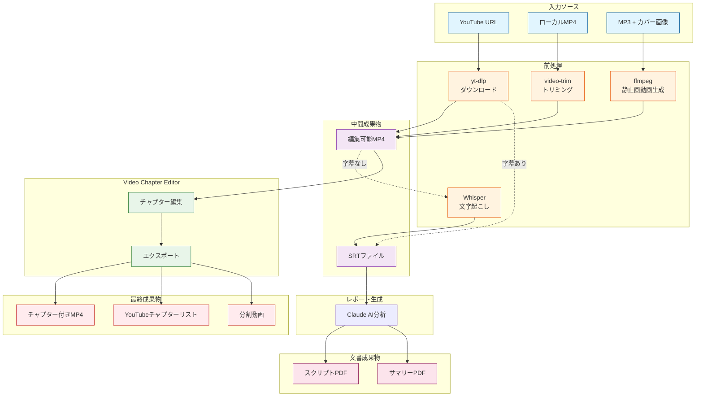

# Video Chapter Editor ワークフローグラフ

## 処理フロー（一筆書き問題としての分析）

入力ソース、中間生成物、最終成果物をノードとし、処理の流れをエッジとしたグラフ。

## グラフ理論的分析

### ノード次数の確認

| ノード | 入次数 | 出次数 | 合計次数 | 種別 |
|--------|--------|--------|----------|------|
| YouTube URL | 0 | 1 | 1 | 始点（奇点） |
| ローカルMP4 | 0 | 1 | 1 | 始点（奇点） |
| MP3+カバー | 0 | 1 | 1 | 始点（奇点） |
| 編集可能MP4 | 3 | 1 | 4 | 中間（偶点） |
| SRTファイル | 2 | 1 | 3 | 中間（奇点）※ |
| チャプター付きMP4 | 1 | 0 | 1 | 終点（奇点） |

※ SRTファイルは中間ノードでありながら奇点となっている。これはSRT取得（入力2本：yt-dlp、Whisper）とレポート生成（出力1本）で次数が3となるため。

### 設計上の対応

共通パス「編集可能MP4 → VCE → チャプター付きMP4」に集約することで、
入力側の分岐を吸収し、処理の重複を最小化している。

SRTファイルについては、VCEのスコープ外（レポート生成ワークフロー）への
接続点として機能しており、ワークフロー間の境界として許容される。
