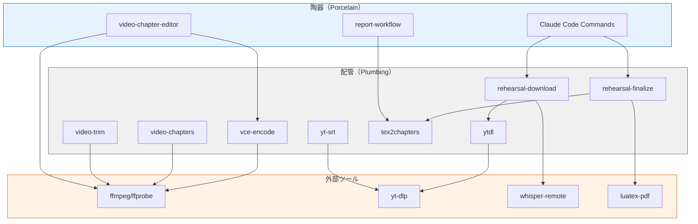

# media-scribe-workflow アーキテクチャ

## 設計思想: 配管と陶器（Plumbing & Porcelain）

### Gitからの着想

Gitは内部コマンドを2層に分離している:

| 層 | 名称 | 特徴 | 例 |
|----|------|------|-----|
| 配管 (Plumbing) | 低レベルコマンド | 単一機能、スクリプト向け | `git hash-object`, `git update-index` |
| 陶器 (Porcelain) | 高レベルコマンド | ユーザー向け、配管を組み合わせ | `git add`, `git commit` |

この設計により:
- **配管**: 安定したAPI、自動化・スクリプト向け
- **陶器**: ユーザー体験重視、内部実装は変更可能

### media-scribe-workflowでの適用

```
┌─────────────────────────────────────────────────────────────────┐
│                    陶器 (Porcelain)                              │
│  ┌──────────────────────────┐  ┌──────────────────────────────┐ │
│  │   video-chapter-editor   │  │      report-workflow         │ │
│  │       (PySide6 GUI)      │  │     (開発中 / PySide6 GUI)   │ │
│  └──────────────────────────┘  └──────────────────────────────┘ │
│                                                                  │
│  ┌──────────────────────────────────────────────────────────────┐│
│  │              Claude Code スラッシュコマンド                   ││
│  │  /rehearsal, /aesa, /luatex など                             ││
│  └──────────────────────────────────────────────────────────────┘│
└─────────────────────────────────────────────────────────────────┘
                              │
                              │ 呼び出し
                              ▼
┌─────────────────────────────────────────────────────────────────┐
│                     配管 (Plumbing)                              │
│                                                                  │
│  ┌─────────────┐ ┌─────────────┐ ┌─────────────┐ ┌────────────┐ │
│  │   yt-srt    │ │ video-trim  │ │video-chapters│ │tex2chapters│ │
│  └─────────────┘ └─────────────┘ └─────────────┘ └────────────┘ │
│                                                                  │
│  ┌─────────────┐ ┌─────────────┐ ┌─────────────┐ ┌────────────┐ │
│  │   ytdl      │ │ vce-encode  │ │  spd2png    │ │ jsonl2md   │ │
│  └─────────────┘ └─────────────┘ └─────────────┘ └────────────┘ │
│                                                                  │
│  ┌───────────────────────────────┐ ┌────────────────────────────┐│
│  │     rehearsal-download        │ │    rehearsal-finalize      ││
│  │  (ytdl + whisper-remote)      │ │ (luatex-pdf + tex2chapters)││
│  └───────────────────────────────┘ └────────────────────────────┘│
└─────────────────────────────────────────────────────────────────┘
                              │
                              │ 依存
                              ▼
┌─────────────────────────────────────────────────────────────────┐
│                   外部ツール / サービス                          │
│  ┌──────────┐ ┌──────────┐ ┌──────────┐ ┌──────────┐            │
│  │  ffmpeg  │ │ yt-dlp   │ │ whisper  │ │ luatex   │            │
│  └──────────┘ └──────────┘ └──────────┘ └──────────┘            │
└─────────────────────────────────────────────────────────────────┘
```

---

## 配管ツール一覧

### 単一機能ツール（純粋配管）

| ツール | 入力 | 出力 | 機能 |
|--------|------|------|------|
| `yt-srt` | YouTube URL | `.srt` | YouTube自動字幕取得 |
| `ytdl` | YouTube URL | `.mp4` + `.srt` | 動画+字幕ダウンロード |
| `video-trim` | `.mp4` + 区間 | `.mp4` | 指定区間カット |
| `video-chapters` | `.mp4` + `.txt` | `.mp4` | チャプター埋め込み |
| `tex2chapters` | `.tex` | `_youtube.txt`, `_movieviewer.txt` | LaTeX→チャプター抽出 |
| `vce-encode` | `.mp4` + `.txt` | `.mp4` | チャプター付きエンコード |
| `spd2png` | `.spd` | `.png` | PADtools→PNG変換 |
| `jsonl2md` | `.jsonl` | `.md` | Claude会話→Markdown変換 |

### 複合ツール（配管の組み合わせ）

| ツール | 組み合わせ | 用途 |
|--------|----------|------|
| `rehearsal-download` | `ytdl` + `whisper-remote` | 動画DL + 文字起こし起動 |
| `rehearsal-finalize` | `luatex-pdf` + `tex2chapters` | PDF生成 + チャプター抽出 |

### 設計原則

1. **単一責任**: 1ツール = 1機能
2. **stdin/stdout対応**: パイプ接続可能
3. **エラーコード**: 0 = 成功, 非0 = 失敗
4. **冪等性**: 同じ入力には同じ出力

---

## 陶器ツール一覧

### GUI アプリケーション

| ツール | 対象ユーザー | 機能 |
|--------|------------|------|
| **video-chapter-editor** | 動画編集者 | チャプター編集、エンコード、書出 |
| **report-workflow** | ドキュメント作成者 | AI分析レポート生成（開発中） |

### Claude Code スラッシュコマンド

| コマンド | 機能 | 内部で使用する配管 |
|---------|------|-------------------|
| `/rehearsal` | リハーサル記録作成 | Read, Write, Bash |
| `/aesa` | AESAレポート生成 | Read, Write |
| `/luatex` | LaTeXドキュメント作成 | Write |

---

## スケーラブルなユースケース

### レベル0: 単一ツール使用

最小単位の処理。スクリプト化の基盤。

```bash
# YouTube字幕を取得
yt-srt "https://youtu.be/VIDEO_ID"

# チャプターリスト抽出
tex2chapters document.tex
```

### レベル1: パイプライン構築

複数ツールを連結した自動化。

```bash
# 動画ダウンロード → トリミング → チャプター埋め込み
ytdl "$URL" && \
video-trim input.mp4 -start 00:05:00 -end 01:30:00 -o trimmed.mp4 && \
video-chapters trimmed.mp4 chapters.txt -o final.mp4
```

### レベル2: ワークフロー自動化

複合ツールによる半自動化。

```bash
# ダウンロード + Whisper起動
rehearsal-download "https://youtu.be/VIDEO_ID"

# (Whisper完了待ち)

# PDF生成 + チャプター抽出
rehearsal-finalize "リハーサル記録.tex"
```

### レベル3: AI統合ワークフロー

Claude Codeスラッシュコマンドによる高度な処理。

```bash
# Claude Code起動
claude code

# スラッシュコマンドでAI分析+LaTeX生成
/rehearsal
```

### レベル4: GUI統合

video-chapter-editorによる対話的編集。

```
video-chapter-editor
├── ソース読み込み（複数対応）
├── 波形表示 + プレビュー
├── チャプター編集
├── エンコード設定
└── 書出（ffmpegエンコード）
```

---

## ユースケース別推奨レベル

| ユースケース | 推奨レベル | 理由 |
|-------------|-----------|------|
| 単発の字幕取得 | 0 | `yt-srt`で十分 |
| 定期的な動画処理 | 1-2 | スクリプト化で効率化 |
| リハーサル記録作成 | 3 | AI分析が必要 |
| チャプター付き動画編集 | 4 | 対話的操作が効率的 |
| バッチ処理（大量動画） | 1 | シェルスクリプト+cron |

---

## 責務分離マトリクス

処理の種類に応じた最適な実行環境:

| 処理タイプ | 配管 (CLI) | 陶器 (GUI) | AI (Claude) |
|-----------|-----------|-----------|-------------|
| ファイル変換 | **最適** | ○ | - |
| バッチ処理 | **最適** | - | - |
| 対話的編集 | - | **最適** | - |
| 文脈理解・分析 | - | - | **最適** |
| レポート生成 | ○ | ○ | **最適** |
| プレビュー確認 | - | **最適** | - |

---

## 拡張パターン

### 新規配管ツール追加

1. `bin/` に実行可能スクリプトを配置
2. 単一機能に限定
3. `--help` オプション実装
4. エラー時は非0で終了

```bash
#!/usr/bin/env zsh
# bin/new-tool

usage() {
    echo "Usage: new-tool [options] <input>"
    echo "Options:"
    echo "  -o <file>  Output file"
    echo "  -h         Show help"
}

# メイン処理
main() {
    # 入力検証
    # 処理実行
    # 結果出力
}

main "$@"
```

### 新規陶器（GUI）追加

1. `media_scribe_workflow/ui/` にモジュール配置
2. エントリポイントを `pyproject.toml` に追加
3. 必要に応じて配管ツールを呼び出し

```python
# media_scribe_workflow/ui/new_app.py
from PySide6.QtWidgets import QApplication, QMainWindow

class NewApp(QMainWindow):
    def __init__(self):
        super().__init__()
        # UIセットアップ

    def run_plumbing_tool(self, tool_name, args):
        """配管ツールを呼び出し"""
        import subprocess
        result = subprocess.run([tool_name] + args, capture_output=True)
        return result
```

### Claude Codeコマンド追加

1. `.claude/commands/` にMarkdownファイル配置
2. プロンプトテンプレートを記述
3. 必要に応じて配管ツールを参照

```markdown
# /new-command

## 概要
新しい処理を実行します。

## 手順
1. 入力ファイルを読み込む
2. 分析を実行
3. 結果を出力

## 使用する配管ツール
- `tool-a`: 前処理
- `tool-b`: 後処理
```

---

## 依存関係グラフ



---

## まとめ

### 配管の価値

- **安定性**: 単一機能でバグが入りにくい
- **テスト容易性**: 入出力が明確
- **再利用性**: 様々な陶器から呼び出し可能
- **スクリプト化**: 自動化の基盤

### 陶器の価値

- **ユーザー体験**: 直感的な操作
- **即時フィードバック**: プレビュー、進捗表示
- **状態管理**: 複雑なワークフローの追跡
- **エラー回復**: ユーザーによる修正

### この設計の効果

1. **保守性向上**: 層分離により変更影響を局所化
2. **柔軟性**: 新規ユースケースに対応しやすい
3. **スケーラビリティ**: 単純→複雑へ段階的に対応
4. **選択肢**: CLI派もGUI派も満足
