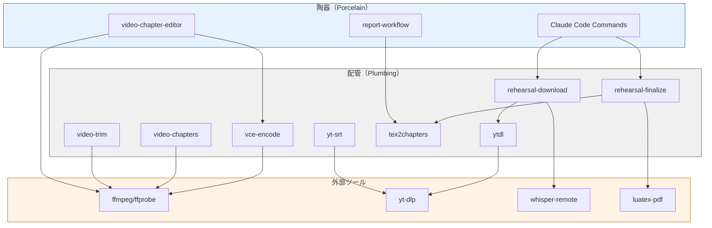
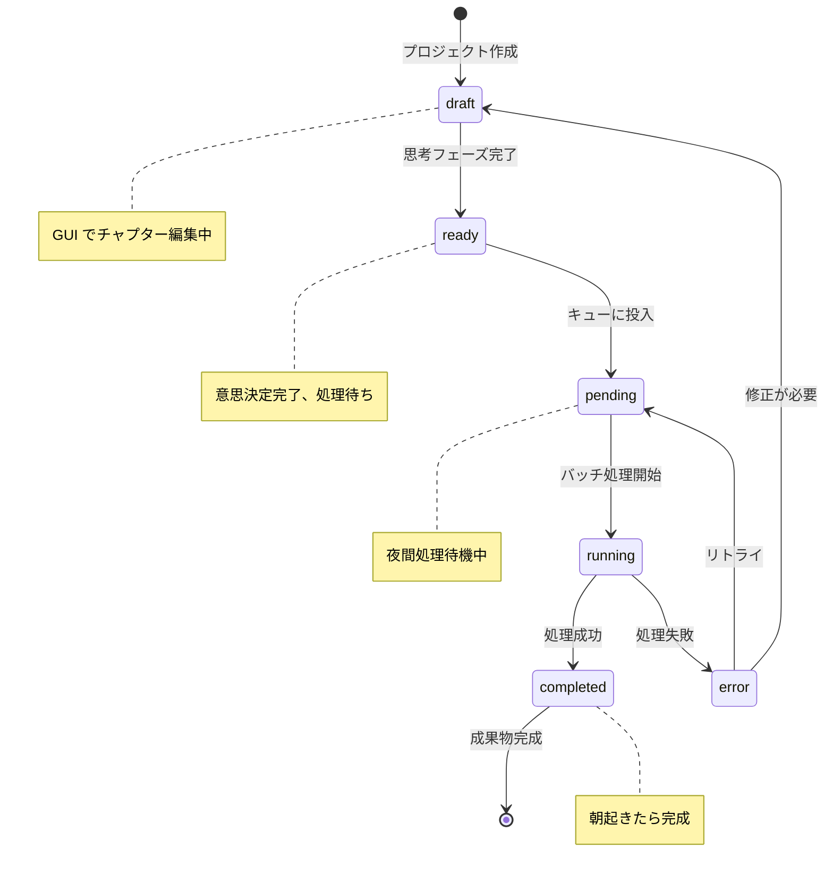

# media-scribe-workflow アーキテクチャ

## 根本思想: 思考と作業の分離

### なぜ分離するのか

クリエイティブな作業において、**思考（コンテンツのクオリティを上げる判断）** と **作業（機械的な処理の実行）** は本質的に異なる。

| 思考 | 作業 |
|------|------|
| 集中が必要 | 待ち時間が発生 |
| 判断・決定 | 実行・処理 |
| 中断されると質が落ちる | バックグラウンドで可能 |
| 人間が行う | 機械に任せられる |

**問題**: エンコードの待ち時間が思考を中断する

```
思考中 → エンコード開始 → 待機（10分〜1時間）→ 思考に戻れない
         ↑ ここで集中が途切れる
```

**解決**: 思考と作業を時間的に分離する

```
┌─────────────────────────────────────────────────────────────┐
│                    思考フェーズ（日中）                      │
│                                                              │
│   集中が必要な作業:                                          │
│   ├─ チャプターの切り方を考える                              │
│   ├─ 除外区間の判断                                          │
│   ├─ AI分析の方向性決定                                      │
│   └─ 品質確認・やり直し判断                                  │
│                                                              │
│   成果物: プロジェクトファイル（意思決定の記録）             │
└─────────────────────────────────────────────────────────────┘
                              │
                              ▼
                    ┌─────────────────┐
                    │ project.msw.yaml │
                    │  （意思決定の     │
                    │    凍結点）       │
                    └─────────────────┘
                              │
                              ▼
┌─────────────────────────────────────────────────────────────┐
│                    作業フェーズ（夜間）                      │
│                                                              │
│   時間がかかる処理:                                          │
│   ├─ Whisper文字起こし（30分〜2時間）                        │
│   ├─ ffmpegエンコード（10分〜1時間）                         │
│   ├─ AI分析（トークン消費、レート制限）                      │
│   └─ PDF生成                                                 │
│                                                              │
│   実行方法: cron / launchd / バッチキュー                    │
└─────────────────────────────────────────────────────────────┘
                              │
                              ▼
                        朝起きたら完成
```

### プロジェクトファイルの役割

プロジェクトファイルは単なる設定ファイルではなく、**思考と作業の境界**である。

| 従来の考え方 | 本アーキテクチャ |
|-------------|-----------------|
| 設定ファイル | **意思決定の記録** |
| ツールへの入力 | **思考と作業の境界** |
| 状態保存 | **非同期処理のキュー** |

### 各ツールの位置づけ

| 機能 | 思考フェーズ | 作業フェーズ |
|------|-------------|-------------|
| チャプター編集 | GUI（即時反映） | - |
| プレビュー | GUI（即時） | - |
| エンコード | **キューに投入のみ** | バッチ実行 |
| 文字起こし | **キューに投入のみ** | バッチ実行 |
| AI分析 | プロンプト調整 | バッチ実行 |
| 品質確認 | GUI（結果レビュー） | - |

---

## 設計思想: 配管と陶器（Plumbing & Porcelain）

### Gitからの着想

Gitは内部コマンドを2層に分離している:

| 層 | 名称 | 特徴 | 例 |
|----|------|------|-----|
| 配管 (Plumbing) | 低レベルコマンド | 単一機能、スクリプト向け | `git hash-object`, `git update-index` |
| 陶器 (Porcelain) | 高レベルコマンド | ユーザー向け、配管を組み合わせ | `git add`, `git commit` |

この設計により:
- **配管**: 安定したAPI、自動化・スクリプト向け
- **陶器**: ユーザー体験重視、内部実装は変更可能

### media-scribe-workflowでの適用

```
┌─────────────────────────────────────────────────────────────────┐
│                    陶器 (Porcelain)                              │
│                                                                  │
│  ┌─────────────────────────────────────────────────────────────┐│
│  │                     GUI アプリケーション                     ││
│  │  ┌─────────────────────┐  ┌────────────────────────────────┐││
│  │  │ video-chapter-editor│  │      report-workflow           │││
│  │  │  ・チャプター編集    │  │     (開発中)                   │││
│  │  │  ・プレビュー        │  │                                │││
│  │  │  ・タスクキュー管理  │  │                                │││
│  │  └─────────────────────┘  └────────────────────────────────┘││
│  └─────────────────────────────────────────────────────────────┘│
│                                                                  │
│  ┌─────────────────────────────────────────────────────────────┐│
│  │                     CLI Wrapper (msw)                        ││
│  │  msw encode project.msw.yaml    # 同じ結果をCLIで           ││
│  │  msw split project.msw.yaml     # バッチ処理向け            ││
│  │  msw process-queue ~/projects/  # 夜間一括処理              ││
│  └─────────────────────────────────────────────────────────────┘│
│                                                                  │
│  ┌─────────────────────────────────────────────────────────────┐│
│  │              Claude Code スラッシュコマンド                  ││
│  │  /rehearsal, /aesa, /luatex など                            ││
│  └─────────────────────────────────────────────────────────────┘│
└─────────────────────────────────────────────────────────────────┘
                              │
                              │ 呼び出し（同じプロジェクトファイル）
                              ▼
                    ┌─────────────────┐
                    │ project.msw.yaml │
                    └─────────────────┘
                              │
                              ▼
┌─────────────────────────────────────────────────────────────────┐
│                     配管 (Plumbing)                              │
│                                                                  │
│  ┌─────────────┐ ┌─────────────┐ ┌─────────────┐ ┌────────────┐ │
│  │   yt-srt    │ │ video-trim  │ │video-chapters│ │tex2chapters│ │
│  └─────────────┘ └─────────────┘ └─────────────┘ └────────────┘ │
│                                                                  │
│  ┌─────────────┐ ┌─────────────┐ ┌─────────────┐ ┌────────────┐ │
│  │   ytdl      │ │ vce-encode  │ │  spd2png    │ │ jsonl2md   │ │
│  └─────────────┘ └─────────────┘ └─────────────┘ └────────────┘ │
│                                                                  │
│  ┌───────────────────────────────┐ ┌────────────────────────────┐│
│  │     rehearsal-download        │ │    rehearsal-finalize      ││
│  │  (ytdl + whisper-remote)      │ │ (luatex-pdf + tex2chapters)││
│  └───────────────────────────────┘ └────────────────────────────┘│
└─────────────────────────────────────────────────────────────────┘
                              │
                              │ 依存
                              ▼
┌─────────────────────────────────────────────────────────────────┐
│                   外部ツール / サービス                          │
│  ┌──────────┐ ┌──────────┐ ┌──────────┐ ┌──────────┐            │
│  │  ffmpeg  │ │ yt-dlp   │ │ whisper  │ │ luatex   │            │
│  └──────────┘ └──────────┘ └──────────┘ └──────────┘            │
└─────────────────────────────────────────────────────────────────┘
```

### GUIの責務（思考フェーズ専用）

GUIは**思考を支援する機能**に特化し、作業は配管に委譲する。

| 責務 | GUI | CLI Wrapper |
|------|-----|-------------|
| チャプター編集（波形+クリック） | **必須** | - |
| プレビュー再生 | **必須** | - |
| 視覚的フィードバック | **必須** | - |
| 配管の呼び出し | イベントドリブン | 直接 |
| 進捗表示 | リアルタイム | stdout |
| タスクキュー管理 | 可視化 | 順次実行 |
| エンコード実行 | 配管に委譲 | 配管に委譲 |

### GUI と CLI の使い分け

```bash
# 昼: 思考作業（GUI）
video-chapter-editor project.msw.yaml
# → チャプター編集、プレビュー確認、意思決定

# 夜: 自動処理（CLI / cron）
msw process-queue ~/projects/*.msw.yaml \
  --stage encode \
  --stage transcribe \
  --notify slack
# → 朝起きたら完成
```

---

## 配管ツール一覧

### 単一機能ツール（純粋配管）

| ツール | 入力 | 出力 | 機能 |
|--------|------|------|------|
| `yt-srt` | YouTube URL | `.srt` | YouTube自動字幕取得 |
| `ytdl` | YouTube URL | `.mp4` + `.srt` | 動画+字幕ダウンロード |
| `video-trim` | `.mp4` + 区間 | `.mp4` | 指定区間カット |
| `video-chapters` | `.mp4` + `.txt` | `.mp4` | チャプター埋め込み |
| `tex2chapters` | `.tex` | `_youtube.txt`, `_movieviewer.txt` | LaTeX→チャプター抽出 |
| `vce-encode` | `.mp4` + `.txt` | `.mp4` | チャプター付きエンコード |
| `spd2png` | `.spd` | `.png` | PADtools→PNG変換 |
| `jsonl2md` | `.jsonl` | `.md` | Claude会話→Markdown変換 |

### 複合ツール（配管の組み合わせ）

| ツール | 組み合わせ | 用途 |
|--------|----------|------|
| `rehearsal-download` | `ytdl` + `whisper-remote` | 動画DL + 文字起こし起動 |
| `rehearsal-finalize` | `luatex-pdf` + `tex2chapters` | PDF生成 + チャプター抽出 |

### 設計原則

1. **単一責任**: 1ツール = 1機能
2. **stdin/stdout対応**: パイプ接続可能
3. **エラーコード**: 0 = 成功, 非0 = 失敗
4. **冪等性**: 同じ入力には同じ出力

---

## 陶器ツール一覧

### GUI アプリケーション

| ツール | 対象ユーザー | 機能 |
|--------|------------|------|
| **video-chapter-editor** | 動画編集者 | チャプター編集、エンコード、書出 |
| **report-workflow** | ドキュメント作成者 | AI分析レポート生成（開発中） |

### Claude Code スラッシュコマンド

| コマンド | 機能 | 内部で使用する配管 |
|---------|------|-------------------|
| `/rehearsal` | リハーサル記録作成 | Read, Write, Bash |
| `/aesa` | AESAレポート生成 | Read, Write |
| `/luatex` | LaTeXドキュメント作成 | Write |

---

## スケーラブルなユースケース

### レベル0: 単一ツール使用

最小単位の処理。スクリプト化の基盤。

```bash
# YouTube字幕を取得
yt-srt "https://youtu.be/VIDEO_ID"

# チャプターリスト抽出
tex2chapters document.tex
```

### レベル1: パイプライン構築

複数ツールを連結した自動化。

```bash
# 動画ダウンロード → トリミング → チャプター埋め込み
ytdl "$URL" && \
video-trim input.mp4 -start 00:05:00 -end 01:30:00 -o trimmed.mp4 && \
video-chapters trimmed.mp4 chapters.txt -o final.mp4
```

### レベル2: ワークフロー自動化

複合ツールによる半自動化。

```bash
# ダウンロード + Whisper起動
rehearsal-download "https://youtu.be/VIDEO_ID"

# (Whisper完了待ち)

# PDF生成 + チャプター抽出
rehearsal-finalize "リハーサル記録.tex"
```

### レベル3: AI統合ワークフロー

Claude Codeスラッシュコマンドによる高度な処理。

```bash
# Claude Code起動
claude code

# スラッシュコマンドでAI分析+LaTeX生成
/rehearsal
```

### レベル4: GUI統合

video-chapter-editorによる対話的編集。

```
video-chapter-editor
├── ソース読み込み（複数対応）
├── 波形表示 + プレビュー
├── チャプター編集
├── エンコード設定
└── 書出（ffmpegエンコード）
```

---

## ユースケース別推奨レベル

| ユースケース | 推奨レベル | 理由 |
|-------------|-----------|------|
| 単発の字幕取得 | 0 | `yt-srt`で十分 |
| 定期的な動画処理 | 1-2 | スクリプト化で効率化 |
| リハーサル記録作成 | 3 | AI分析が必要 |
| チャプター付き動画編集 | 4 | 対話的操作が効率的 |
| バッチ処理（大量動画） | 1 | シェルスクリプト+cron |

---

## 責務分離マトリクス

処理の種類に応じた最適な実行環境:

| 処理タイプ | 配管 (CLI) | 陶器 (GUI) | AI (Claude) |
|-----------|-----------|-----------|-------------|
| ファイル変換 | **最適** | ○ | - |
| バッチ処理 | **最適** | - | - |
| 対話的編集 | - | **最適** | - |
| 文脈理解・分析 | - | - | **最適** |
| レポート生成 | ○ | ○ | **最適** |
| プレビュー確認 | - | **最適** | - |

---

## 拡張パターン

### 新規配管ツール追加

1. `bin/` に実行可能スクリプトを配置
2. 単一機能に限定
3. `--help` オプション実装
4. エラー時は非0で終了

```bash
#!/usr/bin/env zsh
# bin/new-tool

usage() {
    echo "Usage: new-tool [options] <input>"
    echo "Options:"
    echo "  -o <file>  Output file"
    echo "  -h         Show help"
}

# メイン処理
main() {
    # 入力検証
    # 処理実行
    # 結果出力
}

main "$@"
```

### 新規陶器（GUI）追加

1. `media_scribe_workflow/ui/` にモジュール配置
2. エントリポイントを `pyproject.toml` に追加
3. 必要に応じて配管ツールを呼び出し

```python
# media_scribe_workflow/ui/new_app.py
from PySide6.QtWidgets import QApplication, QMainWindow

class NewApp(QMainWindow):
    def __init__(self):
        super().__init__()
        # UIセットアップ

    def run_plumbing_tool(self, tool_name, args):
        """配管ツールを呼び出し"""
        import subprocess
        result = subprocess.run([tool_name] + args, capture_output=True)
        return result
```

### Claude Codeコマンド追加

1. `.claude/commands/` にMarkdownファイル配置
2. プロンプトテンプレートを記述
3. 必要に応じて配管ツールを参照

```markdown
# /new-command

## 概要
新しい処理を実行します。

## 手順
1. 入力ファイルを読み込む
2. 分析を実行
3. 結果を出力

## 使用する配管ツール
- `tool-a`: 前処理
- `tool-b`: 後処理
```

---

## 依存関係グラフ



---

## まとめ

### 配管の価値

- **安定性**: 単一機能でバグが入りにくい
- **テスト容易性**: 入出力が明確
- **再利用性**: 様々な陶器から呼び出し可能
- **スクリプト化**: 自動化の基盤

### 陶器の価値

- **ユーザー体験**: 直感的な操作
- **即時フィードバック**: プレビュー、進捗表示
- **状態管理**: 複雑なワークフローの追跡
- **エラー回復**: ユーザーによる修正

### この設計の効果

1. **保守性向上**: 層分離により変更影響を局所化
2. **柔軟性**: 新規ユースケースに対応しやすい
3. **スケーラビリティ**: 単純→複雑へ段階的に対応
4. **選択肢**: CLI派もGUI派も満足

---

## 統一プロジェクトファイル仕様

### 概要

すべてのツール（GUI、CLI Wrapper、Claude Code）が共通で使用するプロジェクトファイル。
**意思決定の記録**として機能し、**思考と作業の境界**を定義する。

### ファイル形式

```yaml
# project.msw.yaml (Media Scribe Workflow)
schema_version: "1.0"

# ============================================================
# ソース定義
# ============================================================
source:
  type: youtube | local | multi
  url: "https://youtu.be/..."           # YouTube時
  files:                                 # ローカル/複数時
    - path: "rehearsal_01.mp4"
      role: video
    - path: "audio_high_quality.m4a"
      role: audio

# ============================================================
# チャプター（video-chapter-editor が編集）
# ============================================================
chapters:
  - time: "00:00:00.000"
    title: "オープニング"
    exclude: false
  - time: "00:05:23.500"
    title: "第1曲 ホルスト 木星"
    exclude: false
  - time: "00:45:00.000"
    title: "休憩"
    exclude: true                        # エクスポート時にカット

# ============================================================
# 文字起こし設定
# ============================================================
transcription:
  method: youtube | whisper | manual | skip
  files:
    youtube_srt: "rehearsal_yt.srt"
    whisper_srt: "rehearsal_wp.srt"

# ============================================================
# AI分析設定（オプション）
# ============================================================
analysis:
  profile: orchestral_rehearsal | horn_lesson | meeting
  fields:
    organization: "○○交響楽団"
    conductor: "山田太郎"
    date: "2026-01-10"
    author_part: "ホルン"

# ============================================================
# 出力設定
# ============================================================
output:
  basename: "rehearsal_2026-01-10"
  formats:
    - video_with_chapters      # vce-encode
    - split_by_chapter         # vce-split
    - chapter_list_youtube     # チャプターリスト
    - chapter_list_movieviewer
    - pdf_report               # AI分析 → LaTeX → PDF

# ============================================================
# 処理ステータス（バッチ処理が更新）
# ============================================================
status:
  chapters: ready              # 思考完了、処理待ち
  encode: pending              # 未処理
  transcription: running       # 処理中
  analysis: completed          # 完了
  last_updated: "2026-01-10T23:45:00+09:00"

# ============================================================
# 処理キュー設定（夜間バッチ用）
# ============================================================
queue:
  priority: normal | high | low
  schedule: "after 23:00"      # 夜間実行
  notify:
    on_complete: slack://webhook-url
    on_error: email://user@example.com
```

### スケーラブルな使い方

必要なセクションだけ使用することで、シンプルなユースケースから複雑なワークフローまで対応。

| レベル | 使用セクション | ツール |
|--------|---------------|--------|
| 0 | source のみ | 配管直接呼び出し |
| 1 | source + chapters | vce-encode, vce-split |
| 2 | + transcription | rehearsal-download |
| 3 | + analysis | /rehearsal, AI処理 |
| 4 | + status + queue | video-chapter-editor + 夜間バッチ |

### 各ツールとの対応

```
┌─────────────────────────────────────────────────────────────┐
│                   project.msw.yaml                          │
└─────────────────────────────────────────────────────────────┘
        │           │           │           │           │
        ▼           ▼           ▼           ▼           ▼
   ┌────────┐  ┌────────┐  ┌────────┐  ┌────────┐  ┌────────┐
   │ source │  │chapters│  │transcr.│  │analysis│  │ queue  │
   └────────┘  └────────┘  └────────┘  └────────┘  └────────┘
        │           │           │           │           │
        ▼           ▼           ▼           ▼           ▼
   ┌────────┐  ┌────────┐  ┌────────┐  ┌────────┐  ┌────────┐
   │  ytdl  │  │  VCE   │  │whisper │  │ Claude │  │  cron  │
   │yt-srt  │  │GUI/CLI │  │yt-srt  │  │  Code  │  │ batch  │
   └────────┘  └────────┘  └────────┘  └────────┘  └────────┘
```

### ステータス遷移



### 設計原則

1. **セクション独立**: 各セクションは他に依存せず単独で有効
2. **段階的利用**: 必要に応じてセクションを追加
3. **ツール非依存**: 特定ツールに依存しない汎用フォーマット
4. **人間可読**: YAML形式で手動編集可能
5. **状態追跡**: 処理進捗をファイル内に記録
