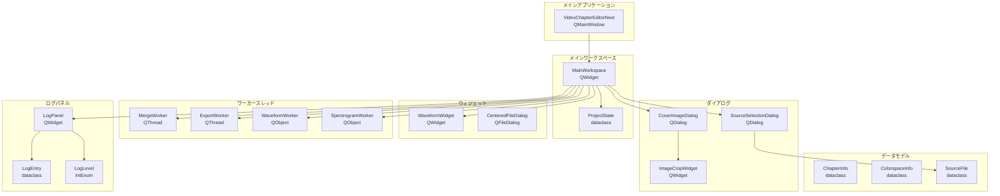
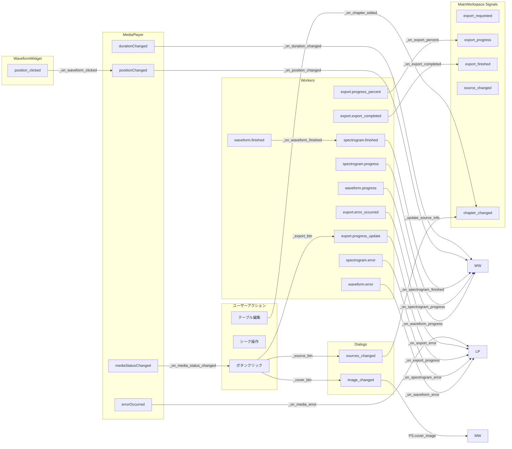

# ui_next 実装構造グラフ

## クラス階層



## Signal/Slot フロー（一筆描き構造）



## メソッド呼び出しグラフ（主要フロー）

```mermaid
flowchart TD
    subgraph "初期化フロー"
        Init[__init__] --> SetupUI[_setup_ui]
        SetupUI --> CreateLeft[_create_left_panel]
        SetupUI --> CreateVideo[_create_video_panel]
        SetupUI --> CreateRight[_create_chapter_table]

        CreateLeft --> CreateSource[_create_source_section]
        CreateLeft --> CreatePlayback[_create_playback_section]
        CreateLeft --> CreateWaveform[_create_waveform_section]
        CreateLeft --> CreateExport[_create_export_section]
    end

    subgraph "ソース読み込みフロー"
        OpenSource[_open_source_dialog] --> UpdateInfo[_update_source_info]
        UpdateInfo --> LoadMedia[_load_source_media]
        LoadMedia --> MergeAudio[_merge_audio_files]
        LoadMedia --> LoadVideo[load_video_file]

        LoadVideo --> StartWave[_start_waveform_generation]
        StartWave --> OnWaveProgress[_on_waveform_progress]
        StartWave --> OnWaveFinish[_on_waveform_finished]
        OnWaveFinish --> StartSpec[_start_spectrogram_after_waveform]
        StartSpec --> StartSpecGen[_start_spectrogram_generation]
        StartSpecGen --> OnSpecProgress[_on_spectrogram_progress]
        StartSpecGen --> OnSpecFinish[_on_spectrogram_finished]
    end

    subgraph "再生制御フロー"
        Toggle[_toggle_playback] --> Play[play/pause]
        SeekRel[_seek_relative] --> SeekTo[_seek_video]
        SkipPrev[_skip_to_prev_chapter] --> SeekTo
        SkipNext[_skip_to_next_chapter] --> SeekTo
        WaveClick[_on_waveform_clicked] --> SeekTo

        PosChange[_on_position_changed] --> Highlight[_highlight_current_chapter]
        PosChange --> SetPos[WaveformWidget.set_position]
    end

    subgraph "チャプター編集フロー"
        LoadChap[_load_chapters] --> ParseChap[_parse_chapter_file]
        LoadChap --> ExtractChap[_extract_chapters_from_media]
        LoadChap --> LoadEmbed[_load_embedded_chapters]

        AddChap[_add_chapter] --> UpdateWave[_update_waveform_chapters]
        RemoveChap[_remove_chapter] --> UpdateWave
        ChapEdit[_on_chapter_edited] --> UpdateWave

        CopyYT[_copy_youtube_chapters] --> GetTable[_get_table_chapters]
    end

    subgraph "エクスポートフロー"
        ExportBtn[_on_export_btn_clicked] --> StartExport[_start_export]
        StartExport --> ExportWorkerRun[ExportWorker.run]

        ExportWorkerRun --> OnProgress[_on_export_progress]
        ExportWorkerRun --> OnPercent[_on_export_percent]
        ExportWorkerRun --> OnComplete[_on_export_completed]
        ExportWorkerRun --> OnError[_on_export_error]

        OnComplete --> LoadExported[_load_exported_video]

        Cancel[_cancel_export] --> ResetBtn[_reset_export_btn]
    end
```



## 一筆描き経路（データフロー観点）

```
起点: ユーザー操作
    │
    ├─→ [ソース選択] ─→ SourceSelectionDialog
    │       │
    │       └─→ sources_changed Signal
    │               │
    │               └─→ _update_source_info()
    │                       │
    │                       ├─→ _load_source_media()
    │                       │       │
    │                       │       └─→ MediaPlayer.setSource()
    │                       │               │
    │                       │               └─→ mediaStatusChanged Signal
    │                       │
    │                       └─→ _start_waveform_generation()
    │                               │
    │                               └─→ WaveformWorker
    │                                       │
    │                                       ├─→ progress Signal ─→ WaveformWidget.set_loading()
    │                                       │
    │                                       └─→ finished Signal ─→ WaveformWidget.set_waveform()
    │                                               │
    │                                               └─→ _start_spectrogram_after_waveform()
    │                                                       │
    │                                                       └─→ SpectrogramWorker
    │                                                               │
    │                                                               └─→ finished Signal ─→ WaveformWidget.set_spectrogram()
    │
    ├─→ [再生/一時停止] ─→ _toggle_playback()
    │       │
    │       └─→ MediaPlayer.play() / pause()
    │               │
    │               └─→ positionChanged Signal
    │                       │
    │                       ├─→ _on_position_changed()
    │                       │       │
    │                       │       ├─→ WaveformWidget.set_position()
    │                       │       │
    │                       │       └─→ _highlight_current_chapter()
    │                       │
    │                       └─→ [タイムライン更新]
    │
    ├─→ [波形クリック] ─→ WaveformWidget.mousePressEvent()
    │       │
    │       └─→ position_clicked Signal
    │               │
    │               └─→ _on_waveform_clicked()
    │                       │
    │                       └─→ _seek_video()
    │
    ├─→ [チャプター編集] ─→ QTableWidget.cellChanged Signal
    │       │
    │       └─→ _on_chapter_edited()
    │               │
    │               └─→ _update_waveform_chapters()
    │                       │
    │                       └─→ WaveformWidget.set_chapters()
    │
    └─→ [エクスポート] ─→ _on_export_btn_clicked()
            │
            └─→ _start_export()
                    │
                    └─→ ExportWorker.start()
                            │
                            ├─→ progress_update Signal ─→ LogPanel.info()
                            │
                            ├─→ progress_percent Signal ─→ export_progress Signal ─→ App.statusbar
                            │
                            ├─→ export_completed Signal ─→ _on_export_completed()
                            │       │
                            │       └─→ export_finished Signal ─→ App._on_export_finished()
                            │
                            └─→ error_occurred Signal ─→ _on_export_error()

終点: UI更新 / ファイル出力
```

## クラス間依存関係マトリクス

| From \ To | MW | WW | SSD | CID | MW_W | ExW | WaW | SpW | LP | PS |
|-----------|----|----|-----|-----|------|-----|-----|-----|----|----|
| App       | ●  |    |     |     |      |     |     |     |    |    |
| MW        |    | ●  | ●   | ●   | ●    | ●   | ●   | ●   | ●  | ●  |
| WW        |    |    |     |     |      |     |     |     |    |    |
| SSD       |    |    |     |     |      |     |     |     |    |    |
| CID       |    |    |     | ●   |      |     |     |     |    |    |
| MW_W      |    |    |     |     |      |     |     |     | ●  |    |
| ExW       |    |    |     |     |      |     |     |     |    |    |
| WaW       |    |    |     |     |      |     |     |     |    |    |
| SpW       |    |    |     |     |      |     |     |     |    |    |

凡例:
- MW: MainWorkspace
- WW: WaveformWidget
- SSD: SourceSelectionDialog
- CID: CoverImageDialog
- MW_W: MergeWorker
- ExW: ExportWorker
- WaW: WaveformWorker
- SpW: SpectrogramWorker
- LP: LogPanel
- PS: ProjectState

## 生成日時
2024-12-30
