# ワークフロー図

## 基本ワークフロー（単一動画 → SRT）

## 拡張ワークフロー（複数ソース対応）

## 全体フロー

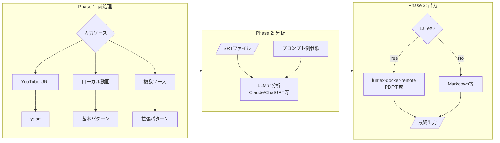

## ツール一覧

| ツール | 機能 | 必須/オプション |
|--------|------|----------------|
| yt-srt | YouTube字幕取得 | 必須 |
| video-trim | 不要部分削除 | 基本 |
| movie-viewer | チャプター作成 | 基本 |
| video-chapters | チャプター結合 | 基本 |
| audio-normalize | 音量正規化 | 拡張 |
| audio-extract-channel | チャンネル抽出 | 拡張 |
| video-replace-audio | 音声差し替え | 拡張 |
| whisper-remote | 高精度文字起こし | 拡張 |
| luatex-docker-remote | PDF生成 | 拡張 |

---

## 前処理ワークフロー アクティビティ図（スイムレーン）

Video Chapter Editor における前処理フェーズのアクター間協調。
処理の詳細はPAD（`docs/pad/preprocessing-workflow.png`）を参照。

### 全体フロー

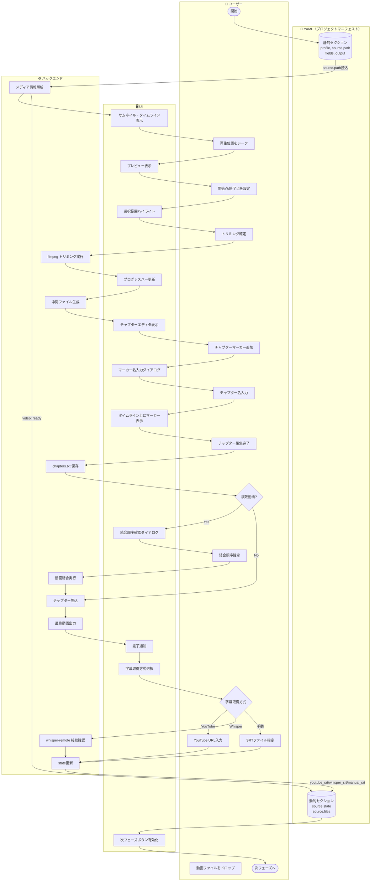

### トリミング操作の詳細

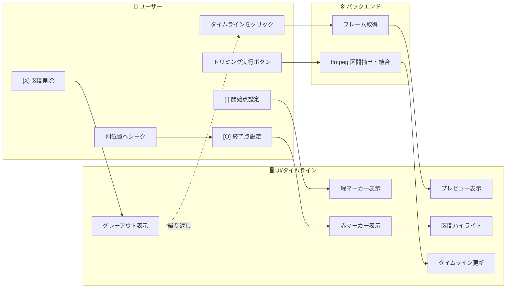

### チャプター編集の詳細

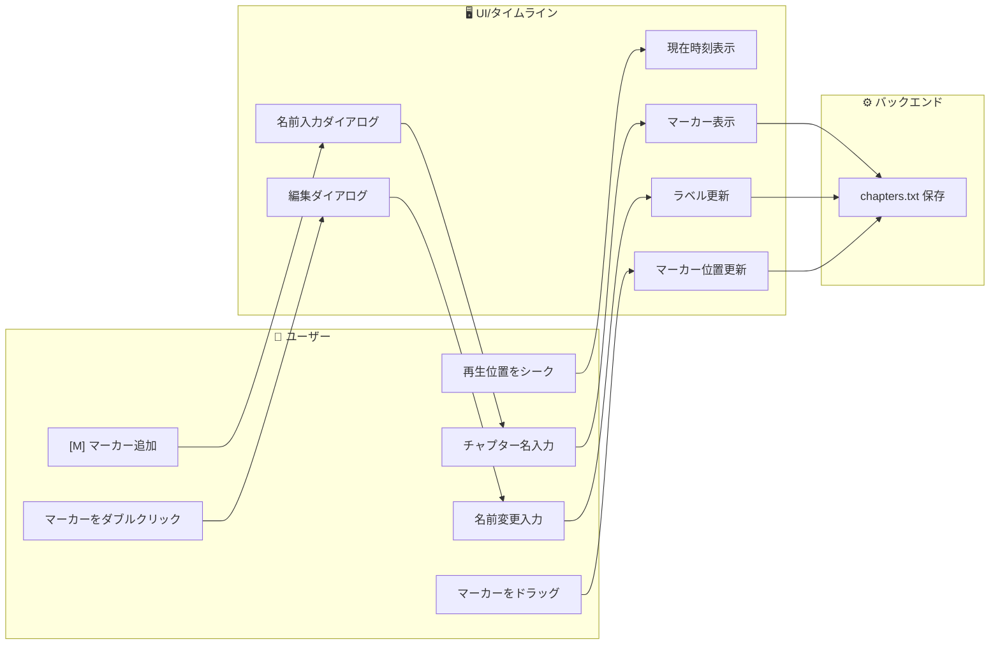

### 状態遷移（UI視点）

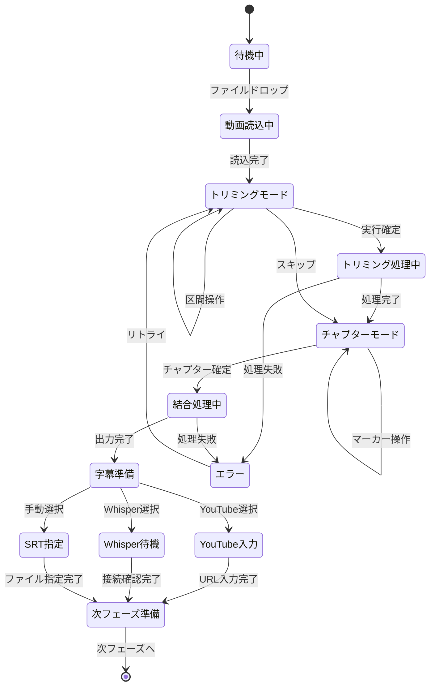

---

## 前処理ワークフロー PAD図

### 処理フロー

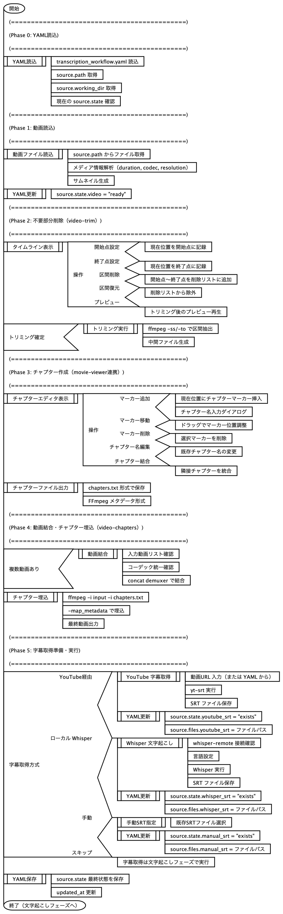

---

## 入力状態の場合分けと遷移

### 入力状態の列挙

| # | 動画 | YT字幕 | Whisper | 手動SRT | 必要な処理 |
|---|------|--------|---------|---------|-----------|
| 1 | YouTube URL | - | - | - | ytdl（動画+YT字幕）、任意でWhisper |
| 2 | ローカル動画のみ | - | - | - | Whisperまたは手動SRT |
| 3 | ローカル動画 | ✓ | - | - | 任意でWhisper追加 |
| 4 | ローカル動画 | - | ✓ | - | 処理可能 |
| 5 | ローカル動画 | ✓ | ✓ | - | 処理可能（統合） |
| 6 | ローカル動画 | - | - | ✓ | 処理可能 |
| 7 | YouTube DL済み | - | - | - | yt-srt or Whisper |

### 入力状態遷移図

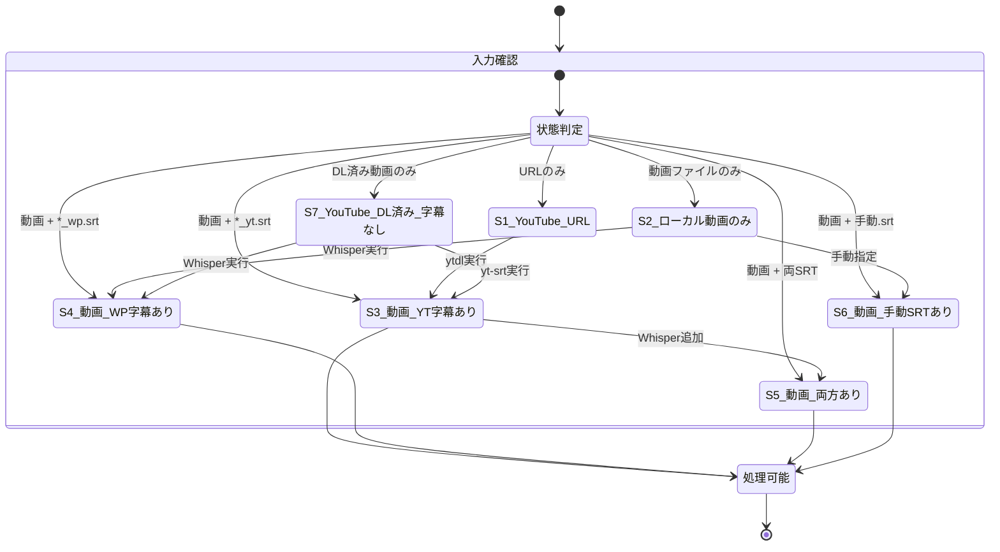

### 前処理出力と文字起こし入力の対応

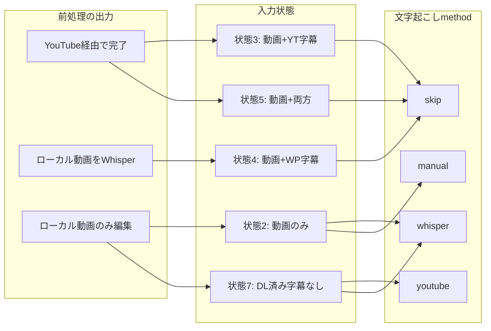

### YAMLライフサイクル

YAMLファイルは**プロジェクトマニフェスト**として、全ワークフローの開始前に作成する。

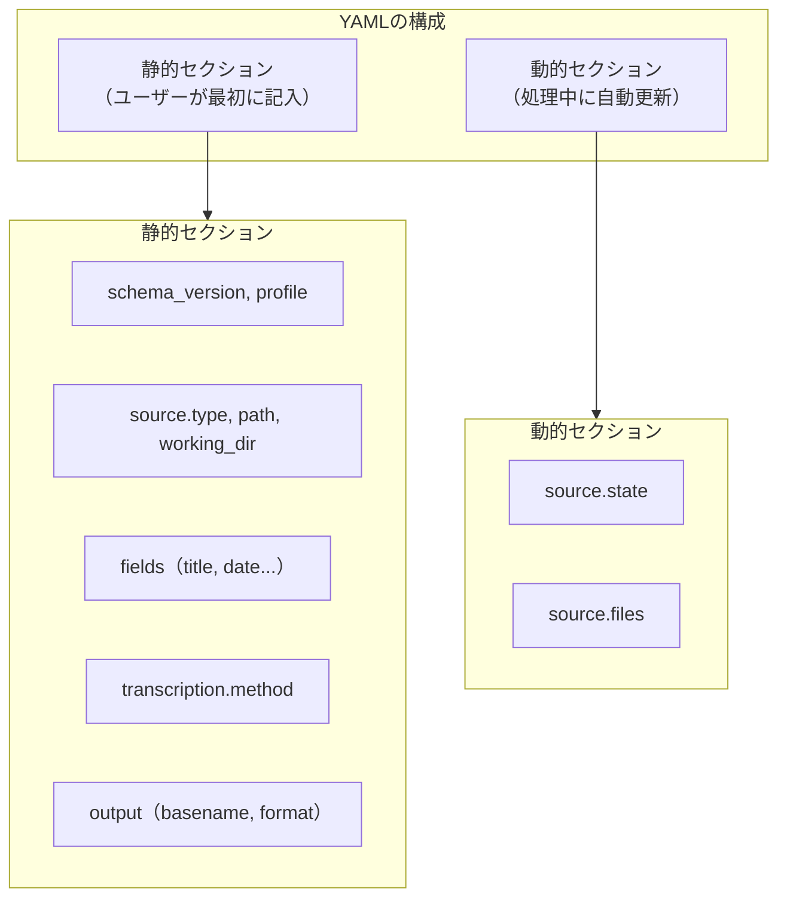

### ワークフロー順序（YAML中心）

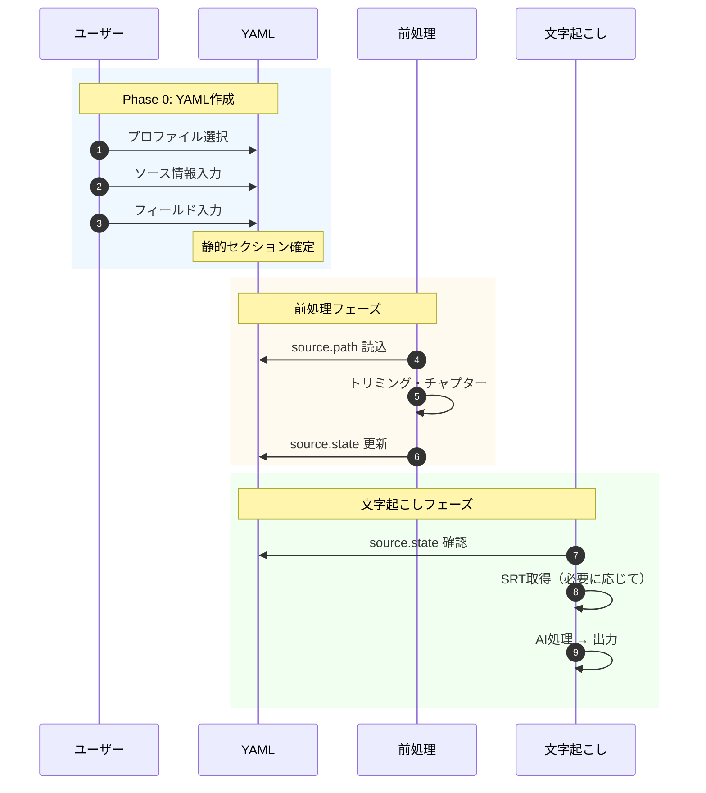

### ワークフロー境界の定義

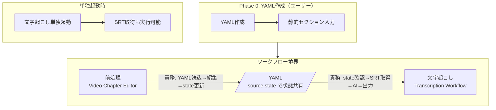

---

## 文字起こしワークフロー スキーマ構造

### ファイル参照関係

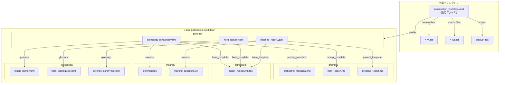

### スキーマ階層（TeX/LaTeXアナロジー）

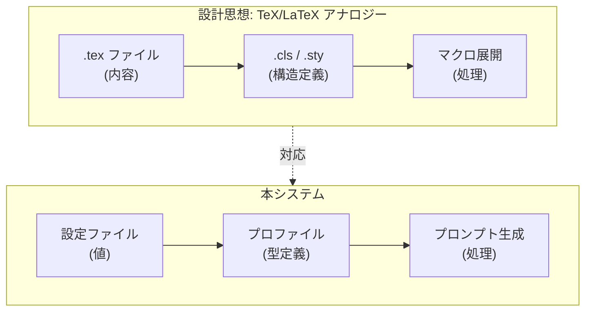

### 参加者構造の類型

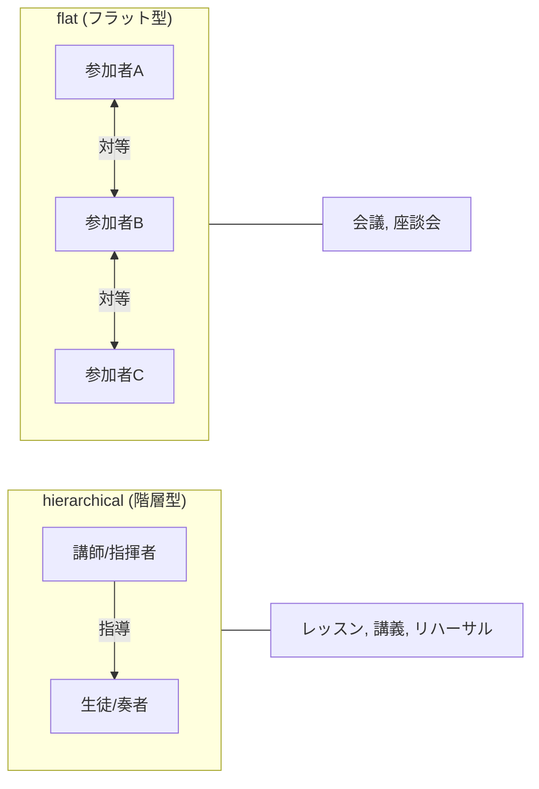

### 処理フェーズ

```mermaid
flowchart LR
    subgraph P0["Phase 0"]
        direction TB
        P0A["YAML作成"]
        P0B["ユーザー入力"]
    end

    subgraph PRE["前処理"]
        direction TB
        PRE_A["トリミング"]
        PRE_B["チャプター"]
        PRE_C["state更新"]
    end

    subgraph P1["Phase 1"]
        direction TB
        P1A["初期化"]
        P1B["YAML読込"]
    end

    subgraph P2["Phase 2"]
        direction TB
        P2A["プロファイル解決"]
        P2B["リソース読込"]
    end

    subgraph P3["Phase 3"]
        direction TB
        P3A["入力状態判定"]
        P3B["7状態のいずれか"]
    end

    subgraph P4["Phase 4"]
        direction TB
        P4A["ソース処理"]
        P4B["url_only→ytdl"]
    end

    subgraph P5["Phase 5"]
        direction TB
        P5A["文字起こし"]
        P5B["SRT統合"]
    end

    subgraph P6["Phase 6"]
        direction TB
        P6A["プロンプト生成"]
        P6B["変数展開"]
    end

    subgraph P7["Phase 7"]
        direction TB
        P7A["AI処理"]
        P7B["(外部)"]
    end

    subgraph P8["Phase 8"]
        direction TB
        P8A["出力生成"]
        P8B["PDF/MD/DOCX"]
    end

    P0 --> PRE --> P1 --> P2 --> P3 --> P4 --> P5 --> P6 --> P7 --> P8
```

### プロファイル検索順序

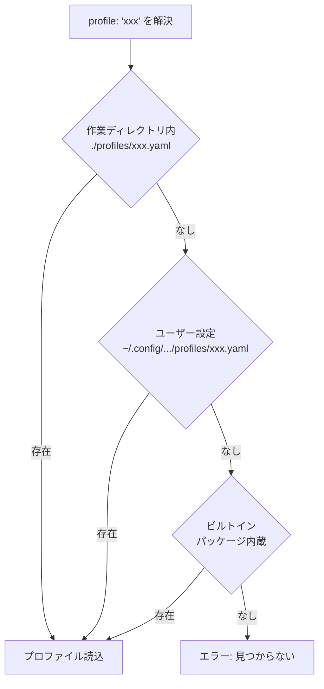

---

## 文字起こしワークフロー アクティビティ図（スイムレーン）

ユーザー、UI、バックエンド間の協調を示す。処理の詳細はPAD（`docs/pad/transcription-workflow.png`）を参照。

### 全体フロー

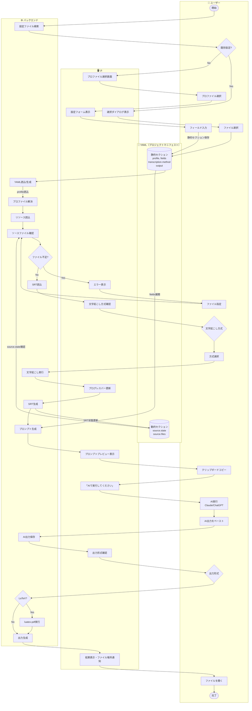

### エラー処理フロー

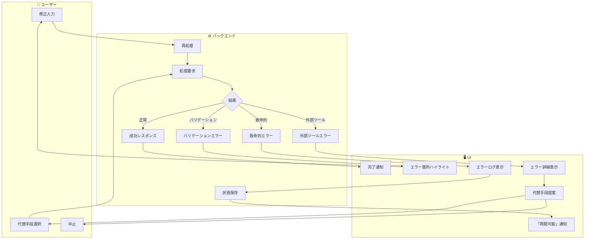

### 状態遷移（UI視点）

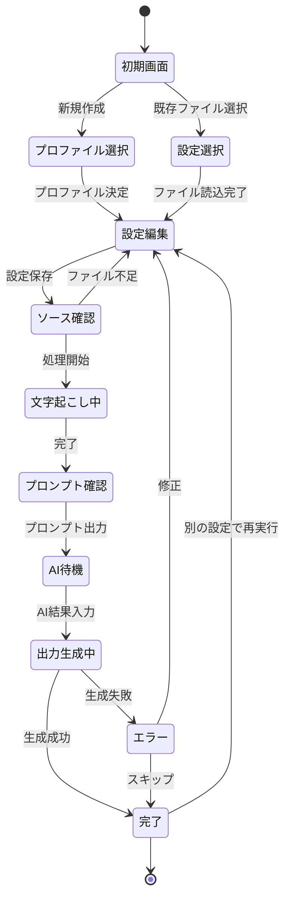

---

## 文字起こしワークフロー PAD図

### スキーマ構造

### 処理フロー

