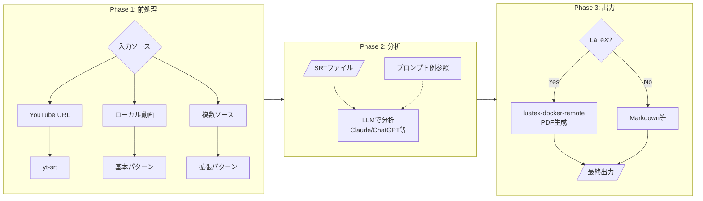

# ワークフロー図

## 基本ワークフロー（単一動画 → SRT）

## 拡張ワークフロー（複数ソース対応）

## 全体フロー

## ツール一覧

| ツール | 機能 | 必須/オプション |
|--------|------|----------------|
| yt-srt | YouTube字幕取得 | 必須 |
| video-trim | 不要部分削除 | 基本 |
| movie-viewer | チャプター作成 | 基本 |
| video-chapters | チャプター結合 | 基本 |
| audio-normalize | 音量正規化 | 拡張 |
| audio-extract-channel | チャンネル抽出 | 拡張 |
| video-replace-audio | 音声差し替え | 拡張 |
| whisper-remote | 高精度文字起こし | 拡張 |
| luatex-docker-remote | PDF生成 | 拡張 |
