# ワークフロー図

## 基本ワークフロー（単一動画 → SRT）

## 拡張ワークフロー（複数ソース対応）

## 全体フロー

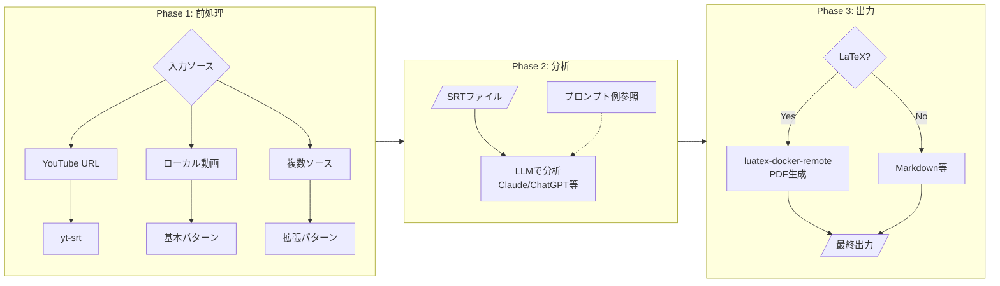

## ツール一覧

| ツール | 機能 | 必須/オプション |
|--------|------|----------------|
| yt-srt | YouTube字幕取得 | 必須 |
| video-trim | 不要部分削除 | 基本 |
| movie-viewer | チャプター作成 | 基本 |
| video-chapters | チャプター結合 | 基本 |
| audio-normalize | 音量正規化 | 拡張 |
| audio-extract-channel | チャンネル抽出 | 拡張 |
| video-replace-audio | 音声差し替え | 拡張 |
| whisper-remote | 高精度文字起こし | 拡張 |
| luatex-docker-remote | PDF生成 | 拡張 |

---

## 前処理ワークフロー ユーザー/UI/バックエンド インタラクション図

Video Chapter Editor における前処理フェーズのアクター間協調。

### 全体フロー

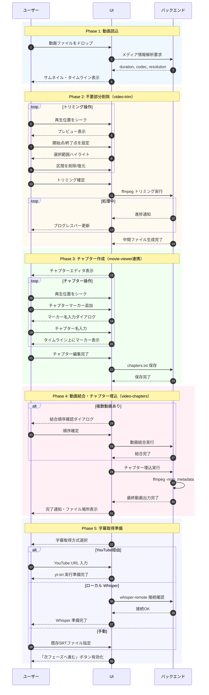

### トリミング操作の詳細

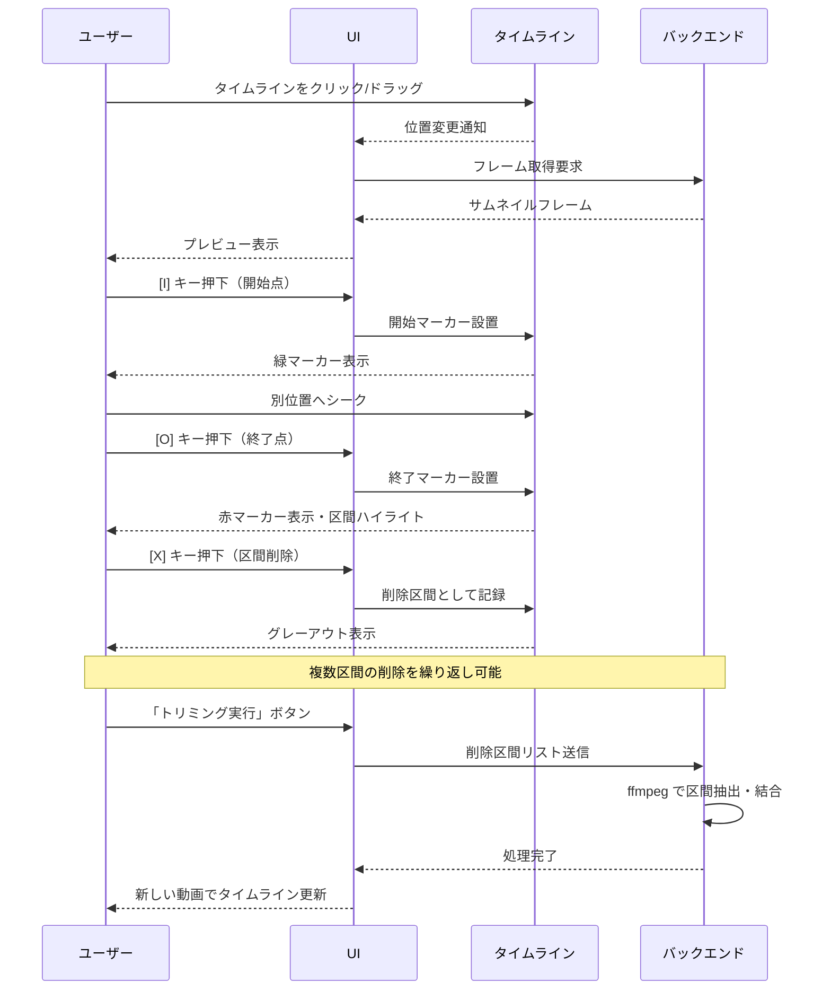

### チャプター編集の詳細

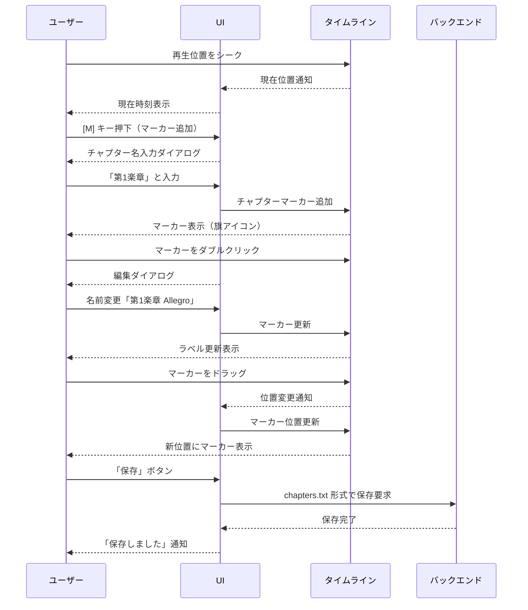

### 状態遷移（UI視点）

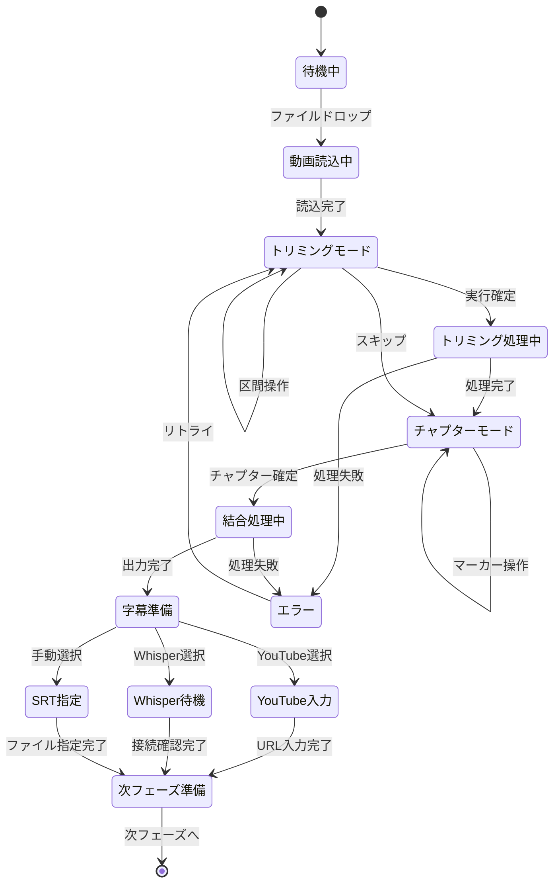

---

## 前処理ワークフロー PAD図

### 処理フロー

---

## 文字起こしワークフロー スキーマ構造

### ファイル参照関係

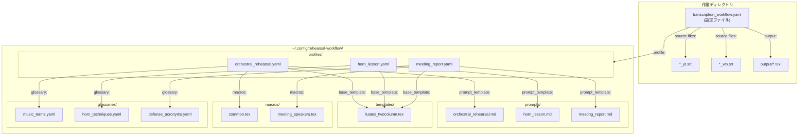

### スキーマ階層（TeX/LaTeXアナロジー）

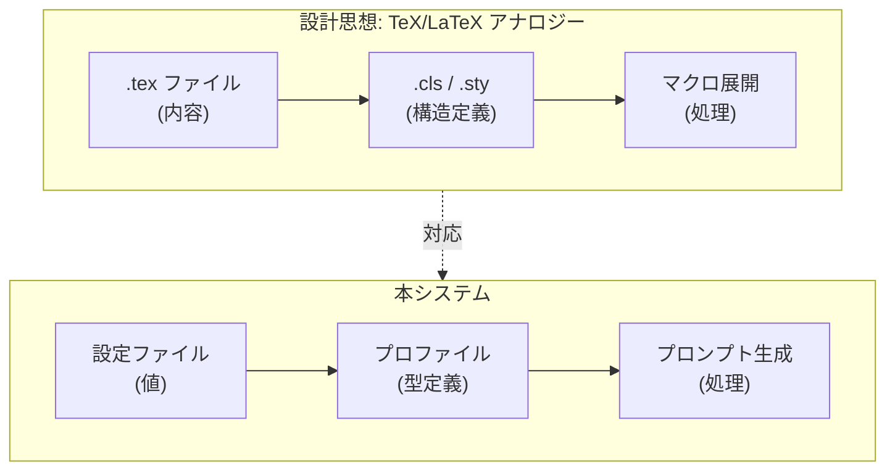

### 参加者構造の類型

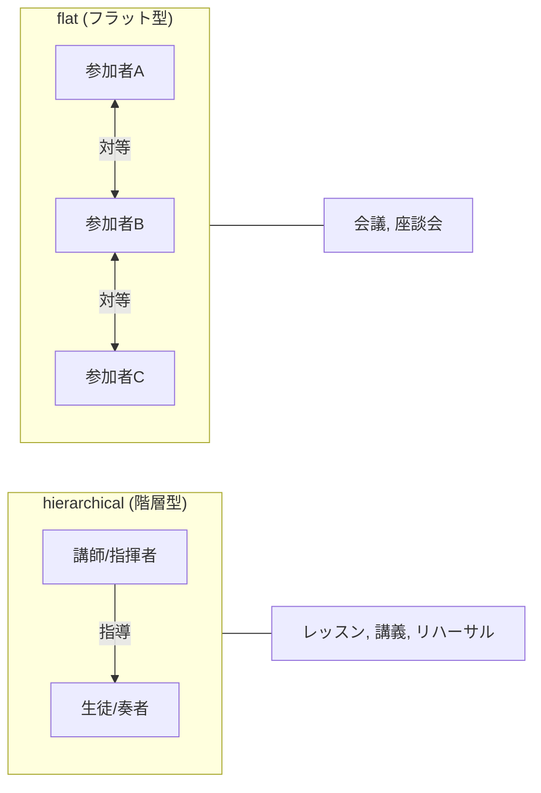

### 処理フェーズ

```mermaid
flowchart LR
    subgraph P1["Phase 1"]
        direction TB
        P1A["初期化"]
        P1B["設定読込/新規作成"]
    end

    subgraph P2["Phase 2"]
        direction TB
        P2A["プロファイル解決"]
        P2B["リソース読込"]
    end

    subgraph P3["Phase 3"]
        direction TB
        P3A["ソース処理"]
        P3B["SRT取得/読込"]
    end

    subgraph P4["Phase 4"]
        direction TB
        P4A["文字起こし"]
        P4B["SRT統合"]
    end

    subgraph P5["Phase 5"]
        direction TB
        P5A["プロンプト生成"]
        P5B["変数展開"]
    end

    subgraph P6["Phase 6"]
        direction TB
        P6A["AI処理"]
        P6B["(外部)"]
    end

    subgraph P7["Phase 7"]
        direction TB
        P7A["出力生成"]
        P7B["PDF/MD/DOCX"]
    end

    P1 --> P2 --> P3 --> P4 --> P5 --> P6 --> P7
```

### プロファイル検索順序

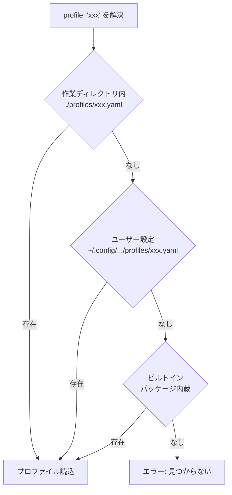

---

## ユーザー/UI/バックエンド インタラクション図

ユーザー、UI、バックエンド間の協調を示す。バックエンド内部の処理詳細はPAD参照。

### 全体フロー

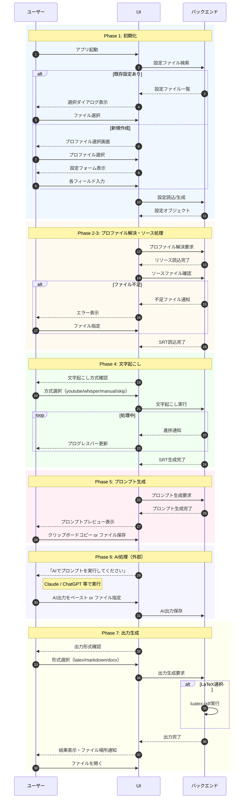

### エラー処理フロー

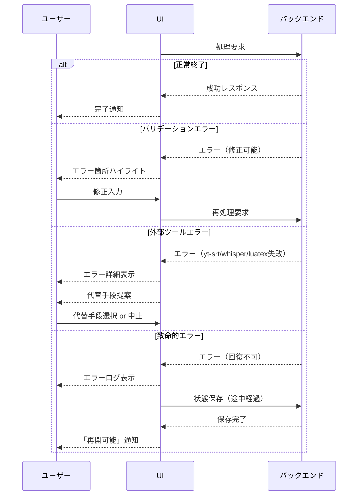

### 状態遷移（UI視点）

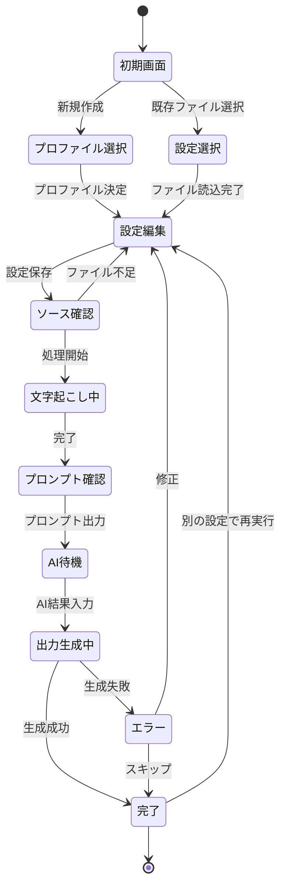

---

## 文字起こしワークフロー PAD図

### スキーマ構造

### 処理フロー

